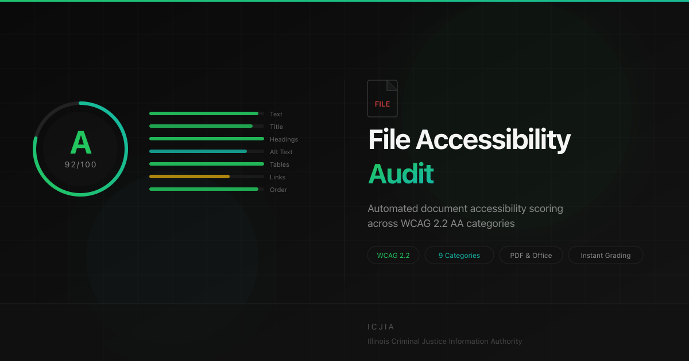

# ICJIA File Accessibility Audit



**Production URL:** https://audit.icjia.app | **Source:** https://github.com/ICJIA/file-accessibility-audit

A web tool that scores PDF accessibility readiness against [WCAG 2.1](https://www.w3.org/WAI/WCAG21/quickref/) and [ADA Title II](https://www.ada.gov/resources/title-ii-rule/) requirements. Upload a PDF, get an instant grade (A–F) with category-by-category findings and remediation guidance.

**This tool is diagnostic only** — it identifies accessibility issues but does not fix them. The intended workflow is: upload → review findings → fix in Adobe Acrobat → re-upload to verify.

## Quick Start

### Prerequisites

- **Node.js 22+** (see `.nvmrc`)
- **pnpm 9+**
- **QPDF 11+**

```bash
# macOS
brew install qpdf node pnpm

# Ubuntu/Debian
sudo apt install -y qpdf
npm install -g pnpm
```

### Install & Run

```bash
# Install dependencies
pnpm install

# Set up environment files
cp apps/api/.env.example.local apps/api/.env
cp apps/web/.env.example.local apps/web/.env

# Start both servers (kills stale ports automatically)
pnpm dev
```

- **Frontend:** http://localhost:5102
- **API:** http://localhost:5103

That's it — the app works immediately with authentication disabled (the default). No email provider or credentials needed.

### Utility Scripts

```bash
pnpm clean      # Remove .nuxt, .output, Vite cache, and build artifacts
pnpm test       # Run all tests with summary
pnpm dev        # Start API + Web dev servers
pnpm build      # Type-check API + build Nuxt frontend
pnpm start:all  # Start both production servers (kills stale ports, API :5103, Web :5102)
pnpm rebrand    # Regenerate static files after changing BRANDING in audit.config.ts
```

## Authentication (Optional)

Authentication is **off by default**. The app can be used without any login, email provider, or credentials. This is controlled by a single toggle in `audit.config.ts`:

```ts
export const AUTH = {
  REQUIRE_LOGIN: false,  // ← set to true to enable OTP authentication
  // ...
}
```

### With auth disabled (`REQUIRE_LOGIN: false` — default)

- Users go straight to the upload page — no login screen
- No email provider or SMTP credentials needed
- No audit history is recorded (no user identity to associate with analyses)
- All security protections (rate limiting, file validation, CORS) remain active

### With auth enabled (`REQUIRE_LOGIN: true`)

- Users must authenticate via a **6-digit one-time password (OTP)** sent to their email
- Only `illinois.gov` email addresses are accepted (configurable via `AUTH.ALLOWED_EMAIL_REGEX`)
- Sessions last 72 hours via JWT in an httpOnly cookie — no passwords stored
- All analyses are logged with the authenticated user's email for audit history
- **Requires an email provider** — the app needs to send OTP codes (see below)

### Why an email provider is needed

When authentication is enabled, the app sends one-time passcodes via email. This requires an SMTP relay service. The app supports two providers out of the box:

| Provider | Docs |
|----------|------|
| Mailgun (default) | [docs/07-mailgun-integration.md](docs/07-mailgun-integration.md) |
| SMTP2GO | [docs/06-smtp2go-integration.md](docs/06-smtp2go-integration.md) |

The provider is controlled in `audit.config.ts` → `EMAIL.PROVIDER`. Credentials go in `apps/api/.env`:

```env
SMTP_USER=your-smtp-login
SMTP_PASS=your-smtp-password
```

**To switch providers**, change one line in `audit.config.ts`:

```ts
PROVIDER: 'mailgun'   // ← change to 'smtp2go' to switch
```

Host and port are set automatically per provider.

**Dev note:** When running locally with auth enabled, OTP codes are printed to the API console — no email credentials needed for development.

## Scoring Rubric

Each PDF is scored across **9 accessibility categories** based on [WCAG 2.1](https://www.w3.org/WAI/WCAG21/quickref/) and [ADA Title II](https://www.ada.gov/resources/title-ii-rule/) requirements. Categories that don't apply to a document (e.g., tables in a document with no tables) are excluded and the remaining weights are renormalized.

### Categories & Weights

| Category | Weight | WCAG Criteria | Why It Matters |
|----------|:------:|---------------|----------------|
| Text Extractability | 20% | 1.3.1, 1.4.5 | The most fundamental requirement. If a PDF is a scanned image with no real text, screen readers have nothing to read. |
| Title & Language | 15% | 2.4.2, 3.1.1 | The document title is the first thing a screen reader announces. The language tag controls pronunciation. |
| Heading Structure | 15% | 1.3.1, 2.4.6 | Headings (H1–H6) are the primary way screen reader users navigate and skim documents. |
| Alt Text on Images | 15% | 1.1.1 | Every informative image must have a text alternative. Without it, blind users get no indication of what the image shows. |
| Bookmarks | 10% | 2.4.5 | For documents over 10 pages, bookmarks provide a navigable table of contents. |
| Table Markup | 10% | 1.3.1 | Without header cells (TH), screen readers read table data in a flat stream with no context. |
| Link Quality | 5% | 2.4.4 | Raw URLs are meaningless when read aloud. Descriptive link text tells users where a link goes. |
| Form Fields | 5% | 1.3.1, 4.1.2 | Unlabeled form fields are unusable with assistive technology. |
| Reading Order | 5% | 1.3.2 | The tag structure must define a logical reading sequence. |

### Grade Scale

| Grade | Score Range | Label |
|:-----:|:----------:|-------|
| **A** | 90–100 | Excellent |
| **B** | 80–89 | Good |
| **C** | 70–79 | Needs Improvement |
| **D** | 60–69 | Poor |
| **F** | 0–59 | Failing |

### Severity Levels

Each category receives a severity based on its individual score:

| Severity | Score Range | Meaning |
|----------|:----------:|---------|
| Pass | 90–100 | Meets accessibility standards. |
| Minor | 70–89 | Small improvements recommended. |
| Moderate | 40–69 | Should be addressed before publishing. |
| Critical | 0–39 | Must be fixed — represents a significant barrier to access. |

### Reference Standards

- [WCAG 2.1 Quick Reference](https://www.w3.org/WAI/WCAG21/quickref/)
- [ADA Title II Final Rule (2024)](https://www.ada.gov/resources/title-ii-rule/)
- [Section 508 Standards](https://www.section508.gov/manage/laws-and-policies/)
- [PDF/UA (ISO 14289-1)](https://pdfa.org/resource/pdfua-in-a-nutshell/)

Scoring aligns with WCAG 2.1 Level AA success criteria and ADA Title II digital accessibility requirements effective April 2026. All scoring constants live in `audit.config.ts`.

## Report Exports

Reports can be downloaded in four formats, all with links back to [audit.icjia.app](https://audit.icjia.app):

| Format | Contents |
|--------|----------|
| **Word (.docx)** | Formatted report with score table, detailed findings, help links, and grade colors |
| **HTML (.html)** | Standalone dark-themed page with full report — works offline, printable |
| **Markdown (.md)** | Plain-text report with tables and findings — works in any text editor or docs platform |
| **JSON (.json)** | Machine-readable v2.0 schema with WCAG mappings, remediation plan, and LLM context (see below) |

Reports can also be shared via **shareable links** that expire after 30 days. Shared report pages include:

- **Export buttons** — download the report as Word, Markdown, or JSON directly from the shared link
- **CTA to audit tool** — "Audit Your PDF" button linking back to the live tool
- **Methodology card** — "How Scores Are Derived" section with links to QPDF and PDF.js (Mozilla) docs, WCAG 2.1 and ADA Title II references, and a link to the full scoring rubric
- **Severity highlighting** — critical issue counts in red, moderate in yellow within the executive summary
- **Caveat notice** — recommendation to verify with Adobe Acrobat and make source documents accessible before PDF export

When auth is disabled, shared reports display "Shared on [date]" without exposing usernames.

## SEO

The app uses **[@nuxtjs/seo](https://nuxtseo.com/)** for comprehensive search engine optimization:

| Feature | Implementation |
|---------|---------------|
| **Sitemap** | Auto-generated at `/sitemap.xml` — includes public pages, excludes auth/admin routes |
| **Robots** | Auto-generated at `/robots.txt` — blocks `/api/`, `/login`, `/my-history`, `/history` |
| **Schema.org** | `Organization` identity (ICJIA) via module + `WebApplication` JSON-LD in page head |
| **Open Graph** | Full OG tags with 1200x630 image, alt text, site name, locale |
| **Twitter Cards** | `summary_large_image` with title, description, image, and alt text |
| **Favicons** | `favicon.ico`, `favicon.png` (32px), `apple-touch-icon.png` (180px), PWA icons (192/512px) |
| **Web Manifest** | `site.webmanifest` for PWA install and app metadata |
| **Canonical URL** | `https://audit.icjia.app` |
| **Meta** | `description`, `keywords`, `author`, `theme-color`, `lang="en"` |

## AI Readiness

The app is structured for discovery and consumption by LLMs, AI agents, and automated tools:

### LLM Discovery Files

| File | Purpose |
|------|---------|
| [`/llms.txt`](https://audit.icjia.app/llms.txt) | Concise summary: what the app does, scoring categories, grade scale, API endpoints |
| [`/llms-full.txt`](https://audit.icjia.app/llms-full.txt) | Full documentation: per-category scoring logic, remediation steps, JSON export schema |

These follow the emerging [`llms.txt` convention](https://llmstxt.org/) — a plain-text file at the site root that tells AI crawlers what the site does and how to use it.

### JSON Export (Schema v2.0)

The JSON export is designed for machine consumption. Beyond the basic report data, it includes:

| Section | What it provides |
|---------|-----------------|
| `categories[].status` | Machine-readable `"pass"`, `"minor"`, `"moderate"`, `"fail"`, or `"not-applicable"` |
| `categories[].wcag` | WCAG 2.1 success criteria IDs, principle name, and tool-specific remediation steps |
| `remediationPlan` | Prioritized fix steps sorted by severity — each with category, score, WCAG criteria, and action |
| `llmContext.prompt` | Pre-built prompt summarizing the audit, ready to paste into any LLM |
| `llmContext.standards` | Array of applicable standards (WCAG 2.1 AA, ADA Title II, Section 508, PDF/UA) |
| `llmContext.scoringScale` | Score range definitions for pass/minor/moderate/fail |

### Structured Data

- **WebApplication JSON-LD** in `<head>` — identifies the app type, features, author, and pricing (free) for search engines and AI agents
- **Schema.org Organization** — links ICJIA as the publisher via `@nuxtjs/seo`

## CLI Tool

The monorepo includes `a11y-audit`, a command-line PDF accessibility analyzer that uses the same scoring engine as the web app.

```bash
# Build the CLI
pnpm --filter @icjia/a11y-audit build

# Analyze a PDF
node apps/cli/dist/index.js report.pdf

# JSON output (pipe to jq, etc.)
node apps/cli/dist/index.js report.pdf --json

# CI gate — exit 1 if any file scores below 80
node apps/cli/dist/index.js docs/*.pdf --threshold 80
```

### Options

| Flag | Description |
|------|-------------|
| `--json` | Output results as JSON |
| `--threshold <n>` | Minimum passing score (0–100) — exits with code 1 if any file fails |
| `--help` | Show usage |
| `--version` | Show version |

The CLI produces a colored terminal table with grades, scores, and severity for each category. Requires QPDF installed on the system.

## Project Structure

```
file-accessibility-audit/
├── apps/
│   ├── web/            # Nuxt 4 frontend
│   │   ├── public/     # Static assets (og-image, favicons, llms.txt, manifest)
│   │   └── app/        # Pages, components, composables, layouts
│   ├── api/            # Express API server
│   │   └── src/        # Routes, services, middleware, database
│   └── cli/            # a11y-audit CLI tool
│       └── src/        # CLI entry point (bundles via tsup)
├── scripts/
│   └── rebrand.ts      # Regenerate static branding files (pnpm rebrand)
├── docs/               # Design documents (see below)
├── audit.config.ts     # Single source of truth for all constants + branding
├── og-image.svg        # OG image source (regenerated by pnpm rebrand)
├── ecosystem.config.cjs # PM2 config (production)
├── pnpm-workspace.yaml
└── .nvmrc              # Node.js version
```

## Tech Stack

| Layer | Technology |
|-------|-----------|
| Frontend | Nuxt 4 / Nuxt UI 4 / Dark mode only / WCAG 2.1 AA compliant |
| SEO | @nuxtjs/seo (sitemap, robots, Schema.org, OG) |
| API | Express / TypeScript / tsx (no build step in dev) |
| PDF Analysis | QPDF (structure tree) + pdfjs-dist (text/metadata) |
| Database | SQLite via better-sqlite3 (audit logs, shared reports) |
| Auth | Optional email OTP → JWT (httpOnly cookie) |
| Email | Mailgun (default) / SMTP2GO (alternative) / Nodemailer |
| CLI | tsup → single ESM bundle, QPDF + pdfjs-dist |
| Deployment | DigitalOcean → Laravel Forge → PM2 → nginx |

## Configuration

All magic numbers, thresholds, weights, limits, and email provider settings are in **`audit.config.ts`** at the project root. This is the single source of truth — the API imports it directly, and the docs reference it.

- **Auth toggle** → `AUTH.REQUIRE_LOGIN` (`true` or `false`)
- **Scoring weights** → `SCORING_WEIGHTS`
- **Email provider** → `EMAIL.PROVIDER` (`'mailgun'` or `'smtp2go'`)
- **Share link expiry** → `SHARING.EXPIRY_DAYS` (default: 30)
- **Rate limits** → `RATE_LIMITS`
- **Dev/prod URLs** → automatic based on `NODE_ENV`

Secrets (`JWT_SECRET`, `SMTP_PASS`) stay in `.env` — never in config.

## White-Labeling / Branding

All organization-specific branding is centralized in the `BRANDING` section of **`audit.config.ts`**. Change these values to rebrand the tool for any organization:

```ts
export const BRANDING = {
  APP_NAME: 'ICJIA File Accessibility Audit',  // Header, page titles, SEO, exports
  APP_SHORT_NAME: 'Accessibility Audit',        // PWA manifest
  ORG_NAME: 'Illinois Criminal Justice ...',    // Schema.org, meta author, JSON-LD
  ORG_URL: 'https://icjia.illinois.gov',        // Schema.org identity link
  FAQS_URL: 'https://accessibility.icjia.app',  // Navbar FAQs link ('' to hide)
  GITHUB_URL: 'https://github.com/ICJIA/...',   // Footer GitHub link ('' to hide)
}
```

These values flow automatically into:

| Where | What changes |
|-------|-------------|
| **Header** | App name in the top-left |
| **Page titles & SEO** | `<title>`, Open Graph, Twitter Cards, Schema.org |
| **Shared report pages** | Report title, footer attribution, CTA link |
| **Report exports** | Markdown footer, JSON `reportMeta`, DOCX footer, HTML footer |
| **Navbar** | FAQs link (hidden when `FAQS_URL` is `''`) |
| **Footer** | GitHub link (hidden when `GITHUB_URL` is `''`) |
| **API CORS** | Uses `DEPLOY.PRODUCTION_URL` (also in `audit.config.ts`) |

### Also update when rebranding

These values are in `audit.config.ts` but separate from `BRANDING`:

| Config | Section | What it controls |
|--------|---------|-----------------|
| `DEPLOY.PRODUCTION_URL` | `DEPLOY` | Production domain for CORS, canonical URL, shared report links |
| `EMAIL.DEFAULT_FROM` | `EMAIL` | Sender email address for OTP codes |
| `AUTH.ALLOWED_EMAIL_REGEX` | `AUTH` | Allowed email domains for authentication |

### Regenerating static files

After changing `BRANDING` or `DEPLOY.PRODUCTION_URL`, run the rebrand script to regenerate all static branding files:

```bash
pnpm rebrand
```

This regenerates:
- `apps/web/public/site.webmanifest` — app name, short name
- `apps/web/public/llms.txt` — title, org, URLs
- `apps/web/public/llms-full.txt` — title, org, URLs, JSON schema examples
- `og-image.svg` — org name in the bottom bar
- `apps/web/public/og-image.png` — converted from SVG via sharp

The only file not covered by the script is `apps/cli/package.json` (package `name` field) — update manually if forking.

## Design Documents

| Doc | Description |
|-----|-------------|
| [00 — Master Design](docs/00-master-design.md) | Architecture, scoring model, API, auth, security |
| [01 — Phase 1: Core Grader](docs/01-phase-1-core-grader.md) | Phase 1 deliverables and testing checklist |
| [02 — Phase 2: Enhanced Features](docs/02-phase-2-enhanced-features.md) | DOCX, batch upload, shareable reports |
| [03 — Phase 3: Admin & Monitoring](docs/03-phase-3-admin-monitoring.md) | Admin dashboard, scheduled re-checks |
| [04 — Deployment Guide](docs/04-deployment-guide.md) | Infrastructure, env vars, nginx, firewall |
| [05 — Use Cases](docs/05-use-cases.md) | End-user scenarios and workflows |
| [06 — SMTP2GO Integration](docs/06-smtp2go-integration.md) | Email provider setup and gotchas |
| [07 — Mailgun Integration](docs/07-mailgun-integration.md) | Mailgun setup (default provider) |

## Tests

**271 tests** across 9 test files. Run all with a summary at the end:

```bash
pnpm test                # All tests (API + Web) with summary
pnpm test:api            # API tests only
pnpm test:web            # Web tests only
pnpm test:scoring        # Scoring model tests only
```

`pnpm test` prints a summary after all suites complete:

```
════════════════════════════════════════════════════════════
  TEST SUMMARY
════════════════════════════════════════════════════════════
  ✔ API      168 passed (5 files)
  ✔ Web      103 passed (4 files)
────────────────────────────────────────────────────────────
  ✔ 271 tests passed across 9 files
════════════════════════════════════════════════════════════
```

### API Tests (168 tests)

| File | Tests | What it covers |
|------|------:|----------------|
| `scorer.test.ts` | 76 | All 9 scoring categories, grade/severity thresholds, N/A handling, weight renormalization, executive summary generation, edge cases (scanned PDFs, mixed results, hierarchy skips, partial alt text, disorder ratio) |
| `qpdfParser.test.ts` | 34 | QPDF JSON parsing: StructTreeRoot/Lang/Outlines/AcroForm detection, heading tags (H1–H6 + generic /H), table TH header detection, figure alt text, MCID content ordering, outline counting, tree depth, malformed JSON |
| `auth.test.ts` | 25 | JWT middleware (missing/invalid/expired/wrong-algorithm tokens), admin middleware (role checking, case sensitivity), email domain validation (illinois.gov, subdomains, rejection of non-gov domains, ALLOWED_DOMAINS dev override) |
| `mailer.test.ts` | 6 | Email config validation: production exits without credentials, development warns but continues, provider info logging |
| `integration.test.ts` | 27 | End-to-end PDF analysis: accessible/inaccessible fixture scoring, category completeness, grade/severity validation, comparative scoring between documents |

### Web Tests (103 tests)

| File | Tests | What it covers |
|------|------:|----------------|
| `accessibility.test.ts` | 36 | WCAG 2.1 color contrast verification (4.5:1 ratio for all text/bg combinations), regression guards against low-contrast classes (text-neutral-500/600), semantic HTML landmarks (main, header, footer, nav), link accessibility (rel attributes, underlines), component-level a11y (keyboard-accessible controls, caveat text, click targets) |
| `components.test.ts` | 33 | DropZone (drag/drop, PDF validation, file size limits), ScoreCard (grade display, color coding for all 5 grades, score/filename/summary), CategoryRow (score bars, severity badges, expand/collapse findings, N/A display), ProcessingOverlay (spinner, stage messages) |
| `login.test.ts` | 13 | Two-step OTP flow (email → code), API call verification, error handling, back navigation |
| `scoring-display.test.ts` | 21 | Grade color mapping (A–F), N/A category rendering, severity badge colors (Pass/Minor/Moderate/Critical) |

## Deployment

**Target:** DigitalOcean droplet (2 vCPU / 4GB RAM, ~$24/mo) → Laravel Forge → PM2 → nginx

See [docs/04-deployment-guide.md](docs/04-deployment-guide.md) for full instructions (server setup, nginx config, firewall, SSL). Short version:

```bash
pnpm install --frozen-lockfile
pnpm build                                    # Type-check API + build Nuxt
pm2 restart ecosystem.config.cjs --update-env  # PM2 sets PORT and NODE_ENV
```

For local production testing (without PM2):

```bash
pnpm build && pnpm start:all    # Clears ports, starts API :5103 + Web :5102
```

## Accessibility (WCAG 2.1)

The web interface itself meets **WCAG 2.1 Level AA** standards. Both the main audit page and shared report pages score **100** on Lighthouse accessibility audits.

### What's enforced

| Requirement | Implementation |
|-------------|---------------|
| **Color contrast** | All text meets 4.5:1 minimum ratio against dark backgrounds. Only `text-neutral-300`, `text-neutral-400`, and `text-white` are used — `text-neutral-500` and `text-neutral-600` are banned. |
| **Semantic landmarks** | `<header>`, `<nav>`, `<main>`, `<footer>` in the default layout; `<main>` on standalone report pages. |
| **Link distinguishability** | External links use `underline` or blue-400 color (7.5:1+ contrast). All include `rel="noopener noreferrer"`. |
| **Keyboard accessibility** | All interactive elements are native `<button>` or `<a>` elements — no div-based click handlers. |
| **Click targets** | Expand/collapse buttons span full width (WCAG 2.5.8). |

### Accessibility tests

The `accessibility.test.ts` suite (36 tests) runs as part of `pnpm test` and guards against regressions:

- **Contrast math** — verifies WCAG luminance ratios for every text color + background combination used in the UI
- **Source scanning** — reads `.vue` template sections and fails if `text-neutral-500` or `text-neutral-600` appear
- **Landmark verification** — confirms `<main>`, `<header>`, `<footer>`, `<nav>` exist in layouts and pages
- **Component-level checks** — keyboard-accessible controls, caveat text, link attributes, no low-opacity text

## Security

- **Auth is optional** — all other security protections apply regardless of the auth toggle
- Files processed in memory (QPDF temp file deleted immediately)
- `execFileSync` (no shell) for QPDF invocation
- Rate limiting on all endpoints
- Helmet + nginx security headers
- CORS locked to same origin in production
- See **docs/00-master-design.md, Section 9** for the full security model

## License

MIT License. Copyright (c) 2026 Christopher Schweda. See [LICENSE](LICENSE) for details.
