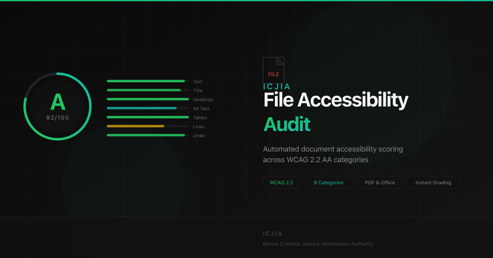

# ICJIA File Accessibility Audit

[](https://github.com/ICJIA/file-accessibility-audit/releases) [](LICENSE)     



**Production URL:** https://audit.icjia.app | **Source:** https://github.com/ICJIA/file-accessibility-audit

A web tool that **audits** PDF, Word (.docx), PowerPoint (.pptx), and Excel (.xlsx) accessibility — and **(optionally) auto-remediates** PDFs — against [WCAG 2.2 AA](https://www.w3.org/WAI/WCAG22/quickref/) (a strict superset of [WCAG 2.1 AA](https://www.w3.org/WAI/WCAG21/quickref/), the legal minimum under [IITAA 2.1 §E205.4](https://dhs.illinois.gov/accessibility/iitaa/iitaa-standards.html) and [ADA Title II](https://www.ada.gov/resources/title-ii-rule/)), and [Illinois IITAA 2.1](https://doit.illinois.gov/initiatives/accessibility.html) — all on infrastructure you control, with no AI and no per-document fees. To revert to WCAG 2.1 labels: set `WCAG_VERSION=2.1` and redeploy (API reverts on restart; web UI on rebuild).

## What it does

| | Feature | Detail |
|---|---------|--------|
| **9** | WCAG categories audited | Each document (PDF, Word, PowerPoint, or Excel) scored across the WCAG-aligned categories that apply to its format (up to 9) — a weighted 0–100 score (A–F grade) plus a separate, binary pass/fail **WCAG 2.2 conformance verdict**. |
| **F → A** | Auto-remediation (optional) | Tag untagged PDFs in seconds: qpdf → [OpenDataLoader](https://github.com/opendataloader-project/opendataloader-pdf) → [veraPDF](https://verapdf.org/). Output is rejected if it regresses the score. Manual review still recommended for IITAA compliance. |
| **PDF/UA** | Standards aligned | WCAG 2.2 AA (superset of 2.1 AA), ADA Title II (compliance due April 26, 2027 for entities of 50,000+; April 26, 2028 for smaller entities and special districts), Illinois IITAA 2.1, PDF/UA-1 via veraPDF — PDF/UA-2 validated when a document declares it (v1.94.0). Full lifecycle audit trail with `fs.stat`-verified deletion events for compliance reporting. |
| **31** | Matterhorn checkpoints disclosed | The landing page lists all 31 checkpoints of the [Matterhorn Protocol](https://pdfa.org/resource/the-matterhorn-protocol/) — the PDF Association's PDF/UA test model, the same one PAC implements — and which layer checks each: the audit engine, the [veraPDF](https://verapdf.org/) passes that run alongside every PDF audit (PDF/UA conformance, plus its machine-testable WCAG 2.2 profile since v1.97.0), or human review (47 of its 136 failure conditions are machine-uncheckable by any tool). When veraPDF cannot run, PDF reports say **"Did not run"** instead of hiding the panel (v1.91.0). The checklist opens with a scope note (v1.101.0): Matterhorn applies to PDFs only — Word/PowerPoint/Excel files are still fully checked, under their own per-format audits. |
| **0** | Files retained | Audit: in-memory only, gone in seconds. Remediation: output deleted on first download or 30-minute TTL, then verified absent. |
| **$0** | No AI, no third-party APIs | Every step runs on your own server. No data sent to vision models, hosted AI services, or commercial PDF/Office SDKs. |
| **100%** | Open source | Apache 2.0 / MIT / MPL toolchain. No per-document fees, no SDK licensing. Designed for state agencies that need control over their pipeline. |
| **5** | Files per batch | Upload up to 5 files (PDF, Word, PowerPoint, or Excel) at once; per-file remediation for PDFs. `POST /api/analyze-url` for programmatic auditing of public documents. |
| **4** | Export formats | Text / HTML / Markdown / JSON report exports. 1-year shareable links — no account needed (the tool has none). |

Auto-remediation is **disabled by default** — set `REMEDIATION_ENABLED=true` in your environment to enable. Architectural details in [docs/archive/pdf-remediation-integration-plan.md](docs/archive/pdf-remediation-integration-plan.md); the Phase 1 follow-on (interactive alt-text walkthrough) is specced in [docs/archive/pdf-remediation-alt-text-walkthrough-spec.md](docs/archive/pdf-remediation-alt-text-walkthrough-spec.md).

The intended workflow is: **upload → review findings → either auto-remediate or fix at the source (Word, InDesign, etc.) and re-export → re-upload to verify.** Manual review remains essential for full IITAA compliance regardless of which path is taken — the tool's job is to find issues and reduce the manual remediation surface, not replace human review.

## Contents

New here? The live tool is at **[audit.icjia.app](https://audit.icjia.app)**; this README is the technical companion. Jump to:

- **Overview** — [What it does](#what-it-does) · [Scoring rubric](#scoring-rubric)
- **Run it** — [Quick Start](#quick-start) · [No Accounts, No Sign-In](#no-accounts-no-sign-in) · [Configuration](#configuration) · [Deployment](#deployment)
- **APIs & automation** — [Batch Upload](#batch-upload) · [Analyze from URL](#analyze-from-url) · [Fleet Document Auditing](#fleet-document-auditing) · [Bulk Inventory Scoring](#bulk-inventory-scoring) · [API Access & the Fleet Service Token](#api-access--the-fleet-service-token) · [CLI Tool](#cli-tool)
- **Reports & data** — [Report Exports](#report-exports) · [Activity Export](#activity-export) · [Document Metadata](#document-metadata) · [SEO](#seo) · [AI Readiness](#ai-readiness)
- **Project** — [Structure](#project-structure) · [Tech Stack](#tech-stack) · [Branding & White-Labeling](#branding-and-white-labeling) · [Design Documents](#design-documents) · [Tests](#tests) · [Accuracy gates](#accuracy-gates)
- **Security & history** — [Security](#security) · [Changelog](#changelog) · [License](#license)

## Quick Start

### Prerequisites

- **Node.js 22+** (see `.nvmrc`)
- **pnpm 9+**
- **QPDF 11+**

```bash
# macOS
brew install qpdf node pnpm

# Ubuntu/Debian
sudo apt install -y qpdf
npm install -g pnpm
```

### Install & Run

```bash
# Install dependencies
pnpm install

# Set up environment files
cp apps/api/.env.example.local apps/api/.env
cp apps/web/.env.example.local apps/web/.env

# Start both servers (kills stale ports automatically)
pnpm dev
```

To start the dev server **with the auto-remediation feature enabled** (without having to remember the env vars each time), use the convenience wrapper:

```bash
./start-dev-server.sh
```

It auto-detects your Java install (brew openjdk on macOS, apt openjdk on Ubuntu), looks for an optional veraPDF install, and exports `REMEDIATION_ENABLED=true` before running `pnpm dev`. Safe to re-run; no sudo required.

- **Frontend:** http://localhost:5102
- **API:** http://localhost:5103

That's it — the app works immediately. There are no accounts to create, no sign-in, and no email provider to configure (the tool sends no email at all).

### Utility Scripts

```bash
pnpm clean      # Remove .nuxt, .output, Vite cache, and build artifacts
pnpm test       # Run all tests with summary
pnpm lint       # ESLint across the repo
pnpm typecheck  # Type-check API + Nuxt (vue-tsc via `nuxt typecheck`)
pnpm dev        # Start API + Web dev servers
pnpm build      # Type-check API + packages/analyzer, build Nuxt frontend
pnpm start:all  # Start both production servers (kills stale ports, API :5103, Web :5102)
pnpm rebrand    # Regenerate static files after changing BRANDING in audit.config.ts
./logs.sh       # The 500 most recent audits; ./logs.sh help for the rest — on the server, or from here over SSH
```

## No Accounts, No Sign-In

Since **v1.68.0** the tool has no authentication system at all — removed deliberately, because keeping the tool free of stored identifiers matters more than gating a free service:

- **No accounts, no sign-in.** No OTP codes, no JWT sessions, no personal access tokens (`fap_`), no admin role, and no login / My History / Admin Logs pages. Every endpoint is public and **rate-limited per IP**.
- **No email sending.** The mailer was removed with the OTP flow (login codes were the only email the service ever sent). There is no email provider to configure and no SMTP credential to hold.
- **No identifier storage, at the schema level.** Migration 11 dropped the `email`, `ip_address`, and `user_agent` columns — and their data — from every table, and deleted the `otp_codes`, `revoked_jtis`, and `access_tokens` tables outright. An `audit_log` row is now: event type, file name (sanitized), score, grade, content hash, timestamp — **metadata about the audit, never the file, never the caller**.
- **What the usage record holds, and where you can read it.** Every audit, URL audit, page audit, refused upload and — since v1.88.0 — **failed audit** is one `audit_log` row: event type, file name or URL, score, grade, content hash, request tier, timestamp, and for a failure a one-word reason (`unreadable`, `timeout`, `fetch-failed`, `navigation-failed`, `internal` — never the error text). Rows are purged after 365 days. The same rows are written out as one CSV per day on the server — see [Activity Export](#activity-export) — and the file name is the one field that can carry personal information, if a person put it there; the [data-retention policy](https://audit.icjia.app/data-retention) says so rather than claiming otherwise.
- **Env vars no longer read:** `JWT_SECRET`, `SMTP_*`, `MAILGUN_*`, `ADMIN_EMAILS`, `ALLOWED_DOMAINS`. The child-process env DENY-list in `packages/analyzer` still strips those names before spawning qpdf / the OOXML worker / veraPDF — defense in depth kept even though nothing sets them anymore.
- **Remediation controls were rekeyed for an identity-free world.** The audit-before-remediate gate binds to the **content hash** alone; the daily remediation cap lives in **process memory keyed by IP** (used transiently, never written to disk, a row, or a log; resets on restart); `/api/remediate/:jobId/{status,download,receipt}` authorize by the job's own **download token** only.
- **All other protections remain active** — rate limiting, file validation, size caps, SSRF blocks, CORS.

One credential still exists and is unchanged: the optional **`API_PRIVILEGED_TOKEN`** fleet service token — a rate-tier/allowlist bypass for server-to-server fleet automation, **a service credential, not a user account**. See [API Access & the Fleet Service Token](#api-access--the-fleet-service-token).

The plain-language version of all of this lives on the in-app [data-retention policy](https://audit.icjia.app/data-retention); precise wording matters there — the schema has no email, IP-address, or browser column, but the tool deliberately never claims "no personal data" (a file name as uploaded can itself name a person, and shared reports quote short labels from documents).

## Scoring Rubric

Each document is assessed across named accessibility categories based on [WCAG 2.2](https://www.w3.org/WAI/WCAG22/quickref/) (a strict superset of [WCAG 2.1](https://www.w3.org/WAI/WCAG21/quickref/)) and [ADA Title II](https://www.ada.gov/resources/title-ii-rule/) requirements. A category that doesn't apply (tables in a document with no tables) counts as **passing**; one the tool could not evaluate is excluded from the denominator. See [How a category that doesn't apply is counted](#how-a-category-that-doesnt-apply-is-counted).

### One score, and a separate conformance verdict

Every audit produces **two distinct things**, and the distinction is deliberate:

**A 0–100 score (A–F grade).** A weighted, partial-credit *prioritised-readiness* metric across the WCAG-aligned categories scored for the file's format — 9 for PDF and PowerPoint, 8 for Word, 7 for Excel, plus always-"Not Assessed" rows for checks the tool doesn't yet automate — it shows how close a document is and what to fix first. The score counts only **WCAG 2.1 Level A/AA** criteria — the legal standard under **Illinois IITAA 2.1 §E205.4** and **ADA Title II** (enforced mechanically by the `wcag21Purity` tests and the `legal-basis` CI gate). The audit's disclosure checklist additionally covers **WCAG 2.2 AA** (a strict superset); the criteria 2.2 added are interactive/manual and are shown separately as "not assessed — manual review", never counted.

**A WCAG 2.2 conformance verdict.** A separate, binary pass/fail. WCAG conformance is all-or-nothing per success criterion — one image without alt text fails 1.1.1 (Level A) outright — so a weighted score with partial credit *cannot* be a conformance claim. A document can score 90+ and still fail WCAG. The verdict reports confirmed, machine-checkable failures, each linked to its W3C "Understanding" page; when it finds none it says exactly that — **not** "conformant", because color contrast and the *correctness* of alt text, headings, reading order, and tags require manual review. When an analyzer cannot process a file (encrypted or damaged), the verdict honestly reports that no verdict could be determined rather than guessing.

#### The score is capped by the worst finding (v1.58.0, corrected in v1.58.2)

**A document's score may never outrank its worst unresolved finding.** The letter is then derived from that score through the one published scale (90 = A, 80 = B, 70 = C, 60 = D, below that F), exactly as it always was — so the number and the letter can never disagree:

| Worst finding | Score ceiling | Best possible grade |
| --- | :--: | :--: |
| none | 100 | **A** |
| Minor | 89 | **B** |
| Moderate | 79 | **C** |
| Critical | 69 | **D** |

The ceilings are *derived* from `GRADE_THRESHOLDS` (`maxScoreForGrade`), so moving a band boundary moves the caps with it and the two cannot drift.

Renormalizing away N/A categories has two consequences that made the tool contradict itself in front of the people it exists to help — both confirmed against a 31-document corpus:

1. **A single failure dominates a sparse document and is diluted in a rich one.** Two Word files with the *identical* defect — no document title, language present, so Title & Language scored 50/Moderate in both — graded **B (87)** and **C (71)**, because the first had 7 of 10 applicable categories to average against and the second only 3. Same fault, different letter, no way for a reader to tell why.
2. **Four perfect categories outvoted one catastrophic one.** Two PDFs missing *both* title and language (0/Critical, two WCAG failures each) graded **B** — better than the Word file above, which had strictly the milder defect. Corpus-wide, 4 documents held an **A** while carrying an unresolved Moderate and 2 held a **B** while carrying a Critical.

An averaged score cannot express "one thing here is disqualifying", but accessibility conformance is pass/fail per criterion, not a mean. The cap restores that, and gives the letters a rule that fits in one sentence for the agency staff deciding whether to publish: **A = nothing found · B = only minor items · C = a real problem to fix · D/F = do not publish.** It also makes the grade and the publication verdict structurally incapable of disagreeing, which was the reported symptom — a reader ranking documents by letter got the opposite of the truth.

#### How a report is presented

Every report opens in the **Visual view**: the grade, an **"About this document" card** showing everything the file records about itself — source application, author, created and modified dates, page count and the rest, with an honest "Not set" where the file is silent, and a closing line naming which app the fix steps below are written for and why — then a numbered action plan that walks through one fix at a time in plain language, with instructions for both the source document and Adobe Acrobat. When a PDF's own stored metadata says it was laid out in **Adobe InDesign** — as most designed annual reports are — the source-document route swaps its Word menu paths for the real InDesign workflow (Create Tagged PDF on export, Export Tagging for headings, Object Export Options alt text, the Articles panel for reading order); anything else, including old reports, keeps the Word-centric copy unchanged. Fix steps are written for the current app versions (Microsoft 365 Word, Acrobat's 2023+ "All tools" interface, and InDesign 2026 for InDesign-made PDFs, verified August 2026), give the older classic-Acrobat path in parentheses where it differs, and every fix card says so — including how to tell which Acrobat you're on and who to contact (IDS at ICJIA) if the menus don't match. The **Detailed view** holds the complete technical report — every finding, the WCAG criteria it maps to, the evidence, PDF/UA signals, methodology.

The chooser sits above every report and the choice is **not remembered between reports**. It used to persist per device, which meant anyone who opened the Detailed view once got it for every report afterwards — and since the action plan exists only in the Visual view, the plan appeared to have been deleted (reported exactly that way). The cost of being wrong here is asymmetric: showing the stepper to someone who wanted detail costs one click; hiding it from someone who needed it costs them the guidance.

Both views end with **"Still worth checking by hand"**, on every report at every score, including a perfect one. These checks confirm accessibility structure is *present*; almost none can judge whether it is *correct* — alt text reading "image" passes, a heading describing the wrong section passes. Each check a document passed contributes the one judgment the tool could not make, and the WCAG criteria the tool does not evaluate at all are listed by name with links.

The score itself carries the same warning visually, not just in prose further down the page. An amber **automation-limit band** — led by a solid amber header bar reading **"This tool checks a subset — a human has to check the rest"** — sits directly under the verdict line in both views, *above* the fix-progress meter, so the reassuring parts cannot be reached without passing it, and travels with the score into the remediation before/after cards, the printable plan, the downloaded HTML report, and the share email. Since v1.102.0 it is **ungated: one form, every grade, every report**. It used to show its full form only over a 79 (A and B, the grades that look done) with a compact one-liner everywhere else; the rule is now that nobody sees a score from this tool without seeing what the tool cannot check. The old `shouldShowAutomationLimit` predicate is deleted outright, and a test pins that it stays deleted.

The band draws the split and states it in words: a proportion bar, then *Machine-checkable · roughly 30–40%* — **Checked, this score** (tags exist, images carry alt text, a title and language are set, contrast clears the minimums, form fields are labelled) — beside *Human judgment · roughly 60–70%* — **Still open, needs a person**, drawn with an open dashed border because it is work that never closes automatically (does the alt text actually describe the image, does the reading order make sense in a screen reader, do complex tables navigate sensibly, is the writing clear). It names the peer tools by name — this site, Adobe Acrobat's checker, PAC, Word's — so the limit reads as a property of automated checking rather than a hedge about this particular tool, reports the real count of WCAG criteria the audit never machine-checked at all, and points further questions at the reader's agency accessibility coordinator. The percentages are **sourced, not folklore**, and the band links all three: the [UK government's ten-tool study](https://accessibility.blog.gov.uk/2017/02/24/what-we-found-when-we-tested-tools-on-the-worlds-least-accessible-webpage/) (143 planted barriers — best tool 41%, worst 17%), [Deque's own coverage report](https://www.deque.com/automated-accessibility-coverage-report/) (57% of issue volume, named in place as the most optimistic figure on record so the vendor's higher number isn't hidden), and [Adobe's checker documentation](https://helpx.adobe.com/acrobat/using/create-verify-pdf-accessibility.html) (reading order and contrast are manual checks) — plus Matterhorn's own 47-of-136 human-judgment split, read live from `MATTERHORN_FACTS` so protocol-data changes carry into the copy. This **amends** v1.58.1's no-figures rule rather than repealing it: any bare figure out of 100 beside a letter grade still gets read as the grade, so the band may carry only the paired coverage ranges and attributed study figures, each with a `%` attached. The test enforces it as a whitelist — strip those five figures and nothing percent-like may remain.

**Printer-friendly action steps** opens the plan in a new tab as a self-contained page — every fix expanded, both routes shown, human checks included, nothing loaded from the network — to print or save as PDF and work from beside the document. Every WCAG criterion on it links to its W3C "Understanding" page, and because links aren't clickable on paper, printing writes each address out in full so the rule can be typed out; the footer carries the WCAG quick-reference address for the same reason. The same button appears on the auto-remediation result, printing what the automatic fixes could *not* repair.

**One publish verdict, everywhere.** The audit report and the remediation result both call `publicationVerdict`. They used to differ (`publicationVerdict` vs `grade === "A"`), and on a file graded B with only Minor findings the two said "ready to publish" and "Not ready to publish yet" about the same PDF. Readiness now **fails closed** when the audit cannot be read, rather than reporting a file publishable because it could not be assessed.

**Remediation results match the findings.** Every category the audit flagged appears in the remediation results with an explicit disposition — *fixed*, *improved — not fully fixed*, ***no change***, *got worse*, or *newly flagged after tagging* — with its before → after score, so what the automatic pass did (or could not do) to each finding is stated rather than left to be inferred. Still-flagged rows carry the same plain-language step copy as the audit report's action plan, chosen by the failure mode the analyzer actually found: a fully tagged, fully extractable PDF whose only text-layer flag is non-embedded fonts gets a font-embedding step, never the scanned-document "picture of text" copy (one category id covers scanned, security-locked, untagged, and fonts-only text problems, and the step now names the right one).

#### How a category that doesn't apply is counted

A category that **doesn't apply** counts as **passing** and stays in the denominator. A document with no tables does not have a table-markup problem — it has no tables. A category the tool **could not evaluate** (`notAssessed`, e.g. "contrast could not be resolved in this version") is excluded from the denominator instead: scoring it as a pass would be an unverified claim.

Through v1.58.2 both were dropped and the remaining weights renormalized, which **penalized simple documents**. Reported on two Word files, both missing a document title and nothing else in common: a one-page public notice scored **71** and a longer meeting agenda **79** — the notice *worse*, despite having strictly **fewer** findings. Only 3 of the notice's 10 categories could be checked at all, so its single fault was **58% of its whole score**, while the agenda's were spread across 7 checks and diluted to 20%. Both now score **79 / C**.

Two cases must not be flattered by this, and both are pinned by test:

- **Scanned documents still score 0.** Their categories come back null because there is no extractable content to check — the opposite of "nothing wrong". Without the `isScanned` guard in `aggregateScore` the scanned fixture scored **55**.
- **Unevaluable categories stay out.** See above.

Corpus impact: 2 of 31 grades moved (both F → D, on documents where fewer than half the checks applied). Both still carry Critical findings and stay capped at 69.

**Why the score and not the letter.** v1.58.0 capped the *letter* instead. That fixed both problems above and broke something more basic: it severed the letter from the number, so a report headline read `D` above `80/100`. Reported twice, in those words — *"80 and above is a B. Not a C, and certainly not a D."* On the published scale the report was simply wrong on its face, and no amount of relabelling the number fixed it (v1.58.1 tried, and a reader immediately read "81 of 100" as a percentage grade too). Any figure out of 100 beside a letter grade is read **as** the grade. Capping the score instead keeps one consistent scale and one derivation. `scorer.test.ts`'s **THE INVARIANT** test walks real scoring paths asserting `grade === gradeForScore(overallScore)` for the document *and* both score profiles — it fails on a re-introduction of the v1.58.0 bug (verified by sabotage: "score 92: expected 'C' to be 'A'"), which nothing in the suite caught the first time.

The cap **only ever lowers** a score, never raises one, so a poor average keeps its own worse number. Rule and helpers live in `packages/shared/src/scoring.ts` (`SEVERITY_GRADE_CAPS`, `maxScoreForGrade`, `capScoreBySeverity`, `scoreCapReason`) so the analyzer, web, API, and CLI share one definition.

**What the report shows.** Score and letter sit together as a matched pair again, and the "Fix progress" panel beneath them carries a plain **count** — "5 of 6 checks passed" — rather than a second figure out of 100, which would be one more thing to mistake for the grade. When the score is sitting at its ceiling the panel says which finding is holding it there ("The one check that didn't pass is critical, which holds the score at 69 — a critical issue caps a document at D until it is fixed"), because a reader watching a number stall needs to know one finding is responsible, not that the checks stopped improving. Both report views render this identically.

**Already-shared report links self-correct.** Stored reports carry every input the calculation needs (per-category `score`, `weight`, `notAssessed`, plus `isScanned`), so the API re-derives the score from them under current rules when *serving* a stored audit — recomputing, applying the ceiling, and re-deriving the letter, — shared reports and both remediation audits — rather than migrating the database. Stored rows stay byte-identical (they are an agency's evidence of what was computed on the day; deriving the display value beats rewriting the record), and a link shared before the change no longer disagrees with the same document re-audited today. The stored executive summary is *regenerated* rather than string-patched, because it branches on the grade — swapping the letter inside stale prose would leave the sentence arguing against its own grade.

> Cite the **score** for tracking remediation progress; cite the **conformance verdict** for the pass/fail compliance question. Neither replaces review by a human accessibility specialist — pair the audit with PAC 2024 and an Adobe Acrobat Accessibility Full Check for a definitive determination.

> **Note —** prior to v1.21.0 the tool surfaced a second "Practical" (PDF/UA-flavoured) score profile alongside Strict. It was retired because auditors found two profiles confusing; PDF/UA conformance is now verified authoritatively by [veraPDF](https://verapdf.org/) on every PDF audit — PDF/UA-1, or PDF/UA-2 when the document declares it (v1.94.0) — surfaced in the PDF/UA verdict panel (since v1.37.0) and again on the remediation result page. The score described here is the single canonical score.

### Categories & Weights

Nine categories, weighted by WCAG conformance level and user impact. A category that doesn't apply (no tables, no forms) counts as passing; one that could not be evaluated is excluded. Each category is mapped to the exact WCAG success criteria it evaluates — all carried forward unchanged from WCAG 2.1 into 2.2.

| Category | Weight | WCAG 2.1/2.2 SC | Why it matters |
| --- | :--: | --- | --- |
| Text Extractability | 20% | 1.1.1, 1.3.1 (A) | The most fundamental requirement — a scanned image with no real text gives a screen reader nothing to read. Non-embedded fonts used for visible text cap this category at 85 (fonts that never display visible text — remediation leftovers, whitespace-only runs — are exempt, matching Adobe Preflight). |
| Title & Language | 15% | 2.4.2, 3.1.1 (A) | The document title is the first thing a screen reader announces; the language tag controls pronunciation. |
| Heading Structure | 15% | 1.3.1 (A), 2.4.6 (AA) | Headings (H1–H6) are how screen reader users navigate and skim. |
| Alt Text on Images | 15% | 1.1.1 (A) | Every informative image needs a text alternative. |
| Table Markup | 10% | 1.3.1 (A) | Without header cells (TH), screen readers read table data as a flat, context-free stream. |
| Reading Order | 10% | 1.3.2 (A) | The tag tree must define a logical reading sequence — out-of-order content makes a document unusable, so this Level-A category is weighted accordingly. |
| Bookmarks | 5% | 2.4.5 (AA) | For documents over 10 pages, bookmarks provide a navigable table of contents. No criterion strictly requires them in a single document (2.4.5 is scoped to sets of pages; W3C's PDF2 technique relates bookmarks to it), but Acrobat's own checker flags long documents without them, so their absence is a moderate readiness issue weighted below the Level-A categories. |
| Link Quality | 5% | 2.4.4 (A) | Raw URLs and vague phrases ("click here", "read more") are meaningless read aloud. Link text is read from each `<Link>` tag (not from whatever text happens to sit under the link's rectangle), and a link annotation no tag claims is reported as **untagged** — a screen reader following the tags never meets it — counted against the score and asserted as a 1.3.1 failure. |
| Form Accessibility | 5% | 1.3.1, 3.3.2, 4.1.2 (A) | Unlabeled form fields are unusable with assistive technology. |
| Color Contrast | not scored | 1.4.3 (AA) | Rendered-PDF contrast analysis is not yet implemented, so this row applies to PDF only — surfaced as **"Not assessed"** — never as a pass — so a PDF report never implies contrast was checked. Word, PowerPoint, and Excel documents store explicit and theme-based colors (plus Excel's legacy indexed palette), so contrast *is* computed and scored directly for those formats (theme resolution since v1.95.0). |
| **Total** | **100%** | | |

**Reading order is not scored on forms.** The metric compares the tag sequence against the *draw* sequence, which works for flowing prose but is structurally meaningless in a form: field captions and widgets are painted in a later pass, so a **correctly** tagged form — one whose tags sit in logical reading position rather than paint position — scored worst. A DoIT Accessibility XFA example took a 35-point deduction whose entire cause was four `/Caption` elements reading "Order Date:", "City:", "State:", "ZIP:", tagged exactly where a reader meets them and painted last; its author disputed the grade and was right. The card had also been contradicting itself, printing *"divergence is not automatically wrong"* directly above the deduction for that divergence. Where the measurement cannot support a verdict it is now reported and not scored, with a check a person can actually run (tab through the form, then read it with a screen reader). Non-form documents are untouched — the calibration corpus keeps byte-identical scores.

**Table headers get told which way they point.** A header cell can be marked correctly and still not say whether it labels the column beneath it or the row beside it — `/Scope`. A DoIT Accessibility example was a clean two-way table (labels across the top *and* down the left) with all seven header cells tagged and not one carrying a Scope; its author believed the file was fully compliant. The report now states which value goes where — top cells are Column, left-hand cells are Row, the corner cell needs nothing — instead of the generic "mark a header row", which teaches nothing to someone whose header row is already marked. It also explains the standards split, because authors keep meeting it: **PDF/UA treats a header with no direction as a defect outright, while WCAG only asks that the relationship be determinable somehow and does not name Scope as the only way.** Both experts can be right, they are reading different rulebooks, and setting Scope satisfies both. Reported as a readiness gap, never as a confirmed WCAG failure.

**Neutral findings no longer wear a failure mark.** The card picked one icon from the *category* score and stamped it on every line, so a card scoring 65 put a red ✗ beside plain measurements ("Structure tree depth: 7 level(s)"), the methodology paragraph, and its own "not necessarily wrong" caveat. `isNeutralFinding` now classifies per line, and its load-bearing test is the negative one: a real fault must never be softened into a bullet.

The published category → success-criteria map also appears on the in-app Technical Details page.

**Text turned into pictures** (v1.105.0). Word's PDF export rasterizes text that carries an effect it cannot express in PDF — a shadow, outline, glow, reflection, or a gradient or partly transparent fill — and it does so **one image per line**. A real board agenda is what found this: its letterhead read "ILLINOIS / CRIMINAL JUSTICE / INFORMATION AUTHORITY" and all three lines were pixels. The string "ILLINOIS" appeared nowhere in the PDF's text layer, so the agency's own name could not be read aloud, searched for, or reflowed on zoom — while the report said only "3 images missing alt text" and sent the author to Acrobat to write descriptions of their own letterhead. **The remedy is the opposite one**: alt text stands in for the words instead of restoring them, and the fix belongs in Word rather than Acrobat. The finding says so, explains it without jargon (no "rasterized", no "artifact"), and gives the reader a ten-second way to confirm it themselves — try to select the words; if they will not highlight, they are a picture. It is also the class of defect **no source-side checker can catch**: in the `.docx` it is still text, so Word's own Accessibility Checker reports nothing and nothing looks wrong on screen. It becomes an image only at export, which makes the PDF the first place it can be found.

Since v1.106.0 the **Visual view carries it too** — most authors never open the Detailed view, so the action plan gains its own step answering the question the report otherwise provokes ("what images? I never added one") before it asks for anything. That step also has to override a rule: a report's own per-document Acrobat block normally beats the dictionary copy, and here that block opens with *"Add alternate text — Acrobat detects all figures and walks through them"*, the exact move the step exists to prevent. A variant lead-in now sits ahead of it (`acrobatLead`), keeping the block's still-valid advice for real photos underneath.

The detector reads image dimensions from qpdf's object graph rather than pdf.js — pdf.js resolves image objects lazily while *rendering*, so an operator-list walk never learns their size (measured: the counter read 0 on a file with three such images). It recognises the shape of a line of type: wider than 4:1, between 8 and 120 pixels tall, at least 40 wide. Every bound excludes something real — near-square logos and photographs, hairline rules, wide decorative colour bands, and spacer slivers — and a width-grouping rule drops pictures that were sliced into identical horizontal bands, after a control file's state seal came out as six 392-pixel strips that all matched the shape test. Across the 27 control PDFs this fires on four. Hand-inspection found **three true positives and one false positive**: a fact sheet's section title and a form's header really are lettering-as-artwork, while a chart's solid callout-box background is not (its text extracts fine). The finding is therefore worded as something to check, never as a failure it declares. It is **evidence, not proof**, so the finding asks the reader to confirm, never asserts a WCAG failure, and never moves the score — the calibration suite passes unchanged.

### Grade Scale

| Grade | Score Range | Label             |
| :---: | :---------: | ----------------- |
| **A** |   90–100    | Excellent         |
| **B** |    80–89    | Good              |
| **C** |    70–79    | Needs Improvement |
| **D** |    60–69    | Poor              |
| **F** |    0–59     | Failing           |

### Severity Levels

Each category receives a severity based on its individual score:

| Severity | Score | Meaning |
| --- | :--: | --- |
| No issues found | 100 | The automated checks for this category found nothing. Reserved for a perfect 100 — a category scoring 90–99 still has at least one finding. |
| Minor | 70–99 | Small improvements recommended. |
| Moderate | 40–69 | Should be addressed before publishing. |
| Critical | 0–39 | A significant barrier to access — must be fixed. |

### Reference Standards

- [WCAG 2.2 Quick Reference](https://www.w3.org/WAI/WCAG22/quickref/)
- [What's New in WCAG 2.2 (W3C)](https://www.w3.org/WAI/standards-guidelines/wcag/new-in-22/)
- [ADA Title II Final Rule (2024)](https://www.ada.gov/resources/title-ii-rule/)
- [Illinois IITAA 2.1 Standards](https://doit.illinois.gov/initiatives/accessibility/iitaa/iitaa-2-1-standards.html)
- [Section 508 Standards](https://www.section508.gov/manage/laws-and-policies/)
- [PDF/UA (ISO 14289-1)](https://pdfa.org/resource/pdfua-in-a-nutshell/)
- [Matterhorn Protocol 1.1 (PDF Association)](https://pdfa.org/resource/the-matterhorn-protocol/) — 31 checkpoints / 136 failure conditions; the landing page's checkpoint-by-checkpoint coverage disclosure is measured against it

Scoring counts only WCAG 2.1 Level A/AA success criteria — the standard ADA Title II and the Illinois IITAA 2.1 require. The audit also checks documents against WCAG 2.2 AA (a strict superset) for the manual-review disclosure list; nothing 2.2 added is ever counted in a score. ADA Title II digital accessibility compliance is due April 26, 2027 for public entities serving 50,000 or more people, and April 26, 2028 for smaller entities and special district governments (DOJ interim final rule, April 20, 2026). All scoring constants live in `audit.config.ts`. To revert the displayed standard to 2.1, set `WCAG_VERSION=2.1` and redeploy (API reverts on restart; the web UI reverts on rebuild).

## Batch Upload

Upload up to **5 files** (PDF, Word, PowerPoint, or Excel) at once. Files are analyzed in parallel (2 at a time) and results appear in a **file scoreboard** — a row of report cards, one per file, each showing a grade ring in the grade's color, the score out of 100, and the filename. Select any card to read that file's full report, export, or share.

### How it works

- **Drop or select multiple files** — the drop zone accepts multiple PDF, Word, PowerPoint, or Excel files. Files are staged with a preview list before analysis begins.
- **Frontend-only orchestration** — no new API endpoints, no server-side queue. The browser calls the existing `/api/analyze` endpoint once per file with a client-side concurrency limit of 2 (matching the server's `MAX_CONCURRENT_ANALYSES`).
- **Per-file progress** — a progress view shows each file's status (queued, processing, done, error) with grade badges as they complete.
- **Scoreboard results** (`BatchFileSwitcher.vue`, since v1.80.0) — after processing, a row of per-file report cards switches between reports; every card, active or not, carries full card chrome (the previous thin tab strip styled inactive tabs as near-invisible muted text, and users reported not seeing the second file at all). The completion message is the scoreboard's own header, not a separate banner. Export and share work on the active file's result.
- **Single file unchanged** — dropping a single file works exactly as before (no scoreboard, no staging step).

### Limits

| Constraint          | Value            | Enforced by                           |
| ------------------- | ---------------- | ------------------------------------- |
| Max files per batch | 5                | Frontend (`DropZone.vue`)             |
| Max file size       | 25 MB each       | Frontend + multer + nginx             |
| Concurrent uploads  | 2                | Frontend semaphore + server semaphore |
| Rate limit          | 500/hour per IP (5000/hour with a privileged token) | Server (`analyzeLimiter`) |

**Note:** `BATCH.MAX_FILES` in `audit.config.ts` is the canonical constant (currently 3). The frontend DropZone also enforces this limit client-side.

## Analyze from URL

`POST /api/analyze-url` — audits a document (PDF, Word, PowerPoint, or Excel) by URL instead of upload. Two surfaces:

1. **API** — `POST /api/analyze-url` with body `{ "url": "..." }` returns the same `AnalysisResult` shape as `POST /api/analyze`.
2. **Web UI** — visiting `https://audit.icjia.app/?prefill=<url>` auto-fetches the file on page load and displays the result in the existing analysis UI.

This is the server-side complement to the "Audit Link" column that [filecap-cli](https://github.com/ICJIA/filecap-cli) generates in its HTML/CSV reports. Each report row produces a link like `https://audit.icjia.app/?prefill=https%3A%2F%2Fexample.com%2Freport.pdf`; clicking it now runs the audit automatically.

### Using the API

```bash
curl -X POST https://audit.icjia.app/api/analyze-url \
  -H "Content-Type: application/json" \
  -d '{"url": "https://icjia.illinois.gov/documents/2024/annual-report.pdf"}'
```

No credential is required — the endpoint is public and rate-limited per IP (same limiter as `/api/analyze`). Anonymous callers are restricted to the URL allowlist below; a request presenting the deployment's fleet service token (`Authorization: Bearer <API_PRIVILEGED_TOKEN>`) bypasses the allowlist and gets the generous rate tier.

### URL allowlist

Only ICJIA-affiliated and Illinois state government URLs are accepted by default. Each entry matches the host exactly **or** any subdomain of it.

| Allowed host | Coverage |
| --- | --- |
| `illinois.gov` | every Illinois state agency subdomain (e.g., `icjia.illinois.gov`, `idph.illinois.gov`, `doit.illinois.gov`) |
| `icjia.cloud` | `*.icjia.cloud` (ICJIA-owned services) |
| `icjia.app` | `*.icjia.app` (production `audit.icjia.app` and siblings) |
| `icjia-api.cloud` | `*.icjia-api.cloud` (`agency`, `dvfr`, `i2i`, `vpp`, `infonet`, etc.) |
| `ilheals.com` | `*.ilheals.com` (program partner) |

Look-alike domains are rejected — `illinois.gov.evil.com` does *not* match `illinois.gov` (no dot before the allowed host) and `fakeillinois.gov` does not match either (no subdomain separator).

Operators can extend the list without a code change via the `ANALYZE_URL_ALLOWED_HOSTS` environment variable (comma-separated hostnames).

A request carrying a valid `API_PRIVILEGED_TOKEN` (`Authorization: Bearer <token>`) **bypasses the allowlist entirely** and may audit any _public_ URL — the private/reserved-IP SSRF block (below) still applies to it. See [§ Security](#security).

### SSRF protection

Even if a hostname passes the allowlist, the endpoint hard-rejects:

- `localhost`, `127.0.0.1`, `0.0.0.0`, `::1`
- `*.local`, `*.internal`
- RFC1918 private ranges (`10.0.0.0/8`, `172.16.0.0/12`, `192.168.0.0/16`)
- Link-local (`169.254.0.0/16`)

### Limits

| Constraint | Value | Note |
| --- | --- | --- |
| Max file size | 25 MB | Fetched content (matches the direct-upload cap as of v1.27.0) |
| Fetch timeout | 30 s | Same as bulk-from-inventory |
| Rate limit | shared with `/api/analyze` (`analyzeLimiter`) | |

## Fleet Document Auditing

`POST /api/audit-url` — combined "audit a document by URL **and** persist a shareable report" endpoint — designed for fleet-audit automation that emits one row per document (PDF, Word, PowerPoint, or Excel) into an HTML/CSV inventory and needs both the scores and a stable link to the full report.

The difference from `/api/analyze-url`:

| Endpoint | Returns | Persisted? | Best for |
| --- | --- | --- | --- |
| `POST /api/analyze-url` | full `AnalysisResult` (every category + finding) | no | one-off browser auditing, deep programmatic inspection |
| `POST /api/audit-url` | trimmed scalar payload + `reportUrl` | yes (365 days) | fleet inventory enrichment — CSV cells + click-through links |
| `POST /api/bulk-from-inventory` | per-file scores in a manifest | yes | when you already have a filecap NDJSON inventory |

### Request

```bash
curl -X POST https://audit.icjia.app/api/audit-url \
  -H "Authorization: Bearer $API_PRIVILEGED_TOKEN" \
  -H "Content-Type: application/json" \
  -d '{"url": "https://icjia.illinois.gov/documents/2024/annual-report.pdf"}'
```

The `Authorization` header is optional: the endpoint is public and rate-limited per IP, but fleet automation typically presents the deployment's [fleet service token](#api-access--the-fleet-service-token) for the generous rate tier and the URL-allowlist bypass. Pass `"force": true` (body field) or `?force=true` (query) to bypass the hash dedup and force a fresh audit even if an unexpired cached report exists for the same content.

### Response (`200 OK`)

Every top-level field is a scalar or a `{ score, grade }` pair — ready to flatten into CSV without nested parsing.

```json
{
  "filename":        "annual-report.pdf",
  "pageCount":       42,
  "audited":         "2026-05-18T15:32:11.000Z",
  "strict":    { "score": 67, "grade": "D" },
  "practical": { "score": 78, "grade": "C" },
  "reportId":        "a1b2c3d4e5f6a7b8c9d0e1f2a3b4c5d6",
  "reportUrl":       "https://audit.icjia.app/report/a1b2c3d4e5f6a7b8c9d0e1f2a3b4c5d6",
  "reportExpiresAt": "2027-05-18T15:32:11.000Z",
  "cached":          false
}
```

`cached: true` indicates a hash-dedup hit — the same file content was previously audited, the existing `reportUrl` is being returned, and no new audit ran. The scores in a cached answer are regraded to the **current** scoring model before they're returned (v1.78.1), exactly as `/report/:id` regrades on read — a cached row and the report page it links to always state the same number. `false` indicates a fresh audit + persist.

### Hash dedup (Policy A)

After fetching the file the server computes `sha256(bytes)` and looks for an unexpired `shared_reports` row matching the same content hash (since v1.68.0 the dedup keys on the hash alone — there is no caller identity to key on). On a hit, the cached `reportId` / `reportUrl` are returned and no new audit runs — your quarterly fleet runs will return the same URL for unchanged files (clean CSV diffs) — while the score/grade pair is re-derived under the current scoring model at answer time (v1.78.1), so re-runs pick up scoring refinements without losing the stable link.

When the file content has changed (different hash) a fresh audit runs and produces a new `reportId`. The previous report stays accessible at its URL until its 365-day TTL elapses.

### Flatten to CSV with `jq`

```bash
curl -sS https://audit.icjia.app/api/audit-url \
  -H "Authorization: Bearer $API_PRIVILEGED_TOKEN" \
  -H "Content-Type: application/json" \
  -d '{"url": "https://icjia.illinois.gov/documents/2024/annual-report.pdf"}' \
  | jq -r '[.filename, .pageCount, .strict.score, .strict.grade, .practical.score, .practical.grade, .reportUrl, .reportExpiresAt] | @csv'
```

Header row to put at the top of your inventory CSV:

```csv
url,filename,pageCount,strictScore,strictGrade,practicalScore,practicalGrade,reportUrl,reportExpiresAt
```

### Limits

Same as `/api/analyze-url` (25 MB file cap, 30-second fetch timeout, `analyzeLimiter` rate limit). Same SSRF allowlist applies — extend via `ANALYZE_URL_ALLOWED_HOSTS` env var when adding sites to the fleet inventory.

## Bulk Inventory Scoring

`POST /api/bulk-from-inventory` — accepts a [filecap](https://github.com/ICJIA/filecap-cli) NDJSON inventory and scores every file in it server-side in one request. The server fetches each file by its public URL, runs the existing `analyzeDocument` pipeline (PDF, Word, PowerPoint, or Excel — dispatched by detected content type), saves a shareable report, and returns a manifest with per-file scores, grades, and report links.

**No credential required.** The endpoint is public and rate-limited per IP; presenting the deployment's fleet service token (`Authorization: Bearer <API_PRIVILEGED_TOKEN>`) unlocks the generous rate tier.

### How it works

1. Generate an inventory with filecap: `filecap scan ... --public-url-base https://yoursite.com/uploads -o inventory.ndjson`
2. POST the inventory:

```bash
# Option A — raw NDJSON (Content-Type: text/plain, max 5 MB)
curl -X POST \
  -H "Content-Type: text/plain" \
  --data-binary @inventory.ndjson \
  https://audit.icjia.app/api/bulk-from-inventory \
  > scores.json

# Option B — JSON body
curl -X POST \
  -H "Content-Type: application/json" \
  -d '{ "inventory": "<NDJSON string>" }' \
  https://audit.icjia.app/api/bulk-from-inventory \
  > scores.json
```

3. The response is a `{ summary, results }` manifest where each entry maps a file path to its score, grade, and a `/api/reports/:id` link.

### Limits

| Constraint              | Value    | Note                                                     |
| ----------------------- | -------- | -------------------------------------------------------- |
| Max inventory size      | 5 MB     | Total NDJSON payload                                     |
| Max files per request   | 100      | Additional entries beyond 100 are silently skipped       |
| Max file size           | 25 MB    | Per-file limit, matches `ANALYSIS.MAX_FILE_SIZE_MB`      |
| Fetch timeout           | 30 s     | Per file; timed-out entries are recorded as errors        |
| Rate limit              | shared with `/api/reports` (10/hour per IP)              |

### Considerations

- **Serial processing.** Files are scored one at a time to respect the 2-at-a-time semaphore in `pdfAnalyzer.ts` (shared across all four formats). Large inventories (50+ files) can take several minutes inside a single HTTP request.
- **Access model.** The endpoint is public and rate-limited per IP; there are no user credentials (see [API Access & the Fleet Service Token](#api-access--the-fleet-service-token) for the one service token that exists).
- **No URL allowlist.** The server will fetch any URL in the inventory. A per-deployment allowlist of permitted hostnames is recommended before exposing this endpoint publicly.

## API Access & the Fleet Service Token

**Every API endpoint is public.** There are no user credentials — no session cookies, no personal access tokens (the `fap_` PAT system was removed in v1.68.0 along with the rest of the auth stack, and the `access_tokens` table no longer exists). Abuse is bounded by per-IP rate limits, the 2-slot analysis semaphore, size caps, and the SSRF controls, exactly as before.

One service credential remains, unchanged: **`API_PRIVILEGED_TOKEN`**.

| Property | Detail |
| --- | --- |
| What it is | A single static bearer token set in the server environment (`API_PRIVILEGED_TOKEN` in PM2 env / `/etc/environment`) — a **service credential for fleet automation, not a user account** |
| How it's sent | `Authorization: Bearer <token>` on the audit endpoints |
| What it grants | (1) the generous rate tier (5000/hr analyze, 1000/min global, vs. 500/hr / 100/min per anonymous IP); (2) a bypass of the ICJIA / illinois.gov URL allowlist on the URL-audit endpoints |
| What it never bypasses | The private/reserved-IP SSRF block, the size caps, and the concurrency semaphores — a leaked token cannot reach internal services |
| Comparison | Constant-time; the token is read from the environment, never logged or persisted |
| Unset | Feature off — every caller gets the strict anonymous tier (fail-safe) |

Headless workflows (e.g. the [@icjia/filecap](https://github.com/ICJIA/filecap-cli) `audit-enrich` command, or the fleet-audit pipeline) simply call the public endpoints, presenting the service token when a deployment has issued them one.

## Activity Export

Since v1.88.0 the retention sweep writes **one CSV per calendar day** (America/Chicago) of the `audit_log` table into **`logs/activity-YYYY-MM-DD.csv` at the repository root** on the server — one `ls` from the application root for an operator with `less`, and a file a manager can open in Excel (`ACTIVITY_LOG_DIR` overrides the location; `logs/` is git-ignored and survives deploys). It is **derived** from the database (never a second source of truth), kept for the usage log's own **365 days** (`SHARED_REPORTS.AUDIT_LOG_RETENTION_DAYS` — there is no separate setting), pruned by file-name date, **not** included in the nightly backup, and **not served** by any route.

Columns: `id, timestamp_utc, timestamp_chicago, event, filename, score, grade, content_hash, tier, reason` — the pinned allow-list in `apps/api/src/services/activityCsv.ts`. `tier` is `trusted-tool` / `public` / `unknown`; `reason` is set only on `*-failed` rows. RFC 4180 quoting, a formula-injection guard, a UTF-8 BOM, LF line endings.

The first sweep after deploy materialises the whole window from the rows still in the database; a missed midnight heals itself; a complete day's file is never rewritten (delete it to regenerate).

**`./logs.sh` — the quick way.** A script at the repo root reads both kinds of file with one set of commands, **from your laptop** (no local `logs/`, so it runs the command on the server over SSH and streams the result back — `--copy` fills *your* clipboard, `pull` downloads a CSV) **or on the server**. A bare `./logs.sh` shows the **500 most recent audits, newest first, across as many days' files as it takes** (`recent N` or just `./logs.sh 200` for a different count); then `activity [DATE]`, `failed [DATE]`, `docs [N|DATE]`, `doc PATTERN`, `errors [DATE]`, `grep PATTERN [DATE]`, `tail`, `list [N]` (the files), `pull DATE`, and `help` (the script's own header: every command, the DATE shape with accepted and rejected examples, every format, worked examples for the loop commands). **`docs` makes the remediation loop visible**: it groups the same rows by document and prints one line per file audited 2 or more times — runs, distinct versions (content hashes), first and last score, and the change between them, newest activity first (documents audited once are left out and counted in the caption; failed audits are not counted). **`doc PATTERN`** is the drill-down: every audit of one document, oldest first, across every day on file — failed attempts included — matched by file-name fragment (case-insensitive) or content-hash prefix (6+ hex characters). `tail` started before the day's first error now says so and waits for the file instead of surfacing tail's `cannot open` warning. DATE is `YYYY-MM-DD` in America/Chicago, or the words `today` / `yesterday`; a bare date is a shortcut for `activity DATE`. Formats `--table` (terminal default, the CSV parsed properly), `--csv`, `--tsv`, `--md`, `--copy`. Because a day's file is written just after midnight, the newest audits on file are yesterday's — the table says so. `logsSh.test.ts` runs the real script against a fixture directory. Since v1.88.1 the sweep also logs one `[sweep] …` summary line at every startup (and whenever an interval sweep did anything), so `pm2 logs` answers "did it run?".

**Error log.** The same directory holds `errors-YYYY-MM-DD.log` — a tee of everything the API process writes to stderr (`console.error`/`console.warn`, formatted as the terminal shows it, stacks included), installed at startup so a fault can be diagnosed without PM2: kept **30 days** (`ACTIVITY_EXPORT.ERROR_LOG_RETENTION_DAYS`), capped at 50 MB per day (a crash loop cannot fill the disk), not backed up, never served. The activity CSV gives the one-word `reason`; the error log gives the message and stack. Runbook: [`docs/activity-export.md`](docs/activity-export.md). Design: [`docs/superpowers/specs/2026-08-22-activity-export-design.md`](docs/superpowers/specs/2026-08-22-activity-export-design.md).

## Report Views

Since v1.54.0 every report — the live result and shared report pages alike — renders in one of two views, switched by a full-width **Visual / Detailed** chooser above the report. Every report opens on the Visual view for everyone, every time (v1.61.1) — the choice deliberately does not persist, because the action plan lives in the Visual view and a sticky "Detailed" once hid it from the person who needed it.

- **Visual view (default)** — an infographic-style layout written for non-technical document authors: an oversized grade circle with the score and a plain-English verdict that leads with the blocker when there is one ("Not ready to publish — 2 critical issues") and otherwise pairs the grade word with the outlook ("Excellent — ready to publish"), color-coded severity count tiles, a one-line WCAG 2.2 AA verdict strip, an **About this document** card (the stored document metadata — source application, dates, author — with a line naming which app the fix steps target and why; the Detailed view's Document Metadata panel carries the same line), and a numbered **action plan** ordered by severity. One step is open at a time; each carries big severity-colored step numbers, a plain-language "why it matters," fix routes for the source document (Word / PowerPoint / Excel — or InDesign, when the PDF's stored Creator metadata says InDesign made it) and — for PDFs — an Acrobat route that prefers the report's own document-specific steps, and WCAG criterion chips linking into the evidence, plus a version note naming the exact Word/Acrobat/InDesign versions the steps were verified against (with an IDS contact line for mismatched menus). "Where the score comes from" bars carry the score table's full data (score, grade, severity per category, not-scored reasons), and a single **Full technical report** expander holds the WCAG criteria detail, executive summary, audit-scope caveat, detailed findings with evidence, PDF/UA checks, methodology, and document metadata.
- **Detailed view** — the classic report, byte-identical to v1.53.0: score card with the conformance panel, issues summary, PDF/UA panels, methodology, and the full category detail.

Since v1.91.0 the **PDF/UA-1 machine-check panel (veraPDF) renders for every PDF report** — the live result, both report views, and stored shared reports. When veraPDF did not run (binary not configured, or its bounded JVM queue was saturated) the panel says **"PDF/UA-1 machine checks (veraPDF): Did not run"** with a plain statement that not run means not checked, never passed — previously the panel silently disappeared, so a PDF report looked complete while the machine-checkable Matterhorn conditions went unexamined. A stored PDF report from before the field existed shows the same disclosure. The API attaches `pdfUaVerdict` with `available: false` in that case (previously the field was omitted), and `rebuild.sh`'s post-deploy smoke checks now probe the veraPDF engine via `/status?format=json` so a deploy that lost the binary is loud at deploy time rather than discovered one report at a time.

Since v1.93.0 every PDF report also carries **"Your document against the Matterhorn checklist"** — a collapsed panel (all four surfaces: Visual + Detailed, live and shared) that regroups the report's existing findings under the 31 Matterhorn Protocol checkpoints: engine findings map to their checkpoints, veraPDF failures group by their PDF/UA clause (shown verbatim), unmappable rules land in a visible "Other PDF/UA rules" block, and the four statuses are words — *Issues found*, *No machine-detected issues*, *Needs human review*, *Not machine-checked* — **never an aggregate count or a "Pass"** (pin-tested; a "24 of 31" beside a letter grade would read as a second grade). Purely a re-presentation computed at render time from the stored payload, so existing shared reports gained it retroactively.

Data parity between the views is a tested invariant: every fact visible in one view is visible in the other (possibly behind the technical expander). URL page audits stored in the same table render the grade hero only — the guards that prevent a category-less report from showing a false "nothing to fix" card are pinned by tests on all three surfaces (view, hero, HTML export).

![The Visual report view for an 18-page PDF that scored 62/100, grade D. A large glowing orange circle dominates the page with the letter D inside it, above the score "62/100" and the publication verdict (captured before v1.56.0, when the verdict read "Poor — not ready to publish"; it now leads with the blocker: "Not ready to publish — 2 critical issues"). Below are three severity tiles — 2 Critical in red, 0 Moderate muted, 3 Minor in blue — then a red strip reading "Does not meet WCAG 2.2 Level AA · 3 criteria failing — details below". The action plan begins beneath: "5 fixes, in order. № 1–2 block publication — start there, then re-upload to verify", with step 1 "Give the document a title and set its language" open, showing a green "Easiest — fix the source document" route and the start of an Acrobat route.](docs/images/report-visual-view-1.png)

![Continuation of the same Visual report: collapsed action-plan steps 2 through 5, each with a large solid severity-colored numbered circle — red for the Critical "Describe images with alt text", blue for the Minor steps — and a severity chip plus "Show how" affordance. Below, the "Where the score comes from" section lists every scored category with a grade-colored horizontal bar, numeric score, grade letter badge, and severity chip, followed by "Not scored" explanations for Color Contrast and Form Accessibility and the collapsed "Full technical report" expander.](docs/images/report-visual-view-2.png)

## Report Exports

Reports can be downloaded in four formats, all with links back to [audit.icjia.app](https://audit.icjia.app):

| Format             | Contents                                                                                       |
| ------------------ | ---------------------------------------------------------------------------------------------- |
| **Text (.txt)**    | Plain-text report with score, conformance verdict, category scores, and detailed findings — opens in any editor, no dependencies |
| **HTML (.html)**   | Standalone dark-themed page mirroring the Visual view — severity tiles, verdict phrase, and the ordered action plan up top, every classic section retained, all accordion content forced visible — works offline, printable |
| **Markdown (.md)** | Plain-text report with tables and findings — works in any text editor or docs platform         |
| **JSON (.json)**   | Machine-readable v2.0 schema with WCAG mappings, remediation plan, and LLM context (see below) |

Reports can also be shared via **shareable links** that expire after 1 year. In Detailed view, shared report pages also include:

- **Export buttons** — download the report as Text, HTML, Markdown, or JSON directly from the shared link
- **CTA to audit tool** — "Audit Your Document" button linking back to the live tool
- **Methodology card** — "How Scores Are Derived" section with links to QPDF and PDF.js (Mozilla) docs, WCAG 2.2 and ADA Title II references, and a link to the full scoring rubric
- **Per-category WCAG references** — every scored category card shows a dedicated "WCAG 2.2 References" panel listing the exact success criteria the score is tied to (id, name, Level A/AA), with each row linking to the official W3C Understanding document so reviewers can verify the grade against the standard
- **Severity highlighting** — critical issue counts in red, moderate in yellow within the executive summary
- **Caveat notice** — for PDFs, a recommendation to verify with Adobe Acrobat and make the source document accessible before export; for Word, PowerPoint, and Excel files, a pointer to run the file's own built-in Microsoft Accessibility Checker directly on the source document

Shared reports display "Shared on [date]" and nothing about who shared them — the `shared_reports` schema has no email column, so no sharer identity exists to show.

## Document Metadata

Every report includes a **Document Metadata** section that surfaces embedded document properties. This metadata is **informational only** — it is not scored or factored into the accessibility grade. Fields that are missing from the document display as "Not set," which itself is useful for identifying incomplete metadata. The fields shown depend on the file type being audited — `AnalysisResult` (`apps/api/src/services/pdfAnalyzer.ts`) carries a separate `pdfMetadata` / `docxMetadata` / `pptxMetadata` / `xlsxMetadata` object per format.

### PDF

| Field              | Source             | What it tells you                                                      |
| ------------------ | ------------------ | ---------------------------------------------------------------------- |
| Source Application | `Creator`          | The authoring tool (e.g., Microsoft Word, Adobe InDesign, LibreOffice) |
| PDF Producer       | `Producer`         | The PDF generation engine (e.g., macOS Quartz, Adobe PDF Library)      |
| PDF Version        | `PDFFormatVersion` | PDF spec version (e.g., 1.4, 1.7, 2.0) — tagged PDF requires 1.4+      |
| Page Count         | Document           | Total number of pages                                                  |
| Author             | `Author`           | Document author metadata                                               |
| Subject            | `Subject`          | Document subject/description                                           |
| Keywords           | `Keywords`         | Embedded keywords for search and classification                        |
| Created            | `CreationDate`     | When the PDF was originally generated                                  |
| Last Modified      | `ModDate`          | When the PDF was last modified                                         |
| Encrypted          | `IsEncrypted`      | Whether the PDF has password protection or permission restrictions     |

> **Note —** the Word/PowerPoint/Excel metadata below is computed by the analyzer, included in every JSON export, **and rendered by the live report's Document Metadata panel** (`ReportContent.vue`) — the panel shows whichever of `pdfMetadata` / `docxMetadata` / `pptxMetadata` / `xlsxMetadata` is present on the report, using each format's own field set below.

### Word (.docx)

| Field      | Source      | What it tells you                                                                                                       |
| ---------- | ----------- | ------------------------------------------------------------------------------------------------------------------------- |
| Title      | `title`     | Document title from Word's core properties                                                                              |
| Creator    | `creator`   | The document's author/creator metadata                                                                                  |
| Language   | `language`  | Resolved default document language (paragraph styles' `docDefaults`, else `dc:language`) — controls screen-reader pronunciation |
| Page Count | `pageCount` | Total pages, from Word's stored page-count property when present                                                        |
| Word Count | `wordCount` | Total word count from document statistics                                                                               |

### PowerPoint (.pptx)

| Field       | Source       | What it tells you                                                             |
| ----------- | ------------ | -------------------------------------------------------------------------------- |
| Title       | `title`      | Presentation title from core properties                                       |
| Creator     | `creator`    | The presentation's author/creator metadata                                    |
| Language    | `language`   | Default run language from the presentation part, else the first slide master  |
| Slide Count | `slideCount` | Total number of slides                                                        |

### Excel (.xlsx)

| Field       | Source       | What it tells you                      |
| ----------- | ------------ | ------------------------------------------ |
| Title       | `title`      | Workbook title from core properties     |
| Creator     | `creator`    | The workbook's author/creator metadata  |
| Sheet Count | `sheetCount` | Total number of worksheets              |

## SEO

The app uses **[@nuxtjs/seo](https://nuxtseo.com/)** for comprehensive search engine optimization:

| Feature           | Implementation                                                                             |
| ----------------- | ------------------------------------------------------------------------------------------ |
| **Sitemap**       | Auto-generated at `/sitemap.xml` — every page is public (there are no auth/admin routes)   |
| **Robots**        | `/robots.txt` — blocks `/api/`, `/status`, `/healthz`, `/publist`                          |
| **Schema.org**    | `Organization` identity (ICJIA) via module + `WebApplication` JSON-LD in page head         |
| **Open Graph**    | Full OG tags with 1200x630 image, alt text, site name, locale                              |
| **Twitter Cards** | `summary_large_image` with title, description, image, and alt text                         |
| **Favicons**      | `favicon.ico`, `favicon.png` (32px), `apple-touch-icon.png` (180px), PWA icons (192/512px) |
| **Web Manifest**  | `site.webmanifest` for PWA install and app metadata                                        |
| **Canonical URL** | `https://audit.icjia.app`                                                                  |
| **Meta**          | `description`, `keywords`, `author`, `theme-color`, `lang="en"`                            |

## AI Readiness

The app is structured for discovery and consumption by LLMs, AI agents, and automated tools:

### LLM Discovery Files

| File                                                      | Purpose                                                                               |
| --------------------------------------------------------- | ------------------------------------------------------------------------------------- |
| [`/llms.txt`](https://audit.icjia.app/llms.txt)           | Concise summary: what the app does, scoring categories, grade scale, API endpoints    |
| [`/llms-full.txt`](https://audit.icjia.app/llms-full.txt) | Full documentation: per-category scoring logic, remediation steps, JSON export schema |

These follow the emerging [`llms.txt` convention](https://llmstxt.org/) — a plain-text file at the site root that tells AI crawlers what the site does and how to use it.

### JSON Export (Schema v2.0)

The JSON export is designed for machine consumption. Beyond the basic report data, it includes:

| Section                   | What it provides                                                                                |
| ------------------------- | ----------------------------------------------------------------------------------------------- |
| `categories[].status`     | Machine-readable `"pass"`, `"minor"`, `"moderate"`, `"fail"`, or `"not-applicable"`             |
| `categories[].wcag`       | WCAG 2.1 success criteria IDs, principle name, and tool-specific remediation steps              |
| `remediationPlan`         | Prioritized fix steps sorted by severity — each with category, score, WCAG criteria, and action |
| `llmContext.prompt`       | Pre-built prompt summarizing the audit, ready to paste into any LLM                             |
| `llmContext.standards`    | Array of applicable standards (WCAG 2.1 AA, ADA Title II, Section 508, PDF/UA)                  |
| `llmContext.scoringScale` | Score range definitions for pass/minor/moderate/fail                                            |

### Structured Data

- **WebApplication JSON-LD** in `<head>` — identifies the app type, features, author, and pricing (free) for search engines and AI agents
- **Schema.org Organization** — links ICJIA as the publisher via `@nuxtjs/seo`

## CLI Tool

The monorepo includes `a11y-audit`, a command-line PDF, Word, PowerPoint, and Excel accessibility analyzer that depends directly on `@file-audit/analyzer` — the same audit engine package the API consumes — so CLI and web results come from identical scoring logic.

### Single-file audit

The CLI runs directly via `tsx` — there is no build step or `dist/` output (the old `tsup` bundle was removed; `apps/cli` depends on `@file-audit/analyzer` for the actual analysis engine).

```bash
cd apps/cli

# Analyze a PDF
pnpm exec tsx src/index.ts report.pdf

# Word, PowerPoint, and Excel work the same way
pnpm exec tsx src/index.ts slides.pptx

# JSON output (pipe to jq, etc.)
pnpm exec tsx src/index.ts report.pdf --json

# CI gate — exit 1 if any file scores below 80
pnpm exec tsx src/index.ts docs/*.pdf --threshold 80
```

| Flag              | Description                                                         |
| ----------------- | ------------------------------------------------------------------- |
| `--json`          | Output results as JSON                                              |
| `--threshold <n>` | Minimum passing score (0–100) — exits with code 1 if any file fails |
| `--help`          | Show usage                                                          |
| `--version`       | Show version                                                        |

### Batch publication audit (`publist`)

Audits all ICJIA publications in bulk, generating CSV and HTML reports with grade distribution, category breakdowns, and remediation guidance.

```bash
# Audit all ICJIA publications (uses cache — fast on re-runs)
pnpm a11y-audit

# Force full re-scan (clears cache)
pnpm a11y-audit -- --force

# Clear cache only (e.g., after remediation)
pnpm a11y-audit -- --clear

# Custom concurrency
pnpm a11y-audit -- --concurrency 5
```

| Flag                    | Description                                                     |
| ----------------------- | --------------------------------------------------------------- |
| `--from <file>`         | Local JSON file with publication list (default: fetch from API) |
| `--output, -o <path>`   | CSV output path (default: `./publist-audit.csv`)                |
| `--force`               | Clear cache and re-audit all publications                       |
| `--clear`               | Clear cache only (no scan)                                      |
| `--concurrency, -c <n>` | Concurrent analyses, 1–10 (default: 3)                          |

**How it works:**

1. Fetches all publications from ICJIA's GraphQL API (with pagination)
2. Filters to supported document types (PDF, Word, PowerPoint, Excel), skips already-cached results
3. Downloads and audits each file with configurable concurrency
4. Caches results in `~/.a11y-audit/cache.db` (SQLite)
5. Generates CSV + HTML reports with grade distribution and assessment
6. Copies HTML report to `apps/web/public/publist.html` → accessible at `/publist`

**HTML report features:**

- Grade distribution bar chart
- Sortable columns (instant — sorts in-memory, renders 150 rows per page)
- Expandable detail rows with category breakdowns, severity badges, summary, and tags
- Embedded CSV download (no server round-trip)
- Assessment summary with remediation recommendations

**Manager access:** The report is served at `https://audit.icjia.app/publist` — a shareable URL for stakeholders. Not indexed by search engines.

## Project Structure

```
file-accessibility-audit/
├── apps/
│   ├── web/            # Nuxt 4 frontend
│   │   ├── public/     # Static assets (og-image, favicons, llms.txt, manifest)
│   │   └── app/        # Pages, components (DropZone, BatchProgress, AppTooltip, ScoreCard), composables, layouts
│   ├── api/            # Express API server
│   │   └── src/        # Routes, services, middleware, database (imports the audit engine from @file-audit/analyzer via thin re-export shims, so internal apps/api import paths are unchanged)
│   └── cli/            # a11y-audit CLI tool (runs via tsx — no build step)
│       └── src/        # Subcommand router, commands/, lib/ (cache, csv, html, graphql) — depends on @file-audit/analyzer directly, not on apps/api by relative path
├── packages/
│   ├── analyzer/       # @file-audit/analyzer — the audit engine (PDF/DOCX/PPTX/XLSX analyzers, qpdf integration, OOXML worker, scoring), extracted from apps/api; consumed by apps/api and apps/cli
│   └── shared/         # @file-audit/shared — scoring constants + report types shared by web/api/cli
├── scripts/
│   ├── test.ts                      # `pnpm test` — api/web/cli suites in parallel, one summary
│   ├── rebrand.ts                   # Regenerate static branding files (pnpm rebrand)
│   ├── synthetic-controls.ts        # 110-trap PDF battery + twin orderings (CI gate) → trap-manifest.json
│   ├── synthetic-office-controls.ts # 17-trap docx/pptx/xlsx battery + twins (CI gate) → trap-manifest-office.json
│   ├── score-ledger.ts              # Golden score ledger verify/--bless (CI gate) ↔ score-ledger.json
│   ├── resave-invariance.ts         # qpdf re-save must grade identically + determinism (CI gate)
│   ├── prod-sentinels.ts            # Post-deploy: designed-answer uploads against the live site
│   ├── verify-controls.ts           # Invariant sweep across the local corpus
│   └── build-brief.mjs              # Regenerates the /trust page + emailable brief with live numbers
├── docs/               # Design documents (see below)
├── audit.config.ts     # Single source of truth for all constants + branding
├── og-image.svg        # OG image source (regenerated by pnpm rebrand)
├── ecosystem.config.cjs # PM2 config (production)
├── logs.sh             # Read the activity CSVs / error log in a hurry (./logs.sh help; see Activity Export)
├── logs/               # Runtime, git-ignored: activity-YYYY-MM-DD.csv + errors-YYYY-MM-DD.log
├── pnpm-workspace.yaml
└── .nvmrc              # Node.js version
```

## Tech Stack

| Layer        | Technology                                                                         |
| ------------ | ---------------------------------------------------------------------------------- |
| Frontend     | Nuxt 4 / Nuxt UI 4 / Light & dark mode / WCAG 2.1 AA compliant                     |
| SEO          | @nuxtjs/seo (sitemap, robots, Schema.org, OG)                                      |
| API          | Express / TypeScript / tsx (no build step in dev)                                  |
| PDF Analysis | QPDF (structure tree, tags) + pdfjs-dist (text/metadata, image detection fallback) |
| Database     | SQLite via better-sqlite3 (audit metadata, shared reports — no identifier columns) |
| Access       | No accounts or sign-in — public endpoints, per-IP rate limits (+ optional `API_PRIVILEGED_TOKEN` fleet service token) |
| Analytics    | Self-hosted [Plausible](https://plausible.io/privacy-focused-web-analytics) on ICJIA's own DigitalOcean droplet (`plausible.icjia.cloud`) — cookie-free, no cross-site tracking, no commercial provider; the CSP's only allowed external origin (`ANALYTICS` in `audit.config.ts`) |
| CLI          | Runs via tsx (no build step) — depends on `@file-audit/analyzer` for QPDF + pdfjs-dist |
| Tooling      | ESLint + Prettier + editorconfig / GitHub Actions CI (lint → typecheck → build → test) |
| Deployment   | DigitalOcean → Laravel Forge → PM2 → nginx                                         |

## Configuration

All magic numbers, thresholds, weights, and limits are in **`audit.config.ts`** at the project root. This is the single source of truth — the API imports it directly, and the docs reference it.

- **Scoring profiles & weights** → `SCORING_PROFILES` (`SCORING_WEIGHTS` remains the strict-profile alias)
- **Share link expiry** → `SHARED_REPORTS.EXPIRY_DAYS` (default: 365)
- **Rate limits** → `RATE_LIMITS`
- **Landing-page “What's New” entries** → `ANNOUNCEMENTS` (prepend to announce; index 0 is the one the banner shows), with `ANNOUNCEMENT_BANNER_SENTENCES` (default: 4) setting how much of it the banner shows before linking through to `/announcements`, which always holds every entry in full
- **Dev/prod URLs** → automatic based on `NODE_ENV`

The one secret (`API_PRIVILEGED_TOKEN`, optional) stays in the environment — never in config.

## Branding and White-Labeling

All organization-specific branding is centralized in the `BRANDING` section of **`audit.config.ts`**. Change these values to rebrand the tool for any organization:

```ts
export const BRANDING = {
  APP_NAME: "ICJIA File Accessibility Audit", // Header, page titles, SEO, exports
  APP_SHORT_NAME: "Accessibility Audit", // PWA manifest
  ORG_NAME: "Illinois Criminal Justice ...", // Schema.org, meta author, JSON-LD
  ORG_URL: "https://icjia.illinois.gov", // Schema.org identity link
  FAQS_URL: "https://accessibility.icjia.app", // Navbar FAQs link ('' to hide)
  GITHUB_URL: "https://github.com/ICJIA/...", // Footer GitHub link ('' to hide)
  DEFAULT_COLOR_MODE: "dark", // 'light' or 'dark' — user can toggle
};
```

These values flow automatically into:

| Where                   | What changes                                                 |
| ----------------------- | ------------------------------------------------------------ |
| **Header**              | App name in the top-left                                     |
| **Page titles & SEO**   | `<title>`, Open Graph, Twitter Cards, Schema.org             |
| **Color mode**          | Default light or dark mode preference                        |
| **Shared report pages** | Report title, footer attribution, CTA link                   |
| **Report exports**      | Markdown footer, JSON `reportMeta`, DOCX footer, HTML footer |
| **Navbar**              | FAQs link (hidden when `FAQS_URL` is `''`)                   |
| **Footer**              | GitHub link (hidden when `GITHUB_URL` is `''`)               |
| **API CORS**            | Uses `DEPLOY.PRODUCTION_URL` (also in `audit.config.ts`)     |

### Also update when rebranding

These values are in `audit.config.ts` but separate from `BRANDING`:

| Config                     | Section  | What it controls                                               |
| -------------------------- | -------- | -------------------------------------------------------------- |
| `DEPLOY.PRODUCTION_URL`    | `DEPLOY` | Production domain for CORS, canonical URL, shared report links |

### Regenerating static files

After changing `BRANDING` or `DEPLOY.PRODUCTION_URL`, run the rebrand script to regenerate all static branding files:

```bash
pnpm rebrand
```

This regenerates:

- `apps/web/public/site.webmanifest` — app name, short name
- `apps/web/public/llms.txt` — title, org, URLs
- `apps/web/public/llms-full.txt` — title, org, URLs, JSON schema examples
- `og-image.svg` — org name in the bottom bar
- `apps/web/public/og-image.png` — converted from SVG via sharp

The only file not covered by the script is `apps/cli/package.json` (package `name` field) — update manually if forking.

## Design Documents

The app's current behavior is defined by the code and [`audit.config.ts`](audit.config.ts). The most recent design write-up is the accuracy doc below (in `docs/`); the earlier design, deployment, integration, and roadmap documents have been moved to [`docs/archive/`](docs/archive/) for reference.

| Doc                                                                        | Description                                                                             |
| -------------------------------------------------------------------------- | --------------------------------------------------------------------------------------- |
| [00 — Master Design](docs/archive/00-master-design.md) | Architecture, scoring model, API, auth, security — original design reference |
| [01 — Phase 1: Core Grader](docs/archive/01-phase-1-core-grader.md) | Core grader deliverables and testing checklist |
| [04 — Deployment Guide](docs/archive/04-deployment-guide.md) | Infrastructure, env vars, nginx, firewall |
| [06 — SMTP2GO Integration](docs/archive/06-smtp2go-integration.md) | Email provider setup (historical — the mailer and OTP flow were removed in v1.68.0) |
| [07 — Mailgun Integration](docs/archive/07-mailgun-integration.md) | Mailgun setup (historical — the mailer and OTP flow were removed in v1.68.0) |
| [09 — Forge Deployment Cheatsheet](docs/archive/09-forge-deployment-cheatsheet.md) | Step-by-step Laravel Forge deploy: nginx proxies, PM2, deploy script |
| [10 — Scoring Reconciliation](docs/archive/10-scoring-reconciliation.md) | Strict vs Practical scoring, PDF/UA rationale, WCAG/ADA interpretation, Matterhorn note |
| [Fleet Inventory Reporting](docs/archive/fleet-inventory-reporting.md) | The `/api/audit-url` fleet endpoint: profile scores, report URLs, hash dedup |
| [PDF Remediation Integration Plan](docs/archive/pdf-remediation-integration-plan.md) | Auto-remediation architecture, privacy, threat model, audit trail |
| [PDF Remediation — Alt-Text Walkthrough Spec](docs/archive/pdf-remediation-alt-text-walkthrough-spec.md) | Spec for the in-progress interactive alt-text walkthrough |
| [Table & Heading Accuracy Fixes](docs/table-and-heading-accuracy-fixes.md) | v1.24.1 diagnosis & fixes: table over-count, scope-based table scoring, heading order |

All but the accuracy doc now live in [`docs/archive/`](docs/archive/) — see its [README](docs/archive/README.md) for what each document is and whether it's superseded or still-accurate reference.

## Tests

**3,390 tests** across 204 test files (API 1,628 · Web 1,713 · CLI 49) — plus the **accuracy gates**, nine corpus-level checks that run beyond the unit suites (see [Accuracy gates](#accuracy-gates) below). Run all three suites with one summary:

```bash
pnpm test                 # API + Web + CLI, with a unified summary
pnpm test:api             # API tests only
pnpm test:web             # Web tests only
pnpm test:scoring         # Scoring model tests only
cd apps/cli && pnpm test  # CLI tests only, standalone
```

### Accuracy gates

Beyond the unit suites, nine corpus-level gates verify the **auditing itself** — what a report says, not just that the code runs. The first seven run in CI on every push; the last two are release/deploy practice:

| Gate | Command | What it guarantees |
| --- | --- | --- |
| Trap battery (PDF) | `pnpm synthetic-controls` | 110 hand-built adversarial PDFs, each with a designed truth (modeled on Canva, InDesign, and Word exports), rebuilt from scratch and re-judged; **twin orderings** — for every matched good/bad pair, the flawed twin may never outscore the correct one. One violated truth fails the build. |
| Trap battery (Office) | `pnpm synthetic-office-controls` | 20 hand-built `.docx`/`.pptx`/`.xlsx` traps with designed truths (fake bold headings, alt panels never opened, unmarked header rows, untitled slides, "Sheet1", and a workbook that passes WCAG 2.1 outright while still carrying best-practice work) plus done-right twins and the same twin-ordering rule. |
| Golden score ledger | `pnpm score-ledger` | Every control document's exact score, grade, and per-category verdict is pinned in `scripts/score-ledger.json` (174 rows, error behavior included). Any drift fails until a human re-blesses (`--bless`) **in the same commit** — no grade moves silently, ever. |
| Legal basis | `pnpm legal-basis` | Only WCAG 2.1 A/AA may move a score. Every scored category sitting below 100 must have at least one failing WCAG criterion attributed to it in the conformance verdict — a deduction the report itself cannot tie to the law fails the build. (In CI since 2026-08-29; listed here since 2026-08-31, when the table was audited alongside its converse below.) |
| Best-practice basis | `pnpm best-practice-basis` | The converse of the legal-basis gate (2026-08-31): nothing the law **requires** may be filed under "not scored". Where a best-practice row reads NOT MET on a document whose same category carries a failing WCAG criterion, a person must have recorded why the two are different defects (`scripts/best-practice-basis.json`); a new, unreviewed pairing fails the build. Under-scoring — telling an agency it is compliant when it is not — is the more damaging of the two errors. |
| Re-save invariance + determinism | `pnpm resave-invariance` | Every trap rewritten by qpdf must grade identically, digit for digit — byte layout can never change a grade — and sentinel documents audited five times (three concurrently) must return identical results. |
| Encoding invariance | `pnpm encoding-invariance` | One document re-emitted in **every legal encoding of the same meaning** — attributes inline / behind a reference / as an array / via a class map, values direct or indirect, role-mapped custom tags, single-kid shorthand — must return an identical verdict. Generalizes re-save invariance from *different bytes* to *different legal structure*; found unsupported class-map attributes on its first run. |
| Corpus sweep | `pnpm verify-controls` | Invariant verification across the full local corpus (real documents + traps) before releases. |
| Live-site sentinels | `pnpm prod-sentinels` | After a deploy, three designed-answer traps are uploaded to the running site: the disguised scan must still score exactly 0/F, the hollow-alt census must read 1 of 3, the perfect document must still score exactly 100/A. CI proves the code; this proves the deployment. |

`pnpm test` (`scripts/test.ts`) runs all three workspaces — `apps/api`, `apps/web`, and `apps/cli` — in parallel and prints one combined summary once every suite completes:

```
════════════════════════════════════════════════════════════
  TEST SUMMARY
════════════════════════════════════════════════════════════
  ✔ API      1351 passed (80 files)
  ✔ Web      1134 passed (79 files)
  ✔ CLI      49 passed (6 files)
────────────────────────────────────────────────────────────
  ✔ 2534 tests passed across 165 files
════════════════════════════════════════════════════════════
```

### API Tests (1410 tests)

<details>
<summary><strong>Per-file coverage</strong> — 85 test files — click to expand</summary>

| File | Tests | What it covers |
| --- | ---: | --- |
| `severityGradeCap.test.ts` | 26 | The rule that a document's **score** may never outrank its worst unresolved finding, and that the letter is then derived from that score through the one published scale. Leads with **THE INVARIANT** — an exhaustive sweep over all 101 scores × 4 severities asserting `gradeForScore(capped)` matches 90/80/70/60 — because v1.58.0 capped the letter independently and shipped "D" above "80/100"; this makes that unshippable. Then each rung's ceiling (Critical 69, Moderate 79, Minor 89), that those ceilings are *derived* from `GRADE_THRESHOLDS` rather than hardcoded, that the cap **only lowers**, that the worst severity wins, that a never-assessed category cannot cap anything ("no images were found" is not a finding), idempotency, and pass-through on a null score or a non-array. `scoreCapReason` works from the **already-capped** score — all any consumer has — reporting the ceiling when the score sits at it. Plus `regradeStoredReport`: the stored score lowered *and* the letter re-derived from it, each profile capped against its **own** categories, the summary regenerated rather than patched (a stale one would reintroduce the "D above 80/100" mismatch verbatim), idempotency, and — because this runs on public share links — no throw on a malformed, truncated or ancient row. Closes with the four real documents that caused the change, now permanent fixtures in `controls/` |
| `scorer.test.ts` | 185 | All scoring categories, the mixed generic-`/H`-plus-numbered-headings penalty (Matterhorn 14-002 — 60, with an all-numbered no-false-positive guard), grade/severity thresholds, N/A handling, weight renormalization, executive-summary generation, the WCAG conformance gate, table header-association credit via `/Scope` or `/Headers`, table caption credited as a non-blocking note, filename-like titles earning partial credit without a false 2.4.2 failure, help-link accuracy (version-matched W3C Understanding URLs, no broken WebAIM anchors), supplementary findings (list markup, marked content, font embedding, empty pages, role mapping, tab order, language spans, paragraph count, PDF/UA identifier, artifact tagging, ActualText & expansion text, the Acrobat fix guide), the usage-based font-embedding exemption (a non-embedded font absent from pdfjs's visible-text census is exempt with honest wording and no 85-cap; present → flagged; census absent (legacy stored reports) → flagged; subset prefixes correlated across differing tags; exempt-path findings pinned never to match the action plan's `/non-embedded font/i` trigger; Adobe-parity encoding rule passes when all non-embedded fonts are exempt), the Heading Outline signals group (emitted with each heading's text when pdfjs resolved it, omitted when it couldn't, capped at 40 lines with a visible remainder note), and the reading-order figure exclusion (a figure tagged first but painted last — the Excel logo case — scores 100; the legacy deduction stands for stored payloads without the figure census; displaced TEXT still deducts with the census present) |
| `matterhornCompleteness.test.ts` | 44 | The v1.92.0/v1.94.0 Matterhorn completeness passes end to end — plus the red/blue proofs (a 10,000-entry single-chain RoleMap parses under a wall-clock bound; megabyte /Note IDs dedup by bounded prefix; OBJRs collected in EVERY serialization — indirect OBJR objects, /K → indirect kids arrays, inline struct-element kids — so a correctly tagged form can never read as all-untagged; print-production annotations never censused; /EF-less Filespecs never counted; widgets without /AcroForm never gate) — atop: `<Note>` /ID presence + uniqueness census (19-003/19-004, empty IDs count as missing), `<Formula>` alt census incl. role-mapped chains (17), TRANSITIVE RoleMap resolution (a `Custom → MyHead → H1` chain is a heading — the single-hop walk missed it), circular-map and standard-type-remap diagnostics (02-003/02-004), the unmapped-custom-tag census that ignores ACTION dictionaries, JavaScript action + name-tree censuses, multimedia-annotation counts that never count Sound OBJECTS, OCG config /Name + /AS checks (20-001/20-002), the `/Lang` shape check (half credit for "english", full for "en-US", never a 3.1.1 gate assertion), formulas pooling into alt_text coverage + the confirmed 1.1.1 formula failure, the notes/RoleMap/behaviors advisories with their absent-means-silent guarantee, 1.2.2 joining notAssessed only when media exists, and the three Adobe-parity rows (scripts/multimedia/flicker) passing as MEASURED when the censuses report nothing, not_computed when something is present, legacy-vacuous when a fixture omits the censuses |
| `pdfjsTextCensus.test.ts` | 9 | The pure text-census helpers (v1.94.0): `censusTextItems` classifying tagged vs untagged visible characters by MCID-bearing frames, artifact runs ignored entirely, Span-inside-P inheritance, whitespace never visible, PUA/replacement counting across all three planes; and `detectPdfUaFlavour` (attribute- and element-form part-2 declarations → ua2; part 1 / absent / namespace-only mentions stay ua1; later declarations found past earlier occurrences) |
| `integrationTextCensus.test.ts` | 8 | Full-pipeline integration over the two hand-authored synthetic fixtures: `partial-tagging.pdf` (one tagged sentence + three loose ones — Text Extractability capped ≤50 with the Matterhorn 01 block naming page 1, content-free check must NOT fire, document ≤79) and `unmapped-glyphs.pdf` (ToUnicode→PUA — capped ≤50 with the Matterhorn 10 block, no untagged-census false positive, document ≤79) |
| `qpdfParser.test.ts` | 134 | QPDF JSON parsing: StructTreeRoot/Lang/Outlines/AcroForm detection, heading tags (H1-H6 + generic /H) collected in document/reading order, table analysis (TH/scope/rows/nesting/caption/columns/headers) with nested tables excluded from the top-level count and ColSpan/RowSpan-aware column consistency, list analysis (LI/Lbl/LBody — LBody required, Lbl advisory), multi-widget form fields (radio groups collapse to one field with /TU from the parent), MarkInfo, RoleMap, tab order, font embedding, paragraph/language spans, figure alt text, orphaned-phantom pruning (container tags — `<Figure>`, `<L>`, `<Table>` — that carry `/S` but have no `/P` parent and are named by no `/K` are excluded when a StructTreeRoot exists, but never pruned in a treeless document), MCID content ordering, outline counting, tree depth, PDF/UA identifier, artifact tagging, ActualText & expansion text, malformed JSON, qpdf exit-code-3 recovery (warnings with valid stdout JSON), real qpdf-v2 `obj:`-key fixtures, the figure MCID census (direct /Figure MCIDs per page, role-mapped figures included, nested captions excluded — the reading-order fidelity metric's image exclusion), and the font rendering-reachability census (descriptors count only when a `/Font` resource dict — page, Type0 `/DescendantFonts` chain, AcroForm `/DR`, indirect dicts — can reach them; struct-tree `/ADBE_FT-Style` leftovers and fully orphaned descriptors are excluded; each live entry records its font's `/BaseFont` names for usage correlation) |
| `veraPdfBuffer.test.ts` | 3 | The audit-time veraPDF wrapper `runVeraPdfOnBuffer`: returns `available:false` without writing a temp file when `VERAPDF_PATH` is unset; otherwise writes a short-lived temp PDF, runs veraPDF against that path with the 30 s audit timeout, and unlinks it in `finally` (including when veraPDF rejects); never throws |
| `analyzeVeraPdf.test.ts` | 3 | The `/analyze` route attaching `pdfUaVerdict`: attached for a PDF when veraPDF ran, attached with `available:false` when it did not run (v1.91.0 — the report renders a "Did not run" disclosure from it instead of a silently hidden panel), and veraPDF not invoked for a non-PDF upload |
| `bulk-from-inventory.test.ts` | 41 | Bulk inventory scoring across all four formats: input validation, NDJSON parsing, `filterCategory` generalized beyond pdf-only (docx/pptx/xlsx), per-file content-type detection (real format sniffing, not the old blanket %PDF- gate), per-file `*_DISABLED`/`*_PARSE_FAILED`/timeout error-code mapping, and result-structure assertions (one bad entry never aborts the batch) |
| `analyze-url.test.ts` | 38 | Analyze-from-URL: SSRF prevention (private/local-address blocking), scheme validation, allowlist enforcement (against the real `services/urlPolicy.ts` exports, no longer a re-implemented copy), and route-level input/PDF validation and fetch-error handling |
| `xlsxService.test.ts` | 44 | Excel `.xlsx` parsing: workbook/sheet metadata, used-range and merged-cell counts, defined tables, picture/chart alt text and hyperlinks, cell-style contrast (large-text threshold; literal, theme-indexed + tint, and legacy indexed colors all resolved since v1.95.0; automatic colors unresolved; empty cells excluded), and DoS hardening — a real-cell-count `MAX_CELLS` cap (not the spoofable dimension ref), pre-counted drawing/hyperlink/table caps that reject before any read fan-out, a cumulative auxiliary-part byte budget that catches large object-sparse drawing parts fast, and aggregate zip-package limits (entry-count and total-uncompressed-size caps, even when no single part exceeds `XLSX.MAX_UNCOMPRESSED_BYTES`) |
| `pdfjsTitle.test.ts` | 33 | The filename-like-title classifier: flags real filename/tool-generated titles ("report_v3_final.pdf", "Microsoft Word - …", "scan_20240115") while preserving legitimate one-word titles ("Introduction", "Budget2024", "COVID-19", "Section-508") that the old heuristic erased, plus real-pdfjs wiring tests proving the /Info title is preserved with only the advisory flag set |
| `pdfjsHeadingOutline.test.ts` | 10 | PDF heading-TEXT extraction: the marked-content id → text map (innermost-run attribution, id-less BMC runs falling to the nearest enclosing id, unbalanced ends tolerated), the struct-tree walk (H/H1–H6 roles, Alt/ActualText preferred over content text, nested-span joining, blank headings skipped), and real-pdfjs wiring — a hand-built tagged PDF resolving to `[{level:"H1", text:"Hello Heading"}]`, the fully tagged fixture yielding a non-empty outline, an untagged PDF yielding an empty one |
| `pdfjsFontUsage.test.ts` | 5 | The content-stream font-usage census (`visibleTextFontNames`), real pdfjs on hand-built PDFs: a font painting visible text is reported (TJ arrays with kerning numbers included), a font painting only spaces is not, text in invisible render mode 3 (the OCR layer) doesn't count, returning to a visible mode does, and a page with no text yields an empty array (never `undefined` — absent means the census is unusable and the scorer must not exempt) |
| `pdfjsLinkText.test.ts` | 13 | PDF link text comes from the `<Link>` tag, not from geometry: the struct-tree walk pairs each Link node's content text with the annotation ids it references (pdf.js's bare `object` ids and prefixed `annotation` ids both normalized, nested spans joined, `/Alt` as the fallback for an image link, annotation-less Links reported with an empty id list), the text-bearing-figure census (page, alt status, length, 80-char preview; text-free figures skipped), `hasEOL` line breaks treated as word boundaries whether on an item or as pdf.js's separate empty item, and real-pdfjs wiring on a hand-built tagged PDF whose link rectangle also contains the origin of the following text run — the tagged link reads exactly `annual report` (the old geometric path read `annual report today. Visit www.example.org`), the annotation no tag claims is reported `tagged: false`, one entry per link, and the census counts 2 link annotations / 1 untagged |
| `linkTagging.test.ts` | 15 | Untagged links surfaced everywhere they belong: in a tagged document a `tagged: false` link counts as failing and is listed under `--- Links Not Tagged ---` with its page, is never judged on the text near its rectangle (no "vague phrase" from a fragment), and gets the Word text-box explanation plus Acrobat's Unmarked Links path in both the category and the per-document Acrobat block; an untagged document classifies every link on its text (no second penalty for the missing tree); legacy entries with no flag score exactly as before; 1–2-character text is labelled "too short", not "vague phrase", with page numbers; the conformance gate asserts 1.3.1 under `link_quality` only for a tagged document with untagged links; and Acrobat parity's Tagged annotations rule passes, fails `N of M`, passes vacuously with no link annotations, or stays `not_computed` when the census is absent |
| `readingOrderDriftPages.test.ts` | 4 | The reading-order card names its drift pages: `computeReadingOrderFidelity` returns `driftPages` (page + rounded match %) for every page under 80%, empty when none drift; the card line reads `page 2 (10%), page 4 (10%)` and caps at 12 pages with "and N more" |
| `textAsImageDetection.test.ts` | 13 | Text turned into pictures (v1.105.0): the shape test that separates a rasterized line of type from everything it could be confused with, every threshold pinned to a real file — the three ragged letterhead lines that motivated it (189/404/562 × 35) and a title stored as a picture at another resolution ("ADULT REDEPLOY ILLINOIS", 661×51) are accepted; seals, logos and photographs are rejected as near-square; hairline rules are rejected by the 8px floor; wide decorative colour bands (1274×194, 2390×199) are rejected by the 120px ceiling that replaced a too-loose 200; spacer slivers are rejected by the 40px width floor; plus the width-grouping rule that drops a picture sliced into identical horizontal bands — a control file's state seal came out as six 392px strips and every one matched the shape test, so three or more equal widths is read as a grid rather than prose (that file went from 7 flags to 1), while two equal widths stay a coincidence |
| `figureTextGuidance.test.ts` | 7 | "Add alt text" is the wrong fix for a `<Figure>` that is really a text box: text-bearing figures without alt are listed by page with their preview under `--- Figures That Contain Text ---`, with the instruction not to describe them (a Figure's alt replaces its contents) but to change the tag via Properties → Type; figures that already have alt are not listed; the block is absent when no figure carries text or the census is missing; the listing caps at 10; the retag path is appended to the per-document Acrobat block only when such figures exist; and the score is unchanged by the guidance |
| `ooxml.test.ts` | 34 | The shared OOXML core (`ooxml.ts`) used by the DOCX/PPTX/XLSX checkers: namespace-agnostic XML walking (`parseXml`/`rootElement`/`textOf`/`attrOf`/`childrenOf`/`rawText`), relationship-map parsing, core-property text extraction, drawing alt-text resolution (descr → title → decorative-at-any-depth), shared contrast math (`normalizeHex`/`contrastRatio` against known WCAG reference values), the manual-bullet regex, `readCapped`'s per-part byte cap, theme scheme-color resolution (`resolveSchemeColor`/`buildSchemeColorMap`), DOCTYPE rejection with entity-expansion hardening (a part carrying `<!DOCTYPE` is parsed as empty rather than handed to the XML parser, case-insensitively, while the five built-in XML entities still decode in ordinary text), and `assertZipWithinLimits` (the aggregate entry-count and total-uncompressed-size gate shared by every OOXML format, including exact-boundary and error-message cases) |
| `integration.test.ts` | 32 | End-to-end PDF analysis: accessible/inaccessible fixture scoring, category completeness, grade/severity validation, comparative scoring, malformed-PDF handling, and the Heading Outline signals surviving the full real pipeline (qpdf binary + pdfjs + scorer) with actual heading text |
| `docxService.test.ts` | 57 | Word `.docx` parsing: title/creator/language/page-count metadata (with `dc:language` core.xml fallback), heading extraction in document order with fake-heading (bold/large/styleless paragraph) detection, image alt text and decorative flags, table header/dimension/nesting detection, link resolution via relationships, real-vs-manual-bullet list detection, run-level color contrast, format validation, `readCapped` zip-bomb resource limits, aggregate zip-package limits (entry-count and total-uncompressed-size caps even when no single part exceeds `DOCX.MAX_UNCOMPRESSED_BYTES`), and DOCTYPE/entity hardening (a DOCTYPE-bearing `document.xml` is neutralized rather than parsed, while `&amp;`/`&lt;`/`&gt;` in real heading and alt text still decode end-to-end) |
| `audit-url.test.ts` | 30 | Fleet `audit-url` endpoint: profile-score extraction (strict/remediation, with pre-scoreProfiles fallback), report-URL building, SHA-256 Policy-A hash dedup, response shape, filename derivation (`remote.<type>` fallback, not hardcoded `.pdf`), the unsupported-type 422 gate, per-format error-code→HTTP-status mapping (`*_DISABLED`→415, `*_PARSE_FAILED`→422, timeout/killed→504, and a generic 500 that never echoes `err.message`), `sanitizeStoredReport` applied before the `shared_reports` insert, and the dedup branch regrading stored reports to the current scoring model before extracting the scalar pair — pinned against the real stored payload that exposed the fleet score mismatch (30/F stored → 47/F served) |
| `pptxService.test.ts` | 42 | PowerPoint `.pptx` parsing: package/slide metadata, title-first-shape detection, picture/table/hyperlink/list/media extraction, run-level contrast (shape fill → slide background → theme scheme colors, large-text threshold), and DoS hardening — shape and text-element caps that count at any nesting depth (not just top-level, not just shape count), a linear frame/pic walk that avoids double-counting nested graphicFrames, theme-color resolution bounded per analysis rather than per run, and aggregate zip-package limits (entry-count and total-uncompressed-size caps, even when no single part exceeds `PPTX.MAX_UNCOMPRESSED_BYTES`) |
| `safeFetch.test.ts` | 25 | SSRF private-IP classifier: IPv4 reserved ranges, IPv6 loopback/link-local/ULA, and the bracketed / IPv4-mapped IPv6 forms that previously failed open (`[::1]`, `[::ffff:127.0.0.1]`, hex-mapped) |
| `urlPolicy.test.ts` | 22 | The extracted URL/SSRF policy module: allowlist + subdomain matching, lookalike-suffix rejection, private/local-host blocking, `ANALYZE_URL_ALLOWED_HOSTS` env extension, the privileged public-URL validator, and `SafeFetchError`→HTTP status mapping |
| `rateLimiter.test.ts` | 22 | The privileged bearer-token tier — constant-time `isPrivilegedRequest` (missing/wrong/empty/prefix/over-length tokens, feature-off when unset), tier selection (strict per-IP vs generous shared bucket), a live limiter test proving a token exceeds the anonymous cap on the same IP — plus both global-limiter carve-outs: `isRemediationStatusRequest` and `isStatusRequest` route matching (including lookalikes like `/api/statuses` and `POST /api/status`), `isGlobalLimitExempt` exempting exactly those two and nothing else, `tieredLimiter`/`globalLimiter` skip semantics that exempt them without draining the shared bucket, and `remediationStatusLimiter`'s own generous per-IP cap |
| `status.test.ts` | 80 | The public `/api/status` payload, built against a real `:memory:` database provisioned by the actual migration runner (so the SQL meets production's real column types — `audit_log.created_at` is a UTC datetime *string* while `remediation_jobs.created_at` is an INTEGER ms epoch). Covers the document-event-type split (page audits and auth events excluded), extension-derived format buckets including `unknown_extension` for extension-less URL filenames, the 24h/30d windows, `last_audit_at` emitted as zone-marked ISO so it can't be parsed as local time, tiered failure semantics (qpdf/database → outage; veraPDF/Chromium → degraded), a corrupt database degrading to `database:"down"` rather than throwing, probe failures becoming data (`{ok:false, reason}`) instead of exceptions, a hung probe timing out under fake timers, and the two independent cache TTLs asserted by **probe invocation count** — the property that stops an uptime monitor spawning a veraPDF JVM on every poll. Also the letter-grade distribution: the A–F split, a NULL grade counted as `ungraded` rather than dropped, an unrecognized value bucketed there too without injecting a key onto the struct, a lower-case grade normalized into its letter, per-window filtering, zeroed buckets on the database-down path, and — the headline guarantee — **every window's buckets summing to that window's document total**, so the page can never print two figures that disagree. Plus refused uploads: the rejection event type asserted disjoint from the audited and page types, refusals counted without moving the audit total or the grade split, the extension buckets (`.csv`/`.tsv` sharing one, `.docx`/`.xlsx`/`.pptx` never falling into the legacy ones — a regression to an unanchored `LIKE` would reclassify every modern file), buckets summing to the refusal total, per-window filtering, zeroed shape on the database-down path, and the invariant that a refusal **cannot satisfy the remediation audit-gate** because its `content_hash` is NULL; failed-audit rows are invisible to every count; local time from `DEPLOY.LOCAL_TIME_ZONE`. Plus the v1.89.0 aggregates: `distinct_documents` counting distinct content hashes per window (the same bytes re-checked stay one document; NULL-hash rows and page audits uncounted), and `document_progress_30d` — the 30-day loop grouped by filename with runs/improvable/improved/reached-an-A folded from one-row-per-document SQL, a NULL-score row never counted as a run, the median lift suppressed to `null` below `STATUS.PROGRESS_MIN_DOCS`, and same-second ties broken by insertion order so first and last scores are stable. Since v1.90.0 the loop counts public uploads only: a fleet (privileged) row that leaked in would flip `improvable` — watched directly; unknown-tier (pre-migration) rows contribute nothing so the figures climb from tier recording; and `distinct_documents` is pinned to keep counting every tier |
| `auditLogTier.test.ts` | 3 | The write half of the privileged-tier metric: `recordAudit` must persist which rate-limit tier an audit came through. Runs the **real** writer against a real migrated in-memory SQLite database (the singleton is mocked to a `:memory:` instance), asserting a genuine round-trip — a trusted-tool audit stores `privileged = 1`, a public audit `0`, and a refused upload carries the tier too — not a spy on the insert |
| `statusPrivacy.test.ts` | 9 | Privacy guard for the public status document. Seeds `audit_log` and `remediation_jobs` with a distinctive filename and content hash, then asserts the counts prove the row was read while neither value — nor any `@`, nor any `/opt`-`/usr`-`/home`-`/Users`-style path — appears anywhere in the serialized JSON. Since v1.68.0 it also asserts the schema itself: the migrated database **physically has no** `email`, `ip_address`, or `user_agent` column anywhere, so identifying data cannot reach the payload because it cannot exist in the first place. Also pins probe failures to the closed reason enum (a thrown error carrying `/opt/verapdf/verapdf` must not reach the payload), engine versions to bare numbers rather than raw tool output, the disk section never naming a filesystem, and the top-level key set to an allow-list so a new field can't be added by accident. The seed now carries two versions of the same secret filename, so the v1.89.0 `distinct_documents` and `document_progress_30d` blocks are proven to consume the filename (as SQL partition key) and both hashes (in a DISTINCT count) while neither value ever appears in the JSON |
| `reportSanitize.test.ts` | 17 | `sanitizeStoredReport`, the store-boundary guard applied before every report insert: strips unsafe (`javascript:`/`data:`) help-link and conformance-finding URL schemes — including nested under `scoreProfiles.*.categories` — while preserving the finding text, rejects malformed (non-array `categories`, non-object) reports without mutating the caller's object, and tolerates malformed `conformance` shapes (string, null, missing `url`) without throwing |
| `migrations.test.ts` | 26 | The numbered SQLite migration runner (`PRAGMA user_version`-keyed): a fresh database lands at the latest version with the full schema and re-opening is a no-op; the version-selection algorithm applies exactly the `N+1..latest` migrations to a snapshotted database and bumps `user_version` after each one individually (not just at the end, so a crash mid-migration can resume); and the legacy fast-forward path — the core correctness requirement — lands an already-provisioned pre-migration-runner database at the latest version without re-running any `ALTER`, preserves its data, still runs later migrations after the fast-forward, and targets a FIXED baseline constant rather than the migration list's current length Migration 14's `idx_audit_created_at` turns the export's day-window query and the retention purge into index seeks (`EXPLAIN QUERY PLAN` pinned). Migration 15 rebuilds `remediation_events` without its foreign key: a fresh database has none, a populated v14 table is rebuilt in place with every row and id intact and the job becomes deletable, and re-running is a no-op. |
| `bindHost.test.ts` | 3 | The pure interface-selection helper behind the loopback bind: production returns the configured `DEPLOY.BIND_HOST` (`127.0.0.1`), development returns `undefined` (bind all interfaces, so the Nuxt dev proxy's `localhost`/`::1` target still resolves), and whatever loopback value is configured passes through — so a containerized deploy could set `0.0.0.0` without a code change |
| `bindLoopback.test.ts` | 3 | The wiring that keeps both app processes off `0.0.0.0` in production: `require`s `ecosystem.config.cjs` and asserts the web process's `HOST` equals `127.0.0.1` and agrees with `DEPLOY.BIND_HOST` (single source of truth), and source-inspects `index.ts` to confirm the API binds through `resolveBindHost(isProduction, DEPLOY.BIND_HOST)` rather than a bare port — so neither half can silently regress |
| `ooxmlWorker.test.ts` | 14 | The interruptible OOXML child-process worker (DOCX/PPTX/XLSX now analyze off the main event loop): results and `ParseError` codes survive the IPC round-trip, a timeout SIGKILLs the child rather than abandoning it and frees its concurrency slot, the promise only settles once the child's OS-confirmed `exit` fires (with a grace-timer fallback so it never hangs forever), and the spawn environment excludes API secrets while the child still boots and analyzes correctly |
| `uploadMiddleware.test.ts` | 20 | The multer upload filter: accepts PDF/Word/PowerPoint/Excel by MIME type or extension (case-insensitive, extension wins over a wrong mimetype), rejects unsupported files with a 400 (not the framework's default 500) whose message lists every currently-accepted format, and `acceptedFormatsMessage`'s one/two/many-way label joins (Oxford comma when all four formats are enabled) as formats are flag-disabled. Plus the recognized-but-unauditable formats: a `.doc`/`.xls`/`.ppt`/`.rtf` upload is told which modern format to produce and how, a `.csv` gets copy that never says "Save As" (converting a CSV to `.xlsx` to score better is bad advice), both still carry the 400, an unrelated type still falls back to the accepted-formats list, and none of the four modern formats is hijacked |
| `auditLogSanitize.test.ts` | 7 | The storage-hygiene guard for `audit_log`'s attacker-controlled text columns, added as the regression test for red/blue finding **R1**: markup stripped from a stored filename, an over-long name capped at `FILENAME.MAX_LENGTH` (the empirical repro was 4,040 characters), newlines removed so a filename cannot forge a second log line (**R2**, which this test is what found), a traversal attempt reduced to its basename, never an empty string, an ordinary filename left byte-identical, and idempotence — `routes/analyze.ts` sanitises before calling `recordRejectedUpload`, which sanitises again, and that must be a no-op rather than progressive mangling |
| `detectLegacyFormat.test.ts` | 15 | Content-based recognition of the file types the tool can name but not audit, so a **renamed** file (a `.doc` saved as `.docx` sails past the extension filter) is not told to check whether it is a `.zip`. Covers each OLE2 directory stream — `WordDocument`, `Workbook` (BIFF8), `Book` (BIFF5), `PowerPoint Document` — the `ole-unknown` fallback for the rest of the family (`.msg`, `.vsd`), and RTF, which is text rather than an OLE2 binary. Also the bounds that keep it cheap and safe: the scan stops after 8 KB (a name past the bound degrades to `ole-unknown`, the intended trade) while one just inside is still found, the signature must sit at offset 0 so a PDF embedding those bytes stays a PDF, and empty/truncated buffers return null rather than throwing. Fixtures are synthesized in-test — the detector reads only the 8-byte signature and a UTF-16LE name, so committing real Office binaries would assert nothing extra |
| `remediateAuthz.test.ts` | 8 | Remediation job status/receipt authorization — since v1.68.0 the job's own download token is the **only** authorization there is (no owner identity exists): a request without the token gets a 404 (not a leak-revealing 401/403), the correct token gets 200, the wrong token gets the same 404 shape as missing, and an unknown job id 404s regardless of token |
| `analyzer.test.ts` | 11 | The top-level `detectFileType`/`analyzeDocument` dispatcher: content-based format detection (PDF header, real Word/PowerPoint/Excel ZIP parts — never confused with each other or rejected as null for a non-document buffer) and routing to the correct pipeline, including that a `.docx` result omits PDF-only signals, an unsupported type is rejected cleanly, and a zip exceeding the aggregate `OOXML.MAX_ZIP_ENTRIES` cap is treated as unsupported/undetectable rather than crashing the dispatcher |
| `docxConformance.test.ts` | 13 | The Word WCAG 2.2 conformance gate: a clean document passes; confirmed failures fire for 1.1.1 (non-decorative image missing alt text, not decorative ones), 2.4.2 (no title), 3.1.1 (no declared language), 1.3.1 (a data table with no header row, but not a single-row layout-like table), and 1.4.3 (confirmed low-contrast text); 1.3.2 is always not-assessed and 1.4.3 is not-assessed only when no runs were checkable |
| `pageAuditor.test.ts` | 10 | `slimIssue`, the axe-core finding slimmer for page audits: maps id/impact/description/helpUrl/tags, caps returned nodes at 25 while `nodeCount` still reflects the true uncapped count, and tolerates missing/empty nodes, tags, or targets without throwing |
| `remediationJobs.test.ts` | 8 | Remediation job store: single-use download tokens stored hash-only and verified constant-time (tampered/empty/cross-job tokens rejected), status transitions (pending→running→stepped→complete/failed/expired), and audit-JSON round-trip — job rows carry no caller identity since v1.68.0 |
| `remediationCap.test.ts` | 4 | The in-memory per-IP daily remediation cap that replaced the old per-user SQL count (v1.68.0): admits up to the limit inside the window then refuses, keys callers independently, frees slots as reservations age out, and a refused attempt consumes no slot — the IP is used transiently in process RAM only, written nowhere, and the store resets on restart |
| `remediationLifecycle.test.ts` | 8 | Remediation lifecycle log + cleanup sweep against a real temp SQLite DB: append-only event ordering, path-hash privacy (no raw paths in the compliance log), delete-and-verify semantics (idempotent on already-absent files), TTL expiry deleting outputs and flipping status, stuck-job failure, sweep idempotency, and the start/stop of the cleanup interval being safe regardless of the feature flag |
| `docxScorer.test.ts` | 17 | `scoreDocx`: a clean document grades A with no failures, Text Extractability is an automatic pass (Word text is always extractable), Reading Order and Form Accessibility are marked not-assessed and excluded from the weighted average, the DOCX-specific `list_structure` category carries its own WCAG map, PDF-only signals (`pdfUa`, `adobeParity`) are omitted, the executive summary uses Word-appropriate wording, and the heading card's outline signals: every real heading listed as `H{level} "text"` (capped at 40 with a remainder note, long text truncated) plus fake-heading paragraphs listed verbatim so authors can find and restyle them |
| `pageAuditGuard.test.ts` | 8 | The headless-browser SSRF interceptor's decision logic: data:/blob:/about: allowed, non-http(s) blocked, document navigations allowlist-gated (open-redirect targets rejected), subresources IP-checked but not allowlist-gated, and the private-IP check still forced when a privileged token bypasses the allowlist |
| `adobeParity.test.ts` | 7 | The Adobe Acrobat parity report builder - the 32-rule mapping is still computed and persisted for backward compatibility, though no longer surfaced in the UI |
| `audit-url-page.test.ts` | 9 | The Chromium page-audit route's error handling: a busy-semaphore 503 keeps its existing safe message, timeout and non-timeout `auditPage` failures map to 504/502 without ever echoing the raw `err.message`, a post-audit failure (e.g. the `shared_reports` insert) falls through to a generic detail-free 500, and `sanitizeStoredReport` runs on the result before that insert; failed page audits recorded, expected failures log one line |
| `childSpawnEnv.test.ts` | 6 | `buildChildSpawnEnv`, the environment scrubber shared by every child-process spawn site: strips this app's known secret families plus any generic `*_SECRET`/`*_TOKEN`/`*_PASSWORD`/`*_KEY` name, preserves what the child needs to boot (including non-credential operational config like `DB_PATH` or an allowlist), never mutates the source object, and defaults to the real `process.env` |
| `conformance.test.ts` | 17 | WCAG conformance gate: version-flag switching between 2.1 and 2.2 criterion sets, form-field gating for 2.2-only criteria, and 1.3.2 Meaningful Sequence asserted only from the rigorous MCID order comparison (never from heuristic category scores) |
| `pptxScorer.test.ts` | 11 | PowerPoint scoring config and `scorePptx`: enabled by default with the spec's caps/weights, `slide_titles` registered in the WCAG category map and penalizing untitled or duplicate slide titles (naming the offending slide numbers), `reading_order` deducting for a title that isn't the first shape and advising on shape-heavy slides, and empty categories null-scored so they renormalize out of the weighted average |
| `xlsxScorer.test.ts` | 15 | Excel scoring config and `scoreXlsx`: enabled by default with the spec's caps/weights, `sheet_names` registered in the WCAG category map and penalizing only default-named *visible* sheets, `table_markup` deducting per issue (headerless table, a dataful sheet with no defined table, capped merge-cell penalty), and `title_language` scoring on title alone while explaining the language gap |
| `qpdfNormalize.test.ts` | 5 | Remediation normalize step: qpdf exit 3 (repaired recoverable damage, output written) counts as success, mirroring the audit's exit-3 recovery; hard failures still throw; a wall-clock timeout is passed to qpdf |
| `veraPdf.test.ts` | 4 | veraPDF JSON verdict extraction: rule identifiers built from clause + test number (never the "FAILED" status string), per-rule counts, and the authoritative failed-checks total |
| `pdfuaXmp.test.ts` | 3 | PDF/UA identifier detection from XMP through real pdfjs parsing — element form and RDF attribute form (`pdfuaid:part="1"`), which pdfjs's own parser misses |
| `pptxConformance.test.ts` | 3 | The PowerPoint WCAG 2.2 conformance gate: clean for a well-formed deck, fires 1.1.1/2.4.2/3.1.1/1.3.1/1.4.3 only on confirmed violations, and does not fire for untitled slides (a scoring-only deduction) or media (listed not-assessed) |
| `qpdfSpawnEnv.test.ts` | 3 | The qpdf subprocess spawn environment: both the sync (`execFileSync`) and async (`execFile`) qpdf call sites omit a planted secret (and other secret families like `JWT_SECRET`/`SMTP_PASS`) while keeping `PATH` |
| `xlsxConformance.test.ts` | 4 | The Excel WCAG 2.2 conformance gate: clean for a well-formed workbook (3.1.1 honestly not-assessed — Excel has no language property), fires 1.1.1/2.4.2/1.3.1/1.4.3 only on confirmed violations, and does not fire for merged cells or table-less data sheets (advisory-only deductions, not conformance failures) |
| `docxIntegration.test.ts` | 2 | End-to-end Word `.docx` analysis: a well-structured accessible document scores highly with no failures, and a poorly-authored one fails and cites the correct WCAG criteria |
| `pdfAnalyzerTimeout.test.ts` | 2 | The in-process pdfjs parse timeout abandons a pathological document and frees its concurrency slot |
| `pptxIntegration.test.ts` | 2 | End-to-end PowerPoint `.pptx` analysis: an accessible deck scores ≥ 90 with a clean conformance gate, and a hostile deck scores ≤ 35 citing the correct WCAG criteria |
| `xlsxIntegration.test.ts` | 2 | End-to-end Excel `.xlsx` analysis: an accessible workbook scores ≥ 90 with a clean conformance gate, and a hostile workbook scores ≤ 35 citing 1.1.1/2.4.2/1.3.1/1.4.3 |
| `remediate-spawn-env.test.ts` | 1 | The remediation worker's spawn environment excludes API secrets (`JWT_SECRET`/`API_PRIVILEGED_TOKEN`/`SMTP_PASS`) while preserving what the Java-based worker needs to run (`PATH`/`HOME`/`JAVA_HOME`/`NODE_ENV`) |
| `failureEventTypes.test.ts` | 5 | `STATUS.FAILURE_EVENT_TYPES` is exactly the `-failed` twin of every document/page event type and overlaps no other list; migration 13 adds a nullable `audit_log.reason` and lands a fresh database at `user_version` 13, safely re-runnable; the export config names a real IANA zone |
| `auditFailureClassifier.test.ts` | 8 | `classifyAuditFailure`: every rule of the spec's table — `SafeFetchError` → `fetch-failed` before anything else, 503 and refusal codes → `null`, parse codes / encrypted → `unreadable`, every timeout shape → `timeout`, `net::ERR_*` → `navigation-failed`, everything else (including non-Error throwables) → `internal`; never a substring of the message |
| `auditLogFailure.test.ts` | 7 | `recordAuditFailure` against a real migrated `:memory:` DB: `<base>-failed` event, NULL score/grade/hash, tier and reason stored, file names sanitised but URLs left intact (clamped at 512), an out-of-set reason degrades to `internal`, the other writers leave `reason` NULL, and an insert failure never throws |
| `auditFailureWiring.test.ts` | 10 | THE WIRING: `/analyze`, `/analyze-url`, `/audit-url`, `runUrlAudit` (fetch failures) and `/bulk-from-inventory` (per entry) each call `recordAuditFailure` with their own event type and the classified reason; 503 records nothing; bulk's upstream-HTTP-error branch records `fetch-failed`; 503 records nothing; every site records exactly once |
| `errorHandler.test.ts` | 8 | The extracted global error handler: a 4xx (incl. multer's 413) logs one line with status/code/method/path and nothing about the caller; a 5xx keeps the full error; responses are unchanged; body-parser's own 413 keeps its `request entity too large` body; `statusOf` normalises a falsy status to 500 |
| `dataDir.test.ts` | 6 | `defaultDataDir` derives from `DB_PATH` exactly as `db/sqlite.ts` does, and `status.ts` re-exports the same function |
| `activityDays.test.ts` | 11 | Local-day arithmetic for the export: days cut at Chicago midnight in CDT and CST, both 2026 DST transitions, calendar math across month/year/leap boundaries, the export window (grace + cutoff), and the `activity-YYYY-MM-DD.csv` name codec that recognises nothing else |
| `activityCsv.test.ts` | 9 | The CSV: the ten-column allow-list, RFC 4180 quoting, the formula-injection guard for every trigger character, BOM + LF, the policy's tier vocabulary, a hostile filename round-tripping through a parser with exactly ten fields |
| `activityExport.test.ts` | 8 | The runner against a real DB + temp dir: writes every complete day in the window and nothing outside it, header-only empty days, idempotent, never rewrites, prunes only matching names at/before the cutoff, atomic tmp+rename with 0600/0700, stale tmp overwritten, fails loudly on a blocked directory or unknown zone |
| `activityExportWiring.test.ts` | 4 | `runCleanup()` really runs step 8 against the real activity log directory (`logs/` at the repo root; `ACTIVITY_LOG_DIR` in tests), reports `activityFilesWritten`/`activityFilesPruned`, prunes old error-log files in the same step, and captures a failing export under step `activityExport` without blocking the other steps |
| `sweepStep8Isolation.test.ts` | 1 | The retention sweep's step 8 keeps its two halves independent: with the activity export mocked to throw, `runCleanup()` records exactly one `activityExport` error and still prunes an outdated `errors-*.log` (`errorLogFilesPruned` = 1). |
| `errorLog.test.ts` | 8 | The stderr tee behind `logs/errors-YYYY-MM-DD.log`: entries carry the UTC timestamp, level and the `util.format` text (stacks included); the original console call still runs; a new local day opens a new file; the per-day byte cap writes one notice and stops; an unwritable directory never throws and notifies stderr once; `uninstall()` restores the console; pruning deletes only `errors-*.log` at/before the cutoff |
| `activityLogsPolicyConformance.test.ts` | 5 | The data-retention page pinned to the code: § 7's windows equal `SHARED_REPORTS.AUDIT_LOG_RETENTION_DAYS` and `ACTIVITY_EXPORT.ERROR_LOG_RETENTION_DAYS`, § 7/§ 8 name `ACTIVITY_EXPORT.DIR_NAME`, § 8's reason list is exactly `AUDIT_FAILURE_REASONS` |
| `cleanupSummary.test.ts` | 8 | The retention sweep's one-line `[sweep] …` report (v1.88.1): every count on one line with failed steps named; silent for an idle interval sweep, always printed at startup; every captured step error goes to stderr; `runScheduledSweep` runs the real sweep and never rejects. |
| `logsSh.test.ts` | 36 | The real `logs.sh` run against a fixture `logs/` directory (`LOGS_DIR`, never SSH): a bare `./logs.sh` is the most recent audits newest first across days and caps at the 500-row default, `recent N` takes the last N overall and steps over an empty day, the bare-number and bare-date shortcuts, the table caption (count, day span, "today's audits are not on file yet") and its stderr placement for the paste formats, a quoted comma staying one cell in `--tsv`, `activity`/`failed`/`errors`/`grep`/`list` unchanged, `today`/`yesterday` accepted as DATE, every other date shape rejected with the accepted form and a live example — as exactly one message and exit 1 for every command that takes a DATE (bash drops errexit inside `$(…)`), today's activity explained, a missing day pointing at `list`, `help`/`-h`/`--help` being the script's own header and naming every command, format and date example (worked `docs`/`doc` examples included), and unknown commands/options failing loudly. The remediation loop: `docs` groups by filename with runs, distinct versions, first → last score and signed change, newest activity first, the failed attempt not counted and the singleton left out but counted in the caption; `docs DATE` narrows to one day and `docs N` to the N most recent audits; `doc` matches a name fragment case-insensitively or a content-hash prefix, prints the whole story oldest first with failed attempts included, says "no audits matching" cleanly, and demands a PATTERN with a worked example; `docs today` explains the midnight lag. `tail` without today's error file explains and waits — no `cannot open` warning — then follows the moment the first error lands; with the file present it announces the path and streams appended lines |
| `jobPurgeWithEvents.test.ts` | 2 | Step 4 of the retention sweep against a real file-backed database: a finished job past `JOB_ROW_RETENTION_DAYS` that still has events is purged, its events survive (the seven-year audit trail), no `purge_jobs` error is recorded and the `[sweep]` line reads `errors: 0`; the next sweep purges nothing new. |
| `backup.test.ts` | 9 | The nightly backup script (`apps/api/scripts/backup-db.mjs`): SQLite's online backup API rather than a file copy (a WAL-mode `cp` misses committed rows), snapshot verification (`PRAGMA integrity_check` + `audit_log` row count), rotation, `last-backup.json`. |
| `backupStatus.test.ts` | 13 | The `/status` payload's `backup` section from `last-backup.json`: never a filesystem path, the stale-after threshold, shape-complete when unavailable. |
| `qpdfCycleGuards.test.ts` | 5 | The structure-tree walkers in `qpdfService` / `qpdfStructTree` terminate on cyclic object graphs (a `/K` that names an ancestor). |
| `sharedReportsPurge.test.ts` | 3 | Physical retention of `shared_reports`: rows deleted only past expiry + grace (the 410 survives the grace window), idempotent, and the sweep runs on its interval even with remediation disabled. |
| `veraPdfHardening.test.ts` | 5 | veraPDF on the main analyze path: bounded concurrency, a spawn environment without API secrets, and error text that is safe to return to a client. |

</details>

### Web Tests (1143 tests)

<details>
<summary><strong>Per-file coverage</strong> — 82 test files — click to expand</summary>

| File | Tests | What it covers |
| --- | ---: | --- |
| `color-mode.test.ts` | 51 | Light-mode WCAG 2.1 contrast (all text/background combinations), dark-mode contrast validation, CSS variable definitions in both `:root` and `html.light`, color-mode toggle, no hardcoded dark-only colors in templates, branding-configuration checks |
| `colorTokens.test.ts` | 30 | The grade and severity palette, measured against the surfaces it is actually painted on. The dark colours run 5.3–10.3:1; the SAME colours on the light theme measured 1.9–3.8:1 — every one below the 4.5:1 WCAG AA floor, in a tool that exists to catch that. Both palettes are now asserted against all three surfaces of their own theme, which is what caught yellow-700 passing on white and the body surface but landing at 4.47:1 on `#f3f4f6`. Also pins that the two tables stay parallel (a grade in one and missing from the other would silently fall back to the dark hex), that `main.css` mirrors both for stylesheet use, and that the helpers return a plain hex rather than `var()`/`color-mix()` — load-bearing, because the test DOM drops inline styles containing either, which would blind every colour assertion in the suite. Closes with a deliberately non-vacuous check that the OLD single palette really did fail, so the file cannot quietly start passing if thresholds or surfaces drift. Plus `withAlpha`, which replaced 13 hand-written hex-alpha suffixes across 8 files |
| `serverStatusIndicator.test.ts` | 16 | The header's status light as a link with an accessible per-system tooltip. Pins the two traps: a plain `<a href="/status?html">`, never `NuxtLink` (a Nitro server route client-side-navigates into the SPA 404), and a real tooltip, never `title` (touch-invisible, screen-reader-silent). The accessibility contract each has a test: opens on keyboard focus not only hover, Escape dismisses in place and a fresh hover reopens (WCAG 1.4.13), `aria-describedby` wiring, the visible text as the link's name with no aria-label override (2.5.3), glyph **plus word** per system so state never rides on colour alone (1.4.1), `ok: null` rendered as "not yet checked" and never dressed up as up or down (including its glyph staying muted when the ✓/✕ marks gained their green/red — colour as a second channel beside the word, same measured tokens), and a dead API clearing the system list rather than asserting stale states. Then the contrast group, computed from `main.css` rather than asserted by eye: the tooltip's text tokens and the status text tokens must clear 4.5:1 on both the resting and the **hover** surface in both palettes — the hover surface is what caught green-700 at 4.46:1 and red-600 at 4.3:1 on light, and the raw `green-500`/`amber-500` this replaced measured ~2:1. Companion checks pin the component to the very tokens the arithmetic measures. Sabotage-verified: role removal, Escape un-wiring, surface-token swap, and a paled light token each fail |
| `securityAudits.test.ts` | 16 | § 10 of the data-retention page — the auditor-facing security history — after it went from 3,273 lines of hand-written markup (65 `<article>` blocks, ~46 lines and 8 duplicated class attributes each) to data plus one 161-line renderer. The migration was verified by rendering both versions and comparing the text of all 65 entries character for character; what remains here are the properties that must keep holding. The load-bearing group is the **safety argument for the renderer's `v-html`**: entries carry inline emphasis mid-sentence, so their text is markup and is rendered as markup, which is safe only because the strings are authored in this repository and compiled into the bundle. That is asserted rather than asserted-in-a-comment — only `<a>/<br>/<code>/<em>/<strong>` appear, no event handler, no `style`, no `src`, no `data:`/`javascript:` URI, no template interpolation, and every `href` is https or root-relative. Plus: every entry renders, every badge label has a colour (a typo would otherwise print a bare word mid-sentence), the notes render as markup rather than printing a literal `<strong>` (28 of them did, at first), the history stays newest-first and dated, and — the release-checklist gap that this found — **completeness**: every version in `CHANGELOG.md` at or above 1.18.0 appears in § 10 *and* in the README's Review history, with the "recorded after the fact" markers still in place. That started as a check on the shipping version alone (v1.63.1 had shipped without an entry), and was strengthened once the 27 § 10 and 29 README gaps behind it were backfilled — a per-release check cannot tell you the archive behind it is intact. Sabotage-verified by deleting a mid-history entry from each surface and by stripping the markers |
| `printablePlan.test.ts` | 26 | The printable action plan and its button. The load-bearing properties are that **both** fix routes survive into the printout — on screen they sit behind an accordion, on paper there is nothing to click and the reader may not be the person who chose the route — that document-derived strings are escaped (findings quote alt text, link labels and titles straight out of the uploaded file), and that the page is genuinely standalone: no scripts, no `<link href>`, no `src="http`, since it opens as a blob URL where a relative path resolves to nothing and a printout needing the network is useless on paper. Plus the page-break rules that keep a fix and its instructions together, the ink-friendly print styles, the human checks and unexamined criteria, the retitling the remediation page uses, and a source scan pinning the button onto **all four** surfaces that show a report — the same wiring gap that left the manual-review card missing from a whole view two releases earlier — plus a source scan that the button passes the stored Creator into the plan builder, so an InDesign annual report never prints Word-only steps |
| `manualReview.test.ts` | 21 | The checklist a report shows an author when there is nothing left to fix. A 100 used to yield an empty action plan and a line of bare criterion numbers, leaving the obvious question unanswered. Pins that the list is built from the checks that **passed** (failing ones are already the action plan), that unscored categories contribute nothing, that the scorer's own order is preserved so the heaviest checks read first, and that malformed input on a public shared report cannot throw. Two guards carry the weight: a **completeness** check that every scoring category able to pass has a prompt — so one added to the profile later cannot silently vanish from an author's checklist — and a copy check that each prompt names a concrete action rather than restating the check it came from. Then the card itself: six entries for a perfect document, the specific judgment automation cannot make ("'image', 'logo' and a filename all pass this check"), "Nothing below is a failure" stated outright, the unexamined WCAG criteria listed by name with working links, and a different framing on a report that still has fixes so it never reads as claiming a pass |
| `gradeCapNote.test.ts` | 10 | What the report shows now that score and letter are a matched pair again, on **both** views. The pair renders together; the "Fix progress" panel carries a plain **count** ("1 of 2 checks passed") rather than a second figure out of 100, which is precisely how the v1.58.1 layout failed — a reader read "81 of 100" as a percentage grade; unassessed categories are excluded from that count; where the score sits at its ceiling the panel names the finding holding it there and the grade it caps to; and it stays silent when the score is below the ceiling or the document is clean. ScoreCard computes all of it from the **strict profile's own** categories, so it can never describe a document other than the one on screen |
| `backupsExplained.test.ts` | 13 | The answer to "why back up anything if nothing is stored?", pinned on **both** surfaces in one file — because the failure here is not a surface losing the explanation outright but the two drifting into different claims. On `/status`: the literal question is posed (not paraphrased), the ✓/✗ split names what a snapshot holds and what it cannot, the explanation survives all three backup states rather than only the healthy one, the collapsed peek says "records, not documents" so a reader who never expands it does not read "28.0 MB" as 28 MB of files, the policy link is same-origin with no script surface, the whole thing stays inside a collapsed `<details>` so the default page stays terse, and a payload with no `backup` field still renders nothing. On the retention page: § 7a exists, is anchored where `/status` links to it, is listed in the table of contents, draws both lanes to their own verdicts, and § 8 agrees. The load-bearing assertions are the **overclaim guards**, tightened for v1.68.0: both surfaces must still fail on "no personal data" / "no PII" / "anonymized" (a file name as uploaded can itself name a person), while now stating the affirmative absences — no accounts or sign-in, and no email, IP-address, or browser column in the schema — and describing what a snapshot holds as metadata about the audit. Reassurance by omission is the regression, and sabotage confirmed each guard bites |
| `actionPlan.test.ts` | 65 | The Visual view's action-plan mapper: a plain-language dictionary entry (jargon-free title AND why) for all 13 category ids, Critical→Moderate→Minor ordering with stable ties, PDF two-route vs OOXML one-route fix instructions, preference for the report's own Acrobat steps over dictionary defaults, unknown-id and missing-fileType fallbacks, forged-report input guards, and the `verdictPhrase` publication clause — plus the `text_extractability` failure-mode variants: non-embedded fonts on a tagged extractable PDF get a font-embedding step (never "picture of text"/OCR), untagged-or-empty-tree gets a tagging step, an AT-denying security setting gets a security step, and scanned/unrecognized findings keep the original OCR copy — plus InDesign creator detection: a PDF whose stored Creator matches InDesign (any era, any case) swaps the source route to verified InDesign steps under an InDesign-naming label, every entry with PDF source steps must carry InDesign steps (completeness, and none may mention Word menus), the variants are InDesign-aware too, and Word/unknown/missing creators keep today's routes byte-for-byte — plus two more findings-keyed variants: `alt_text` reports carrying `--- Figures That Contain Text ---` get "describe the pictures, retag the text boxes" (title, why, Word/InDesign source steps, and a dictionary Acrobat route with the Properties → Type path), `link_quality` reports carrying `--- Links Not Tagged ---` get "tag the links" with a real Acrobat route (Unmarked Links) instead of the source-only label while keeping the wording advice; both are InDesign-aware, obey the plain-language rule, and leave reports without those blocks on today's copy |
| `reportSectionOrder.test.ts` | 16 | Report layout invariants per view, source-inspected: both pages carry the exact `VISUAL VIEW`/`DETAILED VIEW` markers (visual first), the Detailed slice preserves every pre-redesign blocking-before-informational ordering unchanged, ReportVisualView's own source pins hero → tiles → verdict → plan → bars → technical report, and TechnicalReport keeps findings above the PDF/UA panels above methodology |
| `components.test.ts` | 45 | DropZone (drag/drop, all four format validations — PDF/docx/pptx/xlsx MIME + extension, size cap, per-format enable/disable flags dropping both the accept attr and the copy), ScoreCard (grade display, recommendation copy, all five grade colors, source-app-aware conformance-fix wording, and href-stripping for `javascript:` conformance-finding URLs while keeping the finding text), ProcessingOverlay (stage messaging), and the unsupported-format copy reaching the banner — legacy Office by behaviour rather than exact phrasing (the wording is owned by `@file-audit/shared`), and CSV asserted to never say "Save As" |
| `responsive.test.ts` | 44 | Responsive layout across mobile navigation, layout padding, ScoreCard, ReportContent, the index/report/history pages, CSS transitions, and the scoring modal |
| `accessibility.test.ts` | 35 | WCAG 2.1 color-contrast verification for dark and light modes (4.5:1 minimum across all text/background combinations), regression guards against low-contrast classes, semantic HTML landmarks, link accessibility, and component-level a11y |
| `reportExportBanner.test.ts` | 20 | The exported report banners across all three export formats (Markdown/HTML/text): filename-first framing, format-aware labels (PowerPoint slides, Excel sheets, PDF pages), and stored-XSS hardening — `buildHtml`/`buildMarkdown` never emit a `javascript:` conformance-finding or help-link URL as a live link target (Markdown link or HTML `href`), while keeping the visible text |
| `report-content.test.ts` | 25 | The shared ReportContent component (score table, Document Metadata, Detailed Findings, Not Included in Scoring) rendered by both the live page and shared reports: grade/severity colors from the shared palette, score-table `scope="col"` headers and a visually-hidden `<caption>` (Task F6), N/A subsection + footnote gating, the aria-expanded export-snapshot contract, technical-signals panels open by default (the pill starts on Advanced/aria-expanded true and collapses on click — a reader in this view has already asked for depth), help-link href-stripping for `javascript:` URLs (stored XSS), a malformed-stored-report SSR crash guard (non-array `categories`/`findings`), and the Document Metadata panel rendering PDF/Word/PowerPoint/Excel metadata (discriminated by `fileType`, a real `0` count rendering as "0" rather than "Not set", the panel disappearing when no metadata object is present, and the panel's fix-step tie-in line naming the app the steps target from the recorded creator) |
| `documentMetadata.test.ts` | 16 | The shared metadata presentation both views draw from (`utils/documentMetadata.ts` + `DocumentMetadataCard.vue`): `metadataItemsFor` returns the same field inventory as the Detailed panel for all four file types (with the fileType discrimination and old-report fallback preserved, and a real `0` still the digit 0), `formatMetaDate` keeps the panel's long-standing format, `sourceTieInLine` names InDesign / Word / the honest fallback / the uploaded-Office-file-is-the-source per case and **can never disagree with `buildActionPlan`'s own InDesign detection** (both key on the exported `isInDesignCreator`), and the card itself renders every row with "Not set" for missing values, the tie-in line, a plain statement when the file records nothing at all, and survives a null result |
| `tableSemantics.test.ts` | 16 | Source-scans every page/component for table semantics (Task F6): every `<table>` has exactly one `<caption>`, and every `<th>` declares `scope="col"` |
| `ai-analysis.test.ts` | 15 | `buildAiAnalysis` — the AI-analysis export and prompt generation, remediation-focused output, and per-format framing (slide count and PowerPoint title for pptx, sheet count and Excel fix wording for xlsx, unchanged Pages/Acrobat wording for pdf) |
| `findings.test.ts` | 15 | Findings utilities: guidance-vs-actionable finding classification and per-card finding partitioning |
| `scoring-display.test.ts` | 15 | ScoreCard grade color mapping (A-F), the conformance-verdict explanation, and the single-Strict-view guard |
| `modeDivergence.test.ts` | 13 | `naReason`, the Not-Applicable/Not-Assessed explanation text: format-scopes claims that used to read as universal — `color_contrast` and `reading_order`'s PDF/Acrobat-specific wording now says so explicitly (with a Word equivalent added for reading order), `alt_text` points to the right pane in Word/PowerPoint/Excel as well as Acrobat/PAC, `bookmarks` is stated as PDF-only rather than implying PowerPoint is scored by slide count, and unrelated categories (`table_markup`, `link_quality`, `form_accessibility`) are asserted unchanged |
| `ReportActionBanner.test.ts` | 13 | The ReportActionBanner component — the report-page severity-count banner (singular/plural critical/moderate/minor combinations, the all-pass state) and format-neutral wording that never says "PDF" for a docx/pptx/xlsx result |
| `uploadFormats.test.ts` | 19 | The `uploadFormats` composable: builds the file-input `accept` attribute and format-list copy from the PDF/docx/pptx/xlsx enable flags (Oxford comma at four, comma-free "and" at two, exactly the disabled format dropped), and `unsupportedFormatHint` — pointing a user who picks a legacy `.doc`/`.xls`/`.ppt`/`.rtf` file at the modern format and the Save As fix, case-insensitively, while returning null for modern OOXML and unrelated file types. Each legacy message must also set the expectation that converting carries content but **not** accessibility structure. CSV is asserted as the deliberate opposite: it says there is nothing to audit, that this is not a defect, and points at the page linking the file — and is pinned never to contain "Save As", because telling a CSV author to convert produces a worse artifact and a meaningless grade. `.tsv` resolves to the same message |
| `useReportExport.test.ts` | 13 | `useReportExport`'s format-neutral fixes: `baseFilename` strips the source extension for every audited format (previously left `.docx` dangling), `buildJSON`'s `llmContext.standards` includes PDF/UA only for actual PDFs (not PowerPoint/Excel, and still included for legacy fileType-less PDF reports), the LLM prompt and remediation-plan fallback no longer hardcode Adobe Acrobat, and the scanned-document wording in `buildHtml` says "document" rather than "PDF" |
| `actionPlanComponent.test.ts` | 10 | The ActionPlan timeline rail: numbered steps with step 1 auto-open, exclusive-open accordion (opening a step closes the previous; clicking the open step closes all), both fix routes and WCAG chips in an expanded step, the `show-evidence` emit, blocking-steps subtitle math, the green pass card with the manual-review reminder, and re-seeding to the new first step when the steps prop changes (batch tabs). Visibility asserted via the style attribute — vue-test-utils `isVisible()` is structurally blind under happy-dom |
| `reportHeader.test.ts` | 12 | The Visual view's header trio: ReportGradeHero (grade + score + plain-language verdict; the blocker-leads rule — a Critical drops the grade adjective, counts itself, and colours by severity so a weighted-average "A" can never render "Excellent — not ready to publish" in green — plus singular/plural, the moderate-only and clean phrasings, and NO publication clause for category-less page-audit reports), SeverityTiles (per-severity counts, icon + label + number pairing, muted zero tiles), and VerdictStrip (failing-criteria count with a technical-report link, green no-failures variant, rendering nothing without a conformance verdict) |
| `exportActionPlan.test.ts` | 8 | `buildHtml`'s Visual-view mirror: the action plan renders between hero and category table ordered Critical-first, severity tiles and the verdict phrase appear, every legacy section is retained, an InDesign Creator in the stored metadata swaps the exported source route to InDesign steps, page-audit-shaped results get no plan/pass-card/verdict and no crash, clean reports get the pass card — and the XSS case pushes `<script>` payloads through the plan block's real dynamic paths (Acrobat-marker steps and unknown-id fallbacks), asserting the escaped forms appear |
| `reportViewToggle.test.ts` | 6 | `useReportView` (visual default, stored preference applied on mount, garbage values ignored, persistence to `far:report-view`) and the ReportViewToggle control (`aria-pressed` states, `update:modelValue` emit, plain-word labels, `data-export-exclude`) |
| `reportVisualView.test.ts` | 9 | The assembled Visual view: zone DOM order (hero → tiles → verdict → about-this-document → plan → bars → technical report), plan steps built from the result, the failure-mode plan copy wired through (a fonts-only Text Extractability flag renders the font-embedding step, not the scanned-document copy), the stored Creator wired through (an InDesign-made PDF renders InDesign source steps), the About-this-document card rendering the stored metadata and fix-step tie-in above the plan, warnings + notice slot, evidence clicks opening the technical expander, the page-audit guard (hero only — never tiles/plan/bars/expander/pass-card), and legacy strict-profile derivation matching the Detailed view |
| `technicalReport.test.ts` | 6 | The Full-technical-report expander: collapsed by default behind a real `aria-expanded` button, expanding to reveal the conformance detail (failing criteria, not-assessed list, standards basis), executive summary + audit-scope caveat, embedded ReportContent without its score table, and `v-model:open` for evidence links — plus ReportContent's `showScoreTable` prop defaulting to today's behavior |
| `categoryBars.test.ts` | 4 | CategoryBars score-table parity: one row per scored category with label, grade-colored bar, numeric score, grade letter, and severity chip; full-sentence `aria-label` per row; N/A rows distinguishing not-assessed from not-applicable with their `naReason`; malformed categories rendering empty rather than throwing |
| `remediateDownloadPlacement.test.ts` | 12 | The remediation results page, source-inspected: the remediated-file download controls (filename options + button) render inside the "After Remediation" card after the ScoreCard, the old standalone download section is gone, and the readiness banner is grade-gated — a fix-before-publishing warning for anything below an A (strict-profile grade, matching the card's own ScoreCard), a ready-to-publish note on exactly A |
| `analyticsUrl.test.ts` | 6 | `analyticsPagePath`, the URL that leaves the site for the analytics server: per-job `/remediate/<uuid>`, per-file `/report/<id>`, and per-audit `/page-report/<id>` collapse to their base routes (the dashboard was filling with single-visit rows per file hash), every other route passes through untouched, look-alike prefixes (`/remediation-guide`) are not collapsed, and a contract walks the real `pages/` directory so any dynamic `[param]` route the normalizer doesn't collapse fails the suite |
| `backNavSpacing.test.ts` | 6 | The "← Back" nav on /technical-details and /data-retention keeps an explicit positive gap (`mb-6`) and never a negative margin — the Tailwind v3 `-mb-4`-against-`space-y` idiom inverted under Tailwind v4 (space-y sets the element's own margin via zero-specificity `:where()`, so a real negative class replaces it) and drew the Back button over the page eyebrow |
| `remediationFailedCard.test.ts` | 8 | The failed-remediation card, source-inspected: the source-document route ("last resort" stated in words, fix → re-export → re-audit) renders before the Acrobat fallback, "Scanned / image-based content" is gone from the common-reasons list (0→0 passes the regression guard, so scanned files complete rather than fail), the fix-step version note is present, and `SourceDocumentNotice` renders on the failed state |
| `remediationOutcome.test.ts` | 9 | `buildRemediationOutcome`, the per-category dispositions behind the remediation results: a flagged category that comes out clean is fixed, every still-flagged one is exactly one of improved / unchanged / declined / new (numbers from the real ARI fact-sheet run), improved-but-still-flagged never doubles as fixed, never-flagged and not-applicable categories are excluded, Critical→Moderate→Minor ordering, a flagged category missing from the after-audit stays visible as unchanged, and forged-receipt input guards |
| `remediationResultsMatchFindings.test.ts` | 7 | The remediation results page matches the audit findings, source-inspected: dispositions come from `utils/remediationOutcome` (no inline score buckets), "No change" is stated in so many words, every disposition renders a distinct label, still-flagged rows show before → after scores and the action plan's own step copy via `buildActionPlan`, the fixed list derives from the outcome (no double-listing), and the outstanding count is wired to the same list the rows render from |
| `exportSnapshotAccordion.test.ts` | 2 | The snapshot HTML export vs the exclusive accordion: plan-step toggles are never clicked during export (live accordion state untouched) and the exported document force-shows every `.plan-step-body` and the technical-report body regardless of captured inline styles |
| `wcag.test.ts` | 12 | `WCAG_MAP`'s remediation guidance: every fix-it category gained a Word/PowerPoint/Excel equivalent alongside its existing Acrobat steps (Styles gallery for headings, the Alt Text pane, Repeat Header Rows / Header Row, the Selection Pane and linear-flow guidance for reading order), `link_quality` no longer frames every fix as a pre-PDF-export step, `bookmarks` is clarified as PDF-specific, `color_contrast` states Office contrast is machine-checked (not a PDF-only manual step), and `pdf_ua_compliance` is confirmed untouched (it has no Office equivalent) |
| `useRemediationJob.test.ts` | 11 | `useRemediationJob`'s polling behavior: a 1-second base cadence, 429 responses treated as silent back-off feedback (not a job error) with exponential backoff capped at 8 seconds and reset on success, a previously shown error clearing once a later poll succeeds, polling stopping cleanly on a 404, a terminal status, or component unmount, and job-token passthrough (C5 anonymous-mode authorization) — `?token=` is appended (URL-encoded) to both the status and receipt requests when a token is provided, and omitted entirely when it isn't, matching the pre-C5 URL exactly |
| `ReportFileBanner.test.ts` | 9 | The ReportFileBanner component — the prominent filename banner (eyebrow label, bold filename, page/type line, scanned chip, long-name wrapping) with slide counts for PowerPoint and sheet counts for Excel |
| `scoring-profiles.test.ts` | 9 | The `scoringProfiles` utility - scoring-profile selection and per-category resolution |
| `reportBanner.test.ts` | 8 | The `reportBanner` helper: the shared eyebrow label and singular/plural `N pages · PDF` line, extended to label Word/PowerPoint/Excel results by their own noun (pages/slides/sheets) and fall back to the PDF wording for an unknown stored `fileType` |
| `ReportDownloadBar.test.ts` | 8 | The ReportDownloadBar component in both its cards (index.vue) and compact (report/[id].vue) variants: renders the original 5 buttons in their original order and labels with a descriptive `aria-label` added to each, clicking each one calls the matching `useReportExport` function with the result prop, and each variant keeps its own original PDF print-dialog title text and classes |
| `announcementSummary.test.ts` | 20 | The `announcementSummary` utility that shortens a landing-page announcement to its opening sentences for the banner. Sentence splitting has to survive real announcement copy, so it is tested against it: version numbers (`WCAG 2.2`, `PDF/UA-1 (ISO 14289-1)`) are never boundaries, closing curly quotes and parentheses stay with the sentence they end, and a period followed by a lowercase word is an abbreviation rather than a break. Also covers the boundary case where the text has exactly the maximum sentences (nothing cut, no link), the documented consequence that one very long sentence is shown whole because there is nowhere earlier to stop, and that a zero or negative limit still yields one sentence rather than an empty banner. Finally it runs every shipped `ANNOUNCEMENTS` entry through the summarizer and asserts each summary is a non-empty prefix of its own text |
| `AnnouncementBanner.test.ts` | 21 | The AnnouncementBanner component - permanent dismissal per announcement id, localStorage key scoping, re-show after clear, WCAG-version gating, the standing "What's New" heading that marks the banner as recent changes, and the wiring that cuts a long entry to its opening sentences: only those sentences render, a "Read the full update" link to `/announcements` appears **only** when something was actually cut (so it never promises text that does not exist), a space separates the text both from that link and from an entry's own link (Vue's condense mode drops whitespace-only text between elements, so the two underlined links rendered touching), and the archive link survives either way. One case runs against the real newest `ANNOUNCEMENTS` entry, so an entry rewritten as one enormous sentence shows up here. And a data contract over the REAL `ANNOUNCEMENTS`: every entry whose `linkTo` targets `/status` (a Nitro server route) must set `linkExternal: true` — v1.89.0 shipped one without it and every banner click rendered the SPA 404 while the direct URL worked |
| `usePrefill.test.ts` | 7 | The `usePrefill` composable: URL `?prefill` handling, happy path, error handling, and URL-decoding edge cases |
| `shared-constants.test.ts` | 6 | The `@file-audit/shared` scoring constants the web UI derives from: strict weights sum to 1.0 (and bookmarks/reading_order carry the engine's real 5%/10%), grade thresholds/colors, severity thresholds/colors, and WCAG category-map completeness |
| `announcementsArchive.test.ts` | 12 | Reachability of the `/announcements` archive, whose whole purpose is defeated if the banner can hide it. Asserts the archive is linked from both the header and the footer (surfaces that render on every page regardless of banner state), that the page never reads the banner's dismissal store or `localStorage` at all, that it renders every entry rather than only the newest, and that it applies the same WCAG-version filter and honours `linkExternal`. The load-bearing one evolved with v1.68.0: it used to pin the header link **outside** the `v-if="user"` nav (a link inside would have been invisible to every anonymous visitor while looking correct in review); now that auth is gone it asserts the stronger invariant that **no conditional user nav exists in the header at all** for a link to hide inside. Also pins the invariant that makes the banner's click-through worth following: the archive renders `item.text` raw and never reaches for the summarizer, while the banner always does |
| `monitorRouteMethods.test.ts` | 12 | The uptime-monitor routes (`/status`, `/healthz`) must answer **HEAD** as well as GET — several monitors, UptimeRobot included, send HEAD by default, and as `*.get.ts` files Nitro 404'd them, which would report a healthy service as down. Asserts both halves of the fix: the filename carries no method suffix (and the `.get.ts` variant is gone), and an explicit guard narrows to GET/HEAD with a `405` + `Allow` header otherwise. Also pins that HEAD still runs the real probe rather than short-circuiting — a HEAD that always returned 200 would be worse than the 404 it replaced — that `X-Robots-Tag` is set before any work, and that `publist.get.ts` was not swept up by the rename. Also pins that in-site links use a plain `<a href="/status?html">` — never a `NuxtLink`, which renders the SPA 404 without contacting the server — and that it stays in the **same tab** (a test that fails if `target=` reappears) |
| `batchFileSwitcher.test.ts` | 9 | The multi-file report scoreboard (`BatchFileSwitcher.vue`): one card per file inside an accessible tablist, grade letter + score/100 on finished cards, aria-selected on exactly the active card, the shared `batch-file-card` chrome on EVERY card (the regression this component exists to fix — the old inactive tab was near-invisible muted text and a user reported not seeing the second file), `switch` emitted with the card index, honest error ("Couldn't analyze") and cancelled labels, the completion message folded into the header, and the index-page wiring pin (page renders the component; the old inline tablist and dismissible banner are gone) |
| `dropZoneLimits.test.ts` | 3 | DropZone's file-count limit: five files stage without a validation error (the copy has always promised five; the limit was 3 and users hit "Maximum 3 files allowed" under a label saying five), a sixth is rejected with the honest limit message, and the advertised copy matches the enforced limit |
| `auditLeaveWarning.test.ts` | 11 | The guard that stops a stray click discarding a running audit. The half most easily broken is the negative one, asserted first: with no audit running the prompt function is **never called** — an unconditional caution would fire on nearly every click and become a notice people dismiss unread. Also pins that a running audit is asked about with wording naming what is lost, that answering no blocks the navigation, and that all three exits are covered, since the browser treats them as unrelated: `beforeunload` for document navigations (the Status link, reload, closing the tab), a router guard for in-app links that never unload the document, and `goAnalyze` asking for itself because the site-title reset navigates to the route it is already on. Plus the flag tracking both single and batch audits, and clearing on unmount — a stuck flag would prompt on every later click |
| `statusHtml.test.ts` | 100 | The human-readable `/status` view, whose defining property is that it is **additive** — `/status` is a monitored endpoint and a keyword alert reads the JSON body, so quietly serving HTML to a monitor would disable that alarm while looking healthy. Pins that a wildcard `Accept` (UptimeRobot, curl) and a missing `Accept` both still get JSON, that only an explicit `text/html` selects HTML, and that `?json` wins even from a browser (the monitor-proof URL). Also covers the renderer: no `<script>`, no inline handlers, no `javascript:`; native `<details>` for collapsing; type-coloured scalars; arrays including the `degraded` list; empty containers rendered inline; a regression guard against an expanded object rendering as an empty `{}`; and HTML-escaping of keys, values, both hrefs and the document title. Plus the back link to the audit tool, whose label is passed in rather than hardcoded so it follows a rebrand. Plus the grade distribution: three windows rendered, thousands separators, per-window share arithmetic, a singularized one-document window, the `ungraded` row shown only when non-zero, an empty window saying so instead of dividing by zero, a malformed bucket never reaching `NaN`, colours sourced from `GRADE_THRESHOLDS`, best-first ordering, the bars marked `aria-hidden` with the meaning in a `scope`d table under a real `<h1>`, and the self-selection caveat asserted both in the section and above the JSON tree on the assembled page — plus the backward-compatibility case that a payload predating `by_grade_*` renders nothing rather than breaking. Plus the refused-uploads section: both windows, plain-language format names rather than bucket keys, per-window shares, zero rows omitted, an empty window saying so without dividing by zero, a malformed bucket never reaching `NaN`, its own `aria-labelledby` distinct from the grade section's, ordering below the grade distribution and above the JSON tree, and the "attempts, not documents" caveat. Plus the audited-format section, whose whole job is disambiguation: the catch-all labelled **Unrecognized extension** and never "Other", explained in the caveat even in a window where its row is hidden for being zero, stated plainly as *not a refusal*, ordered between the grades and the refusals, and — the point of the section — both catch-alls remaining distinguishable on one page. Plus the v1.55.0 fold-up: every card collapsed by default with its headline fact as a summary peek, the always-visible status strip (pill class per status, version, humanized uptime, degraded list, hostile status string escaped), the stale-backup card pre-opening, the never-run backup peek, the raw-JSON card wrapping a still-fully-expanded tree, and the page still shipping zero JavaScript. Plus the v1.89.0 "Do documents improve?" card: absent block renders nothing (older API build), the headline figures with their derived shares and the signed median, the provenance sentence naming the fields the numbers come from, and the small-sample floor replacing every rate and the median with an em dash — with an explanation — while the raw counts stay; since v1.90.0 the caveat must say the figures come from public uploads only, with trusted-tool fleet runs excluded and counting climbing from when the tier was first recorded |
| `status.test.ts` | 13 | `resolveStatus`, the Nuxt-tier aggregation behind the public `/status` URL. The monitoring-critical case: a core failure must reach the caller as **503 with the payload intact** — Express answers 503 when qpdf or the database is broken, and discarding that body in favour of a bare `api:"down"` would throw away the exact diagnosis the endpoint exists to deliver. Also covers optional-engine failures staying 200, an unreachable API returning a deliberately *minimal* rather than partial body (no fabricated zeros), a rate-limit body reported as reachable-but-unknown without leaking the limiter's message, `isOutage` treating absent engine data as "not evidence of failure", and the API payload never being able to override `web`/`api` |
| `healthz.test.ts` | 8 | `resolveHealthz`, the aggregation behind the `/healthz` liveness-fallback URL served by the Nuxt tier (superseded as the monitoring target by `/status`, but retained because it runs no probes and so still answers when `/status` cannot): 200 with both tiers ok (and the API's uptime echoed) only when the loopback `/api/health` probe answers `status:"ok"`; 503 with `api:"down"` when the probe rejects (unreachable/timeout) or returns a non-ok, empty, or null body; a 429 from the API's own rate limiter counts as alive (flooding `/healthz` can't fabricate an outage) while any other HTTP error stays down; `apiUptime` omitted when down |
| `csp.test.ts` | 7 | `buildCspHeader`: the per-request nonce lands in `script-src` with `'unsafe-inline'` dropped there (while `style-src` keeps it), the tight high-value directives are preserved, and no nonce value can cause `'unsafe-inline'` to leak into `script-src`. Since the Plausible snippet: the self-hosted analytics origin from `ANALYTICS` appears in **both** `script-src` and `connect-src` (allowing only one breaks analytics silently — the script loads but every event is refused), and it is the policy's **only** external origin — strip it and no `scheme://host` source remains anywhere |
| `plausibleAnalytics.test.ts` | 4 | The Plausible wiring's silent failure modes: `nuxt.config.ts` builds the MANUAL script tag (`script.manual.js` — the stock auto-tracker would report per-file URLs and full query strings) from the `ANALYTICS` constants rather than a hardcoded copy that could drift from the CSP; the client plugin sends pageviews from normalized route paths via `analyticsPagePath` and never from `location.href` or the query; `data-domain` equals `DEPLOY.PRODUCTION_URL`'s hostname (the self-hosted instance discards events for any site it doesn't know); and the origin is https with no trailing slash, since it is used verbatim in both the CSP and the script URL |
| `download.test.ts` | 5 | The native `downloadBlob` helper that replaced `file-saver`: creates an object URL from the blob, clicks a detached anchor with the given filename and href, sets the `download` attribute before clicking, revokes the object URL afterward, and never leaves the anchor attached to the document |
| `escapeHtml.test.ts` | 5 | `escapeHtml`: escapes all five HTML-significant characters, neutralizes `<script>` and quote-breakout payloads, leaves benign text untouched, and escapes `&` first so entities aren't double-encoded |
| `IssuesSummary.test.ts` | 7 | The IssuesSummary component - issue-count summary, plus the fix-step version note (which app versions the Acrobat steps target + the IDS support line) rendering under expanded Acrobat steps and only there |
| `shared-urls.test.ts` | 5 | `isSafeHttpUrl`/`safeHttpUrl`, the shared URL-scheme guard used across report components: accepts absolute http/https, rejects `javascript:` and other script-bearing schemes plus relative/empty/non-string input, and `safeHttpUrl` returns `undefined` (not an empty string) for unsafe input so a template's `:href` binding omits the attribute entirely |
| `SourceDocumentNotice.test.ts` | 7 | The SourceDocumentNotice component: format-specific remediation framing — the PDF fallback text by default with its inherits-structure claim conditioned on tagged export and hedged ("in most cases"), no absolute/unverifiable claims in any variant (no "finds and fixes most issues", no "#1 cause"), Word-specific tips for docx, PowerPoint slide-title/checker steps for pptx, and Excel Format-as-Table/sheet-rename steps for xlsx (not one generic multi-app PDF list for every format) |
| `MethodologyCard.test.ts` | 4 | The MethodologyCard component: names the correct per-format toolchain description (PDF by default, Word for docx, PowerPoint for pptx, Excel for xlsx) |
| `indexA11y.test.ts` | 3 | index.vue's error and results a11y (Task F6): the analysis-failed banner carries `role="alert"`, and a successful single-file analysis produces a focusable results heading and moves DOM focus to it |
| `na-cell.test.ts` | 3 | The NaCell component - accessible "Not applicable" vs "Not assessed" rendering |
| `pdfUaSignalsCard.test.ts` | 6 | The PDF/UA-1 conformance-signals panel — signal rows, identifier presence, signals-vs-verdict framing, and the deterministic "N of 6 essentials met" readiness headline (counts the six boolean essentials only; structure depth and artifacts stay informational; count and label don't run together in text content) |
| `pdfUaFixHint.test.ts` | 11 | The `pdfUaFixHint` helper mapping each veraPDF failure to a short Acrobat-oriented fix, keyed off the rule description: untagged-content → tag/artifact hint, TH `Scope` → scope hint (matched before the generic table rule, since the scope text also mentions TH), TR/TH/TD → table hint, CIDSet/font → embedding hint, and a clause-inclusive generic fallback for unmapped rules |
| `severityTally.test.ts` | 3 | The `tallySeverity` utility - per-severity finding counts |
| `pdfUaVerdict.test.ts` | 35 | The shared `PdfUaVerdict.vue` component: the v1.91.0 **"Did not run" disclosure** for `available:false` AND for a `null` verdict (stored PDF report without the field) — stating that not run means not checked, never passed, and never rendering when veraPDF actually ran; a non-pass framed as "additional checks" (never a bare "Fail"/"Conformant") with the manual-review caveat; the failed-checkpoint list collapsed by default; delimiter-aware ruleId suppression; a Pass badge; the "Could not validate" state; the distinct-rule-count reframe with the gated Pareto callout; the grade-aware Don't Panic / reconciliation block; and the Pass-with-outstanding-Criticals caveat |
| `matterhornReportPanel.test.ts` | 30 | The per-report Matterhorn projection + panel (v1.93.0): gating (null for non-PDF and category-less page-audit rows), conformance-failure → checkpoint mapping (security→26, scanned→08, tagging→01, formulas→17, figures→13, language→11, title→06, tables→15, lists→16, links/forms→28), category-score signals with null/100 immunity, finding-text markers that match only the analyzer's NEGATIVE wording (the positive DisplayDocTitle and all-good Note/layer lines must not trip), the v1.92.0 advisory markers, gate-vs-category dedup, veraPDF clause mapping (7.3–7.21 one-to-one, 5→06, keyword-split 7.1/7.2, unknown → the visible unmapped bucket), the veraPDF tri-state (absent / available:false / could-not-validate all render checkpoint-level "Not machine-checked"), human rows pinned in every state, the REAL captured-payload marker-drift guard, and the honesty contract — collapsed by default, statuses in words, **never** an aggregate count, a percentage, or "Pass" — plus all-three-surface wiring |
| `matterhornChecklist.test.ts` | 28 | The landing page's Matterhorn Protocol coverage disclosure (v1.91.0; plain-language rewrite v1.92.0): exactly the protocol's 31 checkpoints in order with the 87+47+2=136 arithmetic; the three non-technical FAQ cards (why "Matterhorn" — the Alpine mountain and the PDF Association; what veraPDF is — an independent second opinion that runs automatically; and a plain "No" to "does this change my score?"); **overclaim guards** — the human-judgment checkpoints (03 Flicker, 04 Color and Contrast, 22 Article Threads) must never claim machine coverage, and the v1.92.0/v1.94.0 promotions are pinned exactly (17/19 engine-partial, 20 engine; 10/21/30 engine-partial since the v1.94.0 censuses); the flagship in-house checkpoints (26 Security, 31 Fonts) stay engine-attributed; the collapsible placement (v1.94.0 — native `<details>` with the section landmark and `<h2>` preserved, auto-opening on `/#matterhorn`); the law-linkage block (v1.97.0 — ADA Title II + IITAA → WCAG 2.1 AA → Matterhorn, with the "law requires WCAG, not a PDF/UA badge" precision line that must never invert); the PDF-only scope note (v1.101.0 — Matterhorn is PDF/UA's test model, Office files still fully checked under their own audits, both halves pinned, plus the new-tab spec link); component renders every checkpoint with its coverage chip, the four-mechanism legend, the "Did not run" cross-reference, and noopener external links; and index.vue wiring |
| `dataRetentionVersion.test.ts` | 2 | The data-retention page no longer hardcodes the stale `1.18.0` version literal — `TOOL_VERSION` now derives from `runtimeConfig.public.appVersion`, the same source the footer uses |
| `ProcessingOverlay.test.ts` | 2 | The ProcessingOverlay component's live region (Task F6): the stage text is wrapped in `role="status" aria-live="polite"`, and an updated stage is announced when the prop changes |
| `remediationGuard.test.ts` | 2 | index.vue's remediation-button guard: gates `RemediateButton` on `fileType === 'pdf'` (a positive allowlist), replacing the old negative `!== 'docx'` check that would have wrongly offered PDF-only remediation for pptx/xlsx |
| `pageReportWiring.test.ts` | 14 | The `/page-report/:id` share page behind every `reportUrl` that `POST /api/audit-url-page` hands out — built after the discovery that the API had emitted that link since v1.26 while the page never existed, so every fleet-audit click-through 404'd. A route **contract test** derives the path segment from the API route's own source and requires the matching page file to exist, so either side renaming without the other fails the suite instead of silently 404ing prod. Real-mount tests (Suspense host, like `reportPageWiring.test.ts`) pin the fetch URL, score/grade, page identity (title, linked URL, audit date), all four axe severity buckets pairing count with label, violation cards (description, element count, selectors, help link), the manual-review section open by default, the no-violations state, link-expiry copy, 404/410 error messages — and the stored-XSS discipline: a `javascript:` audited-page URL or helpUrl renders as inert text, never an href |
| `activityExportPolicy.test.ts` | 7 | Policy v1.12: § 7's activity-files row (usage-log window, on-server, outside backups, one shared setting) and the eight-task sweep paragraph; § 8's failed-audit bullet names the closed reason set and "never the error text"; § 8a shows the migration-13 schema with `reason TEXT`; § 14 keeps the v1.12 entry (append-only history — the header constant is held to the newest entry by `dataRetentionVersion.test.ts`); the new copy never overclaims |
| `statusProgressPolicy.test.ts` | 4 | Policy v1.13 + v1.14: § 14's entry for the v1.89.0 status-page aggregates — nothing new collected, distinct-document counts and the 30-day re-audit summary described, the grouped-by-file-name-inside-the-database promise, the no-file-name/fingerprint/individual-score promise, and the fewer-than-five withholding rule — and the v1.14 clarification: the summary counts public audits only, trusted-tool runs excluded, distinct-document counts unchanged; every entry and the status card's own caveat pass the overclaim guard (name the fields, never deny the data) |
| `analyzerContract.test.ts` | 11 | Contract test against a real captured analyzer payload, not a hand-typed literal: `categories[]`, `conformance`, and the fixture flowing through `ReportVisualView`. |
| `automationLimitBand.test.ts` | 35 | `AutomationLimitBand` — this tool checks a subset: the ungated one-form band on every grade (v1.102.0), the sourced coverage figures and their three outbound links, the whitelist guard that lets through only those five figures and nothing else percent-like, the Matterhorn human-judgment share read from `MATTERHORN_FACTS`, the deleted grade gate staying deleted, visibility that interrupts the celebration, and wiring on every score display including the printout, the HTML export, and the share email. |
| `publishReadiness.test.ts` | 18 | The remediation result page's "can I publish this?" answer: `publishVerdictFor` gives the same verdict as the audit report's `publicationVerdict`, and fails closed when the audit cannot be read. |

</details>

### CLI Tests (49 tests)

`apps/cli` (`@icjia/a11y-audit`) has its own vitest suite. `pnpm test` at the repo root now runs it too (alongside API and Web, with the unified summary above); `cd apps/cli && pnpm test` still works standalone.

<details>
<summary><strong>Per-file coverage</strong> — 6 test files — click to expand</summary>

| File | Tests | What it covers |
| --- | ---: | --- |
| `graphql.test.ts` | 19 | The publications-source GraphQL/file loader: `SUPPORTED_EXTENSIONS`/`hasSupportedExtension` now matches all four audited formats (case-insensitively), and both `fetchPublications` (API) and `loadPublicationsFromFile` (local) keep all four formats and drop the rest while staying backward-compatible with PDF-only lists and the `{ publications: [...] }` wrapper shape |
| `csv.test.ts` | 12 | `escapeCsvField`'s CSV formula-injection guard: prefixes a leading `=`/`+`/`-`/`@`/tab/CR (the OWASP trigger set) with a single quote so spreadsheet apps treat it as text, composes correctly with the existing comma/quote/newline quoting, and leaves normal fields, numbers, and null/undefined untouched |
| `html.test.ts` | 8 | The `publist` HTML report's download-link scheme guard: `isSafeHttpUrl` rejects `javascript:`/`data:`/`vbscript:` and malformed URLs, the guard function is embedded verbatim into the generated page's client-side script, and the Download anchor is gated on it (not bare truthiness) while the already-safe "View Full Analysis" link is untouched, and the report's grade color palette is sourced from `@file-audit/shared`'s `GRADE_COLORS` (verified byte-identical in both the summary cards and legend) |
| `publist.test.ts` | 6 | `downloadFile`'s streaming download guard: reassembles chunked responses into a Buffer, rejects on a non-ok HTTP status, and enforces the size cap both from a `content-length` header and from cumulative streamed bytes — cancelling the reader (not draining an unbounded body) the moment either is exceeded |
| `version.test.ts` | 3 | The CLI's reported `--version` matches `apps/cli/package.json` (no longer the stale hardcoded `1.0.0`), and neither `index.ts` nor `commands/audit.ts` hardcodes its own `VERSION` literal |
| `cache.test.ts` | 1 | The result cache's round-trip: PowerPoint (`slide_titles`) and Excel (`sheet_names`) category scores/grades/severities survive `upsertResult` and render correctly in the CSV and HTML reports |

</details>

### Accessibility Compliance (WCAG 2.1 AA)

The web interface itself meets **WCAG 2.2 Level AA** standards. Measured against production on **2026-08-07** (desktop, Lighthouse via `lightcap`):

| Category | Score |
| --- | :--: |
| Accessibility | **100** |
| Best Practices | **100** |
| SEO | **100** |
| Performance | **97** (CLS 0.104 fixed in v1.61.0 — re-measure) |

The previous "95+ on Lighthouse accessibility" claim predated the v1.54 report redesign and had never been re-run — it was understating the real figure, which is the less common way for a stale number to be wrong, but stale either way.

That run surfaced one genuine failure, now fixed: the announcement banner's "See all updates" link carried the accessible name *"See all previous announcements"*, so the visible words appeared nowhere in the accessible name — a **WCAG 2.5.3 Label in Name** violation, which breaks speech input, on an accessibility tool. The remaining Performance gap is a CLS of 0.104 from header and results-region layout shifts; tracked, not yet fixed.

**What's enforced:**

| Requirement                 | Implementation                                                                                                                                                                        |
| --------------------------- | ------------------------------------------------------------------------------------------------------------------------------------------------------------------------------------- |
| **Color contrast**          | All text meets 4.5:1 minimum ratio in both dark and light modes. CSS custom properties ensure correct contrast for every theme. `text-neutral-500` and `text-neutral-600` are banned. |
| **Semantic landmarks**      | `<header>`, `<nav>`, `<main>`, `<footer>` in the default layout; `<main>` on standalone report pages.                                                                                 |
| **Link distinguishability** | External links use `underline` or blue-400 color (7.5:1+ contrast). All include `rel="noopener noreferrer"`.                                                                          |
| **Keyboard accessibility**  | All interactive elements are native `<button>` or `<a>` elements — no div-based click handlers.                                                                                       |
| **Click targets**           | Expand/collapse buttons span full width (WCAG 2.5.8).                                                                                                                                 |
| **Heading order**           | Valid heading hierarchy (h1 → h2 → h3) on all pages.                                                                                                                                  |

The `accessibility.test.ts` (35 tests) and `color-mode.test.ts` (51 tests) suites guard against regressions:

- **Contrast math** — verifies WCAG luminance ratios for every text color + background combination used in the UI
- **Source scanning** — reads `.vue` template sections and fails if `text-neutral-500` or `text-neutral-600` appear
- **Landmark verification** — confirms `<main>`, `<header>`, `<footer>`, `<nav>` exist in layouts and pages
- **Component-level checks** — keyboard-accessible controls, caveat text, link attributes, no low-opacity text

**Manual audits:** Full browser-based accessibility audits (axe-core, Lighthouse) are not part of the automated test suite. Run these manually against a running dev or production build using the [axe DevTools extension](https://www.deque.com/axe/devtools/) or Chrome DevTools Lighthouse panel.

## Deployment

**Target:** DigitalOcean droplet (2 vCPU / 4GB RAM, ~$24/mo) → Laravel Forge → PM2 → nginx

See [docs/archive/04-deployment-guide.md](docs/archive/04-deployment-guide.md) for full instructions (server setup, nginx config, firewall, SSL). Short version:

```bash
pnpm install --frozen-lockfile
pnpm build                                    # Type-check API + analyzer, build Nuxt
pm2 restart ecosystem.config.cjs --update-env  # PM2 sets PORT and NODE_ENV
```

For local production testing (without PM2):

```bash
pnpm build && pnpm start:all    # Clears ports, starts API :5103 + Web :5102
```

### Status & uptime monitoring

**`GET /status`** (Nuxt) is the monitoring and service-visibility URL. It returns a JSON document covering both tiers, the audit engines, and usage:

<details>
<summary><strong>Sample payload</strong> — click to expand</summary>

```json
{
  "status": "ok",
  "version": "1.53.0",
  "uptime_seconds": 431520,
  "uptime": "4d 23h 52m 0s",
  "checked_at": "2026-08-05T16:47:03Z",
  "checked_at_chicago": "Aug 5, 2026, 11:47:03 AM CDT",
  "web": "ok",
  "api": "ok",
  "database": "ok",
  "engines": {
    "checked_at": "2026-08-05T16:46:14Z",
    "qpdf": { "ok": true, "version": "11.9.0" },
    "verapdf": { "ok": true, "version": "1.30.1" },
    "chromium": { "ok": true }
  },
  "documents_audited": {
    "last_24h": 37,
    "last_30d": 812,
    "total": 14203,
    "by_format_30d": { "pdf": 700, "docx": 84, "pptx": 18, "xlsx": 10, "unknown_extension": 0 },
    "by_format_total": { "pdf": 12010, "docx": 1600, "pptx": 380, "xlsx": 210, "unknown_extension": 3 },
    "by_grade_24h": { "A": 2, "B": 3, "C": 6, "D": 8, "F": 18, "ungraded": 0 },
    "by_grade_30d": { "A": 41, "B": 60, "C": 118, "D": 150, "F": 437, "ungraded": 6 },
    "by_grade_total": { "A": 610, "B": 840, "C": 1780, "D": 2100, "F": 8830, "ungraded": 43 }
  },
  "distinct_documents": { "last_24h": 21, "last_30d": 502, "total": 9917 },
  "document_progress_30d": {
    "documents": 412,
    "reaudited": 96,
    "improvable": 71,
    "improved": 55,
    "reached_a": 34,
    "median_lift": 14
  },
  "privileged_audits": { "last_24h": 0, "last_30d": 310, "total": 2120 },
  "documents_rejected": {
    "last_24h": 3,
    "last_30d": 61,
    "total": 288,
    "by_format_30d": { "doc": 30, "xls": 10, "ppt": 2, "rtf": 1, "csv": 15, "other": 3 },
    "by_format_total": { "doc": 180, "xls": 44, "ppt": 9, "rtf": 2, "csv": 47, "other": 6 }
  },
  "disk": { "status": "ok", "free_bytes": 31085440000, "total_bytes": 51536416768, "free_pct": 60 },
  "last_audit_at": "2026-08-05T14:02:55Z",
  "last_audit_at_chicago": "Aug 5, 2026, 9:02:55 AM CDT",
  "remediation": { "enabled": true, "jobs_24h": { "complete": 4, "failed": 0 } },
  "backup": {
    "status": "ok",
    "finished_at": "2026-08-05T15:31:29.308Z",
    "finished_at_chicago": "Aug 5, 2026, 10:31:29 AM CDT",
    "age_hours": 1.3,
    "size_bytes": 29341552,
    "rows": 8052
  },
  "privileged_tier": "on"
}
```

</details>

**Distinct documents and the re-audit loop (v1.89.0).** `distinct_documents` counts distinct uploaded *contents* (by hash, inside SQLite — no hash leaves the database): four audits of one unchanged file are four audits but one distinct document, and a re-export counts as a new one. It counts **every tier** — the fleet's documents are documents. `document_progress_30d` is the audit → fix → re-audit loop over the last 30 days, grouped by file name inside SQLite, **from public uploads only (v1.90.0)**: the trusted-tool fleet re-scans unchanged documents on a schedule and was drowning the signal, so `privileged = 1` rows are excluded — and so are unknown-tier rows from before migration 12, meaning the figures climb from when tier recording began, exactly as `privileged_audits` does. It reports how many documents were checked, how many were checked 2+ times, how many of the re-checked that started below an A improved or reached one, and the median score change among re-checked documents. The card on the live page, days after tier recording began, with the small-sample floor active:

![The "Do documents improve?" card expanded on the production status page. Its caption states the loop counts public uploads only — audits made through the internal trusted-tool tier (the automated fleet, which re-scans unchanged documents on a schedule) are not counted, and counting began when the request tier was first recorded, so the figures climb from that date — and that everything is computed from stored audit records (the file name, score, and time of audit) grouped by file name inside the database, with no file name, content hash, or individual score appearing. The Last 30 days table reads: Documents checked 4; Re-checked (audited 2+ times) 3; Improved after a re-check "1 of 2 that started below an A"; Median score change among re-checked shown as a dash. The share column shows dashes throughout, above the greyed explanation: rates and the median are hidden — too few re-checked documents in this window (fewer than 5) for either to describe a pattern; the counts are exact.](docs/images/status-progress-card.png) `median_lift` is `null` below `STATUS.PROGRESS_MIN_DOCS` (5) re-checked documents — a median over one document would narrate a single visitor's activity, which the page must never do; raw counts are always published. The HTML view renders the block as the **"Do documents improve?"** card, with rates suppressed below the same floor. No file name, content hash, or individual score is published in either representation; the data-retention policy documents the addition in § 14 (policy v1.13).

**Tiered failure semantics.** Not every broken dependency is an outage:

| Tier | Components | Response |
| --- | --- | --- |
| Core | `api`, `database`, `qpdf` | `503`, `"status":"down"` |
| Optional | `verapdf`, `chromium` | `200`, `"status":"degraded"`, plus a `degraded: […]` array |
| Backup | nightly DB snapshot | `stale` → `200` + `"backup"` in `degraded`; `unavailable` → stays `ok` |

veraPDF or Chromium being unavailable removes the PDF/UA verdict or page audits, but document auditing still works — returning 503 for either would page an operator over something that is not an outage. The backup row (since v1.52.0) follows the same logic one notch further: a **stale** backup — one that succeeded before but is now older than `STATUS.BACKUP_STALE_AFTER_HOURS` (30, nightly cadence plus slack) — joins `degraded`, so a silently dead backup cron pages through the same keyword alert; **unavailable** (no backup has ever completed — the expected state of a fresh deployment before its first scheduled run) deliberately does not, and the backup can never contribute to a 503. When the API is unreachable the response is deliberately minimal (`{"status":"down","web":"ok","api":"down"}`) rather than partial: without the API no count or engine result is knowable, and emitting zeros would be a false statement rather than a missing one.

Point an external monitor (e.g. UptimeRobot) at `https://audit.icjia.app/status`. A plain HTTP(S) monitor suffices for up/down; adding a **keyword alert on `degraded`** is what catches a silently broken engine — veraPDF can die and leave every other signal reporting a healthy 200.

**Caching.** Two TTLs, because the halves differ in cost by orders of magnitude: database aggregates refresh every **5s** (pure SQL — the cache only coalesces bursts), engine probes every **10 minutes**. Probes spawn processes including a veraPDF JVM, so a single short TTL would mean a monitor polling at UptimeRobot's 5-minute default misses the cache on every check — roughly 288 JVM starts a day purely to answer monitoring. With the split, probe cost is bounded by the TTL rather than by poll frequency, and `engines.checked_at` shows how stale a passing result is.

**Two representations, one payload.** Browsers get a syntax-coloured, collapsible JSON tree; everything else gets the JSON. Only an explicit `text/html` in `Accept` selects HTML — a wildcard `Accept` (UptimeRobot, curl) still receives JSON, so a keyword alert on `degraded` keeps working. `/status?json` forces JSON regardless and is the recommended monitor URL, since it states its own contract; `?html` is its mirror and is what every in-site link uses, and `?format=json|html` is also accepted. The JSON body is unchanged — the HTML view is advertised via a `Link: </status?html>; rel="alternate"` header rather than a payload field, so the top-level key allow-list stays intact. The HTML page carries **no JavaScript**: collapsing is native `<details>`, the toggle is a link, and every key and value is escaped.

The HTML view's toolbar carries the JSON toggle on the right and a link **back to the audit tool** on the left. `/status` has none of the site's chrome, so without it anyone arriving from a monitor alert, a bookmark or a pasted link has no path into the app at all. The label comes from `BRANDING.APP_SHORT_NAME` through `runtimeConfig` rather than being hardcoded, so it survives a rebrand.

**Collapsible cards + an always-visible status strip** (v1.55.0). Every section — the engine checks, grade distribution, format split, the re-audit loop ("Do documents improve?"), privileged-tier counts, refusals, the backup row, and the raw JSON tree — is a native `<details>` card. The seven interpretive cards are **collapsed by default**, so a first-time reader meets a stack of one-line summaries instead of a wall of tables, while the **raw JSON payload stays open**: operators and monitors come here for exactly that, so it should never cost a click. Each summary carries the card's headline fact as a right-aligned "peek" ("4,143 documents all-time · 12 in the last 24 h", "✓ 13.6 h ago · 28.0 MB of records, not documents"), so a collapsed card still answers its question without a click. Because collapsing everything would also hide the one thing visitors come for, a **status strip** sits above the cards and never folds: a colored pill (green "All systems normal" / amber "Degraded" / red for anything else), the version, humanized uptime, and the degraded list when there is one. One state overrides the default: a **stale backup arrives pre-opened** — the reader must not have to click to discover it. Still zero JavaScript — `<details>/<summary>` is native, keyboard-accessible, and invisible to the CSP.

**"Why back up anything if nothing is stored?"** (v1.58.0, rewritten for v1.68.0). The tool's headline promise — *your file is never stored* — and a card announcing a nightly backup read as a contradiction, and a real reader raised exactly that. The backup card answers it in place: a two-column ✓/✗ split of what a snapshot contains (one line of metadata per audit — date, file name, score, grade; saved and shared reports) against what it cannot (the document itself, its pages, **who uploaded it** — the schema has no email, IP-address, or browser column for a snapshot to copy), then the resolution in one sentence — the *document* is never saved, the *metadata* that it was checked is, and that is what the backup copies. Because no document is ever written to disk, no backup can hold one. The collapsed peek says "of records, not documents" so a reader who never expands the card does not read "28.0 MB" as 28 MB of files. Both this card and § 7a of the [data-retention policy](https://audit.icjia.app/data-retention#backups-explained) — which draws the same answer as two side-by-side lanes, one ending in *discarded*, one in *backed up* — state the guarantees affirmatively (no accounts, no sign-in; no identifier columns in the schema) while still never claiming "contains no personal data": the file name as uploaded can itself name a person, and `backupsExplained.test.ts` fails on the overclaim phrasing on both surfaces specifically, because reassurance by omission is the regression worth catching here.

The live production page (v1.90.0) — as it opens, and with its cards expanded:

![The /status HTML view as it opens: a toolbar with a link back to the audit tool and a "View raw JSON" toggle, the "Service status" heading, a green "All systems normal" pill beside v1.90.0 and the uptime, then seven collapsed cards each reduced to a title and a one-line peek — Audit engines (all 3 ok), Grade distribution (11,845 documents all-time · 6 in the last 24 h), What was audited (mostly PDF — by file type), Do documents improve? (3 of 4 documents re-checked in 30 days), Trusted-tool (privileged) audits (1 all-time), Files the tool could not check (103 attempts all-time), and Last successful backup (a checkmark, 14.9 h ago · 83.6 MB of records, not documents) — above the raw status payload, which alone is open, showing the syntax-coloured JSON monitors read, beginning with status "ok" and version "1.90.0".](docs/images/status-html-1.png)

![The same production page with its interpretive cards expanded and the raw payload folded away: Audit engines lists qpdf 11.9.0, veraPDF 1.30.1 and Chromium, each with a green dot and a plain-language description of its job; Grade distribution opens to the self-selection caveat, a second caveat noting that grades from before v1.58.0 are on the older scale, and three time windows (last 24 hours, last 30 days, all time) each with a proportional colour-coded bar and an exact documents/share table; What was audited splits the same documents by format (81% PDF in the last 30 days, 87% all-time); Do documents improve? states that it counts public uploads only — the trusted-tool fleet's re-scans are excluded and counting climbs from when tier recording began — above a Last 30 days table (4 documents checked, 3 re-checked, 1 of 2 that started below an A improved) whose rates and median show as dashes over the note that too few documents were re-checked in this window (fewer than 5) for either to describe a pattern; Trusted-tool (privileged) audits counts the internal tier separately (1 audit); Files the tool could not check leads with its attempts-not-documents caveat; and Last successful backup shows the completion line and free disk space above a two-column split — a green ✓ list headed "In a backup — audit metadata only" against a red ✗ list headed "Not in a backup — never stored at all" — then the plain answer to "Why back up anything if documents aren't stored?", a green bottom-line panel, and a link to § 7a of the data-retention policy.](docs/images/status-html-2.png)

**Grade distribution.** The HTML view renders `by_grade_*` as a proportional bar plus an exact table per window (24h / 30d / all time). As six bare numbers the counts say nothing to a non-technical reader; as a proportion the same data answers the question people actually arrive with — *are the documents we audit anywhere near accessible?* Colours and labels come from `GRADE_THRESHOLDS` in `@file-audit/shared`, the same source the report UI scores against, so an `F` is the same red here as on a report.

Two properties are load-bearing:

- **The buckets reconcile.** `ungraded` is a real bucket, not a dropped row. `audit_log.grade` is nullable (failed audits, rows predating the column) and any unrecognized value funnels there too, so each window's buckets always sum to the document total printed beside it. Two numbers on one page that disagree read as a bug; a test asserts the sum for every window.
- **The sampling is stated.** The corpus is self-selected — people upload documents they already suspect have problems, alongside test files, and the same file may be uploaded repeatedly. A reader who takes "62% F" as a population statistic about their agency's document library has been misled by the page, so the caveat sits above the numbers rather than below them. It is asserted by test, in both the section and the assembled page.

The bars are `aria-hidden`; the meaning lives in a real `<table>` with `scope`d headers, and the section is a labelled `<section>` under the page's `<h1>`. An accessibility tool shipping an inaccessible chart would be its own worst advertisement.

**What was audited.** The same documents as the grades, split by file type, rendered as its own labelled section. The catch-all is `unknown_extension` — called `other` until v1.47.0 — and it means *the document was audited normally, we just could not classify its filename*, which in practice is a URL audit whose path ends in something like `download?id=123`. It is near-always zero and exists so the format split always sums to the document total.

The rename and the section both exist for one reason: `documents_audited` and `documents_rejected` each need a catch-all, they mean opposite things, and calling both of them `other` made the page genuinely confusing — a zero next to a non-zero, apparently contradicting each other. Named and labelled apart, they read as the different questions they are.

**Refused uploads.** `documents_rejected` counts what people bring that the tool cannot check at all — the legacy Office formats and CSV — split by the extension it was offered under. It answers a question the audit counts structurally cannot, because a refused file never reaches the audit path: **how much of what people try to check is in a format that can never be checked.**

It is a **sibling** of `documents_audited`, never a bucket inside it. A refusal has no score and no grade, so folding the two together would inflate the audit total and drop every refusal into the grade distribution's `ungraded` bucket, making that figure meaningless. The separation is enforced by `STATUS.REJECTION_EVENT_TYPES` being disjoint from `DOCUMENT_EVENT_TYPES`, asserted by test.

Two details worth knowing:

- **Rejection rows carry a NULL `content_hash`, deliberately.** The remediation audit-gate (`hasRecentAudit`) matches on `content_hash + email` with no `event_type` filter, so a hash on a refusal row would let *"this content was refused"* satisfy a check that means *"this content was audited"*. NULL can never match, which closes it by construction rather than by remembering to filter. Pinned by a test that probes the gate's own SQL.
- **`other` is genuinely populated here**, unlike `documents_audited`'s `unknown_extension`. It covers unrelated types (`.jpg`, `.zip`) and files whose extension lies — a `.doc` renamed to `.docx` is caught by content detection but buckets by its *stated* extension, since that is all the SQL can see. The two catch-alls are different questions and are named differently for that reason: this one means *refused, and not one of the named unauditable formats*; `unknown_extension` means *audited fine, but unclassifiable by filename*.

The caveat differs from the grade distribution's: these are **attempts, not documents**, so one person retrying the same file counts each time.

**The header indicator shares this verdict** — and is a link to this page, with a tooltip listing each system's state from `/api/health`'s `systems` array. `/api/health` reports the same `status`/`degraded` summary, computed from already-cached state — it never triggers an engine probe, and it exists precisely so the header does not poll `/status`, whose 120/min cap is shared globally (Nitro proxies it over loopback, so every browser hit is `127.0.0.1`). ~40 concurrent tabs polling `/status` would exhaust that budget and blind the uptime monitor's keyword alert.

**Last successful backup.** The `backup` key (since v1.50.0) surfaces the nightly database backup remotely: completion time (UTC + Chicago), age in hours, snapshot size, and the usage-log row count it contains. It is read from the `last-backup.json` the backup job writes **only after a snapshot passes `integrity_check`** — so the row is proof a real, verified backup ran, not merely that cron fired. A missing, unreadable, malformed, or failed-integrity status file collapses to `"unavailable"` (never a crash, never a fake success). The row count is labeled *usage-log records* rather than *documents* deliberately: `audit_log` also holds page audits, refusals, and (in rows predating v1.68.0) legacy auth events, so it is always larger than `documents_audited.total`, and the two figures must not read as contradicting each other. The source file carries two absolute server paths (`sourcePath`, `snapshotPath`); neither is copied into the payload, asserted by a dedicated unit test.

**Privacy.** The endpoint is public and unauthenticated, so everything it reports is an aggregate `COUNT(*)` or a boolean about a local engine. No filename, email, IP, user-agent, or filesystem path is ever serialized — filenames are consumed by the by-format `CASE` expression *inside SQLite* and never cross the boundary, and probe failures collapse to a fixed reason enum (`not_configured` / `not_executable` / `timeout` / `error`) because subprocess stderr routinely embeds absolute paths. `statusPrivacy.test.ts` seeds identifying values and fails the build if any reaches the payload.

Excluded by design: **page-audit counts** (the document-vs-page distinction confuses the non-technical readers this page is for) and any **report-sharing figure** (a row records that a report was *generated*, never whether its link was copied or sent — so "shared" is unmeasurable, not merely unmeasured).

Other endpoints:

- **`GET /api/health`** (Express) — `{"status":"ok","uptime":"…","systems":[{"id":"qpdf","label":"Document audits (qpdf)","ok":true,"state":"up"},…]}` (plus `degraded:[…]` when anything is). The per-tier smoke-test URL used after deploys, and the header indicator's source: `systems` names each part of the service with a tri-state — `ok: null` means *not established* (engine never probed, backup never recorded), which never degrades and is shown as its own thing.
- **`GET /healthz`** (Nuxt) — a dependency-free liveness fallback that probes the API over loopback and 503s if either tier is down. It runs no engine probes and touches no database, so it still answers when `/status` cannot.

`robots.txt` disallows `/status` and `/healthz`, and both send `X-Robots-Tag: noindex, nofollow` — robots.txt is advisory, the header is not. Neither affects uptime monitors.

## Security

The application undergoes a security review before every release plus periodic standalone comprehensive audits; the running history is in [Review history](#review-history) below. Current posture:

- **No accounts, no identifier storage** (v1.68.0) — the entire auth stack was removed: no sign-in, no OTP codes, no JWT sessions, no personal access tokens, no admin role, and no mail-sending code at all. Every endpoint is public and rate-limited per IP. At the schema level, migration 11 dropped the `email`, `ip_address`, and `user_agent` columns (and their data) and deleted the `otp_codes` / `revoked_jtis` / `access_tokens` tables; an `audit_log` row is event type, sanitized file name, score, grade, content hash, and timestamp — metadata about the audit, never the file, never the caller. The remediation audit-gate binds to the content hash alone; the daily remediation cap is held in process memory keyed by IP (transient, written nowhere, resets on restart); remediation job status/download/receipt authorize by the job's download token only. `JWT_SECRET`/`SMTP_*`/`MAILGUN_*`/`ADMIN_EMAILS`/`ALLOWED_DOMAINS` are no longer read, though the child-process env DENY-list still strips those names as defense in depth.
- **Files processed in memory** — PDF analysis writes a QPDF temp file under a random name, deleted in the same request even on failure; Word, PowerPoint, and Excel analysis never touches disk — the buffer stays in memory, including across the IPC channel to the interruptible OOXML child process (below).
- **Nightly database backups** (since v1.49.0) — the SQLite database is snapshotted every night using SQLite's online-backup API (WAL-safe where a plain file copy is not), integrity-checked before a snapshot is kept, and rotated so **only the five newest snapshots are retained**. Snapshots stay on the same server, in a dedicated backups directory outside both the application checkout and anything web-reachable; they never leave the machine. The last successful backup is visible on `/status`, and the restore path is scripted and drill-tested. Whole-machine loss is covered separately by the host's own droplet backups. Operator runbook: `docs/database-backups.md`. **What a snapshot contains** (stated in-product since v1.58.0, because "your file is never stored" and "nightly backups" read as a contradiction until someone says otherwise): a copy of this database and nothing else — one line of metadata per audit (date, sanitized file name, score, grade, content hash), saved and shared reports, and the remediation job trail. Since v1.68.0 the schema has no email, IP-address, or browser (user-agent) column anywhere, so a snapshot cannot carry those either; snapshots taken before v1.68.0 keep the old shape until the keep-5 rotation ages them out (≈5 days). Audited documents are never written to disk at all, so no backup can contain one; a snapshot could not reproduce a page of anyone's document. Explained for non-technical readers in the `/status` backup card and in § 7a of the data-retention policy — both of which deliberately never claim "no personal data": a file name as uploaded can itself name a person, and shared reports quote short labels from documents.
- **No shell** — QPDF / OpenDataLoader / veraPDF are invoked via `execFile` with array arguments; user-supplied filenames never reach a shell or a path component.
- **SSRF-hardened URL fetching** — both `/api/analyze-url` and the fleet `/api/audit-url` endpoint fetch and audit PDF, Word, PowerPoint, or Excel content by URL; each resolves DNS in-process, rejects private/reserved IPs (IPv4 + IPv6), pins the connection to the validated IP, and re-validates every redirect hop; the headless-browser page-audit path enforces the same private-IP block on every request via a Chromium interceptor.
- **Bounded work** — per-request size caps (including a per-part uncompressed-size cap on each OOXML format — `.docx`/`.pptx`/`.xlsx` — to stop decompression bombs), a 2-slot analysis semaphore shared by the PDF, Word, PowerPoint, and Excel paths, pdfjs and OOXML (docx/pptx/xlsx) parse/analysis timeouts — the latter enforced by a dedicated per-request child process that a timeout can SIGKILL outright rather than merely abandon — and an enforced wall-clock timeout (with process-group kill) on the remediation worker.
- **Two-tier rate limiting** on the audit endpoints — strict per-IP for anonymous callers (500/hr analyze, 100/min global), generous for callers presenting a valid `API_PRIVILEGED_TOKEN` (5000/hr, 1000/min) — plus **Helmet + nginx headers** on the API and a **nonce-based Content-Security-Policy** on the web app (as of v1.32.0, `script-src` carries a per-request nonce and no `'unsafe-inline'`, so injected inline scripts and `javascript:` URIs are refused; since 2026-08-14 the self-hosted Plausible analytics origin is the policy's single allowed external origin, in `script-src` + `connect-src` only — test-pinned as the only `scheme://host` source in the entire policy); **CORS** locked to a single origin in production.
- **Privileged API token** (`API_PRIVILEGED_TOKEN`, optional) — a single static bearer token that unlocks the generous rate tier **and** lets a trusted client audit URLs outside the ICJIA / illinois.gov allowlist. It never bypasses the private/reserved-IP SSRF block, the size caps, or the concurrency semaphores; constant-time compare; unset = feature off (everyone strict).
- Full security model: **docs/archive/00-master-design.md, Section 9**.

### Batch upload security

Batch processing adds **no new server-side attack surface**. Each file in a batch is an independent HTTP request to the existing `/api/analyze` endpoint, subject to all existing protections:

| Threat                         | Mitigation                                                                                                                                                       |
| ------------------------------ | ---------------------------------------------------------------------------------------------------------------------------------------------------------------- |
| **Bypassing the 3-file limit** | The limit is UX (frontend). The real server-side gates are the per-caller analyze rate limit (`RATE_LIMITS.analyze`) and the global per-IP catch-all (`RATE_LIMITS.global`); a client sending more requests just hits those faster, and the 2-slot analysis semaphore caps actual concurrent work regardless. |
| **Memory exhaustion**          | Server semaphore caps concurrent analyses at 2 regardless of how many requests arrive. Max server memory: 2 × 25 MB = 50 MB (unchanged from single-file mode).   |
| **Filename / document-text XSS** | Filenames and all PDF-, Word-, PowerPoint-, and Excel-derived text (title, alt text, link text, headings) render via Vue `{{ }}` interpolation (auto-escaped). The few `v-html` sinks are fed only by escaped or non-document data, and HTML exports run every string **and** numeric/grade field through a shared `escapeHtml` helper (verified in the 2026-06-10 and 2026-07-01 audits). Server also sanitizes filenames before storage. |
| **Race conditions**            | JavaScript is single-threaded; the batch worker's `nextIndex++` cannot race. Server semaphore uses a FIFO queue.                                                 |
| **Concurrent upload flood**    | Frontend limits to 2 concurrent requests. Even if bypassed, server semaphore queues extras. Rate limiter applies per-IP.                                         |

### Review history

Reviewed before every release, with periodic standalone comprehensive audits. Most recent first — the latest is shown in full; earlier per-release reviews are collapsed to cut visual noise. **Every release since v1.18.0 has an entry**, and `securityAudits.test.ts` fails if one is missing here or from § 10 of the data-retention page, which is the plain-language counterpart of this list.

Entries marked **(entry recorded 2026-08-08)** were reconstructed from that release's own changelog rather than written on the day. 29 releases — overwhelmingly small follow-up corrections — had been left out of this list while the change log and § 10 carried them; the backfill closed the gap and the test above prevents it reopening. The marker stays because a compliance record that quietly backdates itself is worth less than one that says which of its entries were written after the fact.

### v1.145.0 — 2026-08-31 · WCAG 2.1 named everywhere; two criterion listings corrected (no new attack surface)

No new attack surface: nothing here adds a data path, an input, or an output — the release changes which standard the reports name and how they cite it. Every label, criterion link and export now says **WCAG 2.1**, the version ADA Title II and the Illinois IITAA both require; a verdict could previously state one version while the links beside it opened pages for another, and two quick-reference links disagreed with their own labels. Two criterion listings were wrong in a way that matters more than a missing link: the text-extractability card cited **1.4.5 Images of Text**, which the same report lists among the criteria it explicitly does *not* assess, while omitting **1.1.1**; form accessibility omitted **3.3.2**. Both corrected against `packages/shared`, which had them right. One consequence is disclosed rather than buried: on PDFs with form fields, three WCAG 2.2-only criteria (2.5.8, 3.3.7, 3.3.8) no longer appear as manual-review notes, and are named on `/wcag-2-2` instead — and four sentences that the version change had made untrue were rewritten. Every criterion the reports name is now a link to the rule, enforced by a guard test. Tests 3,390.

### v1.144.0 — 2026-08-31 · Adversarial audit of every standards claim the reports make (no new attack surface)

No new attack surface: nothing here adds a data path, an input, or an output — the changes are to what the reports assert, and to the gates that check those assertions. Four independent hostile reviews verified every WCAG, PDF/UA, Matterhorn and third-party claim against primary sources. **One accusation was false**: a Word document whose headings were built from a picture or a symbol could be told it was failing WCAG 1.3.1 about headings that were not blank, while the same report showed grade A and said nothing needed fixing — found, reproduced, fixed at the point of counting, and pinned by a new trap. **The ADA Title II compliance dates were out of date on ten surfaces** (DOJ extended them in April 2026 to April 26, 2027 and April 26, 2028). Five standards citations were corrected, two of which — a technique described as sufficient where W3C calls it advisory, and a help link naming a criterion that does not exist, shipping inside every downloadable report — would have discredited the tool on sight. Three claims about other software were wrong or contradicted this repo's own code. A **ⓘ control beside every NOT CHECKED row** now explains, on hover and on focus, why that particular practice was not checked — every wording opens by saying nothing is wrong with the reader's document. Verified accurate and left alone: every criterion number, name and level; all 22 links to the W3C explanations; the ISO clause map; the Matterhorn headline figures; and all three axe-core classifications. Two gates were widened: the new `best-practice-basis` fails the build when an optional row sits beside an unreviewed legal failure in the same category, and `legal-basis` now catches a category reported as not-examined that carries a confirmed failure — which found a second, older instance the day it shipped. Tests 3,376.

### v1.143.0 — 2026-08-30 · Best practices section: your document's own evidence, through the same escaping every finding already used (no new attack surface)

The new report section (37 non-scored best practices across PDF, Word, PowerPoint, and Excel, each row carrying this document's own evidence) opens no new trust boundary. Every interpolated value in the printable plan passes through the same `escapeHtml` helper already used for scored findings; every link — the catalog's own and any built from document content — passes through `safeHttpUrl` before it can render, and an unparseable one is dropped rather than shown broken. The catalog's own copy (labels, descriptions, fix routes) is authored in this repository, never user-supplied. `evaluateBestPractices`, which runs during `/report/[id]`'s server-side render of stored JSON, narrows every field it reads — file type, category id, page count — before use, and returns nothing rather than throwing on a shape it does not recognize. Also fixed: six advisory findings for Word and Excel documents were rendering under the heading that says the score measures them; the check that separates them recognizes all three of the analyzer's not-scored prefixes now, not two. A second review pass closed the one way a stored report could still overstate itself: each witness-based check records the date its advisory began, and a shared report created before that date shows the row as not checked rather than met. Tests 3,367.

<details>
<summary><strong>Earlier per-release reviews</strong> (v1.142.0 → v1.33.0) — click to expand</summary>

### v1.142.0 — 2026-08-29 · Red/blue audit of the day's thirty releases: no findings, no new attack surface (documented)

A requested red/blue security audit of everything shipped on 2026-08-29 (75 files, +4,369/−881 across v1.130.0 → v1.141.3), fully documented in `docs/security-audit-2026-08-29-legal-only-sweep.md`. **Zero critical/high/medium findings; zero new attack surface** — no new routes, storage, input parsers, outbound requests, or `v-html`. The three mechanical red-sweep hits verified safe (a dev-only qpdf round-trip with array args on self-built input); the newly rendered veraPDF error field is fixed-literal-only; the v-html'd trust body's data fields are escaped. Also: "good twins" explained in plain language on the trust page. Tests 3,011.

### v1.141.3 — 2026-08-29 · The last staled count, and the guard that now catches its class (no new attack surface)

The original trap-battery announcement still said "caught one real bug"; now historically qualified and countless, and the announcement guard bans word-number status claims and "one real bug" phrasing outright — with its own regex backtracking hole fixed in the process. Tests 3,011.


### v1.141.2 — 2026-08-29 · Timeline stats made countless; staled-once phrasings banned at build time (no new attack surface)

Two more staled counts found in the trust timeline ("caught one of its own bugs" under six chips; "Lost two public arguments" after the third loss) — both rewritten countless, and `build-brief` now fails the build if any staled-once phrasing class returns to the templates, per the new standing rule: every trust-page count is placeholder-driven or countless. Tests 3,011.


### v1.141.1 — 2026-08-29 · "in 1 category" (no new attack surface)

The criteria↔categories bridge never singularized — "2 criteria failing in 1 categories," caught on a live remediation report. On a product hunting copy errors, grammar is copy. Fixed and pinned both ways. Tests 3,011.


### v1.141.0 — 2026-08-29 · Remediation reports open with the two-standards strip; the AI block can't conflate the standards (no new attack surface)

The remediation before/after reports now open with the same two-standards strip as every audit (their data was already current; the presentation wasn't), and the copy-for-AI block enforces the WCAG-required / PDF-UA-best-practice line structurally: the Practical score relabelled as remediation tracking ("informational, never the compliance verdict"), each category's findings partitioned into what-fails-WCAG-2.1 vs best-practice-not-scored, and a fifth standing instruction telling the assistant never to present PDF/UA or "not scored" items as legally required. Tests 3,010.


### v1.140.1 — 2026-08-29 · The optional tier reads as a section, not a footnote (no new attack surface)

The "Above and beyond" group gains a full-width seam ("Everything the law requires is above ↑"), headline-scale title and badge, and at-a-glance stat chips — "0 of these count toward your score", the optional-item count, and veraPDF's own totals — so the required/optional boundary is unmissable. Presentation only; every pinned copy string unchanged. Tests 3,008.


### v1.140.0 — 2026-08-29 · All six checker bugs detailed on the trust page; the count is data, not prose (no new attack surface)

User-caught mismatch: the trust page said "one real bug" while the trap modal wore five bug chips (now six — trap 124's trap-first catch earned its chip). The page now details **every bug transparently** — what was wrong, who found it (the battery, real agency files, the encoding gate, a trap written first), and what it wrongly cost — and the count is derived from the manifests everywhere it appears: `build-brief` fails the build if the detail list drifts from the chips, and a test holds the same invariant app-side. Tests 3,007. No scores moved.


### v1.139.2 — 2026-08-29 · The trap modal ends on the highest trap (no new attack surface)

The user's second report was right where my first check was incomplete: all 124 cards existed, but the battery merge put the Office traps (101–115) *after* the PDF traps (…100, 116–124), so the modal ended on "synthetic-115" and read as a total of 115. The merge now sorts numerically across both batteries (01 → 124), pinned by a test requiring strictly ascending card order ending on the highest-numbered trap. Tests 3,006.


### v1.139.1 — 2026-08-29 · Criteria and categories reconcile on sight (no new attack surface)

User-caught arithmetic gap: severity tiles count *categories* (4+1=5) while the verdict counts *criteria* (6) — both true, since one category can fail two laws (missing title + missing language). The strip now says **"6 criteria failing in 5 categories"** whenever the counts differ (guarded off legacy reports lacking category data), and the plan's subtitle closes the loop: *"Together they clear all 6 failing WCAG 2.1 criteria — fix № 1 clears more than one."* Tests 3,005.


### v1.139.0 — 2026-08-29 · Four more legal encodings pinned (13 total); announcement trap-counts can never go stale (no new attack surface)

The preemptive answer to odd table/text configurations: the encoding-invariance gate now also re-emits the canonical document with **`<THead>`/`<TBody>` row groups**, **attribute arrays with interleaved revision integers**, **the whole table vocabulary behind a RoleMap**, and **the table painted inside a Form XObject** (cross-stream `/MCR`+`/Stm` references) — all 13 encodings must grade identically, so a parser blind spot for any of these shapes fails the build before a real file finds it. Also fixed two dated announcements still saying "all 115/100 trap documents" (the modal itself self-updates and correctly shows 124): links are count-free now, history is marked historical, and a guard test forbids hardcoded trap counts in announcement links forever. Tests 3,002.


### v1.138.1 — 2026-08-29 · The hero fix reaches the page; fix steps say only what failed (no new attack surface)

Two follow-ups caught by checking the live deploy: the softened trust hero ("See for yourself.") had been changed in the markdown template while the rendered `<h1>` lives in the HTML template — fixed at the real source, both twins regenerated. And the title/language fix step gains findings-keyed variants so a document whose language is already set is never told to set it — title-only, language-only, and combined forms, each with only the relevant Acrobat/source steps. Tests 3,000.


### v1.138.0 — 2026-08-29 · The full-copy audit: every scoring claim now matches the legal-only model (no new attack surface)

A sweep of every user-facing surface after the scoring change, on the principle that one error in copy sinks the whole tool. Killed a **flatly false legal claim in two places** (bookmarks "required by ADA Title II" — no law requires them); rewrote all nine "How it's scored" explainer blocks from the pre-sweep model to the legal-only one; corrected every "score based on WCAG 2.2" claim (landing hero, stat tile, README, Scoring Rubric, AI-block framing) to the consistent truth — **the score counts only WCAG 2.1 A/AA; WCAG 2.2's additions are disclosed, never counted**; fixed the table step's "experts may disagree" hedge that contradicted its own REQUIRED chip; and softened the trust hero to "See for yourself." Also **verified veraPDF end-to-end**: designed-defect traps fired exactly the right clauses (7.21.4.1, 7.5, and — correctly — nothing for a *wrong* language), the vendored WCAG 2.2 machine profile runs live, and **1.30.1 is the current stable** (1.31.x is the dev stream) — no update needed. No scores moved. Tests 2,997.


### v1.137.0 — 2026-08-29 · The failing verdict names WCAG 2.1; one verdict banner, not two (no new attack surface)

User-caught from a live report: the red banner said **"Does not meet WCAG 2.2 Level AA"** an inch above *"Nothing beyond WCAG 2.1 A/AA is counted."* Every failing criterion is a 2.1 criterion (gate-enforced), so failing verdicts now name **WCAG 2.1** everywhere — banner, conformance headline, executive summary, and the copy-for-AI block. The legacy `VerdictStrip` (a duplicate verdict stacked above the two-standards strip) is retired, its manual-review count absorbed into the strip. No scores moved. **No new attack surface**: copy and one component removal. Tests 2,997.


### v1.136.0 — 2026-08-29 · The legal-only scoring sweep: only WCAG 2.1 can move a score, and a CI gate proves it (scoring change)

The user's ruling implemented in full: *the ONLY guidelines are ADA Title II, WCAG 2.1, and IITAA — everything else is worth identifying but must not affect the score.* Every deduction in all four scorers was audited against one bright line — **a deduction must correspond to a failing WCAG 2.1 A/AA criterion the report can name, or it may not move the grade**. Fifteen best-practice checks became labelled advisories (bookmarks, reading-order heuristics, heading conventions, link wording, DisplayDocTitle, slide titles, sheet names…); confirmed legal failures gained the explicit citations they were missing (missing headings 1.3.1, untagged content 1.3.1, wrong/unusable language 3.1.1, filename-as-title 2.4.2/F25, untagged links 1.3.1…). A new **`pnpm legal-basis` CI gate** re-verifies the rule on every build — *every point lost names the law it broke* — sabotage-verified, first run 164 violations, now zero across 167 documents. **183 ledger rows moved, all upward, none down**; prod sentinels untouched. **No new attack surface**: scoring rules, conformance attributions, one gate script, tests. Tests 3,000. Corpus 124.


### v1.135.0 — 2026-08-29 · The REQUIRED chip is earned, not stamped (no new attack surface)

A user-reported contradiction: a report saying **"3 criteria failing"** above five steps all chipped REQUIRED BY WCAG 2.1 — and for bookmarks the chip sat an inch above the step's own finding saying no criterion strictly requires them. The chip is now **earned**: it appears only on steps whose category produced a failing criterion in the conformance verdict (matched on the finding's own category field, never on shared SC numbers); other scored steps say **RECOMMENDED**, old reports without a verdict show no chip, and the plan's opening line reconciles the arithmetic ("3 of the 5 clear WCAG 2.1 criterion failures; the other 2 are recommended"). Verified against the report that surfaced it: exactly 3 + 2. Also removed the strip's "…and more" tail — it read as if the grade might include WCAG 2.2 extras (the SiteImprove failure mode); the line now guarantees *"Nothing beyond WCAG 2.1 A/AA is counted"*, and new `wcag21Purity` tests make that an invariant: the build fails if scoring or conformance ever cites a WCAG 2.2-only criterion. This makes the open bookmarks/reading-order scoring decision visible instead of contradictory. **No new attack surface**: label logic and copy, pinned by tests. Tests 3,000.


### v1.134.0 — 2026-08-29 · Every veraPDF finding gets a two-route fix — source file or exported PDF (no new attack surface)

Each PDF/UA rule in the plan's "Above and beyond" group now carries a collapsed **"How to fix"** with two routes: prevent it **in the source file** (Word/InDesign) or repair it **in the exported PDF** (Acrobat). The mapping is deliberately conservative — keyword-matched on veraPDF's stable English descriptions, most-specific first, and **an unmapped rule shows no advice at all** rather than a guess; keyword ordering is pinned by tests (several rule texts contain each other's keywords). Verified against the real agency report that prompted it: all 10 of its failing rules map. The PDF/UA identifier's advice explicitly warns it is a claim of conformance to add last, not a repair. **No new attack surface**: one pure mapping function, one template change, tests. Tests 2,996.


### v1.133.0 — 2026-08-29 · "Required by WCAG 2.1" named precisely; veraPDF's verdict in full; a same-day self-review fixes its own blind spot (no new attack surface)

Reports now name the standard the law actually cites — **"Required by WCAG 2.1"** (the ADA Title II rule and Illinois IITAA both name WCAG 2.1 AA) replaces the vaguer "required by law" on the strip, the per-step chips, and the Detailed tier; optional items are consistently a **PDF/UA best practice**. The plan's "Above and beyond" section now carries **veraPDF's complete verdict** — every failing rule with ISO clause and count — and renders even when the only findings are veraPDF's (the DoIT-newsletter shape: 100/A legally, 106 PDF/UA items). A same-day self-review of v1.130–v1.132 then fixed four of its own mistakes, TDD-style: a **one-row table** read as a crosstab and docked (trap 124 written first, watched fail at 89/B, then fixed); the strip missing from the actual Detailed view; optional fix lines dropped from the plan's group; the collapsed metadata table lost in print. Traps 122–124 pin the unscoring decisions (corpus **124**), a sabotage run proved the battery goes red when the split is disabled, and the encoding-invariance gate gained qpdf **object-stream** and **QDF** transforms (nine encodings, one verdict). veraPDF on the server confirmed current stable (1.30.1). **No new attack surface**: scoring logic, presentation, tests, and two qpdf round-trips inside an existing local gate. Tests 2,991.


### v1.132.0 — 2026-08-29 · The plan says which steps the law requires, and keeps optional work out of the numbers (no new attack surface)

The legal verdict's link scrolled to the technical report — evidence, not action — and now targets the action plan itself (**"Go to the fixes"**, new `#action-plan` anchor). Each numbered step carries a **REQUIRED BY LAW** chip beside its severity, which is true by construction rather than assertion: a PDF/UA-only item has no severity, so it never becomes a step. Everything optional is collected in a closing **"Above and beyond — not required by law"** group, stating that none of it affected the grade. **A number in this plan means a legal obligation** — mixing optional work back into the list would undo the separation of the previous two releases. Tests 2,985.


### v1.131.0 — 2026-08-29 · The legal verdict leads every report; two non-legal deductions removed (scoring audit)

**"Just tell me the WCAG/IITAA failures"** is the first question a reviewer asks, so every report now opens with it. A two-standard strip sits under the grade in both views: the legal verdict (**WCAG 2.2 AA · ADA Title II · Illinois IITAA**) in full width and large type, stating *"This — and only this — is what your grade measures"*, with PDF/UA readiness beneath it as a quiet footnote marked *"Not counted in your score."* Then, because that claim is only worth making if it is true everywhere, **every scoring operation was audited against WCAG 2.2** — and two were removed: **font embedding** (no success criterion requires it; a substituted font still renders and reads aloud) and **nested tables** (properly tagged, relationships remain determinable). Both are still reported, now as unscored PDF/UA items. Seven real documents scored higher, none changed letter grade, all blessed through the ledger. Mixed heading conventions, generic `<H>`, and skipped levels were deliberately left scored and named in the CHANGELOG as a visible open decision. **No new attack surface**: scoring rules, one presentational component, tests. Tests 2,981.


### v1.130.0 — 2026-08-29 · The grade measures the law; PDF/UA is reported beside it (scoring change)

**Answers a fair objection before it is raised: WCAG 2.2 AA / ADA Title II / IITAA are the law, PDF/UA is not — so a document must not be marked down for a PDF/UA-only requirement.** The scoring profile was already WCAG-anchored (`pdf_ua_compliance: 0`), but one deduction leaked across, and the copy admitted it — calling a finding "a readiness gap rather than a confirmed WCAG failure" while deducting points that moved the grade. The line is now drawn where the standards draw it: WCAG 1.3.1 asks that header-to-data relationships be *programmatically determinable*, so in a grid whose headers sit along one edge with nothing spanned, a missing `/Scope` is PDF/UA readiness and **no longer scored**; where headers run along both edges or cells span, the association genuinely cannot be worked out and it stays a scored **WCAG failure** (new `simpleHeaderLayout` signal). Both views now label the tiers — **"Required by law"** vs **"Also recommended — PDF/UA readiness (not counted in your score)"** — driven by a prefix contract, so stored reports are unaffected. Trap 121 holds the simple side; trap 24 became its complex twin. Two real documents moved defensibly (ARIFactSheet 55→56, Juvenile Justice 53→54; no letter changed), blessed through the ledger in the same commit. **No new attack surface**: scoring logic, rendering, tests. Tests 2,974. Corpus 121.


### v1.129.0 — 2026-08-29 · Encoding invariance: the gate that stops waiting for the next dispute (no new attack surface)

Five author disputes in two days shared one shape: **the same meaning, encoded a legal way we did not anticipate.** Each was found by a real agency file *after* a wrong grade was published. `pnpm encoding-invariance` ends that pattern: one document re-emitted in every legal encoding of the same semantics — attributes inline, behind a reference, as an array, via a class map; values direct and indirect; role-mapped custom tags; single-kid shorthand — all of which must produce an **identical verdict**. It is re-save invariance generalized from *different bytes* to *different legal structure*, and it runs in CI on every push. **It found a real gap on its first run, before any file arrived**: class-map attributes (`/C` + `/ClassMap`) were unsupported, so a table scoped that way scored 89/B instead of 100/A. All three attribute readers now share one resolution path covering both `/A` and `/C`. **No new attack surface**: one dev/CI script and a widened attribute lookup. Tests 2,971.


### v1.128.0 — 2026-08-29 · Indirect attribute values; a declared language that contradicts the text (scoring fix + new check)

**Two false findings from one root cause, and a real defect nobody's tool was catching.** ISO 32000 lets any value be indirect, and Word writes `/Scope`, `/ColSpan` and `/RowSpan` that way; this checker resolved the containing `/A` dictionary but not the value inside it, so a reference syllabus had all 19 scoped headers called "missing Scope" **and** a regular grid called ragged (every span read as 1). Fixed — that file goes 89/B → 100/A on tables, matching veraPDF, which passes it outright. Separately, the same file declares `/Lang FR` on English prose (its Word source is correct; the export promoted one French sentence to the whole document). Every conformance checker passes that — they verify a tag **exists**, not that it is **true** — while a screen reader reads the whole document with French pronunciation, WCAG 3.1.1 failing literally. Now reported, behind four guards (60-word floor, recognisable declared language, evidence floor, wide margin over both the declared language and the runner-up) so it is silent in any doubt. Three traps (**119** total) including a good twin carrying a real French passage that must never be accused, plus 9 unit tests. **Our own "accessible PDF" fixture is that syllabus** — a test had asserted `title_language === 100` for it all along; it now asserts 75 and says why. **No new attack surface**: value resolution, one read-only text heuristic, tests. Tests 2,971.


### v1.127.0 — 2026-08-29 · veraPDF's verdict now appears beside the finding it corroborates (no new attack surface)

Reports now answer *"says who?"* with someone other than us. Where **veraPDF** — the PDF Association's own validator, which this project did not write — independently failed the same point on the same document, the fix step and the evidence card quote **its words, its ISO 14289-1 clause, and its failed-check count**. Where veraPDF is *stricter* than this checker, the report says that too, explicitly marked **not counted in the score** (we never score from another tool's verdict). Silence is never presented as agreement: no verdict, an unavailable verdict, a clean verdict, or an unmapped rule all render nothing, pinned by tests in both directions. Mapping is on veraPDF's description keywords rather than clause numbers (clause numbers drift between versions), and is deliberately conservative — unmapped rules stay in veraPDF's own panel. **No new attack surface**: one read-only mapping of data the report already carried, plus rendering. Tests 2,962.


### v1.126.0 — 2026-08-29 · `/Scope /Both` accepted: a correct table was being marked down (scoring fix)

**The checker was wrong and the author's file was right — the fourth such dispute, and the second the file won.** ISO 32000-1 defines three scope values for table headers (`Row`, `Column`, `Both`); this accepted only two. Since a table qualifies only when *every* header is scoped, one correct `/Both` cell — the right markup for a cross-tab's corner header, which labels its row *and* its column — flipped the whole table to "missing scope" and cost 11 points. Found in **reference documents published by the Illinois DoIT**, verified by reading the object graph rather than trusting our own output: `newsletter-accessible.pdf` re-grades **89/B → 100/A**, and the other four files' grades did not move (two genuinely carry no `/Scope` or `/Headers` at all). The fix-it advice was corrected too — it had been steering authors *away* from `/Both`. A new trap (`synthetic-116-crosstab-scope-both.pdf`, sabotage-verified to fail against the old code with the exact production symptom) plus three parser unit tests lock it; the five DoIT files are now ledger-pinned ground truth (157 rows). **No new attack surface**: one comparison widened, two copy strings, tests. Tests 2,952. Corpus: 116 traps.


### v1.125.0 — 2026-08-29 · Sabotage tests: the gates are proven able to fire (no new attack surface)

Twenty-five new tests close the loop on the accuracy machinery itself. The gates' decision logic now lives in one shared module (`scripts/gateLogic.mjs`, used by the ledger, both trap batteries, and the page generator) and **sabotage tests feed it the exact failures it exists to catch** — a drifted score, an inverted twin pair, an unfilled placeholder — proving each alarm rings, and stays silent otherwise. The 8×8-fixture lesson is pinned at the unit level (a 49-pixel image is decoration, a 50-pixel one is content, whatever size it is painted). Every sitemap-listed page gains a render-smoke test with an exactly-one-h1 landmark rule, and the `/trust#` deep-link rule is pinned for all future announcements (with `/#matterhorn` encoded as the deliberate counter-example). **No new attack surface**: tests, one shared pure-logic module, one test-only stub. Tests 2,949.


### v1.124.0 — 2026-08-29 · The trap battery covers all four formats; the twin rule; README brought current (no new attack surface)

Fifteen native **Word, PowerPoint, and Excel traps** join the 100 PDF traps — bold-posing-as-headings, unopened alt panels, unmarked header rows, untitled slides, "Sheet1" — each beside a done-right twin that must pass clean. **All 115 held**, and a new **twin rule** is enforced across 11 matched pairs in both batteries: the flawed twin may never outscore the correct one (monotonicity, which no single-file test can see). The score ledger grows to **151 pinned rows**; the trust page's inventory modal lists all 115. One first-run failure was the checker being right (the Office good twins genuinely lacked a language declaration; the skeletons now declare one, as real exports do). This README's Tests section was corrected (2,924 tests / 189 files) and gained the **Accuracy gates** documentation. **No new attack surface**: one dev/CI script, one merged manifest, documentation. Tests 2,924.


### v1.123.0 — 2026-08-29 · Three accuracy gates: the score ledger, re-save invariance, live-site sentinels (no new attack surface)

Three new gates built to guarantee report accuracy, not just code health. **The golden score ledger**: all 136 control documents' exact scores and per-category verdicts are committed (`scripts/score-ledger.json`); any drift fails CI until a human re-blesses the ledger in the same commit — no grade moves silently, ever. **Re-save invariance**: every trap rewritten by qpdf must grade identically, digit for digit — byte layout can never change a grade — plus determinism (sentinels audited five times, three concurrently, identical every time). **Live-site sentinels** (`pnpm prod-sentinels`): after a deploy, traps with designed answers are uploaded to the real site — 0/F must still be 0/F, 100/A still 100/A; all three pass against production today. The invariance gate **caught a fixture defect on its first run** (8×8 trap images under the tiny-image threshold made the census layout-dependent; now realistic 64×64 — three ledger rows re-blessed through the workflow, as designed). The trust page gains a second modal listing all twelve gates in plain language, stat-card deep links to both modals, and the new hero: **"Built to be checked. So check it."** **No new attack surface**: three dev/CI scripts, one committed JSON, generated-page content. Tests 2,924.


### v1.122.0 — 2026-08-28 · One hundred trap documents, all held; the full inventory opens from the trust page (no new attack surface)

The adversarial corpus doubles again, 50 → **100, every designed truth holding**. Batch four is modeled on what **Canva, InDesign, and Word** actually export: flat untagged posters, decorative-shape swarms beside their properly-artifacted twins, custom naming soup with unmapped orphans, alt-less anchored images, bold-only header rows, text effects rasterized line by line, whitespace "tables" the checker must not hallucinate, "Print to PDF" (three losses named on one report) — plus per-tool done-right twins and a hundredth document that is perfect and grades exactly 100/A. The trust page now opens a **modal inventory of all 100** (48 defects caught · 51 correct or hostile documents passed clean · 1 real bug found and fixed), rendered from a manifest only a fully verified battery run can write and pinned by a test that counts the cards. **The battery is now a CI gate**: every push rebuilds all 100 from scratch and one violated truth fails the build — every failure is a defect to fix, in a sample or in the checker. "Can I trust this?" now leads the top navigation. **No new attack surface**: trap PDFs from a dev-only script, generated-page content, one nav reorder. Tests 2,923. The verification corpus now spans **136 documents: 36 real + 100 synthetic.**


### v1.121.0 — 2026-08-28 · Every open Dependabot alert cleared (dependency safety update)

GitHub's automatic advisory watcher had three open alerts; all cleared. The high-severity one — `extract-zip`, with **no patched version in existence** — was cured by removal: **puppeteer 25**'s browser installer no longer uses it, and the package is gone from the dependency tree. **@nuxt/ui 4.11** clears the form-component advisory (components unused here), and **mermaid 11.17.2** (development-only) clears five more. Verified before release: 2,922 tests green, a live page render + axe pass on the new Chrome 152, UI pages screenshotted intact, documentation diagrams pixel-identical, and `fast-xml-parser` unmoved so document scores cannot shift. No code path that receives, sends, or stores anything changed.


### v1.120.0 — 2026-08-28 · The trap corpus reaches 50 (all held); the trust page explains Matterhorn (no new attack surface)

The adversarial corpus grows 39 → 50, **all 50 designed truths holding**: navigation twins (a 12-page document without bookmarks flagged, its bookmarked twin clean), a cover sheet that must not be punished for being small, the decoration-vs-`<Figure>` contradiction (the tag is the author's claim — flagged), rotated pages, formula twins (`/ActualText` spoken form honored), a declared language span (never penalized), a descriptive tagged link, an **integration file carrying three unrelated defects flagged together in one report**, and the **grand good twin** — headings, described figure, `/Scope`-directed table headers, a labeled tagged form field, tab order, title, language — scoring **100/A**, the proof the checker recognizes complete work. Two of the three initial failures were the *samples*, and the checker's floors won both arguments (a 48-character cover sheet is honestly textless against the 50-character real-text floor; a good twin genuinely lacked `DisplayDocTitle` — the very advisory another trap proves); the third was a test regex missing the finding's real wording. The trust page now lists **all 31 Matterhorn checkpoints** with the tandem explained — Title II/IITAA name WCAG, Matterhorn (published by the PDF Association, veraPDF's own steward) translates it into PDF-testable form — and the closer gains the strongest card: **qpdf, veraPDF, and Matterhorn are the world's tools**, used daily by professional remediators and certified specialists; one person assembled them, the world builds and checks them. Hero copy: internal and external agencies, easier than SiteImprove, clearer than PAC; verdict pills now say what each verdict is. **No new attack surface**: trap PDFs generated by a dev-only script, and generated-page content. Tests 2,922 unchanged. The verification corpus now spans **86 documents: 36 real + 50 synthetic.**


### v1.119.0 — 2026-08-28 · /trust joins the app; nav rows stop wrapping mid-label; sitemap + SEO pass (no new attack surface)

The trust page became a real route: `/trust` renders inside the site's own layout (header nav, footer, theme) instead of the static `/trust.html` that v1.118.0 introduced and never deployed. Its body remains generated — `pnpm build-brief` writes `app/data/trustBody.ts` from the same fill as the emailable `docs/brief` twins, with a test pinning that the page body appears **verbatim** inside the standalone brief; the `v-html` rendering it is the same trust class as §10's (repo-authored template plus machine-formatted numbers, nothing request-derived). The timeline on it now reads newest-first. **Nav fix**: seven footer items in a no-wrap `max-w-4xl` row were compressing labels in half ("What's / New") at laptop widths — header and footer chrome now run `max-w-6xl` with `flex-wrap` rows and `whitespace-nowrap` labels (reading content keeps `max-w-4xl`), pinned by test. **SEO**: a `sitemap.xml` regenerated by `pnpm build-brief` (honest `<lastmod>`; lists every public page and nothing `robots.txt` disallows — pinned so the two files can never argue), the `Sitemap:` line in robots.txt, the site meta description cut 217 → 151 characters, `/trust` canonical + og/twitter overrides, and a gated `preconnect` for the analytics origin — the page's only third-party contact. Hreflang reviewed and deliberately omitted (single-language site). **No new attack surface**: one Vue page rendering repo-authored generated content, CSS-only nav changes, and two static SEO files; no route handler, parameter, dependency, stored field, or retention change. Tests 2,915 → 2,922.


### v1.118.0 — 2026-08-28 · "Can I trust this?" trust page in both navs; the trap corpus doubles to 39 (no new attack surface)

Adds a plain-English trust page at **`/trust.html`**, linked as "Can I trust this?" from the header and footer navs — the manager-facing brief (Title II ADA / WCAG / IITAA framing with links to each, the veraPDF referee, the trap battery, the specialist feedback loop, the publicly-lost disputes, live usage numbers under a big date stamp). It is a **static file in `public/`**, regenerated by `pnpm build-brief` from live sources (`/status` JSON, git, package.json) and written **byte-identical** to `docs/brief/checker-brief.html` — pinned by `trustPage.test.ts`, so the site can never tell a different story than the document being emailed around; every link to it is a plain `<a>`, never NuxtLink (the twice-shipped `/status` trap, pinned again here). The docx twin is verified free of Word field codes on every build. **The adversarial corpus more than doubled, 18 → 39 samples, all 39 truths holding**: batch two adds skipped/generic/mixed/empty heading pathologies, filename-shaped and display-suppressed titles, direction-less header cells (the v1.108 dispute as a permanent fixture), fake typed bullets, nested and ragged tables, bare-URL / "click here" / untagged links, ID-less footnotes, unnamed layers, a circular RoleMap that must not hang, a remapped standard type, JavaScript actions, missing tab order, and two good twins the checker must NOT flag (`/ActualText`, `/Artifact`) — every one passed on the first run. **Reviewed for surface**: the trust page is static HTML with no scripts beyond none at all, no form, no new route handler (Nitro serves `public/` as-is), no parameter, dependency, stored field, or retention change; the generator runs only on the developer machine. Tests 2,910 → 2,915.


### v1.117.0 — 2026-08-28 · Hollow alt text counts as missing, proven by a new adversarial synthetic corpus (18/18 designed truths held)

**The question behind this release: does the checker actually work?** The real-document corpus proves self-consistency, not correctness — nobody knows a real report's ground truth to the last tag. So this release adds the opposite instrument: **18 hand-built adversarial PDFs, each constructed around one designed truth** (`pnpm synthetic-controls`, regenerating deterministically into `controls/synthetic-*.pdf` so each can also be uploaded to production by hand). The suite probes what a keyword-matcher-in-a-lab-coat would fail: a metadata-rich but untagged scan (0/F held), a structure-tree cycle (no hang), sixty nesting levels, paragraphs wearing `<H1>` tags, the Colton-shape detached decoy (ignored per v1.111.0), text painted outside any tag, hostile `<script>`/mustache strings (inert end to end), bold-text-instead-of-headings, InDesign RoleMap soup with a misspelled `/Lbody`, the Canva empty-pairs page (the v1.110.0 guard's first end-to-end fixture), an unlabeled form beside its labeled twin, and a rasterized letterhead line (v1.105.0 warning fires). **Score: 18 of 18 truths held — after the suite caught one real bug**: `/Alt (   )`, whitespace only, passed the figure census's emptiness check and counted as a real description. The formula branch has trimmed since v1.92.0; the figure branch never caught up — fixed for `/Alt` and `/ActualText` alike, and **no real control document carries hollow alt, so nothing re-grades**. Three other initial failures were the SAMPLES being wrong, and the checker's definitions won each argument (tagged image-only ≠ scanned, because alt can carry the text; a 12-paragraph one-pager is legitimately heading-less; a 371-character single `Tj` run is a fixture artifact no exporter produces — pdf.js truncates such runs at ~112 chars, worth knowing, never occurring in real documents). Also fixed: the `#config` alias never resolved under `scripts/`, which had silently broken `verify-controls.ts` since the analyzer extraction — `scripts/tsconfig.json` plus `pnpm verify-controls`/`pnpm synthetic-controls` root aliases. Full corpus now: **54 documents (36 real + 18 synthetic), zero invariant failures, zero real-document changes.** **No new attack surface**: one trim in the figure census, two dev-only scripts, a tsconfig. Tests 2,907 → 2,910.


### v1.116.0 — 2026-08-28 · Security-review follow-ups: the attribution guard covers figures and links, and quoted document text cannot flip an icon (plus corpus verification)

Closes both below-the-bar items from today's security review of v1.105.0→v1.115.0 (13 commits, 59 files; **no new vulnerabilities found** — every new PDF-quoted string traced to an escaping sink, the reachability walk bounded and function-local, `/status` additions derived from already-published numbers, `mapEntryError`'s info-leak guard intact). First: the v1.110.0 attribution guard protected only the heading census, while **figure text and tagged-link text** still read the raw marked-content map — on a page whose attribution failed, a plain photo could be called a "figure containing text" with retag advice attached, and a tagged link could carry a fragment of somebody else's sentence whose very non-emptiness suppressed the geometry fallback. Both now honor the same per-page verdict, computed once and threaded to all three consumers; the annotation's tagged status and author-given `/Alt` survive, since they come from the structure tree rather than the attribution map. Second: the neutral-icon classifier keyword-matched whole finding lines, so a document containing "advisory" in a heading could turn its own quoted failure line into a neutral bullet — display-only, self-inflicted-only, and fixed by stripping balanced quoted spans before matching plus sanitizing sample quotes at the source, so the classifier judges the report's wording and never the document's. Also in this release: the Matterhorn **"Issues found" chip is red** (green good, red bad — amber did not read as the bad one against emerald; the `veraPDF` provenance tag stays amber). **Corpus verification ran end to end: 36 control documents, zero invariant failures** — grade always equals what its score implies, every weight matches its format's own authored table (each sums to exactly 1.0), severity caps hold, the legacy `.xls` refuses as designed, and a before/after sweep shows **no control moved** on any of this release's changes. Dependency snapshot: two advisories, both unreachable (`@nuxt/ui` form components unused and no credentials exist; `extract-zip` install-time only, no patch published). **No new attack surface**: two reliability gates on existing censuses, one classifier hardening, one CSS class. Tests 2,897 → 2,907.


### v1.115.0 — 2026-08-28 · The Matterhorn checklist is one column, with display-size checkpoint numbers (layout only)

Third and final pass on the panel, closing what the previous two left behind. v1.113.0 gave checkpoints WITH findings the full row and v1.114.0 banded alternate rows, which together produced a mixed rhythm — one column here, two there — and, where a lone checkpoint sat in a row of its own, a zebra band that stopped halfway across the panel. Reported as exactly that. It is now **one column top to bottom**: every checkpoint is its own row, a band always spans the full width, and there is no pairing left to reason about — the row index simply *is* the visual row, so the placement computation that mirrored CSS auto-placement is gone with it. Each checkpoint number is now a **step marker**: 24px, monospaced, tabular figures so the column of numerals lines up, and quiet in colour so it marks the step without competing with the checkpoint's name. That is worth the pixels here because this is a numbered standard — the numeral is how a reader crossreferences a finding against PAC or the Matterhorn document itself. The panel is taller than before, and that is the trade: 31 rows read top to bottom rather than tiled, which is what makes each step visible on a document with many findings. **No new attack surface**: CSS classes and one `data-testid`; no route, parameter, dependency, stored field, or retention change, and the honesty contract (no aggregate count, no bare "Pass") is untouched and still pinned. Tests 2,896 → 2,897.


### v1.114.0 — 2026-08-28 · The Matterhorn checklist is zebra striped by visual row (layout only)

Follow-on to v1.113.0, which fixed *which* findings belong to which checkpoint; this makes the boundary between checkpoints visible rather than something the reader traces. The subtlety is that a row here is a **visual** row, not a list item: a checkpoint with findings occupies a whole row alone while two clean ones share one, so `nth-child` striping would band one half of a pair and leave the other bare — a rendering fault, not a stripe. The band follows the row the grid actually places each checkpoint in (computed the same way CSS auto-placement does, including a full-width item meeting a half-filled row and starting the next), and both halves of a shared row always match. Grid gaps became cell padding so the bands meet edge to edge, with a matching negative margin on the list so a band bleeds to the card's inner edge instead of eating cell width — without it the longer checkpoint names wrapped their status chip onto a second line. The band is `--surface-raised` (#16191f on #111111 dark, #eef2f7 on #ffffff light); `--surface-card-alt` was tried first and is three levels of grey — correct in principle, invisible in practice, which fails the stripe's only job, and it was rejected on the rendered page rather than in review. **No new attack surface**: CSS classes and one `data-visual-row` attribute; no route, parameter, dependency, stored field, or retention change, and the panel's honesty contract (no aggregate count, no bare "Pass") is untouched and still pinned. Tests 2,895 → 2,896.


### v1.113.0 — 2026-08-28 · The Matterhorn checklist reads properly on a document with many findings (layout only)

Reported from a real report: _"for files with lots of errors, it can be difficult to see what goes with what."_ The 31 checkpoints tiled two-up in a grid, and a grid row is as tall as its tallest cell — so checkpoint 01 with two long veraPDF clauses sat beside an empty 02, and 06 with three clauses sat beside a one-line 05, producing a column of dead space and leaving the reader to work out which heading a block of findings belonged to. A checkpoint **with** findings now takes the full row, so its evidence can only sit beneath its own heading; the one-line clean checkpoints keep tiling two-up. The evidence list also gained a rail tying it to the checkpoint above it, and each line is a two-column grid with a **fixed-width** tag column — each line being its own grid, an auto column sized to its own row and every description started at a different x, including the plain-language findings that carry no `veraPDF` marker. A wrapped ISO clause now hangs under its own text instead of running back to the margin. **Nothing about what the panel says changed**: same checkpoints, same statuses, same evidence, and the honesty contract (no aggregate count, no bare "Pass") is untouched and still pinned. **No new attack surface**: CSS classes and one `data-testid` per row; no route, parameter, dependency, stored field, or retention change. Verified by eye as well as by test — rendered against a 246-page report carrying the exact clauses from the report that prompted this, and screenshotted at full-panel and single-checkpoint zoom. Tests 2,893 → 2,895.


### v1.112.0 — 2026-08-28 · Byte counters on `/status` gain a human-readable twin (payload addition; no new surface)

The JSON published `free_bytes: 58131922944`, `total_bytes: 82086711296` and `size_bytes: 89382608` and left the reader to do the arithmetic the HTML page had been doing for years ("54.1 GB free of 76.4 GB"). Each counter now carries the formatted figure beside it — `free_human`, `total_human`, `size_human` — the same pairing the payload already used for time (`finished_at` / `finished_at_chicago`); the raw counters are unchanged and remain authoritative. **One formatter now serves both surfaces**: the page carried its own copy, the payload would have needed a second, and two implementations of one format is precisely how a page ends up reading "54.1 GB" beside a payload reading "54.2 GB". It moved to `@file-audit/shared`, the page's duplicate is gone, and the page's test asserts against the shared helper rather than a literal, so reintroducing a local formatter fails the moment its output differs. One behaviour change fell out of it: a size that cannot be read now renders as **"unknown" rather than "0 B"** — an unreadable figure must not look like an empty disk, the same reasoning that makes `null` the payload's answer for an unqueryable filesystem. **No new attack surface**: two derived strings computed from numbers already published, no route, parameter, dependency, stored field, or retention change. `statusPrivacy.test.ts` pins the exact key set of `payload.disk`, so the addition is explicit and reviewed rather than silent. Tests 2,884 → 2,893.


### v1.111.0 — 2026-08-28 · Detached tag subtrees no longer count against a document (false-positive fix; a C becomes an A)

**A second dispute in two days, and the remediator was right again.** The report on `coltons-task-force-2025-A0.pdf` flagged two images as lacking alternative text; the remediator answered that "the two figures aren't in the text". The file settles it: the live tag tree holds **four `<Figure>` elements and all four carry `/Alt`**. The two the report named sit in a **detached `<Part>`** — no `/P`, referenced by nothing — alongside a leftover paragraph and two headings for a page that was rebuilt. The subtree hangs off nothing, is in no ParentTree, and carries no `/Pg`: on no page, reachable by no screen reader. **79/C → 100/A.** Root cause was our reachability test, not the document: orphan pruning (added for InDesign leftovers) asked of each element *alone* whether it carried a `/P` or was named by some `/K`, and both hold for an element inside a subtree that is itself an orphan — the figures point at their orphaned parent and the parent names them. Reachability is a property of the path to the root, so it is now traced from the root: `collectLiveStructRefs` walks `/K` transitively (iterative, visited-guarded, bounded at 500k nodes), and the old test survives only as a fallback for a root whose `/K` cannot be resolved, so a parse quirk can never prune a whole document. The gate covers figures, tables, lists, formulas and notes; headings were already safe, being re-collected by a live tree walk. **Swept all 29 controls: not one score or grade moved** — the change is visible only on documents carrying leftovers. The file was produced by **Canva**, and the fragment is the ordinary residue of a page rebuilt after tagging; nothing about the submitted document needed fixing. **No new attack surface**: one reachability walk over data already parsed, no route, parameter, dependency, stored field, or retention change. Verified against the object graph before any code changed — 10 objects carry `/S /Figure`, 4 live, 4 already correctly pruned, exactly 2 in the detached subtree. Tests 2,882 → 2,884.


### v1.110.0 — 2026-08-28 · Headings are scored on what they say, not only on their levels (scoring change, corpus-swept)

**Prompted by a request to verify a grade rather than trust it**, and every claim below was checked against the PDF's own structures — tag tree, RoleMap, page content streams — before it was acted on. The 246-page report from v1.109.0 scored 60/Moderate for headings on the strength of six level skips. Its outline was far worse than that: of 96 heading tags, **19 carry no text at all, 14 hold an entire paragraph, and 29 are cut mid-word** (_"Population d"_, _"property crime a"_, _"la"_). The report was already printing those fragments and scoring none of them. Heading structure now scores that: an outline where a fifth of the tags are empty, fragmentary, or paragraph-length costs the same as a broken hierarchy, and half or more costs the same as having no levels at all. That document lands at 40/Moderate for headings, 53/F overall (from 56/F). **Corpus-swept: 26 of the 27 controls come out identical**; the only mover is the document that prompted the review. A second fix retires a finding that misdirected: _"13 list(s) have items missing `<LBody>`"_ on a file that contains 43 list bodies spelled `/Lbody` — a single capital off the standard name, unmapped in the RoleMap — so the advice was to add content that was already present. Near-miss tag names are now identified as what they are, with the one-line RoleMap repair, for any standard type. **The reason this release is worth reading twice**: the first cut of the heading check dropped a conformance-clean control (`DVFR_Biennial_Report_2024`) from **100/A to 79/C**, and investigating rather than accepting it exposed a genuine extraction limit — on some pages pdf.js emits marked-content boundaries as immediately-closed empty pairs and delivers the text separately (168 text items, 17 ids, text for one), so five ordinary `<H1>` tags read as empty. Those pages are now excluded from the census rather than counted against the document. **No new attack surface**: no route, parameter, dependency, stored field, or retention change — one extraction census, one scoring rule, and copy. The new rule is deliberately reluctant (six headings minimum, three bad minimum, a fifth of the outline affected, ordinary English explicitly protected) because any sub-100 category becomes a severity and a severity caps the grade. Tests 2,865 → 2,882.


### v1.109.1 — 2026-08-28 · The proxy was still enforcing the old one-minute limit (deploy contract; no new attack surface)

**Found by verifying the previous release against production rather than assuming it.** v1.109.0 raised the audit's own budget to two minutes; nginx's `location /api/` block still carried `proxy_read_timeout 60s`. The same 246-page report returned an nginx HTML `504 Gateway Time-out` at **61.9s** — invisible from inside the process: no route error, no log line, no failed-audit row, because nginx hung up on a request the app was still legitimately working on. Exactly the 2026-08-13 `client_max_body_size` shape, and the second time a limit *in front of* the app has broken a working feature with a green suite. With `proxy_read_timeout 180s` the same file returns **HTTP 200 in 59.8s** with both veraPDF verdicts attached — it was finishing within a second of the old ceiling, which is why it failed at all. **The browser's audit page was never affected** (it creates a job and polls, so every request is short); the exposed callers were the synchronous `/api/analyze` fallback and `/api/audit-url`, **which the fleet scanner uses** on documents of this size. Recorded as `DEPLOY.NGINX_PROXY_READ_TIMEOUT_S` (180) + `PROXY_TIMEOUT_HEADROOM_S` (30) with five `deployLimits.test.ts` assertions, since the value lives in Forge and nothing in the repository can enforce it. One of those tests exists because v1.109.0 moved the arithmetic: qpdf and pdfjs no longer overlap, so their budgets **add** (30s + 120s = 150s) rather than max — restoring the `Promise.all` would silently make this ceiling over-generous, and now fails the build instead. **No new attack surface**: no route, parameter, dependency, stored field, or retention change; one proxy timeout, two documented constants, and their guard tests. The proxy still gives up eventually — 180s is pinned below a 300s ceiling, and every step inside the app remains individually bounded. Tests 2,860 → 2,865.


### v1.109.0 — 2026-08-28 · A document reported as "too complex" was not — the audit was starving itself (resource contention; no new attack surface)

**A user-reported failure, reproduced end to end on production and traced to this tool's own scheduling.** A 246-page InDesign annual report failed with `504 This file is too complex to analyze within the time limit`. It is not complex: on the production droplet qpdf parses it in **1.7s** (3.1 MB of JSON, 33 MB RSS) and pdfjs in **14.2s**. The server log named the thrower — `Error: QPDF timeout … killed: true` — and qpdf was not doing 30 seconds of work. `analyzePDF` ran both passes under one `Promise.all`, but **pdfjs runs in-process**, so Node only drained qpdf's stdout pipe between pdfjs page chunks; qpdf blocked on a full pipe while its own subprocess timeout ran, making `QPDF_TIMEOUT_MS` measure the whole audit's wall clock. Compounding it, the two veraPDF passes ran simultaneously at **785 MB RSS and 191% CPU each** on a 2-vCPU / 3.9 GB box already 583 MB into swap, stretching pdfjs to 41s. Measured progression: qpdf alone **1.7s** → concurrent with pdfjs **15.7s** → with both JVMs **killed at 30s**, matching the 39.2s production 504 exactly. Fixes: qpdf now completes **before** pdfjs starts (the overlap was never real — 15.7s concurrent vs 1.7 + 14.2 sequential — and the qpdf phase now measures **2.7s under full contention**); `VERAPDF_MAX_CONCURRENT: 2 → 1` serializes the passes and halves peak memory; `PDFJS_TIMEOUT_MS` 60s → 120s with veraPDF's per-pass budget 30s → 45s (one PDF/UA pass measured **25.3s idle** on this file, so 30s was silently losing the verdict) and its queue budget 60s → 90s so the second pass can wait out the first. **The "audit server offline" and "degraded" badges were the same event, not an outage:** the health endpoint could not get CPU either, and a failed engine probe was cached for the full 10 minutes — /status reported veraPDF down while it answered `--version` in 2.4s. Transient probe failures now expire after 60s (`STATUS.ENGINE_PROBE_FAILURE_TTL_MS`); `not_configured`/`not_executable` keep the long TTL so a genuinely absent engine is not re-probed every minute. **Reviewed for surface: none is added** — no new route, parameter, dependency, stored field, or retention change; the diff is scheduling, two timeout constants, one cache TTL, and copy. The user-facing message stopped diagnosing the document (it was reached from a catch-all on `err.killed` — any killed subprocess) and now says the cause is usually timing, asks for a retry first, and suggests splitting the document last; one shared `AUDIT_TIMEOUT_MESSAGE` serves all six surfaces that can produce it. One latent test defect surfaced and was fixed: the fleet route's per-entry error mapping was hand-copied into its own test and had drifted to assert that an unmatched error echoes `err.message` — which the route never does, an earlier P2 info-leak finding; the mapping is now exported and the test exercises production. Only **17 timeout failures exist in the entire audit log**, three of them this document during diagnosis, so nothing needs re-running. Tests 2,843 → 2,860.


### v1.108.0 — 2026-08-27 · Table headers get told which way they point, and the PDF/UA vs WCAG split is explained (copy only; no scoring change)

A second document from the same reviewer, and this time **the app's diagnosis was right** — verified against the file rather than taken on trust: not one of its 16 table cells carries an `/A` attribute dictionary, so no `/Scope`, no `/Headers`, no IDs, on a genuine two-way table with labels across the top *and* down the left. What was wrong was the advice. The fix text said _set Scope to "Column" or "Row"_ without saying which goes where, and the Visual view's step said _"mark a header row"_ to an author whose header row was already marked. Both now state the rule by position — top cells are Column, left-hand cells are Row, the corner cell needs nothing — plus the Word shortcut that writes the scopes automatically. Reviewed as **copy only**: no detector, threshold, route, or stored field changed, the document still scores 89/B, and the 185-test calibration passes untouched. The substantive addition is the **standards distinction**, because authors keep colliding with it: PDF/UA treats a header with no direction as a defect outright, while WCAG only asks that the relationship be determinable somehow and never names Scope as the only way — so an author can honestly say a file passes WCAG while this report still asks for Scope, and **both are being truthful**. The copy now says that out loud, which is what the scoring was already doing quietly: the conformance verdict for this file remains "no automated failures" with zero confirmed WCAG failures, so this is reported as a PDF/UA readiness gap and never as a WCAG violation. Tests 2,838 → 2,843.


### v1.107.0 — 2026-08-27 · Reading order is no longer scored on forms; neutral findings stop wearing a failure mark (scoring change, deliberately re-baselined)

**A user-reported false positive, confirmed and fixed.** A DoIT Accessibility XFA example scored 65/D for reading order and its own author disputed the grade — correctly. The entire deduction traced to four `/Caption` elements reading _"Order Date:", "City:", "State:", "ZIP:"_: tagged exactly where a reader meets them, painted last, because that is how form content renders. In a form the two orders are *expected* to disagree, so the better the tagging the worse the metric scored. The card had also been printing _"divergence is not automatically wrong"_ directly above a 35-point deduction for that divergence. Reading order is now reported-but-unscored on documents with form fields, and that file scores 100/A. **This is a scoring change and it is treated as one**: the 185-test calibration passes unchanged, a re-sweep of all 27 control PDFs shows every non-form document keeping its exact score, and a test pins that a *perfectly* ordered form is unscored too — so the rule is structural, not an amnesty for forms that would score badly. Reviewed for what it could hide: an unassessed category counts as passing, so a genuinely bad form no longer loses points here; that is accepted deliberately, because the measurement could not tell the two apart and a wrong verdict is worse than an honest "not measurable — check it this way". Two smaller corrections ship alongside: the report card was choosing one icon from the *category* score and stamping it on every line, marking plain measurements and its own caveat as failures (now classified per line, with the load-bearing test being the negative one — a real fault must never be softened into a bullet); and the lettering note fired its full correction on a banner that already had alt text, under a category scoring 100/A, so it now credits the author and marks itself advisory. Tests 2,827 → 2,838.

### v1.106.0 — 2026-08-27 · The lettering finding reaches the Visual view, and its explanation is corrected (copy + presentation; no new attack surface)

Two things, one of them a correction to the release below. **The warning now appears in the Visual view**, where most authors actually read their report, as an action-plan step that answers *"what images? I never added one"* before asking for anything. And **v1.105.0's explanation was wrong**: it asserted that Word had flattened effect-carrying text into a picture, so the remedy was to remove the effect and re-export. Re-reading the reference agenda's content stream showed its letterhead words were **vector outlines** — 194 bezier curves, zero text operators — lettering inside placed artwork, which no export setting can recover. An author following that advice would have searched Word for an effect that never existed. The finding is renamed and now names both causes with their different remedies, only one of which is repairable. Also corrected: v1.105.0 claimed every hand-checked flag was a true positive; inspecting the remaining two found **three true and one false** (a chart's solid callout-box background, whose text extracts fine). Reviewed as **copy and presentation only** — no new file access, route, schema, or stored field; the detector, its thresholds, and the scoring calibration are untouched, so all 27 control documents keep byte-identical scores. One behavioural change worth recording: a per-document Acrobat block normally outranks dictionary copy, and here it was opening with *"Add alternate text"* — the exact instruction the step exists to prevent — so a variant lead-in now precedes it while keeping the block's valid advice for real photos. That was caught by rendering a real document, not by a unit test. The v1.105.0 announcement banner was corrected **in place** rather than re-shown, since that release was tagged but never deployed and no visitor read the original wording (v1.73.0 precedent); this entry is the disclosure. Tests 2,818 → 2,827.

### v1.105.0 — 2026-08-27 · A new finding: text turned into pictures (read-only analysis; no new attack surface, nothing new collected)

A real board agenda exposed a defect this tool could see and was not reporting: its letterhead — the agency's own name — had been turned into pictures by Word's PDF export, one image per line, so "ILLINOIS" appeared nowhere in the text layer. It could not be read aloud, searched, or reflowed, and the report said only "3 images missing alt text", sending the author to Acrobat to describe their own letterhead when the fix belonged in Word. Reviewed as **read-only analysis of bytes the analyzer already parsed**: the detector reads `/Width` and `/Height` from the qpdf object graph the parser had already walked — no new file access, no new process, no new route, no schema change, and nothing new stored or transmitted. It emits **findings text only** and is barred from the arithmetic: the 185-test scoring calibration passes unchanged, so all 27 control documents keep byte-identical scores and grades. The honesty discipline is the load-bearing part and is enforced by test: the heuristic recognises a *shape*, which is evidence rather than proof, so the finding asks the reader to confirm it themselves and never asserts a WCAG failure. False positives were hunted rather than assumed — a control file's state seal, flattened into six identical 392-pixel bands, matched the shape test on all six until a width-grouping rule dropped it (7 flags → 1), and decorative colour bars (1274×194, 2390×199) forced the height ceiling down from 200 to 120. Across the control corpus it fires on four of 27 files, and the ones inspected by hand are true positives, including a fact sheet whose section title was a picture. Copy is written for a non-technical reader by request — no "rasterized", no "artifact". Tests 2,805 → 2,818.

### v1.104.0 — 2026-08-27 · The acknowledgment notice is withdrawn before it ever shipped (removal only; attack surface shrinks)

The notice added in v1.102.0 and hardened in v1.103.0 is removed at the maintainer's request, pending a rethink of how it should look and work. Reviewed as a **pure removal**: the dialog, the page freeze, the drop-zone and remediation gates, the shared state, the stored `localStorage` timestamp, and the `AUTOMATION_ACK_HOURS` setting are all gone, along with the one piece of client-side state this application had ever written for its own purposes. Nothing was added in their place. Uploading, checking, and remediating behave exactly as they did in v1.101.0. The material fact for this record: **v1.102.0 and v1.103.0 were tagged but never deployed**, so no visitor ever saw the notice, no browser ever stored an acknowledgment, and there is nothing to migrate or clean up — the two entries below describe code that existed only on `main`. The **disclosure itself is unaffected**: every report still carries the automation-limit band at every grade, with the sourced coverage figures and the line that a good score does not mean the document is accessible; the landing-page announcement now describes that band instead of the withdrawn notice. Tests 2,831 → 2,805, the 26 removed being the notice's own.

### v1.103.0 — 2026-08-26 · The gate freezes the page and becomes a real dialog; the wording is rewritten in plain language (presentation only; no new attack surface)

Two user requests, one release. **The page is now frozen until the acknowledgment is given** — it does not scroll, and a dimmed backdrop shows why. Reviewed as a **presentation change with no server component**: enforcement, the one-week window, the fail-closed behaviour, and the privacy posture are byte-for-byte the v1.102.0 logic; no request, route, header, column, retention window, or score changed, and the acknowledgment is still one `localStorage` timestamp that never leaves the browser. The accessibility reasoning is the load-bearing part, so it is recorded rather than assumed: this **reverses v1.102.0's "deliberately not a modal"**, and the reversal is the *accessible* choice. A scroll lock without dialog semantics is the genuinely broken option — keyboard users would still tab into content they can no longer scroll to, screen-reader users would get no signal that the page behind is inert — so freezing brings `role="dialog"`, `aria-modal="true"`, a label and description, and contained focus with it. No Escape handler, deliberately: the acknowledgment is required, the button is the only way out, and focus starts there. A dialog released by its own control is not a WCAG 2.1.2 keyboard trap. Two failure modes are pinned by test because they would be severe and silent: the freeze is lifted on **unmount** as well as on acknowledgment, so a frozen page can never outlive the gate, and it is never applied at all to someone who already acknowledged. **The wording is now written for a non-technical reader** and a jargon guard fails the suite if "alt text", "reading order", "WCAG", "PDF/UA", or a tool acronym returns to that copy. Tests 2,825 → 2,831.

### v1.102.0 — 2026-08-26 · The automation-coverage disclosure becomes a gate: no file is checked until it is acknowledged (client-side only; no new attack surface, nothing new collected)

Legal compliance: people must understand this tool checks only *part* of accessibility — roughly 30–40% of issues in independent testing, true of every checker — before they use it. Reviewed as a **client-side control with no server component**: the acknowledgment is one `localStorage` timestamp, never a cookie, never transmitted, and no identity is recorded, so no request, route, header, column, or retention window changed. State the limit of that honestly — it evidences the disclosure was made and required on a device, not who agreed to it; recording *who* would mean identifying visitors, which this service deliberately does not do (§ 7). It **fails closed**: absent, junk, future-dated, or unreadable storage all leave the tool gated, so a tampered value cannot open it. Enforcement is defense-in-depth rather than a single check — the drop zone refuses the picker, drops, and staged submits; the page guards `analyzeFile`/`analyzeBatch` independently; `RemediateButton` refuses at both entry points — and it is deliberately **not a modal** (no backdrop, no focus trap, no `aria-modal`; the page stays scrollable and readable), because a focus trap would introduce an accessibility defect into an accessibility tool. Verified in a browser against the production build, not only in tests: with the acknowledgment cleared, a click opened no file picker and a genuine `drop` event carrying a PDF started no audit; the ack persisted across reload, and a backdated or junk value re-gated the tool. Also in this release: the automation-limit band is ungated on every grade and every report, and its coverage percentages are sourced and linked (UK GDS, Deque, Adobe, Matterhorn) — amending, not repealing, the v1.58.1 rule against bare figures near the grade, enforced as a test whitelist. Tests 2,799 → 2,825.

### v1.101.0 — 2026-08-26 · The Matterhorn checklist states its scope: PDFs only, Office formats still fully checked (copy + pins; no new attack surface)

A scope note at the top of the landing-page Matterhorn checklist answers "why is this checklist only about PDFs?" — the protocol is PDF/UA's test model and applies to one format by construction, while Word/PowerPoint/Excel files are still fully checked here under their own per-format audits. Reviewed for what the change could expose: nothing — static repository-authored copy rendered through ordinary interpolation; the one new outbound link is `target="_blank" rel="noopener noreferrer"` to the PDF Association's own Matterhorn Protocol page (the same URL the section already linked); the internal link routes to the existing technical-details page. Both halves of the claim are test-pinned so neither wrong reading — Office files aren't checked, or Matterhorn applies to them — can creep back. No API, scoring, or storage change. Tests 2,796 → 2,799.

### v1.100.0 — 2026-08-26 · Real per-pass progress: the job-model audit (new endpoints, reviewed; privacy posture unchanged and stated)

Two additive endpoints give the page real observed step states — the engine analysis and the two veraPDF passes each flip pending/running/done as the pipeline reports them, never a percentage (the JVM passes expose none; a percent would be invented, and the pin says so). Reviewed as new surface: the pipeline itself is the SAME code (extracted verbatim into a shared core; the 54 pre-existing route tests pass unchanged against the thinned synchronous handler — the extraction is proven faithful, not assumed); the job store is an in-memory Map only — no disk, no database, no identity, an unguessable once-returned token stored as its SHA-256 and compared timing-safe, with wrong-id and wrong-token indistinguishable (no existence oracle); results delivered exactly once and deleted, 10-minute TTL, 100-job cap, 5-minute hard-timeout backstop. The finished report's brief wait in process memory is DESCRIBED in the policy (v1.17, § 2/§ 14) rather than assumed unchanged. The synchronous endpoint is untouched and remains the page's automatic fallback, so a deploy skew can never break uploads. Tests 2,783 → 2,796.

### v1.99.1 — 2026-08-26 · The veraPDF queue lines enumerated honestly (copy + pin only)

The waiting screen's two veraPDF lines now read "pass 1 of 2 / pass 2 of 2, both run together." The qualifier is the point: the passes run concurrently and the server reports nothing until both finish, so a bare "pass 2 of 2" would claim sequential progress the page cannot know. The test pin carries the same rationale. Nothing received, sent, stored, or scored differently. Tests unchanged: 2,783.

### v1.99.0 — 2026-08-26 · The waiting experience: a rotating check queue, elapsed counter, and up-front timing expectation (client-side presentation only)

Prompted by a real report of an audit that "just spins": a design-heavy InDesign PDF measured ~26 s in production (the two veraPDF JVM passes are the slow part) while the overlay showed one frozen — and for Office files, wrong — stage line. The overlay now cycles through the real per-format check suite with an elapsed counter and escalating truthful reassurance (15 s: large PDFs can take 30–60 seconds; 60 s: every step is hard-timeout-bounded, so it finishes or fails cleanly). Reviewed for honesty rather than attack surface, since nothing new is received, sent, or stored: the server reports nothing until done, so the queue cycles rather than claiming step-by-step progress, never fakes completion, and URL audits keep their genuinely-known milestones; the rotation is visual-only for screen readers, which get a ~15-second live-region cadence instead of a 2.5-second firehose. The drop zone states up front that analysis can take up to a minute. Tests 2,777 → 2,783.

### v1.98.0 — 2026-08-26 · The Technical Details unification: one content source for the page and the collapsible (no new attack surface)

The `/technical-details` page and the audit page's Technical Details collapsible are now the same `TechnicalExplainer` component — identical by construction and pinned by test (page chrome only on the page; no section prose allowed back; the header states the identity claim so any future divergence would make the page lie visibly). The motivation is the v1.95.2 lesson: two separately-authored surfaces drift, and one of them taught a scoring model retired six weeks earlier. Nothing unique was lost — the worked scoring example (current model + severity cap), the WCAG 2.2 Alignment section, and the toolchain license table moved into the shared component, so both surfaces gained them. Reviewed for surface: purely a re-composition of already-served, repo-authored content — no new route, no request, no input handling, nothing collected or stored; the data-retention policy is untouched at v1.16. Tests 2,775 → 2,777.

### v1.97.0 — 2026-08-26 · The WCAG second opinion: veraPDF's machine-testable WCAG 2.2 profile on every PDF audit (new subprocess input reviewed; adversarially tested)

The deferred Matterhorn-audit item, built scoping-first: a read-only server probe established that veraPDF 1.30.1 has no WCAG flavour and ships no profile files, so the machine-testable WCAG 2.2 profile is vendored in-repo (byte-identical to upstream `rel/1.30` @ `bc8e773`, provenance documented, verified against the production engine before integration) and runs as a second concurrent JVM per PDF audit via `--profile`. Security posture: the pass reuses the existing secret-stripped, timeout-bounded, output-capped invocation path; the profile file is repository-static (not derived from any upload); ONE shared temp copy serves both passes with the first concurrency slot still gating the write — the pre-existing "queued uploads never spill to disk" hardening pin caught the first draft breaking that invariant, and the design was corrected rather than the test. The new panel renders word statuses only (never "Pass"/conformance — it says so itself), shows the v1.91.0 "Did not run" disclosure when the check could not run, renders nothing for the absent key (pre-v1.97.0 stored reports; the `VERAPDF_WCAG_ENABLED=false` kill switch), and bounds forged shared-report payloads to a top-20 render with visible truncation — attack-replayed with a 5,000-row flood. A failing second opinion is test-pinned to change nothing about the score, grade, or categories; calibration is byte-identical across all 32 controls. Data-retention policy v1.16 (lifecycle unchanged — stated, not assumed). Tests 2,752 → 2,775. Both Matterhorn surfaces also gained the plain-language law linkage (ADA Title II + IITAA → WCAG → Matterhorn), with the "the law requires WCAG, not a PDF/UA badge" precision line test-pinned on both.

### v1.96.0 — 2026-08-26 · The data-retention policy verified and reshaped (presentation and wording; policy v1.15; no data-practice change)

The policy page got the full-read verification the other explanation surfaces received, plus three user-requested usability changes. Content verdict: accurate — §§ 1–3, 5–9, 11–15 checked out (the PDF/UA fixes had shipped in v1.95.1); § 13's glossary gained a PDF/UA-2 note. The reshaping: a "Last updated" date leads the header, test-pinned to § 14's newest entry so it cannot drift; § 4's AI exclusion list now names providers and model families without version numbers (the rationale stated in the policy itself — versions churn too fast to chase, and the retired "Bard"/"PaLM" names were the proof), covering every past and future version; § 7's 13-row retention wall became three color-banded tables (document / application records / adjacent systems) with scannable retention chips and every fact string verbatim — the overclaim-guard and row-content pins all pass unchanged; § 10 collapses 148 earlier reviews into one native details fold with the newest expanded, every entry still in the DOM and still counted by its test. Reviewed as change surface: no new route, no request, nothing new collected or stored, no retention period moved — the § 10 card markup moved into a child component that receives only compiled repo data, keeping the v-html safety argument intact and test-pinned. Tests 2,751 → 2,752.

### v1.95.2 — 2026-08-26 · The standalone technical-details page corrected (copy only; the second, separately-authored explanation surface)

The `/technical-details` manager tour is a separate surface from the audit page's Technical Details expander v1.95.1 fixed, and reading it in full found twelve issues — two long-standing. Worst: its worked scoring example still taught the pre-v1.58.3 weight-redistribution model (not-applicable categories count as passing and keep their weight since v1.58.3 — the example's own answer was wrong under the current model, and it never mentioned the severity cap; it now shows both mechanisms, ending at the capped 79 · C). Also corrected: the OOXML path described as "no subprocess" while the diagram below it showed the child process; Office Form Accessibility called "omitted" when the card renders as Not assessed (now with the v1.95.0 censuses named); and four PDF/UA-1-only labels gained the PDF/UA-2 clause (the remediation stage correctly keeps ua1). Copy only — nothing new collected, no new route, no scoring change; data-retention policy stays v1.14. Tests unchanged: 2,751.

### v1.95.1 — 2026-08-26 · The accuracy pass: every explanatory surface verified against the v1.91–v1.95 arc (copy only; no code behavior change)

A user-requested verification of the front-page teasers, the Technical Details page (read in full, all 2,265 lines), the data-retention policy, the README, and both llms docs against everything the five-release Matterhorn arc changed. Fourteen fixes on Technical Details alone: the extraction tables gained the v1.92–v1.94 census rows, four category cards now describe the current scoring rungs, and two pre-existing errors surfaced — the Bookmarks/Reading Order cards showed swapped weights (the weight table beside them was right, so the page contradicted itself), and the Regression Guards section described a three-profile comparison the code has not performed since the dual-profile system was retired in v1.21.0 (it checks two: overall + strict). Three data-retention sections and the README/llms docs no longer describe veraPDF as PDF/UA-1-only or remediation-only (it validates PDF/UA-2 when declared, on every PDF audit). Retention facts, endpoints, and payload shapes verified unchanged; the JSON export's `"PDF/UA (ISO 14289-1)"` literal is deliberately untouched as a documented payload contract. Nothing new collected, no new route, no scoring change — data-retention policy stays v1.14. Tests unchanged: 2,751.

### v1.95.0 — 2026-08-26 · The Office pass: theme colors resolved for contrast, censuses disclosed (new document-internal readers, adversarially reviewed)

Extends the Matterhorn audit's remaining backlog to Word and Excel. The headline: colors referencing the document theme — how most Office text is actually colored — now resolve through the theme part and feed the contrast check (Word `themeColor`/`themeTint`/`themeShade`/`themeFill`; Excel `theme=` with tint in Excel's light-first index order, plus the legacy 66-entry `indexed=` palette with workbook overrides), where the checker previously stayed silent on anything not written out explicitly; a failing theme pair asserts a confirmed WCAG 1.4.3. New disclosed censuses: Word run-level languages (evidence-based 3.1.2), floating/anchored objects (1.3.2), merged and empty table rows, blank-paragraph spacing, content controls and legacy form fields; Excel hidden-sheet exclusion, far-from-A1 data starts, and legacy form/OLE controls — the form cards on both formats are now evidence-based instead of an unconditional "uncommon" claim. Every new reader of document internals was reviewed as attack surface, each attack replayed by a test: forged kilobyte `w:lang` values are BCP 47-validated before they can reach a report string, a forged million-entry `indexedColors` override caps at 256 with past-cap indices honestly unresolved, and out-of-range theme indices or junk tints resolve to *unresolved*, never a defaulted color. An independent high-effort review then confirmed ten more findings, all fixed before tagging — the worst being every `w:sdt` counted as a form control (an automatic Table of Contents got a false "content control detected" claim on one of the most common document shapes), `Number("") === 0` resolving a malformed empty `theme` attribute to white (able to fabricate a confirmed white-on-white 1.4.3 from a corrupt attribute), and split-`instrText` legacy fields reading as "No form controls were detected" — alongside table-cell paragraphs chaining into false spacing runs, baseline-less language censuses contradicting their own report, image-only rows called empty, body-only evidence phrased as whole-document claims, unreadable palette overrides silently swapped for the colors they overrode, and two web surfaces still carrying pre-v1.95.0 copy. Calibration: two real-world Excel controls flip Color Contrast from N/A to a checked, passing 100; no score, grade, or verdict moved anywhere — including through all ten review fixes; the 27 control PDFs byte-identical a fifth consecutive release. No new route, no schema change, nothing new collected or stored — data-retention policy stays v1.14. Tests 2,723 → 2,751.

### v1.94.0 — 2026-08-26 · The score-integrity pass plus the requested adversarial red/blue — thirteen findings fixed before tagging (new analyzer censuses; hardening; no new attack surface)

The final tranche of the 2026-08-25 Matterhorn audit's PDF backlog, shipped only after an adversarial review of the whole v1.91.0 → v1.94.0 surface. New machine checks: extracted characters with no usable text mapping (PUA/U+FFFD — Matterhorn 10) and visible text painted outside every tagged run (01-005/006), both measured from the text-layer item stream so annotation appearance streams cannot pollute them and threshold-tiered so symbol-font bullets stay advisory; visible form-field widgets no structure element references via OBJR reduce the form score proportionally and assert a confirmed 1.3.1; reference-XObject (30-001), embedded-attachment /Desc (21, /EF required), and signature-presence (23) censuses; PDF/UA-2 flavour detection for veraPDF. The red/blue pass fixed THIRTEEN findings before this tag: my own sweep's RB-1 (hostile single-chain RoleMap made resolution quadratic in the main process — hop- and entry-capped, proven by a 10,000-entry-chain wall-clock test), RB-2 (forged shared-report verdicts flooding the Matterhorn panel with DOM nodes — bounded at every dimension), RB-3 (megabyte /Note IDs held whole — bounded prefix); and an independent high-effort review's ten confirmed findings, the worst being F1 — OBJRs in exotic-but-legal serializations were invisible, so a correctly tagged form read as all-untagged and earned a FALSE confirmed Level A failure — alongside a same-page anchor that never opened, a gate firing beside an N/A category, advisory census lines flipping panel rows and action-plan headlines, /EF-less external file references counted as attachments, pre-census stored reports rendering green for checks that never existed, silently-truncated unmapped lists contradicting the panel's own promise, press-production annotations failing press-ready PDFs, and a collapse that had cost the landing page its heading/landmark semantics. Every fix is test-pinned; nothing renders unescaped; no new route, no schema change beyond an optional census-generation field on results, nothing new collected or stored — data-retention policy stays v1.14. Calibration: all 27 control PDFs byte-identical, fourth release running. Tests 2,671 → 2,723.

### v1.93.0 — 2026-08-26 · Every PDF report gains a per-document Matterhorn view (presentation-only regrouping; no new attack surface)

The report pages now carry a collapsed "Your document against the Matterhorn checklist" panel on all four surfaces, regrouping the findings the report already shows under the 31 checkpoints the landing page discloses. Reviewed for what the change could expose: nothing — the projection is computed in the browser from the same report payload the page already renders; no new route, parameter, request, or stored field, and every rendered string is either repo-authored copy, an already-rendered finding fragment, or a veraPDF clause/description that the PDF/UA panel already displays through the same escaped interpolation. The honesty contract is pinned by test: no aggregate count or percentage (a "24 of 31" beside a grade reads as a second grade), never the word "Pass", human-judgment checkpoints can never claim machine coverage at report level, veraPDF-covered checkpoints render "Not machine-checked" whenever veraPDF did not run (the v1.91.0 tri-state carried down), and unmappable veraPDF rules land in a visible bucket rather than being dropped. A real captured analyzer payload guards the finding-marker mapping against silent drift. URL page-audit rows (no categories) and non-PDF reports never render the panel. Tests 2,650 → 2,671.


### v1.92.0 — 2026-08-26 · The small Matterhorn completeness pass — eight new machine checks, zero score drift on the control corpus (new analyzer censuses; no new attack surface)

The second tranche of the 2026-08-25 Matterhorn completeness audit. New in-house checks: `<Note>` /ID presence and uniqueness (Matterhorn 19 — advisory), `<Formula>` text alternatives (17 — scored into alt_text and asserted as a confirmed 1.1.1 failure when absent, the same bar figures are held to), mixed generic-`<H>`-plus-numbered-headings (14-002 — scored 60, a real PDF/UA prohibition the heading check previously tolerated), `/Lang` value shape ("english"/"en_US" earn half credit with a targeted fix, never a gate assertion), RoleMap validity (02 — circular chains, remapped standard types, unmapped custom tags, all advisory) with **transitive RoleMap resolution** (a `Custom → MyPara → P` chain previously resolved one hop, silently dropping chained headings/tables/figures from every census), JavaScript and multimedia presence censuses (29/05 — disclosures plus a 1.2.2 not-assessed entry when media exists; three Adobe-parity rows now report MEASURED passes instead of "vacuous pass assumed"), and optional-content /Name + /AS checks (20). Reviewed for what the change could expose: nothing new reaches any output that isn't derived from the same qpdf JSON the parser already consumed; all new findings render through the existing escaped pipelines; unmapped-tag and RoleMap lists are capped and sorted; no new route, no schema change, nothing new collected or stored — data-retention policy unchanged at v1.14. **Calibration: all 27 control PDFs keep byte-identical scores, grades, category scores, and gate verdicts** — the new checks fire only on documents that actually carry the defects. The landing-page checklist promoted checkpoints 17/19 (engine-partial) and 20 (engine), pinned by test, and was rewritten in plain language for non-technical readers (why "Matterhorn", what veraPDF is, and a plain "no" to "does this change my score?"). Tests 2,619 → 2,650.


### v1.91.0 — 2026-08-25 · veraPDF absence is disclosed, never hidden — and the landing page discloses Matterhorn coverage checkpoint by checkpoint (presentation + one attach-rule change; no new attack surface)

A completeness audit of the analyzer against the Matterhorn Protocol (the PDF Association's PDF/UA test model — 31 checkpoints, 136 failure conditions) found the machine-check layer sound but its failure mode silent: when veraPDF did not run (unconfigured binary, saturated JVM queue), the report's PDF/UA panel simply disappeared, so a PDF report looked complete while the machine-checkable Matterhorn conditions went unexamined. The panel now renders for every PDF — live result, both views, stored shared reports — and says **"Did not run"** with a plain statement that not run means not checked, never passed; the API attaches `pdfUaVerdict` with `available: false` instead of omitting it, and `rebuild.sh` probes the veraPDF engine through `/status?format=json` after every deploy so a lost binary is loud at deploy time. The landing page gains the checkpoint-by-checkpoint coverage checklist (audit engine / veraPDF / human review per checkpoint). Reviewed for what the change could expose: the disclosure branch renders static repo-authored copy plus the configured veraPDF link only — no document-derived or request-derived value; the unavailable verdict shape carries no filesystem paths (the v1.38.0 generic-error discipline is unchanged); the checklist is a static data module rendered through ordinary interpolation; the deploy probe is a read-only GET against the already-public status JSON. No new route, no schema change, nothing new collected or stored; data-retention policy unchanged at v1.14. Overclaim guards are pinned by test: the human-judgment checkpoints (Flicker, Color and Contrast, Article Threads) can never claim machine coverage, and Character Mappings stays veraPDF-attributed until an in-house glyph census ships. Tests 2,602 → 2,619.


### v1.90.0 — 2026-08-25 · The re-audit summary counts public uploads only — fleet re-scans no longer drown the signal (semantic narrowing of a published figure; no new attack surface)

On its first live day, `document_progress_30d` read 3,781 documents / 3,293 re-audited / median lift 0: the trusted-tool fleet re-scans the same unchanged documents weekly, and its runs buried the human remediation story the block exists to tell. The grouping now counts `privileged = 0` rows only — fleet runs excluded, and unknown-tier rows from before migration 12 excluded with them (unknown might be the fleet), so the figures climb from when tier recording began, the same behavior `privileged_audits` has had since v1.86.0. Reviewed for what the change could expose: nothing — it *narrows* what is published; the SQL predicate is a constant, no new value reaches the payload or the HTML, and `distinct_documents` deliberately still counts every tier (a volume figure, contextualized by `privileged_audits`, now pinned by test). The card's caveat states the exclusion and the climb-from date in plain language; data-retention policy → v1.14 (§ 14 clarification), held to the code by `statusProgressPolicy.test.ts`. Two new exclusion tests: a leaked fleet row would flip `improvable` (watched directly), and unknown-tier rows contribute nothing. Tests 2,599 → 2,602.

### v1.89.1 — 2026-08-25 · The v1.89.0 What's New link to the status page works again (one config field; no new attack surface)

The v1.89.0 announcement linked to `/status?html` without `linkExternal: true`, so the banner and the What's New archive rendered a client-side `<NuxtLink>` to a Nitro server route — the Vue router shows its own "Page not found" without contacting the server, while the direct URL worked throughout. Reviewed for what the change could expose: nothing — one boolean on one announcement entry plus one test; no route, data, or retention change, and nothing new is served. The gap is now pinned as a data contract: the banner suite walks the real `ANNOUNCEMENTS` and fails if any entry pointing at `/status` lacks the flag (the component-honours-the-flag half was already pinned after v1.39.0 shipped the same class of bug). Tests 2,598 → 2,599.

### v1.89.0 — 2026-08-25 · `/status` shows whether documents improve — aggregate re-audit statistics (new public figures; nothing new collected; reviewed with one accepted residual)

Two new aggregate families on the public status document, in both representations: `distinct_documents` (distinct uploaded contents per window, counted by hash inside SQLite) and `document_progress_30d` (the audit → fix → re-audit loop grouped by file name inside SQLite — documents checked, re-checked, improved, reached an A, median score change). Reviewed for what the change could expose. No injection path: every new query builds its `IN` list from `?` placeholders bound to config constants, and the time bound is a bound integer. No disclosure path: the grouping SQL selects only numbers — the file name is the partition key and never appears in a SELECT list, the hash is consumed by `COUNT(DISTINCT …)` — and `statusPrivacy.test.ts` now seeds two versions of a secret filename and proves the new blocks consumed the name and both hashes while neither appears in the serialized JSON; the payload's top-level allow-list gained the two keys as deliberate additions. No script-injection path in the HTML card: only numbers reach the web tier, and every cell passes the same `escapeHtml` as the rest of the page. Below `STATUS.PROGRESS_MIN_DOCS` (5) re-checked documents the median is `null` and the HTML suppresses every rate, so no derived figure ever describes a single visitor's documents; raw counts stay published like every other aggregate. **Residual, accepted:** with no accounts, same-named uploads merge in the grouped counts, so someone who already knows a document's exact file name could infer its score movement by differencing counts during quiet traffic — it discloses only an accessibility score, and anyone holding the file can already obtain the exact score by auditing it; the same granularity class as the long-published per-window grade distributions. Nothing new is collected or stored — no schema change, no new route; data-retention policy → v1.13 (§ 14), its wording held to exactly what the code does by `statusProgressPolicy.test.ts`. Tests 2,586 → 2,598.

### v1.88.5 — 2026-08-25 · `logs.sh` shows the remediation loop: grouped `docs` view, per-document `doc` history; `tail` waits for the day's first error (operator tooling, no new attack surface)

Two additions to the operator script and one polish, all reading the same files as before. `./logs.sh docs` groups the activity rows by document and prints one line per file audited 2 or more times — runs, distinct versions (content hashes), first and last score, and the change between them, newest activity first — so the audit → fix → re-audit loop the activity log records is visible at a glance; `./logs.sh doc PATTERN` prints one document's every audit, oldest first, across every day on file, matched by file-name fragment or content-hash prefix. `./logs.sh tail` started before the day's first error now says so and waits for the file instead of surfacing tail's `cannot open` warning. Reviewed for what the change could expose: nothing — both views are re-arrangements of rows staff could already read in full, over the same `forge` SSH credential or directly on the server; no route, credential, column, or retention period changed, and nothing new is served by the site. `logsSh.test.ts` (+11 → 36) pins the grouping math, both window semantics, hash-prefix matching, the failed-audit exclusion, and the tail wait-then-follow handoff. Tests 2,575 → 2,586.

### v1.88.4 — 2026-08-23 · A bare `./logs.sh` shows 500 recent audits instead of 50 (operator tooling, no new attack surface)

One number in the operator script: the default view a bare `./logs.sh` prints grew from the 50 most recent audits to the 500 most recent, for more history per look. Reviewed for what the change could expose: nothing — the larger view draws on the same files, read over the same `forge` SSH credential or directly on the server; no route, credential, column, or retention period changed, and nothing new is served by the site. The default itself is now pinned: `logsSh.test.ts` renders a 505-row fixture day and holds a bare run to exactly the 500 newest rows (the previous fixture was too small to notice the constant regressing), and holds the help header to naming the real default. Tests 2,574 → 2,575.

### v1.88.3 — 2026-08-23 · `logs.sh` usable out of the box: recent audits by default, a help command, date examples (operator tooling, no new attack surface)

A developer-experience release for the operator script only. A bare `./logs.sh` now shows the 50 most recent audits across days instead of a file listing; `help` is a listed command that prints a rewritten header (quick start, both places to run it, what the files are, every command, the DATE shape with accepted and rejected examples, every format); `today` and `yesterday` are accepted as dates. Reviewed for what the change could expose: nothing — the script reads the same files over the same `forge` SSH credential, or directly on the server; nothing new is served by the site; no credential, route, column, or retention period changed. One correctness fix on the way: output is now collected before it is paged, and because bash disables `errexit` inside `$(…)`, every capturing assignment carries an explicit `|| exit $?` — a malformed date had printed a second, bogus error and, for `errors`, exited 0; `logsSh.test.ts` pins exactly one message and exit 1. Pre-existing posture re-verified. Tests 2,550 → 2,574.

### v1.88.2 — 2026-08-23 · Remediation job rows purge again — a foreign key had silently defeated the 30-day retention (retention fix, no new attack surface)

Found by the previous release's own sweep summary on its first production run: step 4 of the retention sweep had failed on every run with `FOREIGN KEY constraint failed`, because `remediation_events` referenced `remediation_jobs` while the events are kept seven years and the job rows only thirty days — so no finished job row had ever been deleted (62 on production, the oldest 97 days old). That is a retention promise in the data-retention policy (§ 7) that was not being kept, in the keep-too-long direction. Migration 15 rebuilds the events table without the constraint: the events are the standalone audit trail the policy describes and outlive their job by design; nothing is collected, served, or exposed differently, and no retention period changed — the existing 30-day window is simply enforced from this release on. Tests 2,545 → 2,550.

### v1.88.1 — 2026-08-23 · Log access script, sweep self-reporting, `created_at` index (ops follow-ups, no new attack surface)

Three follow-ups from the v1.88.0 review, none of them a vulnerability fix. `logs.sh` at the repository root is an operator tool: it reads the activity CSVs and the error log over the existing `forge` SSH credential (or directly on the server) and renders them as a table, Markdown, TSV, or onto the operator's own clipboard — nothing new is served by the site and no new credential exists. The retention sweep now logs a one-line self-report (counts and step names only) and sends captured step errors to stderr, so a step failing every five minutes is visible instead of silent. Migration 14 adds `idx_audit_created_at` — an index, no data change — so the export's per-day query, the retention purge and `/status`'s windowed counts stop scanning the table. README test tables now cover every test file; CI actions bumped to versions targeting the current runner Node. Pre-existing posture re-verified. Tests 2,534 → 2,545.

### v1.88.0 — 2026-08-22 · Failed audits recorded; daily activity export on the server (feature + ops, not a vulnerability fix)

Adds an auditor-facing record rather than fixing a flaw. An audit the tool attempted and could not complete now leaves its own `audit_log` row (`<type>-failed`, NULL score/grade/hash, a one-word reason from a closed set — never error text; migration 13), and the retention sweep writes one derived CSV per Chicago calendar day of that table to `logs/` at the application root on the server: the usage log's own fields and 365-day window, pruned by file-name date, not in backups, **not served by any route**. Reviewed for what it adds to the attack surface and to retention: no new route or parameter; the CSV writer quotes per RFC 4180 and neutralises formula injection (managers open these in Excel); files are `0600` in a `0700` directory owned by the service user; pruning deletes only names of the exact shape it writes. The new event types sit outside every `/status` counting allow-list, pinned by test. Two log-noise trims (page-audit navigation failures and 4xx responses log one line) write nothing that carries an IP, token, user agent or body — also pinned. Data-retention policy v1.12 describes both additions; the file name stays the one field that can carry personal information, and the policy says so. Also recorded: `pm2-logrotate` 3.0.0's compression setting is ineffective (documented, not worked around). The same release adds an application error log — a tee of the service's own stderr into `logs/errors-YYYY-MM-DD.log`, 30 days, 50 MB/day cap — reviewed on the same terms: it holds exactly what stderr already held (never the requester's address, browser identifier, token or request body; file names, page addresses, library paths and the addresses of servers the tool tried to reach can appear, as the policy states), on the same server, never served; and a conformance test pins the policy page's retention windows, directory and reason list to the code's constants. Tests 2,431 → 2,534.

### v1.87.1 — 2026-08-21 · "What's New" entries link to the pages they mention (copy/navigation, not a security change)

The landing-page security announcement referenced "the security log" and "section 10 of the data-retention policy" but gave no link. It now links **"Read the security review log" → `/data-retention#security-audits`** (§10, the on-site security review history — the same content this README's Security section mirrors technically). Two older status-related announcements gained **"View the status page" → `/status?html`** links. New standing practice: any `ANNOUNCEMENTS` entry that references a reachable page (data-retention policy, changelog, security log, status page, GitHub repo page) carries a working link. Conventions matched exactly — internal Vue-page links for on-site pages (the §10 link deep-links via the `#security-audits` anchor), and `linkExternal: true` + the `/status?html` form for the status page, which is a Nitro server route a plain link would 404. **No new attack surface:** three existing announcements gained `linkText`/`linkTo`; no new announcement, behavior, storage, retention, or dependency change. Tests 2,431 (unchanged).

### v1.87.0 — 2026-08-21 · App processes bind loopback in production, closing the `0.0.0.0` exposure (attack-surface reduction)

Closes the 2026-08-20 finding that the API (5103) and web (5102) listened on `0.0.0.0` — reachable on every interface with only the host firewall in front. Both now bind `127.0.0.1` in production: the API through a new pure `resolveBindHost(isProduction, DEPLOY.BIND_HOST)` helper, the web (Nitro) through a `HOST` env var in `ecosystem.config.cjs`. nginx already proxies to `127.0.0.1` and nothing legitimate hits the raw ports from off-host (the fleet uses `https://audit.icjia.app`), so the exposure is removed with zero functional change — **verified at the socket level**, a production start binds `127.0.0.1:5103` while a development start still binds all interfaces. **Production only by design:** dev keeps binding all interfaces because the Nuxt dev proxy targets `localhost:5103`, which resolves to IPv6 `::1` first on some systems, so an IPv4-only bind would break it intermittently — and the finding is about the production droplet. **Scoped to this app:** only `apps/api/src/index.ts` and this repo's `ecosystem.config.cjs` (which defines just `file-audit-api`/`file-audit-web`) change; other processes on the shared host (Strapi) run from their own configs and are untouched — no server-wide, nginx, or `/etc/environment` change. `bindLoopback.test.ts` pins that the API host and the web `HOST` agree on `DEPLOY.BIND_HOST` and that neither can silently regress to `0.0.0.0`. **Hardened.** Deploy picks up the new web `HOST` automatically (`rebuild.sh` restarts with `--update-env`); verify with `ss -lntp | grep -E '510[23]'` showing `127.0.0.1`. No new attack surface — it removes surface; no change to rate limits, SSRF controls, size caps, or dependencies. Tests 2,425 → 2,431.

### v1.86.0 — 2026-08-21 · Privileged-tier audit counts on /status; the day's server hardening recorded (feature + ops, not a vulnerability fix)

Adds a security-monitoring signal rather than fixing a flaw. `/status` now reports how much audit volume came through the `API_PRIVILEGED_TOKEN` (trusted-tool) tier versus the public tier — the measure you watch after rotating the single shared token to confirm its use matches the fleet and nothing else. It is backed by one new `audit_log` column (`privileged`, migration → user_version 12), nullable so pre-migration rows read as unknown rather than being fabricated as either tier. **This records a property of the shared service token, never an identity** — the "nothing about who" guarantee (v1.68.0) is unchanged, and `statusPrivacy.test.ts`'s payload allow-list was extended deliberately, not incidentally. `recordAudit` now requires the tier as an explicit field so a new call site is caught by the compiler, not discovered later mis-recording; all eight call sites were threaded with their real tier. Data-retention policy → v1.11 (§ 8a documents the column, § 14 the change). **New / Note.** This release is also the recorded home for the **operational server hardening of 2026-08-21** — the privileged-token rotation, database and backup permission tightening, removal of an unused print service, and OS patch — disclosed in § 10 of the data-retention policy; it rode this release rather than forcing a deploy of its own, as planned. **OPS.** No new external surface, and no change to rate limits, SSRF controls, size caps, or dependencies. Tests 2,415 → 2,425.

### v1.85.0 — 2026-08-20 · Nuxt 4.5.2 + dependency pins — six framework advisories closed, one reachable in production (SECURITY RELEASE)

The first release in this log that closes a hole which was demonstrably reachable rather than theoretical. The app defines no server islands, yet `/__nuxt_island/<name>` answered on production with 204, carrying this site's own CSP nonce and security headers — while sibling paths 404'd with a different, minimal CSP, confirming the handler was registered and executing. On Nuxt 4.4.7 that endpoint carries **server-side RCE via runtime template injection in island props**, an unauthenticated OOM via unbounded `v-for`, and unauthenticated CPU exhaustion from hashing the island body before validating it. **Fixed by nuxt → 4.5.2**, which also clears unauthorized component instantiation, a runtime payload cache able to disclose one visitor's SSR data to another (`>=4.4.0 <=4.5.0` — 4.4.7 was inside that range), and mixed-case route-rule dropping. That last one was tested directly against production before the bump and this site's headers held on `/Announcements`, `/ANNOUNCEMENTS` and `/PubList`; the version is out of range now regardless. **P1 / Fixed.** — **`@nuxt/devtools` → ^3.4.0** clears a **critical** unauthenticated-RPC command-execution advisory in 3.2.4; verified absent from `.output/`, so it was a developer-workstation exposure while `nuxt dev` ran, never a production one. **P1 / Fixed.** — **`ip-address` → ^10.5.0** (three SSRF/trust-boundary bypasses: octal octet confusion, CIDR-suffix suppression, IPv4-mapped/NAT64 misclassification) and **`nanoid@3` → ^3.3.18**. **P2 / Fixed.** Production advisories: **1 critical / 8 high / 5 moderate → 0 / 1 / 1**. The two that remain are recorded rather than suppressed: `extract-zip` has no non-vulnerable release (2.0.1 is both latest and vulnerable, reached only on Puppeteer browser download) and `@nuxt/ui` needs ≥4.8.1 for an advisory affecting `UAuthForm`/`UForm`, **neither of which this app uses** since the login page was deleted in v1.68.0. **P3 / Accepted.** No application code changed; `fast-xml-parser` did not move, so the OOXML controls needed no re-verification. Tests 2,415 → 2,415.

### v1.84.0 — 2026-08-20 · Landing-page announcement banner shows an update's opening sentences (presentation change, not a security release)

The home-page "What's New" banner printed an entire announcement — the newest ran to 892 characters, roughly ten lines directly above the drop zone — so the tool itself started below what a visitor sees first. It now renders the opening four sentences (`ANNOUNCEMENT_BANNER_SENTENCES` in `audit.config.ts`) and offers a **Read the full update** link to `/announcements`, which is unchanged and still carries every entry in full; the link renders only when text was actually cut. **No new attack surface.** The change is confined to how much of an already-published string one component renders: no route, parameter, payload, stored field, retention window, or dependency changed, and the data-retention policy is unaffected (stays at v1.10). The summarizer is a pure string function over `ANNOUNCEMENTS`, a repository-authored constant — nothing request-derived, user-supplied, or document-derived reaches it — and its output goes through Vue `{{ }}` interpolation exactly as the full text did, so the escaping path is byte-for-byte the one already in place. Reviewed for the two ways a truncation feature usually goes wrong and neither applies: the summarizer never emits markup (it slices and re-joins the source string, so it cannot manufacture a tag an entry did not contain), and it cannot leave the banner empty (below one sentence it returns one, pinned by a test), which would have made a dismissible notice silently unreadable rather than visibly broken. One rendering defect was caught pre-release — an entry that is both cut and carries its own `linkTo` rendered two underlined links touching, a Vue whitespace-condense behaviour, now fixed and pinned. Tests 2,387 → 2,415.

### v1.83.0 — 2026-08-20 · Link text from the link's tag; untagged links, drift pages, and text-box figures reported (accuracy fix, not a security change)

An independent re-verification of a shared report (a 46-page Word export, 69/D) reproduced every count the report made and found four things it _said_ wrong. PDF link text had been collected geometrically — every text item whose origin fell inside the annotation's rectangle — so two vague "here" links scored as descriptive and a wrapped link produced a false-positive fragment; link text now comes from the `<Link>` structure element's own marked-content runs, one entry per link with its page. Link annotations no element claims are reported as untagged — a "Links Not Tagged" block, a confirmed 1.3.1 failure for tagged documents, a computed Acrobat-parity row, and an Acrobat fix path — where before only the PDF/UA panel counted them. The reading-order card names its drift pages, and figures that are really Word text boxes are listed by page with the instruction to retag rather than describe them (a figure's alt text replaces its contents for assistive technology). Trust boundary reviewed: the new strings — tag-derived link text, page numbers, and an excerpt of up to 80 characters from each text-bearing figure — are document-derived text of the same kind the report already carried (link text, alt text, heading text) and reach the browser only through Vue's escaping or the exports' `escapeHtml`, exactly as before; no new route, parameter, or dependency. The figure excerpt is one more kind of document-derived string in stored reports and is disclosed in the data-retention policy (v1.9 → v1.10, § 8a). Every new signal is absent from earlier stored reports, which behave exactly as before. **No storage-schema or dependency change; no new attack surface.** Tests 2,341 → 2,387.

### v1.82.1 — 2026-08-18 · Analytics count the page-report route, not individual reports (privacy correction)

User report (Plausible dashboard screenshot): every web-page audit report visit registered its own Top Pages row, `/page-report/<id>`. `analyticsPagePath` — the v1.76.0 normalizer that collapses `/remediate/<uuid>` and `/report/<id>` before the manual pageview beacon leaves the browser — was never taught `/page-report/[id]` when v1.82.0 shipped it, so individual report addresses reached the self-hosted analytics server for part of one day, against the policy's stated rule that per-file addresses never leave the visitor's browser. The route now collapses to `/page-report`, and a contract test walks the real `pages/` directory and fails on any dynamic `[param]` route the normalizer does not collapse, so the next per-id page type is caught by CI rather than the dashboard. The leaked segment is the report's random identifier (the same one in the shareable link) — it names a stored report, not a visitor; query strings were never affected (path-only reporting since v1.76.0); rows already recorded stay in Plausible's history, as stored analytics are never rewritten. Policy v1.8 → v1.9 (§ 8a, § 9, § 14). **No storage or dependency change; no new attack surface.** Tests 2,339 → 2,341.

### v1.82.0 — 2026-08-18 · The web-page audit report page exists now — every fleet reportUrl had pointed at a 404 (availability fix, not a security change)

User report: a fleet-audit report's link `audit.icjia.app/page-report/<id>` answered "Page not found" while `GET /api/reports/:id` served the stored report perfectly. `POST /api/audit-url-page` had emitted `reportUrl: /page-report/<id>` since the day it shipped (v1.26-era), but the web page was never built — 5,854 unexpired page-audit reports carried dead links, and nothing caught it because the fleet pipeline consumes the JSON without following the link while the API suite asserts the response shape, not that the URL resolves. The page now exists (grade ring, severity buckets, violations with selectors and fix links, manual-review section, expiry footer, the same 404/410 messaging as document reports), and since the URL scheme is unchanged every already-published link heals retroactively. A route contract test derives the path segment from the API source and requires the matching page file to exist, so the seam cannot silently reopen. Trust boundary reviewed: the payload's `url`/`pageTitle`/selectors originate in the audited page; nothing becomes an href unless it parses as plain http(s); no `v-html`; Vue default escaping throughout; link colors use the themed tokens that keep AA contrast in both themes. A read-path web page over an existing public endpoint — nothing new is collected, stored, or transmitted; no server route, parameter, or dependency was added. **No storage or dependency change; no new attack surface.** Tests 2,325 → 2,339.

### v1.81.0 — 2026-08-17 · Reading-order check excludes image paint order (scoring-accuracy fix, not a security change)

User report: an Excel-exported order form scored 89 with a reading-order deduction whose only divergence was the top-of-page logo — tagged first (correctly) but painted last by the exporter. Image paint order is a z-order concern with no reading-order information, so the fidelity comparison now excludes Figure MCIDs (role-mapped figures included; nested captions still compared as text). Displaced text deducts exactly as before, pre-existing stored reports keep the legacy comparison until re-analyzed, and the same file's missing-Scope table finding was verified genuine and stands. Analysis-time change to a read-only parser plus a stale explainer description rewritten — nothing new is collected, stored, or transmitted; no route, parameter, or dependency was added. **No storage or dependency change; no new attack surface.** Tests 2,319 → 2,325.

### v1.80.0 — 2026-08-17 · Multi-file results become a visible scoreboard; batch limit matches the advertised five (UX fix, not a security change)

User report: dropping two files showed "only the first" — both results rendered, but the inactive tab was styled as near-invisible muted text on a transparent strip. The batch tab bar is now a scoreboard of per-file report cards (grade ring in the grade's color, score out of 100, filename), every card carrying full visible chrome, with the completion message as the scoreboard's own header instead of a separate dismissible banner. The dropzone's enforced limit also now matches its long-advertised copy: up to 5 files (it was 3). Frontend-only — the same per-file calls to the existing `/api/analyze` endpoint, same 2-at-a-time client concurrency against the same server semaphore and rate limits; nothing new is collected, stored, or transmitted; no route, parameter, or dependency was added. **No storage or dependency change; no new attack surface.** Tests 2,307 → 2,319.

### v1.79.0 — 2026-08-17 · Font-embedding check flags only fonts used to display text (scoring-accuracy fix, not a security change)

User reports, two files, both passed by Adobe's preflight: one flagged for a non-embedded font used exclusively for single space characters (word processors emit inter-run whitespace in the paragraph's default font; a space paints no glyph and extracts from the encoding, not the font program), the other for fonts that exist only as structure-tree styling metadata left behind by Acrobat's own remediation — no content stream can select them. The check now counts only descriptors reachable through a `/Font` resource dictionary (matching `pdffonts` and Preflight) and exempts reachable non-embedded fonts that never paint a visible, non-whitespace glyph outside invisible render mode 3 (the OCR-layer carve-out PDF/A also makes). Fail-safe: stored reports without the new signals, and any text run whose font can't be resolved, keep the legacy always-flag behavior; the exempt-path wording is test-pinned never to trigger the action plan's "Embed the fonts" step. Analysis-time change to two read-only parsers — nothing new is collected, stored, or transmitted; no route, parameter, or dependency was added. **No storage or dependency change; no new attack surface.** Tests 2,288 → 2,307.

### v1.78.1 — 2026-08-16 · Cached URL-audit answers regrade to the current scoring model (consistency fix, not a security change)

Operator report with screenshots: fleet-inventory rows disagreed with the report pages they link to (F/30 beside a page saying 47/100). `POST /api/audit-url`'s hash-dedup branch returned scores exactly as stored on the original audit date, while the `reportUrl` in the same response serves through `/report/:id`, which has regraded stored reports on read since v1.58.4 — one response, two eras of scoring. The dedup branch now applies the same `regradeStoredReport` before extracting the scalar pair; pinned by a wiring test against the real stored payload that exposed it. Read-path only: stored rows are byte-identical, nothing new is collected, stored, or transmitted, and no route, parameter, or dependency was added. **No storage or dependency change; no new attack surface.** Tests 2,287 → 2,288.

### v1.78.0 — 2026-08-16 · Document metadata surfaces beside the fix steps (feature release, not a security change)

The Visual view gains an "About this document" card above the action plan — every stored metadata field, an italic "Not set" where the file is silent — and both views' metadata surfaces close with a sentence naming which app the fix steps target and why, keyed on the same creator detection the plan itself uses (`isInDesignCreator`, exported so the two can never disagree). The card renders in the visitor's browser from fields the audit already extracted, stored, and displayed in the Detailed view's metadata panel — nothing new is collected, stored, or transmitted. **No storage or dependency change; no new attack surface.** Tests 2,271 → 2,287.

### v1.77.0 — 2026-08-16 · InDesign-aware fix steps (feature release, not a security change)

The action plan's source-document route now adapts to PDFs whose stored Creator metadata says Adobe InDesign made them (most designed annual reports): verified InDesign menu paths replace the Word ones, under a label naming the app. Security posture: the feature reads one already-stored metadata field (`pdfMetadata.creator`, displayed in the metadata panel since it shipped) in the visitor's own browser to choose which locally-bundled copy to render — nothing new is collected, stored, or transmitted, and unrecognized or missing creators render exactly the previous copy. All InDesign menu paths vendor-verified against Adobe's current help (page last updated June 2, 2026). **No storage or dependency change; no new attack surface.** Tests 2,260 → 2,271.

### v1.76.0 — 2026-08-15 · Analytics count routes, not files; query strings never leave with the beacon (privacy hardening)

Operator report: every remediation job registered its own Plausible page (`/remediate/<uuid>`, one visit each). The snippet moved to `script.manual.js` with a client plugin sending pageviews as origin + `analyticsPagePath(route.path)`: `/remediate/<jobId>` and `/report/<id>` collapse to their base routes, everything else passes through. The security-relevant half: the stock script's payload carried the full `location.href`, which on a remediation page included the one-time download token — the reported URL is now path-only, so no query parameter reaches the analytics server. Policy v1.8 (§ 8a, § 9, § 14). CSP, config contract, and the no-SRI decision unchanged; pinned by `analyticsUrl.test.ts` + a strengthened `plausibleAnalytics.test.ts`. Tests 2,255 → 2,260.

### v1.75.4 — 2026-08-15 · Source-document guidance loses its absolutes (copy accuracy pass, not a security release)

Operator direction on `SourceDocumentNotice`, applied to the whole component: "the PDF inherits that structure automatically and no remediation is needed" is now conditioned ("exported with tagging turned on…") and hedged ("in most cases no further remediation is needed — re-check the exported PDF here to confirm"); the Word/PowerPoint/Excel variants state the tagging condition instead of promising *any* export inherits structure *automatically*; the Office-checker tips say it "finds many common issues and offers fixes" rather than "finds and fixes most issues" (the product's own automation-limit stance); and "the #1 cause of remediable PDFs we see here" — data the tool does not collect — became "the classic cause of PDFs that need remediation" here and in the remediation page's source-first explainer. Copy only, menu paths untouched, pinned in `SourceDocumentNotice.test.ts`. **No behavior, storage, or dependency change.** Tests 2,253 → 2,255.

### v1.75.3 — 2026-08-15 · Failed remediation points to the source document first (guidance + accuracy fix, not a security release)

The "Auto-remediation didn't help this time" card now leads with the route that actually works best: fix the original source document (Word, PowerPoint, InDesign, Google Docs) if it still exists, re-export to PDF with tagging on, and re-audit — PDF remediation, by this tool or any other, is stated plainly as the last resort. Acrobat Pro stays as the no-source fallback (verified menu paths unchanged), the failed state now renders the per-app `SourceDocumentNotice` (previously success-only), and the card gains the fix-step version note. Accuracy fix in the same pass: "Scanned / image-based content" was listed as a common failure cause, but a scanned PDF scores 0→0 through the pipeline and *passes* the net-gains-only guard — the reasons list now names the real failure paths (regression on already-tagged input, mis-read layouts, unprocessable files, the time limit). **No behavior, storage, or dependency change.** Tests 2,245 → 2,253.

### v1.75.2 — 2026-08-15 · Band headline says "high score", not "perfect score" (copy fix, not a security release)

The automation-limit band shows for A and B grades, so its headline "Even a perfect score is not a guarantee" overclaimed the trigger; it now reads "Even a **high** score is not a guarantee" on every live surface — the band component, the HTML export, the printable plan, and the landing banner (edited in place, same id, so nobody who dismissed it sees it again for a one-word change; this entry is the on-the-record disclosure, per the v1.73.1 precedent). Dated audit-history entries keep their original wording (append-only). Copy only — predicate, thresholds, layout, and tests-count all unchanged. Tests 2,245.

### v1.75.1 — 2026-08-15 · Back-button overlap on the standalone pages (layout fix, not a security release)

User-reported: the "← Back" button rendered on top of the page eyebrow on /technical-details and /data-retention. Root cause: a Tailwind v3 idiom (`-mb-4` on the nav collapsing against `space-y-10`'s next-sibling `margin-top` for a net 1.5rem gap) silently inverted under Tailwind v4, where `space-y-*` sets the margin on the element itself via zero-specificity `:where()` — the negative class replaces it outright, pulling the header up over the button. Both navs now state the intended `mb-6` gap directly; a sweep found no other negative vertical margins under `space-y` containers. Pinned by `backNavSpacing.test.ts` with the mechanism documented. **No behavior, storage, or dependency change.** Tests 2,239 → 2,245.

### v1.75.0 — 2026-08-15 · Remediation results match the findings; fix steps name the real text-layer problem (accuracy pass, not a security release)

A user-reported fact sheet (fully extractable text, properly tagged, three fonts unembedded — 85/Minor) was shown the scanned-document fix step ("…a picture of text", OCR advice that would have been wrong to follow), and auto-remediation results then said nothing about the finding at all (85→85, rendered only beneath three positive findings) while another category double-listed as both "Fully fixed" and outstanding. The `text_extractability` plan step now picks its copy by failure mode (non-embedded fonts / untagged-or-empty tag tree / AT-denying security setting / scanned), detected from verbatim analyzer finding strings — unrecognized findings keep the old copy, and scoring is untouched. Remediation results give every flagged category exactly one disposition — fixed / improved / **no change** / got worse / newly flagged — with before → after scores and the audit plan's own step copy, computed in a pure unit-tested module (`utils/remediationOutcome.ts`) whose fixtures are the real pipeline run on the reported file. **No new attack surface; no storage, endpoint, or dependency change.** Tests 2,214 → 2,239.

### v1.74.1 — 2026-08-14 · The not-a-guarantee warning made unmissable (visibility pass, copy unchanged, not a security release)

Operator feedback: the warning works and the wording is fine, but non-technical managers stopped reading at the green "ready to publish" line — and this warning "is probably the most critical thing we can add". Copy untouched; two visual escalations, both test-pinned: the band's headline now sits in a solid amber header bar (filled amber-400, black text, ~10:1 in both themes), and the band moved above the fix-progress meter, directly under the verdict line, in both report views, the remediation cards, and the HTML export — so nothing reassuring can be reached without passing it. **No new attack surface; no behavior change.** Tests 2,210 → 2,214.

### v1.74.0 — 2026-08-14 · Printable plan links every WCAG rule, with addresses written out for paper (not a security release)

Operator request: a printout can't click, so print the W3C addresses for typing out. Every criterion in the printable plan is now a real link — fix steps' "Meets:" references link their Understanding pages (via `WCAG_UNDERSTANDING_SLUGS`, moved to `@file-audit/shared` so the analyzer's conformance gate and the printout build identical links from one table), the "Not checked by this tool at all" list links each criterion from the server's per-criterion URL, and the footer names the quick reference. On paper, the print stylesheet's existing `a[href^="http"]::after` rule writes each address out in parentheses. Security posture unchanged and test-pinned: the not-assessed URL arrives from attacker-controlled stored JSON on the shared page, so it passes `safeHttpUrl` before rendering (a `javascript:` address is dropped, not linked or printed); the page remains standalone (no scripts, nothing loaded from the network — `href` attributes load nothing); callers that pass no link options still produce a link-free plan. Tests 2,203 → 2,210.

### v1.73.2 — 2026-08-14 · Scoring-model documentation corrected everywhere it was stale (accuracy pass, not a security release)

An operator review of the landing tiles ("is this all still accurate?") widened into a documentation-truth pass over every surface that describes scoring. Findings: four surfaces still described the pre-v1.58.3 renormalization model (the technical-details explainer, the site-wide rubric panel, the report-page MethodologyCard, and `llms.txt`/`llms-full.txt`) — all now describe the current model (non-applicable counts as passing and keeps its weight; not-assessed sits outside the score), with the old model's removal stated as history; /technical-details described the v1.58.x cap by the wrong mechanism ("the letter is capped") and now states the real one (the score is capped, the letter follows); and v1.73.1's own README recount ("up to ten categories") is reverted — it counted displayed rows where every other surface counts scored categories (PDF/PPTX 9, Word 8, Excel 7, plus Not-Assessed placeholders). The tiles' operational claims all verified against code (pipeline order, job-failing no-regression guard, memory-storage uploads, 30-minute TTL, fs.stat-verified deletion, identity-free audit trail); the one tile change is disclosure, not correction — "No AI, no third-party APIs" now names the self-hosted Plausible counter, matching § 8a. **No new attack surface; no behavior change.** Tests 2,203 → 2,203.

### v1.73.1 — 2026-08-14 · Humans in the loop at every grade + "strong" retired from live copy (not a security release)

Two changes. **(1) The score display is never silent about the human half:** the full "Even a perfect score is not a guarantee" band stays on A/B, and every other grade — C, D, F, unknown, junk — now shows a compact one-line reminder in the same spot ("Whatever the grade, automated checks are only part of the job — a person still has to review this document"). Both forms live in one self-gating component, the HTML export gains the same one-liner below the threshold, and the share email's qualifier is deliberately unconditional with a test asserting no grade gate can creep back in. **(2) Voice pass:** seven user-facing strings retire the word "strong" — "high score"/"high grade (A or B)" in the v1.73.0 banner and § 10 entry, "a high mark overall" and "a good structural signal" in ScoreCard, "and it's high" in the PDF/UA verdict, "High accessibility compliance"/"maintain this high standing" in the CLI fleet summary. v1.73.0's own banner and § 10 wording were corrected in place — that release was tagged but never deployed, so no reader ever saw the original words; this entry is the on-the-record disclosure. Dated audit-history entries keep their original wording (append-only), and `<strong>` markup tags are untouched. Also verified on request: the automation-limit band's never-machine-checked count is computed per document from the audit's conformance verdict — no surface hardcodes a number. **No new attack surface**: presentational component branch, copy, tests; no route, storage, retention, or dependency change. Tests 2,201 → 2,203.

### v1.73.0 — 2026-08-14 · "Even a perfect score is not a guarantee" band beside every good-looking score (report-honesty release, not a security fix)

Prompted by the sentence accessibility remediators keep having to say about automated checkers: a 100 does not mean accessible — it means the machine-testable signals are handled and the file is in good shape; whether it works in a screen reader is a human judgment. The report carried that truth in prose; nothing said it at the score, where a reader decides they are done. A new amber band now sits directly under the score in both views whenever the grade is over a 79 (A/B — the grades that look finished; C/D/F reports already lead with an action plan), splitting the job into "Automated checks — done, this score" and "Human review — always still required" (dashed border: work that never closes automatically), naming the screen-reader pass, and reporting the document's own count of WCAG criteria never machine-checked at all. The same warning, gated by the same single predicate (`shouldShowAutomationLimit`), rides the remediation before/after cards, the printable plan (a dashed box under the grade line), the HTML export's hero, and the share email's quoted score. Two truth rules are test-pinned: no percentage or figure out of 100 may appear in the band (the v1.58.1 lesson — any such figure beside a letter grade is read as the grade; likewise no borrowed "tools catch ~30%" industry stat), and a report without a conformance block gets no count claim rather than a fabricated zero. **No new attack surface**: one presentational component, a boolean predicate, copy, and tests; no route, parameter, storage, retention, or dependency change; the band renders repository-authored strings only. Tests 2,175 → 2,201.

### v1.72.0 — 2026-08-14 · Self-hosted Plausible analytics; the CSP gains its single allowed external origin (privacy-disclosure release, not a security fix)

Page views are now counted by Plausible self-hosted on ICJIA's own DigitalOcean droplet (`plausible.icjia.cloud`) — cookie-free, no stored IP or user-agent, a daily-rotating salted hash so visits cannot be linked across days or sites, and no commercial provider anywhere in the path. The browser reports directly to that origin; this application's server never sees the data. The security-surface change is confined to the CSP: the Plausible origin joins `script-src` (still nonce-based, still no `'unsafe-inline'`) and `connect-src`, and a new assertion pins it as the **only** `scheme://host` source in the whole policy, so a second external origin can't ride in quietly. `ANALYTICS` in `audit.config.ts` is the single source for the snippet and both CSP directives (`""` turns the whole thing off), with `plausibleAnalytics.test.ts` guarding the three silent failure modes (config↔CSP drift, `data-domain` ≠ production hostname, malformed origin). Deliberately no SRI on the snippet — the self-hosted `script.js` is a rolling file, an integrity hash would silently kill analytics at the next Plausible upgrade, and the origin is ICJIA's own trust domain (the future alternative, on the record in the CHANGELOG, is Plausible's same-origin proxy pattern). Data-retention policy → v1.7 (§§ 7, 8, 8a, 9, 14 updated; § 8a's "no analytics" verification row qualified rather than left overclaiming). Disclosed to visitors via the landing banner. Tests 2,163 → 2,175.

### v1.71.0 — 2026-08-13 · Rate-limit observability + `/status` privileged-tier state (operability release, not a security release)

Prompted by a false outage: on 2026-08-12 a fleet-audit run was reported as the audit server being "offline". It was not — host up four days, both PM2 processes 29 h with zero unstable restarts, no OOM kills in seven days, no 5xx or upstream error in nginx all day, TLS valid, and a real audit served three minutes before investigation. The run was calling `/api/audit-url` with **no privileged token**, sat in the anonymous tier (500/hour, 100/min) against ~5,000 PDFs, and spent its wall-clock honoring `Retry-After` — indistinguishable, client-side, from a dead server. What made it costly is that nothing recorded it: this site's nginx vhost sets `access_log off` and the limiters rejected silently, so the decisive fact had to be reconstructed from process uptime and an absence of errors. **Two additions, no behavioral change to the limiter itself** (no limit, window, or tier altered). (1) `rateLimiter.ts` logs one line per 429 — `[rate-limit] 429 limiter=… tier=… auth=… path=… limit=N/Ns` — across all five limiters via a shared `loggedHandler`; `authOutcome()` separates a **wrong** token from an **unconfigured server**, previously indistinguishable since both silently degrade to anonymous; `tokenAuditMiddleware` mounts ahead of `globalLimiter` so a misconfigured client is named on its *first* request, throttled to one warning per minute against log flooding. (2) `/status` gains `privileged_tier: "on" | "off"`; `off` joins the `degraded` array so the **existing** UptimeRobot keyword alert fires with no new monitor. That catches a genuinely silent failure: the token reaches the API only via process env (`ecosystem.config.cjs` → `/etc/environment`, which PAM loads for **login** shells), so a PM2 resurrect from a non-login shell after reboot loses it, `isPrivilegedRequest` fails closed, and every caller — including the weekly fleet run — is forced anonymous while engines, database, disk and backup all stay green. Kept a **degradation, never a 503**, matching `disk`/`backup`: the service can still audit, and a core failure would take the public tool down over a fleet-integration problem. Wired into **both** verdict paths (`getStatus`, `getHealthSummary`) with a test asserting they agree. **Privacy holds and is test-pinned**: the log lines carry no IP, no `Authorization` value, no user agent, and `privileged_tier` is the on/off verdict only — never the token, a prefix, its length, or a hash. Guarded by *"NEVER writes the caller's IP or the token value to the log"* and by a deliberate addition to the `statusPrivacy.test.ts` top-level allow-list. **No new attack surface**: two log statements, one boolean derived from an env var already read at request time, no new route, parameter, or dependency. Companion client change in the separate `icjia-fleet-audit` repo (v1.41.0) reads `AUDIT_ICJIA_TOKEN`, announces its tier at run start, and reports 429 count + total wait at end of run. Tests 2,145 → 2,163.

### v1.70.0 — 2026-08-13 · `ANALYSIS.MAX_FILE_SIZE_MB` 15 → 25 (resource-limit change, not a security release)

Driven by evidence, not preference: the ICJIA fleet audit's first complete pass since 2026-07-02 graded 1,966 PDFs on 2026-08-12/13 and hit the 15 MB cap on six legitimate published documents (17.3 MB budget packet, 20.9 MB HR newsletter, two ILFVCC protocols at 17.5/18.5 MB, two drone reports at 49.4/59.7 MB). The run measured the boundary exactly — largest graded 14.3 MB, smallest refused 17.3 MB. 25 MB clears four of six while holding worst-case upload memory at `2 × 25 = 50 MB` under the **unchanged** `MAX_CONCURRENT_ANALYSES: 2`; the ~64 MB cap needed for the two drone reports would exceed the 50 MB `audit.config.ts` warns about on a 4 GB droplet, so they stay refused. Synchronized across every assertion and display of the value: `audit.config.ts`, `bulk-from-inventory.ts`'s hardcoded `MAX_FILE_BYTES`, `DropZone.vue` (client check + copy), `technical-details.vue`, data-retention §§ 02/09, `llms.txt`/`llms-full.txt`, README limit tables + memory-exhaustion calc, and three `components.test.ts` assertions — including the oversized-file fixture, a 16 MB file that would have silently started passing under the new cap. **Deploy dependency:** nginx `client_max_body_size` (Forge config, outside this repo) must be **≥ 60 MB** on the `location /api/` block or the proxy rejects uploads before the API sees them. _(**Corrected 2026-08-13** — this entry originally said 35 MB, computed from the 25 MB audit cap plus headroom and overlooking `REMEDIATION.MAX_FILE_SIZE_MB: 50`. Acting on that figure the same day broke remediation uploads of 35–50 MB with a proxy 413, invisible to the suite because a request nginx rejects never reaches the app. Binding constraint is remediation: 50 + 10 = 60. Now recorded as `DEPLOY.NGINX_CLIENT_MAX_BODY_SIZE_MB` and pinned by `deployLimits.test.ts`.)_ **No new attack surface**: one numeric limit and the strings that quote it; no change to the SSRF allowlist, rate limiters, concurrency semaphore, zip-bomb guards, storage, retention, or dependencies. Two findings from the same run were referred out rather than changed here — eight agency "PDFs" that are saved HTML pages (the 422 refusal is correct) and an eight-hour throttled run caused by an unset `API_PRIVILEGED_TOKEN`, not by the limiter. Tests 2,145 → 2,145 (three assertions retargeted).

### v1.69.0 — 2026-08-11 · Fix-step accuracy pass: every Word/Acrobat menu path re-verified against current vendor docs (not a security release)

Prompted by a user who couldn't find the fix steps' menu items: Adobe's 2023 "new experience" replaced Acrobat's whole menu system, and pockets of the app — worst, the remediation page's per-category Acrobat dictionary — still described the classic UI (`Tools → Accessibility → …`). Every menu path was re-verified 2026-08-11 against live vendor documentation (Acrobat Pro 26.001.21789; Word M365 2607/16.111) and rewritten current-first with the classic path parenthesized where they differ; Word fixes: **Edit Hyperlink** (not "Edit Link"), **Table Layout** (per Microsoft's own doc), and **View Alt Text**/**Edit Alt Text** dual-named (M365 vs perpetual 2019–2024). Every fix card on all six surfaces now carries a note naming the verified-against versions, a "which Acrobat am I on?" self-test, and the IDS-at-ICJIA contact line — `apps/web/app/utils/fixStepVersions.ts`, pinned by 11 wiring tests. A current/classic toggle was considered and rejected (stored reports carry frozen step text; printouts can't toggle). Verification record in `docs/fix-step-accuracy-2026-08.md`. **No new attack surface**: copy strings, one static note component, tests. No scoring, storage, retention, schema, or dependency change. Tests 2,134 → 2,145.

### v1.68.3 — 2026-08-10 · Landing-page announcement: sign-in was never switched on (copy only, not a security release)

The v1.68.0 banner said the sign-in system "has been removed" and stopped there, leaving the stronger, verifiable claim unsaid. `AUTH.REQUIRE_LOGIN` was `false` in every tagged release from v1.0.0 through v1.67.1 — checked tag by tag before the wording was written — `authMiddleware` returned the anonymous sentinel _before_ JWT verification whenever the switch was off, `remediate.ts` wrote `null` where a job owner's email would go, and `audit_log.email` therefore held `anon:<ip>` for everyone: no account was ever required and no audit was ever bound to one. The only window in which the middleware demanded a JWT unconditionally was ~1 day of pre-release development (the toggle landed 2026-03-07 defaulting to `false`, the date the changelog gives v1.0.0). Deliberately **not** phrased "never implemented" — the OTP login was built and listed as a v1.0.0 feature; it was never _enabled_, which is the claim the repository can back and the distinction an auditor would test. The announcement id gains `-r2` so the correction re-shows to anyone who dismissed the earlier wording. **No new attack surface; pre-existing posture re-verified.** One string and one id in `audit.config.ts`; no behavior, storage, retention, or dependency change.

### v1.68.2 — 2026-08-09 · Documentation-truth pass: 27 verification findings fixed (not a security release)

Two read-only agents adversarially re-checked the data-retention page, README, and technical-details surfaces against the v1.68.0 code (the same pass that caught v1.68.1's broken shared links). Headliners: the policy header claimed v1.4 while § 14 said v1.6 (now test-pinned to § 14's newest entry); § 9 still listed auth cookies + a per-user concurrency limit citing a nonexistent config key (replaced with the real controls); § 7 gains the host nginx access-log row (daily rotation, 52 kept) — the one identifier-bearing store with no listed retention; § 11's receipt URL shows the required token; §§ 2/3/6/8a cross-references and attributions corrected; technical pages fixed for transposed weights (Bookmarks 5% / Reading Order 10%), wrong PPTX/XLSX category lists, four "fully in-process" OOXML claims (it is a short-lived child process), the poll interval, and veraPDF's conditionality + temp copy. One code change: remediation outputs `chmod 0600` after landing, making § 9's stated file mode true (the JVM wrote under umask). Stale auth-era comments swept from config and services. Tests 2,133 → 2,134.

### v1.68.1 — 2026-08-09 · Emergency fix: shared-report links 500 after the identifier removal

`GET /api/reports/:id` still SELECTed the `email` column migration 11 dropped — better-sqlite3 threw at prepare, the catch-all answered 500, and every shared-report link (fleet reportUrls included) broke on production for ~1 hour while the suite stayed green (no test ran this route against the migrated schema). Caught by the post-release documentation verification pass auditing §8a's "every statement enumerated" claim; confirmed live; fixed by removing the column from the SELECT. New `reportsRoute.test.ts` pins the route against a real migrated database (200/404/410 + nothing email-shaped in the payload). No data loss, no exposure — availability only.

### v1.68.0 — 2026-08-09 · Sign-in removed; identifier storage removed at the schema level

The largest data-minimization change in the tool's history, made at the maintainer's direction ("it's more important that this be free of PII instead of an auth sign in"). **Removed outright:** the OTP email flow, JWT sessions + the jti logout denylist, personal access tokens (`fap_`), the admin role and log viewer, the login/My History pages, `authMiddleware` on every route, and the mailer (`nodemailer`, `jsonwebtoken`, `bcryptjs`, `cookie-parser` left the dependency tree; `JWT_SECRET`/`SMTP_*`/`ADMIN_EMAILS` are no longer read — the analyzer child-env DENY-list still strips them as defense in depth). **Migration 11 drops the identity columns and their data**: `audit_log.{email,ip_address,user_agent}` (email held `anon:<ip>` sentinels), `shared_reports.email`, `remediation_jobs.email`, and the `otp_codes`/`revoked_jtis`/`access_tokens` tables — `statusPrivacy.test.ts` asserts the columns are physically absent. **Gates rekeyed:** audit-before-remediate binds to content hash alone; the daily cap is in-memory per-IP (`remediationCap.ts`, transient, restart-reset, atomic by single-threaded check-and-reserve — the P2.4 successor); job status/download/receipt are download-token-only (C5 path, 404 on failure). Accepted trade-offs, on the record: the P2.1 per-caller audit-gate binding is gone (the gate is content-bound now), and the daily cap resets on restart. `API_PRIVILEGED_TOKEN` (fleet service credential) unchanged. Every surface — /status card, §§ 2–8a, § 11, README, llms.txt, AGENTS.md, backups runbook — now tells the identity-free story in metadata terms; policy change log v1.6; overclaim guards strengthened, not relaxed ("no personal data"/"no PII" still banned: a file name can itself name a person). Old nightly snapshots keep the old shape ≈5 days until rotation.

### v1.67.1 — 2026-08-09 · Records described as audit metadata; the personal-detail claim made auditor-precise (not a security release)

Copy-only. The `/status` backup card and data-retention §&nbsp;7a now say what a retained row is: *metadata about the audit event* (date, file name, score, grade) — a record *about* the document, never a copy of any part of it. §&nbsp;7a adds the auditor reconciliation in one place: the policy never claims the records are free of personal detail; it names the personal fields (sign-in email, IP/user-agent connection log with its 365-day purge, file name as uploaded) and states that the records never hold the document or anything read from inside it. A blanket "no PII" claim was rejected — §&nbsp;8a's verification and the `backupsExplained.test.ts` overclaim guards both contradict it, and the guards forced one rewording of this release's own copy (working as designed). Policy change log v1.5. No storage, retention, or behavior change. Tests unchanged at 2,254.

### v1.67.0 — 2026-08-09 · Heading outlines with real text; technical signals open by default (not a security release)

Report-detail release, no data-handling changes. DOCX heading cards now print the captured-but-previously-discarded heading text as a `--- Heading Outline ---` signals group (`H2 "Introduction"`, capped 40 + remainder note) plus look-alike paragraphs under `--- Paragraphs Styled Like Headings ---` — the first signals on any Office card. PDF heading cards gain the same outline with text resolved via pdf.js: `getStructTree()` content leaves and `getTextContent({includeMarkedContent:true})` items share the `p{pageObjId}_mc{mcid}` id format (verified against pdfjs-dist 4.10.38), innermost-run attribution, `/Alt`//`/ActualText` preferred, never fatal, wired through the real qpdf+pdfjs+scorer pipeline by an integration assertion. Technical-signals panels now start expanded (pill starts Advanced and collapses); the export path already force-expanded collapsed toggles so it is unaffected. New heading-text strings ride the existing findings channel, rendered as text nodes by the same components — no new HTML sink. Tests 2,233 → 2,254.

### v1.66.0 — 2026-08-08 · Scoring calibration + complete not-assessed disclosure (not a security release)

An adversarial review of the analyzer against `controls/` verified every hand-checked failure and pass as factually true, then fixed the residual honesty gaps. Conventions with no standards basis no longer cap grades (multiple-H1 → advisory; single-column tables excluded from the table score via the conformance gate's exact expression; bookmarks keep 45/Moderate but stop citing 2.4.5 as the rule). `conformance.notAssessed` now discloses 3.1.2 / 1.4.1 / 1.4.5 / 1.4.11 / 1.3.3 on every verdict, all four formats — the PDF 3.1.2 entry cites the document's own measured span languages. The manual-review card and printable plan gain a caution-tone prompt (amber `!`, never ✓) when images exist but all are excluded from scoring as artifacts, and self-described-decorative alt ("Decorative border") draws an artifact-instead advisory. Controls before/after: zero conformance-verdict changes, four scores up, each traceable; stored reports keep stored numbers. Ops: the `ecosystem.config.cjs` comment and `docs/process-supervision.md` now document that `pm2 restart` applies env only, never restart options (delete + start + save). Tests 2,215 → 2,233. Full writeup: `docs/scoring-calibration-and-disclosure-2026-08-08.md`.

### v1.65.1 — 2026-08-08 · Coloured glyphs on the header tooltip (not a security release)

The tooltip's ✓/✕/— marks are now green/red/muted, as a second channel beside the state words — never instead of them (1.4.1). Same status tokens the header text uses, so the existing contrast measurements on `--surface-raised` (the tooltip's own background) already cover these pairs in both palettes. "Not yet checked" stays muted rather than green: the panel never presents an unverified state as known-good. Browser-verified in both themes; a sabotage check confirms painting the unknown state green fails the suite. Tests 2,214 → 2,215.

### v1.65.0 — 2026-08-08 · Header status light becomes an accessible link + per-system tooltip; light-theme contrast fix (not a security release)

The always-visible header indicator is now a plain `<a href="/status?html">` (not `NuxtLink` — `/status` is a Nitro server route and client-side navigation lands on the SPA 404) with a real on-page tooltip naming every system behind the verdict, sourced from a new `systems` array on `/api/health`. Tri-state per system, honestly: up, down/stale/low, and **not yet checked / never recorded** for anything unestablished — the header must not claim "up" about an engine nothing has probed. The `degraded` list is derived from the same array so dot and tooltip cannot disagree, and `getHealthSummary()` still never triggers an engine probe (pinned). The tooltip is not a `title` attribute (touch-invisible, screen-reader-silent): it opens on hover **and** keyboard focus, Escape dismisses without moving focus, `aria-describedby` carries the full list to screen readers, and the visible text stays the link's name (WCAG 2.5.3, 1.4.13, 1.4.1). Verifying it on both themes exposed that the status text itself was raw `green-500`/`amber-500` — **~2:1 on the light header**; it now uses the theme's status tokens, with the light success/error tokens darkened one step because they measured 4.46:1/4.3:1 on the *hover* surface. Contrast is now computed from `main.css` for both text groups against both surfaces in both palettes. Verified live in both themes: screenshots, keyboard open/Escape/reopen, the a11y tree's link description, and the click-through. Tests 2,193 → 2,214.

### v1.64.0 — 2026-08-08 · The review record backfilled to completeness, and marked as such (not a security release)

Every release since v1.18.0 now has an entry both here and in § 10 of the data-retention page. 27 § 10 entries and 29 README entries were missing — overwhelmingly small follow-up corrections — and each has been written from that release's own changelog, technical framing here and plain language there. **They are marked, not backdated**: every backfilled entry carries *(entry recorded 2026-08-08)*, and both surfaces explain why in their introduction. Those releases were reviewed at the time; this write-up of them was not, and a compliance record that quietly presents a reconstruction as contemporaneous is worth less than one that says which of its entries came later. Two are deliberate calls: **v1.58.1** records an attempt that *failed* and was replaced the same day, because a failed attempt is part of the honest history of how the scoring was corrected; and **v1.58.0**'s entry now states explicitly that its cap was on the letter and moved onto the score in v1.58.2, rather than leaving the two records to disagree. `securityAudits.test.ts` was strengthened from "does the shipping version have an entry?" to full completeness across both surfaces, plus the presence of the markers — a per-release check cannot tell you the archive behind it is intact. Sabotage-verified by deleting a mid-history entry from each and by stripping the markers. Tests 2,190 → 2,193.

### v1.63.2 — 2026-08-08 · § 10 becomes data plus one renderer; the auditor-facing entry is now enforced (not a security release)

§ 10 of the data-retention page — the security-audit history — was 3,273 lines of hand-written markup: 65 `<article>` blocks of ~46 lines each, 536 duplicated class attributes, the same card copied and re-edited every release. It is now `apps/web/app/data/securityAudits.ts` (typed records) plus a 161-line renderer. **No record changed**: verified by rendering both versions and comparing the text of all 65 entries character for character, which also surfaced two content bugs — 28 findings' follow-up notes carried inline markup but were rendered through text interpolation (a reader would have seen a literal `<strong>`), and three sub-headings kept a raw `&amp;`. The renderer uses `v-html`, which is safe for exactly one reason — the strings are authored in this repository and compiled into the bundle, the component takes no props, makes no requests and reads no database — so `securityAudits.test.ts` makes that a checked claim: only `<a>/<br>/<code>/<em>/<strong>`, no event handler, no `style`, no `src`, no `data:`/`javascript:` URI, no interpolation, every `href` https or root-relative. Each assertion sabotage-verified. The same file closes the gap that found this: a release can no longer ship without its § 10 entry, which v1.63.1 did. Tests 2,177 → 2,190.

### v1.63.1 — 2026-08-08 · Header indicator reports `/status`'s verdict (not a security release)

The header's status light polled `/api/health`, which answered only *"is this process alive"* — the one signal on every page could read a confident green "audit server online" while `/status` reported a stale backup, a low disk or a dead engine. `/api/health` now carries the same `status`/`degraded` summary and the indicator shows amber **"degraded — see status"**. Deliberately **not** by polling `/status`: that route's 120/min cap is shared *globally* (Nitro proxies it over loopback, so every browser hit arrives as `127.0.0.1` in one bucket), and ~40 concurrent tabs at 3 req/min would exhaust it, make `/status` answer `"unknown"`, and blind the uptime monitor's keyword alert. `getHealthSummary()` reads only already-cached aggregates, backup and disk state, and an *already-cached* engine snapshot — it never triggers a probe, since those spawn processes (veraPDF starts a JVM) and a 20-second poll across every open tab would make the most expensive operation the most frequent. Pinned by a test that counts probe invocations and requires zero. Also drops the dead job link from the remediation printout. Tests 2,171 → 2,177.

### v1.63.0 — 2026-08-08 · Printable action plan; one publish verdict across both surfaces (not a security release)

Every report and every remediation result gained a printer-friendly action plan, rendered entirely client-side from the report already in memory: a standalone document with one inline `<style>`, no scripts, no `<link href>`, no `src="http"`, opened as a blob URL so it inherits no CSP and fetches nothing. Every interpolated value passes `escapeHtml` — the plan quotes alt text, link labels and titles straight out of the uploaded file. Both fix routes (source document and Acrobat) are always expanded, because the person holding the printout may not be the one who chose the route. Separately, the audit report and the remediation result had two different publish rules, so one file could be "ready to publish" on one page and "not ready" on the other; both now call `publicationVerdict`, and the shared helper **fails closed** — an unreadable or empty category list yields "could not be re-checked", not "ready", which the old `grade === "A"` gate got right only by accident. Tests 2,124 → 2,171.

### v1.62.0 — 2026-08-08 · Visual/Detailed chooser made findable; remediation shows outstanding issues by default (not a security release) (entry recorded 2026-08-08)

The view chooser was two `text-xs` labels in a right-aligned strip, and it was missed — a reader looking for the step-by-step plan could not find the control that shows it and reported the plan as gone. A toggle nobody sees is a hidden setting, not a toggle. It now runs full width above the report in **both** views, asks its own question, gives each option a glyph and a sentence describing what you get, and marks the active view with the word **Showing** rather than by background colour alone (WCAG 1.4.1 — this is an accessibility tool and should not fail the criterion it checks). Separately, the remediation result page's outstanding issues moved out from behind a closed disclosure: a successful remediation is precisely when someone concludes a file is finished, and a one-line count reads as a footnote beside a green panel. `open` is an initial state, not a lock. Tests 2,141 → 2,149; the new assertions pin *findability* rather than presence — "it renders" was already true while it was being missed.

### v1.61.1 — 2026-08-08 · Report view never persists; the stepper is always the entry point (not a security release) (entry recorded 2026-08-08)

The Visual/Detailed choice persisted per device, so anyone who opened the Detailed view once got it for every subsequent report. Reported as *"the stepper is gone"*: the action plan has only ever existed in the Visual view, so a reader who had toggled once met the technical view on a fresh audit and the plan appeared deleted. The preference is no longer stored at all and the legacy `far:report-view` key is cleared on mount, so a stale value cannot linger on anyone's device. The default carries the product's intent and an asymmetric cost — showing the stepper to someone who wanted detail costs a click; hiding it from someone who needed it costs them the guidance. The data-retention policy's v1.54.0 entry, which stated the preference "is kept on your own device", was corrected in place rather than deleted, since this release *removes* one of the few things the tool kept client-side. Tests 2,140 → 2,141; the load-bearing assertion mounts with a stored "detailed" value — the exact state the reader was in — and requires Visual anyway.

### v1.61.0 — 2026-08-08 · Landing-page CLS eliminated; announcement copy and surface (not a security release) (entry recorded 2026-08-08)

CLS 0.104 → effectively zero. The announcement banner rendered only after hydration, appearing ~250px tall above everything and pushing the heading, drop zone and page down in one 0.067 shift — essentially the page's entire CLS, over Google's 0.1 threshold. The cause was a deliberate trade made the wrong way round: the banner started hidden and revealed on mount so a *dismissed* banner never flashed, which made every **first-time** visitor pay a layout shift to spare returning dismissers a frame — and a first-time visitor is who the banner is written for. It now renders during SSR and only ever hides on mount; measured 0.0698 → 0.0001. The residual is stated rather than hidden: a previous dismisser sees it for a frame. Removing that too would need the dismissal readable server-side — a **cookie** rather than localStorage, i.e. a new piece of client-side storage on a tool that documents every one it keeps, and not worth a frame. Also `scrollbar-gutter: stable` (0.0023, and unfixable by content reservation since the cause is the viewport narrowing), announcement copy capped at four or five sentences, and `--surface-announce` measured at 11.9:1 dark / 9.2:1 light. Tests 2,138 → 2,140; the regression test asserts the banner is visible in its *initial* render, deliberately without `await`, since awaiting would let `onMounted` run and pass for the wrong reason.

### v1.60.1 — 2026-08-08 · `/status` disk line scales to GB/TB (not a security release) (entry recorded 2026-08-08)

`/status` rendered *"61112.6 MB free of 78284.0 MB"* for a 76 GB volume. `formatBytes` had been written for the backup row, whose values are snapshot-sized (~28 MB), and capped there; the new disk line reused it. Technically correct, unreadable, and on the page written specifically for people who do not think in megabytes. Now *"Disk 78% (59.7 GB free of 76.4 GB)"*. Caught on production rather than by test, because nothing had asserted a gigabyte-scale value — the formatter had only ever been fed megabytes. Three tests now cover it, including that a backup-sized snapshot does not regress into "0.0 GB". The privacy contract is unchanged: percentage and size only, never a path. Tests 2,135 → 2,138.

### v1.60.0 — 2026-08-07 · Disk-space probe, PM2 restart policy, light-mode contrast — the 2026-08-05 review's carried items (not a security release) (entry recorded 2026-08-08)

**Disk-space probe on `/status`.** A full disk breaks uploads *and* the nightly backup simultaneously and silently, while every other check stays green — the audit path holds files in memory and the backup writes elsewhere, so neither surfaces a disk problem as its own failure; the first symptom would be a failed restore months later. The payload gains a `disk` section (free/total/percent) on the volume holding the database, degrading below `STATUS.DISK_LOW_FREE_PCT` (10%) where the UptimeRobot keyword alert already watches. Never a 503 — the service can still audit on a nearly-full disk, and paging about an outage that has not happened is how alerts get ignored. `unavailable` deliberately does **not** degrade: an unqueryable filesystem is a gap in our knowledge, not evidence of a problem. **No path is ever reported**; `statusPrivacy.test.ts` asserts the section contains no path separator at all. **PM2 `max_restarts` + `min_uptime`** and a log-rotation runbook (`docs/process-supervision.md`): without them a bad deploy becomes a silent hot loop burning CPU and filling the log disk while `pm2 status` reads "online" between crashes. **Light-mode contrast**: the grade/severity palette is tuned for dark (5.3–10.3:1); on light the same colours measured **1.9–3.8:1, every one below the 4.5:1 AA floor**, worst Moderate yellow at 1.92:1. Two palettes now, selected by `useTokenColors()`, verified against **all three** light surfaces — yellow-700 passes on white and the body surface but lands at 4.47:1 on `#f3f4f6`, caught by test rather than by eye. The `var(--grade-a)` implementation was built and rejected: the test DOM drops any inline style containing `var()`/`color-mix()` entirely, which would have blinded every colour assertion in the suite. Also a **WCAG 2.5.3 Label in Name** violation (the banner's "See all updates" link had accessible name *"See all previous announcements"*, so speech input matched nothing) — the site's only accessibility failure; re-measured Accessibility 100, Best Practices 100, SEO 100, Performance 97. Tests 2,099 → 2,135.

### v1.59.2 — 2026-08-07 · Unconditional human-in-the-loop statement; `/status` written for its actual audience (not a security release) (entry recorded 2026-08-08)

The manual-review card rendered only when it had passing checks or unassessed criteria to list — so a badly-failing document, the case that most needs a person, could get no such statement at all. Every report with categories now opens that card with a standing line independent of the score, and a report that still has findings additionally learns that clearing the action plan is not the finish line (a completed plan is a stronger pull toward "done" than a 100). `/status` renamed "Checking engines" → "Audit engines" and gave each engine a plain-language description: the people who open a status page are rarely developers but managers arriving sceptical, so each entry states what the program is, who maintains it, what it does here, and what its running does and does not prove — veraPDF in particular as the externally-maintained ISO 14289-1 validator that stops this being the tool marking its own homework. The strip now carries generation time; the one genuinely cached figure (engine probes, `STATUS.ENGINE_PROBE_TTL_MS`, each spawning a process) states when its reading was taken rather than implying live. Tests 2,095 → 2,099; the whole-document "prose bounded" assertion was refocused outside the collapsed card bodies rather than raised, with a companion assertion that the explanations are genuinely present so it cannot pass on a page that threw them away.

### v1.59.1 — 2026-08-07 · Manual-review card reaches the Detailed view (not a security release) (entry recorded 2026-08-08)

v1.59.0 wired the card into the Visual view only, while also changing ScoreCard's copy to point at "the manual-review list" — which in the Detailed view did not exist. Worse, `IssuesSummary` is `v-if="rows.length"`, so a document with no findings rendered **nothing at all** below the hero on that view; a reader's honest reaction was *"where are the findings?"*. The card now renders on all three report surfaces (Visual, and Detailed on both the audit page and the shared-report page) and a source-scan test pins each, including that both `categories` and `conformance` are passed — without the verdict the "not checked at all" half silently disappears, which is the half a perfect report most needs. Tests 2,091 → 2,095.

### v1.59.0 — 2026-08-07 · "Still worth checking by hand" on every report, including perfect ones (not a security release) (entry recorded 2026-08-08)

A document scoring 100 got an empty action plan and a one-line green card listing bare criterion numbers, leaving its author with the obvious question. The honest answer is that these checks confirm accessibility structure **exists**; almost none can judge whether it is **correct** — alt text of "image" passes, a heading describing the wrong section passes, a reading order tagged in the wrong sequence passes if it is tagged at all. Every check that **passed** now contributes an entry naming what was established and the judgment only a person can make, phrased as a concrete action; failing checks are deliberately absent, being already the action plan. Below that, the WCAG criteria this tool does not evaluate are listed by name with W3C links, stated as unexamined rather than failed. Tests 2,078 → 2,091, including a completeness guard that every scoring category able to pass has a prompt — so one added to the profile later cannot silently vanish from an author's checklist.

### v1.58.4 — 2026-08-07 · Stored reports recompute under current rules, not just the severity ceiling (not a security release) (entry recorded 2026-08-08)

Found by verifying v1.58.3 on production: a shared link to `Public Notice of Meeting.docx` served **71 / C** while re-uploading the identical file gave **79 / C** — precisely the "an old link and a fresh audit disagree" problem regrade-on-read exists to prevent. `regradeStoredReport` applied only `capScoreBySeverity`, a one-way ceiling: it could pick up v1.58.0 and v1.58.2 (which only lowered) but was structurally incapable of picking up v1.58.3, which *raised* simple documents. Stored reports carry every input the calculation needs (`score`, `weight`, `notAssessed`, `isScanned`), so the raw score is now re-derived under current rules with the ceiling applied afterwards; both guards travel with it, and an unusable row falls back to capping so it still gets the ceiling rather than nothing. **This can now raise a stored score** — that is the point. Stored rows remain byte-identical; they are an agency's evidence of what was computed on the day. Tests 2,075 → 2,078; the regrade fixture was replaced with the **real** production payload of the report that exposed this, since the previous two-category stub recomputed to a different number and would not have caught it.

### v1.58.3 — 2026-08-07 · Inapplicable checks count as passing — a document is not penalized for being simple (not a security release) (entry recorded 2026-08-08)

Checks that don't apply now count as **passing** and stay in the denominator instead of being dropped from it: a document with no tables does not have a table-markup problem, it has no tables. Reported from the field on two Word files — a one-page public notice and a longer meeting agenda, both missing a document title and nothing else in common — scoring **71** and **79**, the notice *worse* despite having strictly **fewer** findings, because only 3 of its 10 categories could be checked at all so its single fault was **58%** of its score against the agenda's 20%. Both now score **79 / C**. Two guards, both found by test rather than argument: `notAssessed` categories are still excluded (a null score means two different things the reports already distinguish — *"no tables were found"* versus *"contrast could not be resolved"*; scoring the second as a pass would be an unverified claim), and a scanned document still scores **0** (its categories are null because there is no extractable content, the opposite of "nothing wrong" — without the guard the scanned fixture scored 55, caught by the existing test). Corpus impact: 2 of 31 grades change, both F → D, both still carrying Critical findings and still reading "do not publish". Tests 2,074 → 2,075; distribution A:6 B:3 C:8 D:9 F:5.

### v1.58.2 — 2026-08-07 · The severity cap moves from the letter onto the score, restoring the published scale (not a security release) (entry recorded 2026-08-08)

v1.58.0 capped the *letter* at the document's worst finding and left the weighted average alone, severing the two: a report headline read `D` above `80/100`. Reported twice — *"a 'D' is not 80"*, then *"80 and above is a B. Not a C, and certainly not a D."* On the scale this tool publishes (90 A, 80 B, 70 C, 60 D, below F) the report was wrong on its face. v1.58.1 tried relabelling the number as "Fix progress"; that failed for the same reason, and a reader read "81 of 100" as a percentage grade within minutes. **Any figure out of 100 beside a letter grade is read as the grade.** The number itself had to change. The cap now lowers the **score** — Minor 89, Moderate 79, Critical 69, ceilings *derived* from `GRADE_THRESHOLDS` so they cannot drift from the published bands — and the letter comes off that score exactly as before. Across the 31-document corpus the grade distribution is byte-identical to the letter-cap version. `scorer.test.ts` gained **THE INVARIANT**: a real audit's grade always equals `gradeForScore(overallScore)`, for the document and both published profiles. Nothing in the suite had tied the score to the letter, which is why v1.58.0 shipped green; sabotage-verified by re-introducing that exact bug. Tests 2,069 → 2,074.

### v1.58.1 — 2026-08-07 · Superseded same-day attempt: relabelling the score rather than changing it (not a security release) (entry recorded 2026-08-08)

Recorded because a failed attempt is part of the honest history of how the scoring was corrected. v1.58.0 capped the letter but left the raw score rendering in bold directly beneath the grade circle, so a headline read `D` above `80/100`. This release moved the number into a labelled **Fix progress** panel with a reconciling sentence, on the theory that the two answer different questions and should be shown as different things. It did not work: a reader read "81 of 100" as a percentage grade within minutes, and v1.58.2 replaced it the same day by capping the score itself. The lesson it produced is the one that settled the design and is worth keeping written down — a figure out of 100 beside a letter grade is read *as* the grade, whatever it is labelled. Tests 2,068 → 2,069.

### v1.58.0 — 2026-08-07 · Severity cap on the grade; `/status` answers "why back up anything if nothing is stored?" (not a security release) (entry recorded 2026-08-08)

Two contradictions the tool was showing to the people it exists to help. **The grade is capped by the worst unresolved finding** — Minor at B, Moderate at C, Critical at D. Reported from the field: two shared reports "both have document title issues but look to be graded differently". They did. Renormalizing away inapplicable categories had two confirmed consequences: a single failure dominates a sparse document and is diluted in a rich one (two Word files with the *identical* defect graded B/87 and C/71, one having 7 of 10 applicable categories to average against and the other 3), and four perfect categories outvoted one catastrophic one (two PDFs missing *both* title and language graded **B**, above the Word file with strictly the milder defect). Corpus-wide, 4 documents held an A while carrying an unresolved Moderate and 2 held a B while carrying a Critical. An averaged score cannot express "one thing here is disqualifying", but conformance is pass/fail per criterion, not a mean. Already-shared links self-correct at *serve* time rather than by migration — stored rows stay byte-identical as an agency's evidence, and the stored executive summary is regenerated rather than string-patched, since it *branches* on the grade. **Note this release's cap was on the letter and was corrected onto the score in v1.58.2.** Also: the `/status` backup card and data-retention § 7a now answer why anything is backed up when documents are not stored, both stating what the records **do** carry — a sign-in email, the IP/user-agent log, the file name as uploaded — rather than claiming there is none, because "contains no personal data" would be false and being caught on it once would discredit the rest of the policy. Tests 2,027 → 2,068.

### v1.57.0 — 2026-08-07 · Review follow-through: safety-net gaps and outage legibility (not a security release)

Closes the three coverage gaps the adversarial review found, each verified rather than assumed. A contract test now ties web fixtures to real analyzer output (`apps/web` imports nothing from the analyzer, so a renamed field or changed severity casing would have broken the UI while every web test passed); both report pages' prop bindings are pinned at the source and by a real mount, after sabotage confirmed the old suite caught nothing when `:result="data.report"` became `:result="data"`; and the evidence-link focus gap is fixed, its test written so that reverting either half of the fix fails it — which surfaced that happy-dom does not gate `focus()` on `tabindex`. Operationally, the `/status` HTML view now distinguishes a core outage (qpdf down: nothing can be audited, 503) from an optional degradation (Chromium down: page audits only), via a self-opening engines card and an explicit "Outage — document auditing unavailable" strip; core membership is imported from the status service rather than restated. Tests 1,998 → 2,027.

### v1.56.0 — 2026-08-07 · Whole-app adversarial review; two render-crash guards, verdict coherence (not a security release)

Six independent adversarial reviews (UX, new-surface security, documentation currency, operations, code health, test architecture) and the fixes they produced. Two robustness defects were confirmed by end-to-end reproduction against a running server, both **pre-existing** — the pre-redesign Detailed layout crashed on the same payloads: a non-string element inside a category's `findings[]` threw in `partitionCardFindings`, and an array-like object forged into `scoreProfiles.strict.categories` passed a truthy-`.length` check and threw in `tallySeverity`. Each made a single forged report's own page return 500 permanently; blast radius is one link (the row is read by id, no listing parses stored bodies), no cross-user reach, no data exposure, and the analyzer never emits either shape. Fixed in the shared utilities so old and new components are covered at once. Also closed: the publish-readiness gate on the remediation page was asserted only as source text, so inverting its branches would have kept every test green while telling a user a bad PDF was safe to publish — it is now a pure module with executable tests. The report headline's grade/verdict contradiction (a weighted-average "A" pairing with "not ready to publish", in grade-green) was corrected by letting the blocker lead. CI now gates formatting, and `rebuild.sh` preflights the Node major version. Tests 1,973 → 1,998.

### v1.55.0 — 2026-08-07 · /status HTML cards collapse; always-visible status strip (not a security release)

The status page's HTML view folded its sections into native `<details>` cards (collapsed by default, one-line peeks in the summaries) and gained an always-visible strip — pill, version, humanized uptime, degraded list. Reviewed as zero-new-surface: the JSON body, negotiation rules, and the top-level key allow-list are byte-identically untouched (all 67 pre-existing renderer tests pass unmodified, 12 new ones pin the folds), the page still ships no JavaScript (`<details>` is native, so the nonce-based CSP is untouched), and every strip value renders through the same `escapeHtml` as the tree — including a deliberately hostile `status` string asserted escaped. The one behavioral rule worth stating: a stale backup card pre-opens, so the fold-up cannot hide the page's only actionable warning state. Tests 1,961 → 1,973.

### v1.54.1 — 2026-08-07 · Remediation download moves into the After card with a grade-gated publish warning (not a security release)

Presentation-only change to the remediation results page: the download block (filename options, rename confirm gate, one-time-token download button — all unchanged mechanically) relocated inside the "After Remediation" card beneath the grade and explanations, with a readiness banner that warns below-A results still need fixes before publishing and confirms grade-A results as ready (with an alt-text spot-check nudge). The banner's grade derives from the same strict-profile path as the adjacent ScoreCard, so the two cannot disagree. No new inputs, storage, endpoints, or token behavior; pinned by a source-inspection test. Tests 1,956 → 1,961.

### v1.54.0 — 2026-08-07 · Visual report view + Visual/Detailed toggle (not a security release)

Presentation-layer release, reviewed for new surface before shipping. The redesign is web-only — no analyzer, API, or database change — so the attack surface gained no new inputs, storage, or endpoints. The new components render stored (attacker-controllable) report JSON exclusively through Vue's escaped interpolation; the mapper and every new component array-guard their inputs (non-array `categories`/`findings` render empty rather than 500 — the established forged-report standard), and the reworked HTML-export test now proves escaping on the plan block's real dynamic paths by pushing `<script>` payloads through the Acrobat-steps and unknown-category fallbacks (sabotage-verified: removing any of the three `escapeHtml` calls fails it). URL page audits stored in the same table are structurally excluded from the document-report components, so a category-less report can never render a false "passes" card. The view preference is client-side localStorage only, never serialized to the server. The new UI itself was contrast-audited live during development (105 AA checks passing in dark mode; two step-badge failures found by measurement and fixed before merge). Detailed view remains byte-identical to v1.53.0 as a standing soft rollback, with the `pre-report-redesign` tag as the hard rollback. Tests 1,879 → 1,956.

### v1.53.0 — 2026-08-05 · Code blocks un-mangled sitewide; technical-details enriched (not a security release)

Presentation + one accuracy fix, no behavior change. Root cause worth recording: twelve "code blocks" across the data-retention sections, the homepage technical explainer, and the remediation-deploy snippet were built as `whitespace-pre` styled **divs**, and Prettier — which preserves real `<pre>` elements but knows nothing of a whitespace-sensitive class — had been reflowing their text on every format pass, collapsing SQL schemas, ASCII pipeline flows, auditor queries, and shell commands into single scrolling lines (the shell block was the worst case: comments merged into commands, hazardous to copy-paste). All twelve are now genuine `<pre>` elements (format-proof by construction), multi-line, color-coded with a consistent legend, and `tabindex="0"` keyboard-scrollable. The § 6 schema was re-derived from `migrations.ts` while restoring it, fixing drift (missing `original_filename`, comment-style status enum vs the real `CHECK` constraint). `technical-details.vue` gained four new detailed blocks: the full audit pipeline, a worked weight-renormalization scoring example, the structure-tree DOM, and the four-stage remediation flow with delete-and-verify markers. Tests unchanged at 1,879.

### v1.52.0 — 2026-08-05 · Stale backup promoted into `degraded` (monitoring, not a security release)

The follow-up the v1.50.0 entry promised, now that the nightly cadence is live. `degradedList` takes the backup status: `"stale"` (a backup that succeeded before, now older than `STATUS.BACKUP_STALE_AFTER_HOURS`) appends `"backup"` to `degraded`, flipping the payload to `status: "degraded"` — which the existing UptimeRobot keyword alert matches with **zero monitor-side changes**. The two boundaries from v1.50.0 hold, both pinned by test: `"unavailable"` still does not degrade (a fresh deployment before its first scheduled run must not page), and `isCoreFailure` never considers the backup, so a stale backup cannot produce a 503 (asserted via `payloadIsCoreFailure` under a stale fixture). Residual, documented in the code: deleting `last-backup.json` demotes stale to unavailable and silences the signal — a live nightly job rewrites the file within 24 h, so only the compound failure (file gone *and* job dead) stays quiet. Tests 1,877 → 1,879.

### v1.51.1 — 2026-08-05 · Backup documentation made standing and general (not a security release)

Documentation only. The §Security posture list above gains a standing **Nightly database backups** bullet (nightly cadence, five-newest rotation, on-server location described in general terms, `/status` visibility, drill-tested restore), AGENTS.md's repo map now lists the backup/restore scripts, and the two public surfaces that printed the literal backup directory — the data-retention § 7 row and the v1.50.0 entry below — now describe the location generally ("beside, but outside, the application; unreachable from the web"). Exact-path disclosure invites targeted probing even when the path is not web-reachable, and readers of these surfaces need the guarantee, not the directory name. The operator runbook (`docs/database-backups.md`) deliberately keeps exact paths — its commands must be copy-pasteable — and the CHANGELOG's historical entries are left as written. No code, test, or behavior change.

### v1.51.0 — 2026-08-05 · shared_reports purge + retention decoupled from the remediation flag

Closes two findings from the 2026-08-05 assessment. **Step 8 of the cleanup sweep now deletes `shared_reports` rows past `EXPIRY_DAYS + PURGE_GRACE_DAYS`** (365 + 30 days) — before this, no `DELETE FROM shared_reports` existed anywhere and rows carrying up to 1 MB of `report_json` each (including the document-derived strings § 8a documents) accumulated indefinitely. The grace window is a UX/lifecycle decision, not slack: the read gate answers an informative `410` ("link has expired") only while the row exists, so purging at expiry would collapse every expired link straight to `404`; thirty days preserves the distinction for the realistic re-click window, then the id becomes indistinguishable from one that never existed. The cutoff compares ISO-8601 TEXT lexicographically — the same convention the read gate and dedup lookups already use — and dedup is unaffected by construction (it already filters to unexpired rows).

**`startCleanupInterval()` no longer early-returns when `REMEDIATION.ENABLED` is false.** The gate's comment ("nothing to clean up") was true in v1.18 and false since v1.20.1: with remediation off, the audit_log purge, JTI backstop, and now the shared_reports purge would silently stop between process restarts — and `ecosystem.config.cjs` defaults the flag off when the shell lacks `/etc/environment`, so a bare `pm2 restart` could disable all retention as a side effect. The remediation-specific steps are no-ops when the feature is off (empty-table queries; the orphan scan guards on the output dir existing). Tests pin grace-window survival, idempotency, and the interval firing with the flag disabled. Tests 1,874 → 1,877.

### v1.50.0 — 2026-08-05 · Last-backup row on /status (not a security release)

One read-only addition to an already-public endpoint. The payload gains a top-level `backup` key — added to `statusPrivacy.test.ts`'s allow-list deliberately — read from the `last-backup.json` the backup job writes only after a snapshot passes `integrity_check`. `readBackupStatus` collapses a missing, unreadable, malformed, or failed-integrity file to `"unavailable"`, never a crash and never a fake success; the file's two absolute server paths (`sourcePath`, `snapshotPath`) are deliberately not copied, and a unit test asserts the section can never contain a path. Deliberately **not** wired into `degraded`: a server where backups have never run must not trip the UptimeRobot keyword alert the day the feature deploys — wiring `stale` into `degraded` is a sensible follow-up once the nightly cadence has a track record. The HTML row follows the additive contract (a payload predating the field renders nothing, pinned by test) and escapes every value. Default backup location moved beside the repo checkout — findable in the site folder, outside the git tree and any web root; the API and the shell wrapper derive the same path independently from their own locations, pinned by test on the API side. Tests 1,857 → 1,874.

### v1.49.0 — 2026-08-05 · Nightly DB backups + § 8a storage-verification annex

**Backups.** `apps/api/scripts/backup-db.mjs` takes a nightly snapshot via better-sqlite3's `db.backup()` (SQLite online backup — WAL-safe by construction; a `cp` cron would tear or stale-copy a WAL database, which is why the archived deploy guide's suggestion was never followed). Guards, each pinned by test: `fileMustExist` (a mispointed job can't manufacture an empty DB and back that up), an `audit_log`-presence check (backing up the wrong database fails loudly), `integrity_check` on the snapshot before it's kept, count-based rotation (newest 5, `BACKUP_KEEP_COUNT`) that touches only its own `audit-*.db.gz` files, and an atomically-written `last-backup.json` so staleness is observable. `scripts/restore-db.sh` verifies before touching anything and sets aside the current DB **with its `-wal`/`-shm`** (a stale WAL beside a restored main file corrupts it). Restore drill performed same day: 68 rows → snapshot → verified restore, planted stale-WAL case exercised. Runs via Forge Scheduler as `forge`; DO droplet backups (daily) cover machine loss separately.

**Storage verification (§ 8a).** An evidence-pack sweep of every storage claim: full schema read (7 tables, no BLOB columns anywhere), every `INSERT`/`UPDATE` enumerated and traced, every filesystem write accounted for (8 sites; no `createWriteStream` in the API), dependency check confirming **no request logger exists**, all 41 `console.*` sites reviewed (production logs carry no filenames, emails, or IPs; the dev-only OTP echo is inert under `NODE_ENV=production`), and the single outbound email path confirmed to carry only a login code. **One qualification published rather than papered over:** `shared_reports.report_json` (and remediation jobs' before/after report JSON) persists document-derived strings — metadata fields, image alt-text values, link text and URLs, bookmark titles, form-field names — so the blanket "no document content" claim was narrowed to what the code actually guarantees: no file bytes, no page/paragraph text, no images, no form values, and nothing document-derived at all on the unshared-audit path. Data-retention policy bumped to v1.3. Tests 1,848 → 1,857.

### v1.48.1 — 2026-08-05 · Documentation-accuracy release (not a security release)

No input-handling code changed — the two code edits are a display legend and a config-driven label. The release is security-*relevant* anyway, because several corrected claims were privacy statements: the data-retention policy said IP addresses are never stored (every `audit_log` row records caller IP and user-agent, and always has), claimed indefinite audit-log retention (the sweep purges at 365 days, since v1.20.1), and its § 10 audit register was six releases behind. An auditor-facing policy that under-discloses is a finding in itself; correcting the record is the fix. The policy is now v1.2 with a dated changelog entry disclosing each correction, and every surface that still described veraPDF as remediation-only now reflects the v1.37.0 PDF/UA-on-audit verdict. Tests unchanged at 1,848.

### v1.48.0 — 2026-08-05 · Full red/blue audit (security release)

A standalone audit of the whole application, not a per-release review. **Two findings, both fixed. No critical or high-severity issue.**

**Scope.** Endpoint inventory, authn/authz, injection (SQL and template), SSRF, subprocess execution, DoS and resource limits, secret handling, transport and CSP headers, and the client render path — with a focused pass on v1.44.0–v1.47.0, the least-audited code in the tree.

| # | Finding | Severity | Status |
| --- | --- | --- | --- |
| R1 | Multer file filter persisted `file.originalname` verbatim — 4,040 chars with raw markup reached `audit_log.filename`, and those rows surface through admin-only `/api/logs` | Low/Medium | **Fixed** |
| R2 | `FILENAME.ALLOWED_CHARS` permits `\s`, which matches `\n`/`\r`/`\t`, so newlines survived sanitisation (pre-existing, affected the success path too) | Low | **Fixed** |

**R1** was not exploitable as stored XSS — no `v-html` renders log data, so Vue's default escaping stood in the way — but it placed untrusted, unbounded text into an authenticated UI with one control between it and execution, via the cheapest request an attacker can make (refused at the filter, so the body is never uploaded). Fixed at the **writer**: `recordRejectedUpload` sanitises internally so no future caller can reintroduce it, `recordAudit` clamps `filename`/`user_agent` to 512 chars as a backstop (length only — `audit-url-page` legitimately stores a URL there), and `routes/analyze.ts` now shares the same exported sanitiser. Confirmed by replaying the original attack against the fixed build: 4,040 → 255 characters, markup stripped, ordinary names untouched.

**R2** was found by the regression test written for R1, not by the audit sweep — a reminder that the test for one finding is a reasonable place to look for the next. Fixed by collapsing whitespace before the allow-list runs, inside the sanitiser rather than by narrowing the shared config regex that `routes/remediate.ts` also uses for on-disk names.

**Verified sound, no change needed.** Auth is fail-closed — `authMiddleware` returns the anonymous sentinel *before* JWT verification when `REQUIRE_LOGIN` is off (so the in-repo dev secret is unreachable as deployed), `adminMiddleware` rejects that sentinel explicitly, and `checkAuthConfig` refuses to boot on a missing or default `JWT_SECRET` when login is on. OTPs use `crypto.randomInt` + bcrypt; JWT verify pins `algorithms: ["HS256"]`. Share IDs are 128-bit random, access tokens 256-bit and SHA-256 hashed at rest. SSRF is defended by manual redirect walking with a private/loopback/link-local check per hop. Every subprocess uses `execFile`, never a shell. All SQL is parameterised; the only interpolations are compile-time constants. CORS is pinned to one origin; CSP carries a per-request nonce with no `script-src 'unsafe-inline'`, and `object-src`/`base-uri`/`frame-ancestors` are `'none'`. 365-day `audit_log` retention bounds the new rejection rows. Only `.env.example` files are tracked, with placeholders.

**The new /status render path is clean.** Every interpolation in the three sections added since v1.44.0 is either `escapeHtml`-wrapped or a number validated through `asCount`; the one unescaped value is a hex colour from the compile-time `GRADE_THRESHOLDS` constant. `detectLegacyFormat` compares eight signature bytes and runs one bounded `Buffer.includes` over at most 8 KB. Tests 1,841 → 1,848.

**Live probe of production + adversarial suite.** A read-only probe of the deployed service and a full adversarial suite — run against an isolated local instance so production traffic and statistics stayed untouched — extended the audit past the code. The application tier defended every attack: 10 SSRF vectors (loopback, `[::1]`, decimal/hex/octal IP encodings, `169.254.169.254`, IPv4-mapped IPv6, `file://`, `gopher://`) all blocked with per-hop redirect re-validation; a 200 MB zip bomb rejected in 0.2 s; billion-laughs entity expansion and XXE (both file-read and external-DTD SSRF callback) inert because `fast-xml-parser` ignores DOCTYPEs; 12 concurrent analyses drained cleanly; the remediation audit-gate, admin authorization, pagination clamp, and 1 MB body cap all held; a forced 500 leaked no stack or path.

Three findings, all in the Forge-managed nginx vhost, all **fixed and verified live** — no application change:

| # | Finding | Severity | Fix |
| --- | --- | --- | --- |
| L1 | HSTS absent on the Nuxt frontend (helmet set it only on the Express API) | Low | `add_header Strict-Transport-Security … always` at the edge, covering both tiers |
| L2 | Conflicting `X-Frame-Options` on the frontend — `DENY` (app) vs `SAMEORIGIN` (nginx), which some browsers treat as invalid | Informational | removed the nginx line; the app's own value stands, CSP `frame-ancestors 'none'` is the authoritative control |
| L3 | Security headers missing on nginx error pages (`add_header` without `always` skips 4xx/5xx) | Low | added `always` |

The deprecated `X-XSS-Protection` line was dropped in the same edit. **The header changes are CORS- and API-neutral** — they are browser response directives that a server-to-server caller (e.g. the icjia-fleet-audit integration hitting `/api/audit-url`) ignores; the `/api/` proxy, the 110 MB body cap, and the app-level CORS were untouched, confirmed by an unchanged `204` preflight and a still-processing `POST` after the reload. Confirmed sound at the edge besides: TLS 1.3 / AES-256-GCM, API port not externally reachable, `.git`/`.env` denied, no source maps shipped, `http→https` redirect in place.

### v1.47.0 — 2026-08-05 · Status-page label disambiguation (not a security release)

Presentation and naming only. No new input, no new write path, no query or scoring change — the renamed bucket is the same `COUNT(*)` under a clearer key, and the new section renders figures the payload already carried.

The one thing worth recording is the class of defect this fixes, because it is not the kind a test catches: every number on the page was correct, every bucket reconciled, and the page was still misleading. Two catch-alls named `other`, one structurally near-zero and one genuinely populated, sat on the same page with nothing to indicate they answered different questions — so a reader's only available inference was that one of them was broken. Correct-but-unreadable is a real defect in a page whose entire purpose is to be read by people who cannot audit the query themselves, and it was reported by a reader, not by the suite. The fix is naming and labelling, and the tests added assert the *distinguishability* rather than the arithmetic. Tests 1,833 → 1,841.

### v1.46.0 — 2026-08-04 · Refused-upload counts on /status (not a security release)

One new aggregate on an already-public endpoint, plus a new write path into `audit_log`. No new input is accepted and nothing new about a file is stored — a rejection row holds the filename, the event type, and a timestamp, the same columns an audit row already used.

The finding worth recording is the one that shaped the design. `hasRecentAudit` — the gate that stops anyone remediating a document they have not audited — matches on `content_hash + email` with **no `event_type` filter**. Writing refusals into the same table with a hash would therefore have made *"this content was refused"* a valid answer to *"has this content been audited?"*. Exploitability would have been low (the remediation route independently requires a real PDF header), but the invariant would have been broken, and low-exploitability-today is how latent bugs are made. Rejection rows write `content_hash` NULL, which cannot match under SQL equality — a structural fix rather than a filter someone must remember. A test probes the gate's own query with three hashes, including the empty string, so a future `COALESCE` or `IS NOT DISTINCT FROM` there fails loudly.

The second guard is categorical: `REJECTION_EVENT_TYPES` is disjoint from `DOCUMENT_EVENT_TYPES` and `PAGE_EVENT_TYPES`, asserted directly rather than only observed, so refusals cannot inflate the audit total or contaminate the grade distribution. Privacy posture is unchanged: filenames are consumed by the bucketing `CASE` inside SQLite and never cross the module boundary, and the one new top-level key was added to the `statusPrivacy.test.ts` allow-list deliberately. Tests 1,815 → 1,833.

### v1.45.0 — 2026-08-04 · Legacy Office + CSV rejection copy (not a security release)

Rejection messages only. No new format is accepted, parsed, or scored, and no status code or response shape changed.

The one addition that touches untrusted input is `detectLegacyFormat`, and it was scoped to stay boring: it compares eight signature bytes and runs a bounded `Buffer.includes` over at most the first 8 KB, with no allocation proportional to input, no loop over attacker-controlled counts, and no container parsing. A deliberate non-goal is the obvious "improvement" — walking the CFB directory properly — which would add a real binary parser over hostile input in exchange for nothing but a more precise sentence. A name past the 8 KB bound degrades to the generic legacy-binary message, which is the intended trade and is pinned by test.

Legacy extensions are still rejected at the multer filter rather than accepted-then-sniffed, so the change does not widen how much untrusted data is buffered. The content sniff runs only on the failure path, after `detectFileType` has already returned null, so it adds nothing to a normal upload. Copy is a module constant in `@file-audit/shared` — no user input is interpolated into any of these messages. Tests 1,787 → 1,815.

### v1.44.0 — 2026-08-04 · Status-page grade distribution (not a security release)

One read-only aggregate added to an already-public endpoint. No new input is accepted, nothing new is stored, and no scored result changes.

The new `by_grade_*` fields are `GROUP BY` counts over `audit_log.grade` — the same privacy class as the `by_format_*` counts that preceded them, and subject to the same guarantee: no filename, email, IP, or user-agent participates, and grades are bucketed by a fixed `CASE` whose output is assigned only onto keys the result struct already declares, so a database value can never inject a property. The keys are nested inside `documents_audited`, so `statusPrivacy.test.ts`'s top-level allow-list is untouched and monitors read byte-identical output.

The one judgement call worth recording is editorial rather than technical: an aggregate like "62% F" invites being quoted as a population statistic about an agency's documents, which it is not — the corpus is self-selected and includes repeat uploads and test files. Publishing the number without stating the sampling would make the page a source of a misleading claim, so the caveat is rendered above the figures and pinned by test in both the section and the assembled page. Tests 1,764 → 1,787.

### v1.43.0 — 2026-08-04 · Status-page back link + leave warning (not a security release)

Two client-side UX changes, no new server surface, no change to any payload, stored value, or scored result.

The `/status` HTML view gained a link back to the audit tool, and the header **Status** link now opens in the same tab. The back link's label and both hrefs are passed into the renderer and run through the same `escapeHtml` as every other value on the page, asserted by test — they are our own config values today, which is exactly why they would be easy to leave unescaped and easy to inherit a gap from later. The machine contract is untouched: `/status`, `/status?json`, and any wildcard-`Accept` request return byte-identical JSON with the same status codes, so a monitor's keyword alert on `degraded` is unaffected. Re-verified against the built server with the API deliberately stopped so the degraded path was exercised too.

A **navigation warning** now protects an audit in progress, covering `beforeunload` (document navigations, reload, tab close), a Vue Router guard (in-app links), and `goAnalyze` (the site-title reset, which trips neither hook because it targets the route it is already on). It is silent unless an audit is actually running, and the flag clears on unmount so a confirmed departure cannot leave it stuck. The prompt is the browser's native dialog — no new markup, no focus-trap or `aria-modal` implementation to get wrong, and correct assistive-technology semantics for free. No user input is rendered by any of it: the message is a module constant. All branches verified in a live browser (idle → 0 prompts; running → cancels, blocks on "no", proceeds on "yes"). Controls corpus unchanged. Tests 1,748 → 1,764.

### v1.42.1 — 2026-08-03 · In-site `/status` links request their view explicitly (not a security release) (entry recorded 2026-08-08)

Every link to `/status` from the site — the header link and both announcement entries — now points at `/status?html`, and the in-page toggle and `Link` header use the short `?json`/`?html` forms. Browsers already received HTML through `Accept` negotiation, so nothing a visitor sees changes; it makes the intent legible in the markup and survives any future change to how negotiation works, so no header behaviour can silently hand a monitor the wrong representation and blind a keyword alert. `?format=json|html` still works. Pinned by test, including that no announcement entry links to the bare `/status`. Tests 1,747 → 1,748.

### v1.42.0 — 2026-08-03 · Human-readable HTML view of `/status`; explicit `?json` for monitors (not a security release) (entry recorded 2026-08-08)

`/status` renders as a syntax-coloured, collapsible JSON tree for browsers while machines keep exactly the JSON they had. **The machine contract is unchanged**: JSON remains the default for anything not unambiguously a browser, only an explicit `text/html` in `Accept` selects the HTML view, and a wildcard `Accept` — what UptimeRobot and curl send — still receives JSON. The payload is byte-identical and the top-level key allow-list in `statusPrivacy.test.ts` is untouched; the HTML view is advertised through a `Link: </status?format=html>; rel="alternate"` **header** rather than a payload field, because adding a field would have changed the payload every monitor reads. **The page contains no JavaScript** — collapsing uses native `<details>`/`<summary>` and the toggle is an ordinary link, which keeps it clear of the app's nonce-based CSP (`script-src` has no `'unsafe-inline'`) and works with JS disabled, plausible for someone poking at an unfamiliar status URL. Every key and value is HTML-escaped, asserted by test, even though nothing in the payload is currently attacker-shaped. Tests 1,725 → 1,747.

### v1.41.2 — 2026-08-03 · `rebuild.sh` re-execs after `git pull` so a deploy runs the code it fetched (deploy-script fix) (entry recorded 2026-08-08)

`rebuild.sh` pulled a new copy of *itself* and kept executing the old one. bash reads a script lazily by byte offset rather than reading it whole up front, so when `git pull` rewrote `rebuild.sh` mid-run, bash continued from its saved offset into the **new** contents. Observed symptom: the v1.41.1 deploy fetched the fixed smoke checks but ran the v1.41.0 ones. The worse, unobserved case is the offset landing mid-line and bash executing a fragment of a command. The script now re-execs once, immediately after the pull and only when the pull actually moved `HEAD`, with a guard variable preventing recursion and the pre-pull SHA carried across so the failure banner still prints a rollback target predating the deploy. Verified by simulation: re-execs exactly once when `HEAD` moves, not at all when it does not.

### v1.41.1 — 2026-08-03 · Post-deploy smoke checks reported false failures against a healthy deploy (deploy-script fix) (entry recorded 2026-08-08)

Both bugs were in the deploy script's self-check only; **no application code was involved and production was healthy throughout**, verified live during diagnosis. `pm2 restart` returns as soon as the process is *spawned*, not when it is accepting connections, so the probes were measuring the script's own impatience and reporting `502`; they now wait for `/healthz` to answer 200 (2s intervals, 60s ceiling) and say explicitly when they gave up, so a slow start is not mistaken for a fault. Separately, `-X HEAD` leaves curl waiting for a body a HEAD response never sends, so it blocked until `--max-time` and printed the real code *concatenated* with the `|| echo "000"` fallback — the nonsense `502000`. Now `--head`, and an absent response reads as a clean `000`. The `robots.txt`/`favicon.ico` 404s the checks reported were **real** — an nginx configuration issue on the droplet, resolved on the server the same day.

### v1.41.0 — 2026-08-03 · Header cleanup + keyboard fix + deploy smoke checks (not a security release)

Adds a **Status** link to the header (a plain `<a>`, never a `<NuxtLink>` — `/status` is a Nitro server route, and a NuxtLink renders the SPA 404 without contacting the server; pinned by test). Removes the redundant **Analyze** links from both the desktop nav and the mobile dropdown: clicking the site title clears results and starts a new file. Because that title is now the *only* reset path, it was changed from a bare `<h1>` + `@click` — no focus, no Enter activation, no role — to an `<a href="/">` inside the `<h1>`, restoring keyboard operability (**WCAG 2.1.1**). `rebuild.sh` gained non-fatal post-deploy smoke checks covering `/healthz`, `/status` (GET and HEAD), `/robots.txt` and `/favicon.ico`.

**`/robots.txt` and `/favicon.ico` 404'd in production — an nginx issue, not a repo one. RESOLVED 2026-08-03.** Working assets returned `etag`/`last-modified` (served by Nitro through the proxy); these two returned nginx's own HTML 404 with no etag — the diagnostic that identified the layer. They are exactly the two paths in Laravel Forge's default vhost template (`location = /favicon.ico`, `location = /robots.txt`): an exact-match `location =` outranks the catch-all `proxy_pass`, and with no `proxy_pass`/`try_files` inside, nginx answers 404 itself and never forwards. Both blocks were deleted from the production vhost and nginx reloaded; `/robots.txt` now serves `200 text/plain` with every `Disallow` intact. This also closed the unexplained `/favicon.ico` 404 open since v1.28.0 — same root cause.

### v1.40.3 — 2026-08-03 · `/status` and `/healthz` answer HEAD (monitoring fix, not a security release)

Both were Nitro `*.get.ts` route files, so Nitro matched only GET and returned **404 to HEAD** — the method several uptime monitors, UptimeRobot included, send by default. A monitor configured that way would report the service down while it was healthy. Both files are now unsuffixed (`status.ts`, `healthz.ts`), matching any method, with an explicit guard narrowing back to GET/HEAD and `405 Allow: GET, HEAD` for anything else. HEAD runs the **real probe** rather than short-circuiting, so the code reflects reality; verified against the built server (API down → GET and HEAD both 503; API up → both 200; POST/DELETE → 405). `X-Robots-Tag` is still set on every response. Express's `/api/status` already handled HEAD automatically, so no API change was needed.

### v1.40.2 — 2026-08-03 · Scoring moved to the footer (not a security release)

The Scoring Rubric dialog's trigger moved from the header nav to the footer link row; the dialog content is unchanged. Also corrected a comment and test rationale from v1.39.2 that wrongly claimed the header's `<nav v-if="user">` never renders for anonymous visitors — `/api/auth/me` returns `{ "email": "anonymous" }` rather than `null` while `AUTH.REQUIRE_LOGIN` is false, so `user` is truthy and the nav does render. The "What's New" placement outside that nav remains correct, but because enabling login (or changing the anonymous sentinel to `null`) would silently hide anything inside it — not for the reason originally stated.

### v1.40.1 — 2026-08-03 · Last fixable advisory cleared (`esbuild`)

Pins `esbuild` to `^0.28.1` (was 0.27.3), closing a low-severity arbitrary-file-read advisory in esbuild's *development* server — not a surface this application exposes in production. The override costs nothing: Vite 7.3.6 already declares `^0.27.0 || ^0.28.0` and 0.28.1 was present via nitropack; only `@nuxt/fonts` still held 0.27.3. The tree now resolves to one esbuild version. One advisory remains open and is **not actionable** — a medium-severity `@nuxt/ui` issue (`UAuthForm`/`UForm` SSR markup omits `method`) with no patched version published. It does not apply here: this app uses `UFormField`, not `UForm`/`UAuthForm`, and only on the login page, which is inert while `AUTH.REQUIRE_LOGIN` is false.

### v1.40.0 — 2026-08-03 · Dependency security release — every open advisory cleared

Resolves all ~25 open Dependabot advisories, including high-severity issues in `postcss`, `tar`, `brace-expansion`, `shell-quote`, `ws`, `js-yaml`, `lodash`, `linkify-it`, `picomatch`, and `vite`. Every one was **transitive** — a dependency of build tooling (nuxt, nitropack, puppeteer, `@nuxt/ui`), not of application code.

Dependabot's repeatedly-failing runs were the symptom, not a broken CI job: it reported `security_update_not_possible` (e.g. postcss `latest-resolvable-version: 8.5.8` vs `lowest-non-vulnerable-version: 8.5.18`) because it bumps a transitive package in isolation against the *locked* tree. The declared ranges already permitted the fixes; the lockfile had simply never been refreshed. Resolved with explicit `pnpm.overrides` pinning each package to its lowest non-vulnerable version, using version-scoped keys (`brace-expansion@2`/`@5`, `picomatch@2`/`@4`, `h3@1`, `vite@7`) where two major lines legitimately coexist. Direct bumps: `fast-xml-parser` 5.9.3 → 5.10.1, `sharp` 0.34.5 → 0.35.0, `svgo` 4.0.1 → 4.0.2.

**Framework versions were deliberately held.** A blanket `pnpm update -r` clears the advisories but also performs in-range minor upgrades (`nuxt` 4.4.7 → 4.5.1, `@nuxt/ui` 4.5.1 → 4.10.0); Nuxt 4.5.1 pulls `unhead` 3, which drags in `h3@2.0.1-rc.26` — a release candidate — leaving two incompatible `H3Event` types and failing `pnpm typecheck` on every Nitro route including the pre-existing `/healthz`. A Nuxt upgrade belongs in its own release with its own testing.

`fast-xml-parser` is the XML engine behind every DOCX/PPTX/XLSX check, where a behaviour change would move scores silently rather than throw. Verified by auditing the four OOXML controls on both versions — identical results (92/A, 80/B, 90/A, 90/A). Also adds `last_audit_at_chicago` to `/status`, derived from the UTC value so the two cannot disagree.

### v1.39.3 — 2026-08-03 · `/status` aggregate cache 60s → 5s (not a security release)

Auditing a document and then loading `/status` showed the count unchanged for up to a minute, which reads as the page being broken rather than cached. The 60s value had mistakenly applied the engine-probe cost reasoning to queries with no such cost — a `COUNT(*)` over a few thousand rows is sub-millisecond, and a flood is already bounded by the endpoint's own 120/min per-IP limiter. The **engine-probe cache stays at 10 minutes**: those spawn a veraPDF JVM, and their cost must remain decoupled from monitor poll frequency. No change to what is counted or published.

### v1.39.2 — 2026-08-03 · "What's New" in the header and footer (not a security release)

v1.39.1 added the `/announcements` archive but linked it only from the announcement banner, which shows one entry and is permanently dismissible — so the archive vanished at exactly the moment it became useful. "What's New" now appears in the header and footer, both of which render on every page regardless of banner state. The header link sits **outside** the `v-if="user"` nav: `AUTH.REQUIRE_LOGIN` is false, so that block never renders for ordinary visitors and a link placed inside would have been invisible to essentially everyone while looking correct in review. A test asserts the placement. No data-handling, retention, or authentication change.

### v1.39.1 — 2026-08-03 · Banner link hotfix + announcement archive (not a security release)

The v1.39.0 banner link to `/status` rendered the SPA 404. `/status` is a Nitro **server** route, so the Vue router has no match for it and an ordinary `<NuxtLink>` navigates client-side, never contacting the server — visiting the URL directly always worked, which disguised a link bug as a deploy failure. Announcement entries now carry `linkExternal`, required for any target that is a server route, with both states pinned by tests. Also adds `/announcements`, an archive of past banner entries (the banner shows one entry and is permanently dismissible, so prior updates were otherwise unreachable). No data-handling, retention, or authentication change; the archive renders only notices already published on the home page.

### v1.39.0 — 2026-08-03 · Public `/status` endpoint — reviewed for disclosure (not a security-fix release)

v1.39.0 adds one unauthenticated, read-only endpoint: `GET /status` on the web tier, reporting per-tier health, live engine checks (qpdf, veraPDF, Chromium), API uptime, and aggregate document-audit counts split by format. Because it is public, the review focused on what it discloses. Every published figure is an aggregate `COUNT(*)` or a boolean about a local engine: no filename, email, IP, user-agent, content hash, score, or grade appears, and filenames are consumed by the by-format `CASE` expression inside SQLite so they never cross the module boundary. Probe failures collapse to a closed reason enum rather than echoing subprocess stderr, which routinely embeds absolute paths — the same leak class v1.38.0 fixed for veraPDF. Both properties are enforced by `statusPrivacy.test.ts`, which seeds identifying values and fails the build if any reaches the payload, plus an allow-list assertion on the top-level key set. Rate limiting: `/api/status` is exempt from the global limiter (whose single loopback bucket ordinary traffic could exhaust, 429-ing the status page exactly when someone is checking on the service) and carries its own 120/min per-IP cap. Indexing: excluded via `robots.txt` **and** `X-Robots-Tag`, since the former is advisory and the latter is not. Two fixes landed during the review — probing `QPDF_BIN` rather than a bare `qpdf`, which would have reported a false *outage* wherever PATH lacks the fallback directories (the normal case under PM2), and passing `ignoreResponseError` so a core-failure 503 reaches the caller with its diagnosis intact instead of being flattened to `"api":"down"`. No endpoint authentication, retention window, or data-handling path otherwise changed.

### v1.38.2 — 2026-07-26 · Second PDF/UA panel moved below the blocking issues (not a security release)

Presentation only, completing v1.38.1. The "PDF/UA-1 signals (ISO 14289-1)" card is rendered by `ScoreCard`, so it sat inside the score hero — above the critical-issues banner — and was missed by the v1.38.1 reorder. Both PDF/UA surfaces are now grouped below the issues (`ScoreCard` gained `showPdfUaSignals`, default `true`, so the remediation before/after cards are unchanged), and the card now states that meeting the structural essentials does not mean the document is accessible whenever Critical issues remain. No new attack surface; the added markup interpolates an integer count derived from server-side severity labels, no user input is rendered. No network, storage or scoring change; pre-existing posture re-verified. Controls corpus unchanged. Tests 1,637 → 1,644.

### v1.38.1 — 2026-07-26 · Report ordering — blocking issues above the informational PDF/UA panel (not a security release)

Presentation only: the critical-issues banner and the issues-to-fix list moved above the PDF/UA-1 (veraPDF) panel on both the audit page and shared reports, and a veraPDF "Pass" alongside unresolved Critical WCAG issues now says so explicitly instead of rendering a bare green tick. Rationale: the two checks answer different questions — PDF/UA-1 verifies formal tagging, the WCAG grade reflects real usability — so a Pass can legitimately coexist with Critical failures, and showing it first invited authors to stop reading. No new attack surface introduced; no user input is rendered by the changed markup (the caveat interpolates an integer count derived from server-side severity labels), no network, storage, or scoring change, and pre-existing posture re-verified. Controls corpus unchanged. Tests 1,624 → 1,637.

### v1.38.0 — 2026-07-26 · Audit-algorithm review — **security release** (DoS, secret inheritance, path disclosure) + verdict-integrity fixes

A fresh-eyes review of the audit algorithms, with fixes for the five defects it confirmed. Three carry security weight:

- **Event-loop DoS via a crafted structure tree (fixed).** The structure tree is an object *graph*, so a `/K` entry may name an ancestor (cycle) or two elements may share a child (DAG). Four walkers — `calculateTreeDepth`, `analyzeList`, `analyzeTable`, `buildPageRefToNum` — resolved indirect references with no visited-set, re-expanding every *path*: cost grew exponentially in the depth cap, not linearly in the object count. Measured on the unguarded code, a **three-object** cyclic tree took `calculateTreeDepth` **9 s** at fanout 2 and never returned at fanout 3. This work runs synchronously in the main Express process — only the qpdf subprocess and pdfjs were time-boxed — so one small upload could block the event loop for every request including `/healthz`, and the semaphore slot was never released. `max_memory_restart: 512M` would **not** have caught it: a blocked loop does not grow the heap. The 15 MB upload cap is no defence — the payload is a handful of objects. All four now carry the same guard the other four walkers already had; all 23 control PDFs report byte-identical depths, so real documents are unaffected.
- **veraPDF inherited the API's secrets (fixed).** `buildChildSpawnEnv()` (RB2-d / RB3-2) is applied to qpdf and to the OOXML and remediation workers precisely because they parse attacker-controlled bytes; veraPDF — a JVM parsing hostile PDFs, and on the *main* audit path for every PDF upload since v1.37.0 — was missed, inheriting `JWT_SECRET`, `API_PRIVILEGED_TOKEN` and SMTP credentials on each one.
- **Unbounded JVM concurrency (fixed).** veraPDF runs via `Promise.all` alongside `analyzeDocument`, and only the latter takes the 2-slot analysis semaphore, so every in-flight request spawned its own JVM on a box sized for two ~50 MB analyses; the analyze limiter bounds *rate* (500/hr/IP), not *concurrency*. It now has its own budget (`REMEDIATION.VERAPDF_MAX_CONCURRENT`, default 2), acquired **before** the temp write so a queued caller costs neither a JVM nor a disk copy, and degrades to a hidden panel rather than failing the audit. PM2 runs fork mode with one instance per app, so the in-process bound is genuinely process-wide.
- **Path disclosure (fixed).** veraPDF's `Command failed: <binary path> … <temp path>` message was returned verbatim as `pdfUaVerdict.error` — serialized to the client by `routes/analyze.ts` and persisted into shared reports, which `reportSanitize` does not touch. The detail now goes to the server log only.

Verdict-integrity fixes in the same release (no security weight, but they change results): an empty `StructTreeRoot` no longer buys a clean WCAG verdict; content images never tagged as `<Figure>` are now scored and failed instead of returning N/A; a Catalog-inline `StructTreeRoot` is no longer invisible to the depth, heading-order and MCID walkers. See CHANGELOG 1.38.0 for the full reasoning and the score-change note. Controls corpus: 19 of 23 byte-identical, 4 changed. Tests 1,594 → 1,624.

### v1.37.5 — 2026-07-23 · "Don't Panic" chip attribution + keyboard/touch reach (not a security release)

UI only: the chip became a real `<button>` with `aria-expanded` that discloses an on-page Douglas Adams credit, replacing a `title`-only tooltip that was unreachable by touch and unannounced to screen readers. Static text — no user input is rendered, so no new injection surface; no network, storage, or scoring change. Controls corpus unchanged. Tests 1,591 → 1,594.

### v1.37.4 — 2026-07-23 · veraPDF panel copy polish (not a security release)

UI copy only: the veraPDF verdict reads "Additional checks could be addressed" instead of "Fail," and the "Don't Panic" reassurance badge is larger on its own line with a fuller hover reference. No new input-handling, network, storage, or scoring surface. Controls corpus unchanged. Tests unchanged at 1,591.

### v1.37.3 — 2026-07-23 · veraPDF panel reassurance + fix-hint safety (not a security release)

UI only: a grade-aware "Don't Panic" explainer reconciling a veraPDF PDF/UA-1 Fail with the WCAG grade (reassurance shown only when the grade is good), and a corrected CIDSet fix hint that no longer recommends tag-stripping re-distilling. No new input-handling, network, storage, or scoring surface — the reconciliation is a pure function of the grade + verdict already produced. Controls corpus unchanged. Tests 1,584 → 1,591.

### v1.37.2 — 2026-07-23 · veraPDF verdict number reframe (not a security release)

UI + verdict data-shape only: the veraPDF PDF/UA-1 panel now leads with the distinct-rule-type count instead of the raw per-occurrence failure sum, adds a gated Pareto callout, and sorts its failure list by count before truncation (recording an optional `distinctRuleCount`; legacy reports fall back to the shown-list length — no schema change). No new input-handling, network, storage, or scoring surface — the reframe is a pure function of the verdict already produced, and the sort/count change is internal to veraPDF result extraction. Controls corpus unchanged. Tests 1,572 → 1,584.

### v1.37.1 — 2026-07-22 · PDF/UA panel enhancements (not a security release)

UI-only follow-up to v1.37.0: per-checkpoint fix hints on the veraPDF verdict panel, and a deterministic "N of 6 PDF/UA-1 essentials met" readiness headline on the signals card. No new input-handling, network, storage, or scoring surface — the fix hints are a pure function of the rule text already in the verdict, and the readiness rollup is computed from signals the audit already produces (no veraPDF). Controls corpus unchanged. Tests 1,557 → 1,572.

### v1.37.0 — 2026-07-22 · PDF/UA-1 (veraPDF) verdict on audits (not a security release)

Adds an informational PDF/UA-1 machine-check verdict (veraPDF) to the audit and saved-report pages. Reviewed for new surface before shipping: veraPDF runs read-only against a short-lived temp copy (its own, same pattern and lifecycle as the already-disclosed qpdf temp copy — written and deleted within the same request), never throws, and is bounded by a 30 s audit-time timeout (`VERAPDF_AUDIT_TIMEOUT_MS`) so it can't stall the request. The verdict is a standalone field that does not change the Strict grade or any scored category (controls corpus 0/23 changed). The persisted verdict rides the existing whole-result JSON store and carries no URLs, so it adds no stored-XSS surface — all values render through escaped interpolation, and the only link is the server-configured veraPDF homepage. Config-gated on `REMEDIATION_VERAPDF_PATH`; absent on a tier, the panel is hidden. Tests 1,544 → 1,557.

### v1.36.3 — 2026-07-22 · Orphaned list/table phantoms (accuracy patch, not a security release)

Follow-on to v1.36.2 (same root cause, same reporter, same file). The qpdf walk collected every object carrying `/S` regardless of struct-tree reachability; v1.36.2 pruned only orphaned `<Figure>`, so `controls/2022-DVFR-Annual-Report-A0.pdf` still counted 27 orphaned `<L>` phantoms (reported as "incomplete structure", and a false WCAG 1.3.1 malformed-list conformance failure) plus 3 orphaned `<Table>` objects. The reachability gate (`structReachable` — carries a `/P` or is named in some `/K`, built in a pre-pass with a `docHasStructTree` guard so untagged documents are never pruned) now covers `<Figure>`, `<L>`, and `<Table>` alike. Signal counts (headings, paragraphs, MCIDs) are not gated — no control document carries orphaned ones. No new input-handling path or attack surface. Verified against the 23-document controls corpus: 22 byte-identical, A0 96/A → 100/A (lists 71 → 44, tables 5 → 2, `table_markup` 70 → 100, conformance failures 1 → 0). Tests 1,541 → 1,544.

### v1.36.2 — 2026-07-22 · Orphaned-figure false-positive accuracy patch (not a security release)

Prompted by a user-reported PDF (`controls/2022-DVFR-Annual-Report-A0.pdf`) that scored 89/B on a false "3 of 6 images missing alt text" finding. The qpdf walk collected every object carrying `/S /Figure`, including orphaned struct objects unreachable in the live structure tree (no `/P` parent and named by no element's `/K`) — export leftovers from InDesign/Acrobat that assistive technology never encounters. Those phantom figures are now excluded (a figure survives only if it carries a `/P` or is named in some `/K`), and a document whose only painted images all sit inside `/Artifact` runs now reports a clean "all images are decorative artifacts" N/A instead of the "images detected but no `<Figure>` tags" manual-review advisory (via pdfjs's new `nonArtifactImageCount`). No new input-handling path or attack surface — a parsing-accuracy change only. Verified against the 23-document controls corpus: 22 byte-identical, the reported file 89/B → 96/A. Tests 1,537 → 1,541.

### v1.36.1 — 2026-07-19 · Static-XFA and indirect-reference accuracy patch (not a security release)

Prompted by a real accessible static-XFA form that v1.36.0 scored 90/A with a refused verdict. The "XFA → incomplete" rule now applies only to dynamic XFA (`/NeedsRendering`) — static XFA's conventional content is what viewers display and is audited normally; indirect catalog references (`/Lang`, `/DisplayDocTitle`) are resolved instead of read as raw "N 0 R" strings; the reading-order lower bands are Moderate manual-review signals rather than Critical; and `/Headers`-associated tables no longer lose points for redundant missing `/Scope`. All 22 prior control documents unchanged; the XFA form now scores 96/A with a clean verdict. Tests 1,528 → 1,537.

### v1.36.0 — 2026-07-19 · Accuracy & verdict-integrity release across all four formats (not a security release)

v1.36.0 implements the full accuracy review of the audit algorithms (P0–P2): the conformance gate no longer asserts confirmed WCAG failures from defaulted or unresolved values, and one severe silent pass is closed. Highlights: PDFs whose legacy encryption denies assistive-technology access are now caught (they previously scored 100/A clean); short born-digital PDFs are no longer called "scanned images"; DOCX/PPTX contrast is judged only against backgrounds actually resolved from the file (dark table headers and designed slide layouts no longer fail 1.4.3 at "1:1"); Word text boxes are no longer "images missing alt text"; per-run slide languages satisfy 3.1.1; Excel link text is read from the linked cells; reading-order divergence is routed to manual review instead of a confirmed 1.3.2 (draw order is not reading order); layout-like tables, hidden sheets/slides, hidden form fields, and XFA placeholders no longer drive verdicts. Cross-format equity: one link-text doctrine (raw URLs advisory everywhere), one alt-text convention, proportional deductions with floors/caps, and title/no-headings parity. Coverage additions: headers/footers/footnotes, field-code hyperlinks, legacy VML images, chartsheets, custom heading styles (outlineLvl/basedOn), style-level and master-inherited lists, group-level alt, DisplayDocTitle. Verified against the 19-document controls corpus: PDF scores essentially unchanged (±3), decks/workbooks shed only their false confirmed failures. Tests 1,418 → 1,528.

### v1.35.0 — 2026-07-19 · /healthz aggregate uptime endpoint (not a security release)

v1.35.0 adds one unauthenticated, read-only endpoint: `GET /healthz` on the web tier loopback-probes the API's existing `/api/health` and answers 503 unless both processes are up, so a single external uptime monitor covers both. Reviewed for information disclosure and signal integrity before shipping: the response carries only per-tier up/down status and the API process's uptime string — no user data, filenames, or report contents (nothing beyond what the already-public `/api/health` exposed); the probe is read-only with a 3 s timeout and no retries; and a 429 from the API's own rate limiter counts as alive, so flooding `/healthz` cannot fabricate an "API down" alert (the probe shares the API's loopback rate bucket). No endpoint authentication, retention window, or data-handling path otherwise changed.

### v1.34.0 — 2026-07-12 · Preventive hardening: OOXML zip limits, session revocation, job-status authorization, schema migrations

A prioritized backlog from a whole-application structural and tooling review (five independent passes covering test/lint/CI gaps, code organization, and low-severity security hardening) produced five defensive improvements, covered below. None responds to a confirmed vulnerability or observed exploitation — each narrows a theoretical gap before it could be exercised. The same review also extracted the audit engine into its own `@file-audit/analyzer` package (behavior-frozen; see [Project Structure](#project-structure)) and added GitHub Actions CI running lint, typecheck, build, and all three test suites on every push/PR. **1,410 tests pass across all three workspaces (API 876 / Web 485 / CLI 49); `tsc --noEmit` (`apps/api`, `packages/analyzer`) and `nuxt build` clean.**

**Hardening applied in v1.34.0:**

- **Aggregate OOXML zip limits.** `assertZipWithinLimits()` (`packages/analyzer/src/ooxml.ts`) checks the total ZIP entry count (`OOXML.MAX_ZIP_ENTRIES`, 10,000) and the summed declared uncompressed size across every part (`OOXML.MAX_TOTAL_UNCOMPRESSED_BYTES`, 512 MB) immediately after `JSZip.loadAsync`, before any part is read. The existing per-part `MAX_UNCOMPRESSED_BYTES` cap already bounded any ONE part; this closes the aggregate gap — many separately-legal-sized parts, or an extreme number of tiny entries — across all three OOXML formats (`.docx`/`.pptx`/`.xlsx`) uniformly.
- **DOCTYPE rejection in OOXML XML parts.** `parseXml()` (`ooxml.ts`) now returns an empty parse for any part whose raw text matches `/<!DOCTYPE/i`, before the text ever reaches `fast-xml-parser`. Real Word/PowerPoint/Excel parts never legitimately carry a DOCTYPE, so this is zero-cost for real documents; it sits belt-and-braces alongside fast-xml-parser 5.9.3's own entity-expansion defenses (verified independently: the library already throws on external/parameter entity declarations and never resolves a self-referencing internal entity).
- **Server-side JWT session revocation.** Logout now writes the session token's `jti` to a `revoked_jtis` table (migration 10); `authMiddleware` rejects any subsequently presented token whose `jti` is denylisted, even though the JWT's own signature and `exp` are otherwise still valid — closing the gap where a captured token remained usable after logout until natural expiry. Tokens issued before this shipped carry no `jti` and are simply unaffected by the new check — they still expire on their original schedule.
- **Remediation job-status/receipt authorization.** `GET /api/remediate/:id/status` and `/receipt` now require the job's own download token whenever the request is anonymous (`!AUTH.REQUIRE_LOGIN || !job.email`) — previously these reads had no authorization check in that mode. A missing or wrong token returns 404 (not 401/403) so a caller can't distinguish "wrong token" from "no such job." The logged-in owner-match path is unchanged.
- **Numbered SQLite migrations.** Schema changes are now an ordered `MIGRATIONS` array keyed on `PRAGMA user_version` (`apps/api/src/db/migrations.ts`), replacing inline probe-then-`ALTER` blocks in `sqlite.ts`. A legacy-fast-forward path detects an already-provisioned production database (one that ran the old inline code before `user_version` tracking existed) and jumps straight to the correct baseline version without re-running any `ALTER` — avoiding the exact failure mode (`ALTER TABLE ADD COLUMN` on a column that already exists throws in SQLite) that would otherwise crash the API on deploy.

</details>

<details>
<summary><strong>Previous security reviews</strong> (per-release, v1.32.0 and earlier) — click to expand</summary>

### v1.33.0 — 2026-07-03 · PowerPoint and Excel auditing — full three-team red/blue re-audit of the four-format attack surface (security release) (entry recorded 2026-08-08)

`.pptx` and `.xlsx` auditing through the same scoring engine, taking the tool to all four major document formats, with a full parser/DoS, injection/XSS and logic/bypass re-audit of the widened attack surface. Every confirmed finding was fixed test-first: **OOXML DoS hardening** (cap-before-walk on shapes/text/cells, and a cumulative byte budget on XLSX drawing parts), a **download-link scheme guard** on the `publist` CLI command, **`err.message` info-leak fixes** on the bulk and page-audit routes, **store-sanitize consistency** across every shared-report insert, a **CSV formula-injection guard**, and **stripping application secrets from every child-process environment** (OOXML, remediation, and the qpdf subprocess). OOXML analysis also moved into an interruptible child process, so an analysis timeout genuinely cancels the work rather than leaving it running. Legacy binary formats (`.xls`/`.doc`/`.ppt`) are explicitly rejected at the dropzone with guidance to re-save. The PDF and Word audit paths are unchanged, frozen for scoring calibration.

### v1.32.1 — 2026-07-02 · The remediation progress page no longer rate-limits itself (not a security release) (entry recorded 2026-08-08)

Clicking **Auto remediate this file** on any job longer than ~25 seconds made the page's own status polling (every 250 ms = 240 req/min) drain the anonymous global limit (100/min/IP), so the UI reported "Too many requests" mid-job while the remediation completed fine on the server. `GET /api/remediate/:jobId/status` is now skipped by the catch-all limiter and guarded by its own dedicated flood cap (`RATE_LIMITS.remediationStatus`, 600/min/IP — the endpoint is a single indexed SQLite read), and that dedicated limiter runs **ahead of** the remediation feature-flag gate so the cap holds even where remediation is disabled. Live-verified: 150 rapid polls produce zero 429s while other routes still throttle at exactly 100/min; 650 polls admit exactly 600. The poller also moved to 1s on a self-scheduling timer that never stacks overlapping requests, backs off exponentially on failure (2s → 4s → 8s), treats a 429 as silent back-off feedback rather than a job failure, and clears its error banner on the first successful poll — previously a transient error stuck on screen for ever.

### v1.32.0 — 2026-07-02 · Post-refactor red/blue audit + nonce-based CSP hardening

A follow-up adversarial review of the v1.32.0 structural refactor (`packages/shared`, the extracted URL-policy service, the shared `ReportContent` component), run as three parallel red-team passes with every finding verified against the code. The two headline changes were clean: the URL/SSRF-policy extraction is behaviour-preserving (a mutation test that injected an allowlist bypass broke 22 tests, proving the suite gates the real allowlist), and the new `@file-audit/shared` package is a pure data leaf — a grep of the built client bundle confirms it carries no secrets, and `workspace:*` resolution blocks dependency-confusion. **919 tests pass; `tsc --noEmit` and `nuxt build` clean.**

**Fixed in v1.32.0:**

- **Stored XSS via report help-link URLs.** `POST /api/reports` stored arbitrary caller JSON validating only `filename`/`overallScore`, so a report's `categories[].helpLinks[].url` was attacker-controlled and rendered into an `<a href>` without scheme validation — a `javascript:` URL executed on click. Unlike the v1.30.0 HTML-export sink (bounded to the downloaded file's `file://` origin), this ran in the **app origin** on the public `/report/:id` page, and CSP permitted it under the old `'unsafe-inline'`. Fixed defence-in-depth: help-link URLs are scheme-validated to `http(s)` at the store boundary (recursively, including nested `scoreProfiles.*.categories`) and again at the render sink, and the HTML export routes them through the same guard. Confirmed with a live reproduction before and after.
- **Malformed stored reports could 500 the public page.** A forged report with a non-array `categories`/`findings`, or a `conformance` object missing its arrays, crashed SSR (`reading 'length' of undefined`). The render path now coerces those to safe defaults, and the store boundary rejects a non-array `categories`.

**Hardening applied in v1.32.0:**

- **Nonce-based `script-src` CSP (the tracked v1.30.0 follow-up, now shipped).** Production `script-src` drops `'unsafe-inline'` for a per-request nonce minted in a Nitro plugin and stamped onto every script Nuxt emits, so an injected inline script or `javascript:` URI is refused at the CSP layer regardless of any app-level bug. `style-src` keeps `'unsafe-inline'` (Vue `:style` attributes can't be nonced). Verified against a production build in-browser: zero CSP violations, working hydration and color-mode, and an injected inline script blocked by the browser.

Per responsible-disclosure practice, step-by-step exploit detail is held privately.

### v1.31.1 — 2026-07-01 · HTML export drops inert toggle controls (not a security release) (entry recorded 2026-08-08)

The export is a static snapshot with everything pre-expanded, so the interactive affordances it captured — the per-category Basic/Advanced pill, the show/hide fix-steps chevron, the "click a row" hint — were visible but dead. They are now marked `data-export-exclude` and removed, while all the content they revealed stays fully expanded. Pure-CSS affordances that still function in a static file (N/A cell tooltips, native `<details>`) are left intact. Verified in-browser on a PDF export: 4 Basic/Advanced pills on the live page → 0 in the export.

### v1.31.0 — 2026-07-01 · HTML export becomes a faithful snapshot of the live report (not a security release) (entry recorded 2026-08-08)

The HTML download was a separately hand-built document (`buildHtml()`) and had drifted from the on-screen report: mismatched wording, and missing the methodology card, the disclaimer and per-category detail. It now snapshots the actual rendered results DOM (`[data-report-content]`) and inlines the app's stylesheet and colour mode so the file renders standalone, auto-expanding collapsed sections and dropping interactive-only controls. This guarantees the download can never disagree with what the author saw — load-bearing, because these downloads are what gets sent back to an author when a file fails. `buildHtml()` is retained only as a fallback where there is no live DOM. Verified end-to-end in-browser on a Word result.

### v1.30.3 — 2026-07-01 · Markdown and plain-text exports gain the scored-vs-N/A split (not a security release) (entry recorded 2026-08-08)

Extends the v1.30.2 parity fix to the two remaining formats: scored categories in the category table, a separate "Not Included in Scoring" section for the N/A ones (distinguishing "Not assessed" from "Not applicable", with the reason), and detailed findings for scored categories only. All four surfaces — live page, shared report, HTML download, Markdown/text — now present a result identically.

### v1.30.2 — 2026-07-01 · HTML-export category parity with the live page (not a security release) (entry recorded 2026-08-08)

The downloadable HTML report listed every category in one table, rendering N/A categories as a bare "N/A" and showing detailed findings for all of them, while the live page and the shared `/report/:id` page split them into a scored table plus a separate "Not Included in Scoring" section distinguishing "Not assessed" from "Not applicable". Most visible on `.docx` results, which commonly have several N/A categories: a document showing 5 scored categories on the page previously showed 10 rows in the export. The export now mirrors the page exactly.

### v1.30.1 — 2026-07-01 · Documentation and diagrams catch up with Word support — no code paths changed (entry recorded 2026-08-08)

`/technical-details`, the "What this tool does" hero and the Scoring Rubric modal referenced a PDF-only tool while `.docx` auditing had already shipped. All three now explain both formats — PDF's two-tool qpdf/pdfjs path against Word's fully in-process JSZip + fast-xml-parser path — document Word's rubric differences (contrast scored, List Structure category, Reading Order and Form Accessibility N/A), label the PDF-only sections as such, and add JSZip and fast-xml-parser to the open-source toolchain table. The audit-pipeline flowchart was redrawn to show the branch. Diagram tooling is dev-only and not shipped to the browser.

### v1.30.0 — 2026-07-01 · Word (.docx) accessibility checker + adversarial red/blue audit

The new Word (`.docx`) audit path introduced fresh untrusted-input attack surface — a `.docx` is a user-supplied ZIP of XML parsed in-process with `jszip` + `fast-xml-parser`. A three-front adversarial review (ZIP/XML parsing, denial-of-service/concurrency, and injection/XSS/dispatch/auth) drove every finding against the actual code and the installed library sources; all confirmed issues were fixed test-first before this release. 880 tests pass; `tsc --noEmit` and `nuxt build` clean.

**Headline: the classic XSS vector was already closed.** A malicious document's title, alt text, link text, and headings flow into findings and render on the live page, the shared-report page, and the exports — but every docx-derived string reaches the client only through Vue's auto-escaping `{{ }}` or the shared `escapeHtml` helper, and the raw docx link URLs / alt text are never returned to the browser at all. The v1.27.0 escaping discipline held for the new format.

**Verified already-safe in the parser** (`fast-xml-parser` 5.9.3, checked against the installed source): external-entity XXE (the library throws on `SYSTEM`/parameter entities), billion-laughs entity expansion (nested entities dropped; hard caps on entity size/count), prototype pollution (`__proto__`/`constructor` tag names throw; attribute/entity maps are null-prototype), deep-nesting stack overflow (`maxNestedTags: 100`), and zip-slip (parts are read from fixed literal paths and never written). ReDoS was cleared — the docx regexes have no catastrophic backtracking.

**Fixed in v1.30.0:**

- **Decompression-bomb DoS (the one critical).** `jszip` enforces no uncompressed-size ceiling, so a sub-1 MB upload could inflate `word/document.xml` to multiple GB and OOM the process. Every ZIP part is now read through a streaming reader that checks the ZIP's declared uncompressed size **and** enforces a hard `DOCX.MAX_UNCOMPRESSED_BYTES` (30 MB) budget *during* decompression — the declared size is attacker-controlled, so the streaming abort is the real guard. The same cap applies to the content-type sniff in `detectFileType`.
- **DOCX analysis is now resource-bounded like PDF.** The docx branch previously bypassed the audit pipeline's concurrency semaphore and wall-clock timeout; it now shares the same 2-slot `MAX_CONCURRENT_ANALYSES` semaphore and a `DOCX.ANALYSIS_TIMEOUT_MS` (20 s) timeout (routes already map 503/504), and a `DOCX.MAX_PARAGRAPHS` (100k) cap bounds the extract passes against a document that fits the byte cap but is millions of tiny elements.
- **HTML-export XSS via non-string fields.** The downloadable HTML report interpolated score / grade / overall-score / page-count / grade-label values without escaping, while `/api/reports` stored arbitrary caller JSON (`gradeLabel` echoes an unknown grade verbatim). All such sinks now run through `escapeHtml`, and the report store type-validates `filename` / `overallScore` before persisting. Bounded to the downloaded file's `file://` origin (never the app origin), so it could not reach the app session — fixed regardless. Not docx-specific, surfaced by the audit.
- **URL-route info leak.** `/api/analyze-url`'s catch-all no longer echoes the raw `err.message` to the client (it could leak library/path internals); the detail is logged server-side only, matching the upload route.

Per responsible-disclosure practice, step-by-step exploit detail is held privately. The nonce-based `script-src` follow-up (drop `'unsafe-inline'`) shipped in v1.32.0.

### v1.29.0 — 2026-06-27 · Two-tier rate limiting + privileged token (allowlist bypass)

A scoped review of the new rate-limit tiers and the privileged bearer token. The token grants only (a) the generous rate tier and (b) a bypass of the ICJIA / illinois.gov URL allowlist — it never relaxes the SSRF controls: the private/reserved-IP block runs independently of the allowlist in both the `safeFetch` path (every redirect hop, connection pinned to the resolved IP) and the headless-browser path (every request, via the Chromium interceptor), verified by tests. Size caps, the http(s)-only rule, and the 2-slot concurrency semaphores are unaffected, so a leaked token cannot reach internal services — worst case is auditing arbitrary _public_ URLs at the privileged rate, still serialized through 2 slots. Reverting the campaign-era anonymous limits (5000/hr → 500/hr analyze, 1000/min → 100/min global) tightens the public abuse surface. No new injection/XSS/auth surface; constant-time token compare; the token is read from the environment and never logged or persisted.

### v1.28.1 — 2026-06-10 · Loading-spinner icon routing fix (not a security release)

v1.28.1 fixes a missing UI icon: `@nuxt/icon`'s data endpoint defaulted to `/api/_nuxt_icon`, which this app's `/api/**` proxy forwarded to the Express backend (404), and the v1.27.0 CSP blocked the external Iconify fallback. The endpoint was moved off `/api`, the used icons were client-bundled, and the external API fallback was disabled. No endpoint, authentication, retention window, or data-handling path changed — and the CSP is now even tighter in effect (no external icon fetch attempted).

### v1.28.0 — 2026-06-10 · Front-end perf/export simplification (not a security release)

v1.28.0 replaces the Word/.docx export with a dependency-free plain-text export and pre-renders the Mermaid diagrams to static SVG, removing the `docx` (~0.5 MB) and `mermaid` (~640 KB) client libraries. No endpoint, authentication, retention window, or data-handling path changed; Lighthouse accessibility stays 100 and axe-core reports 0 WCAG AA violations across all pages.

- **No new attack surface.** Two dependencies were *removed*; the new text export is plain `String` concatenation and the diagrams are static assets. The `/history` and `/my-history` pages had their now-redundant auth-middleware declarations removed — they already passed through in the default no-auth mode, so behavior is unchanged and re-gating is a one-line restore.

### v1.27.0 — 2026-06-10 · Comprehensive adversarial red/blue audit + hardening (full app + server, audit + remediation pipelines)

A full adversarial security audit of the entire application — the Nuxt frontend, the Express API, the synchronous audit pipeline, and the optional auto-remediation pipeline — covering injection, authentication/authorization, SSRF, untrusted-document parsing, secrets handling, and denial-of-service. Conducted with a lead reviewer plus four parallel red-team passes (injection/path/process, auth/secrets, SSRF/parse/DoS, frontend XSS), with every finding verified against the code. **All identified items were fixed in v1.27.0** — test-first; 803 tests pass, `tsc --noEmit` and `nuxt build` clean.

**Headline: no live critical-severity issue.** The classic high-impact vulnerability classes were each examined adversarially and verified clean:

- **No SQL injection** — every database statement is a parameterized better-sqlite3 prepared statement; no string-built queries anywhere.
- **No command or argument injection** — all subprocess calls (qpdf, OpenDataLoader, veraPDF) use `execFile`/`spawn` with array arguments and no shell; user-supplied filenames never reach argv or a path component (scratch paths use server-generated UUIDs).
- **No path traversal** — request-supplied job/report ids are used only as parameterized database keys, never joined into filesystem paths; download paths come from the database row, not the request.
- **No insecure deserialization** — subprocess and stored data are parsed with `JSON.parse` only; no `eval`/`new Function`/`vm`.
- **No reachable stored/DOM XSS** — Vue auto-escaping covers all PDF-derived metadata; the few `v-html` sinks are fed by escaped or non-document data; URL sinks resolve to server-fixed allowlists (a malicious PDF's link/title/alt-text cannot reach an `href` or script context).
- **SSRF on the PDF-fetch paths is hardened** — in-process DNS resolution, private/reserved-range rejection (IPv4 + IPv6), connection pinned to the validated IP (closing DNS-rebinding), and per-redirect-hop re-validation.
- **Authentication primitives are sound** (when login is enabled) — OTP via CSPRNG + bcrypt with attempt-limiting and expiry; JWT with a pinned algorithm and expiry; personal access tokens are 128-bit, stored only as SHA-256, looked up by indexed hash, and cannot mint or revoke other tokens; the single-use download token is 256-bit and compared in constant time. CORS is locked to a single fixed origin; Helmet, body-size caps, upload caps, and magic-byte checks are all in place.

**Hardening applied in v1.27.0 (the identified items were denial-of-service or misconfiguration/forward-looking in nature — no live critical):**

- **Headless-browser page-audit SSRF closed** — the page-audit path now installs a Chromium request interceptor that blocks non-http(s) schemes, resolves and rejects private/reserved-IP targets on *every* request (navigation, redirect, and subresource), and re-checks document navigations against the host allowlist on each hop. Verified end-to-end: a loopback navigation is blocked, while a legitimate allowlisted page still renders. Page audits are also bounded by a concurrency cap.
- **Auto-remediation worker is now time-bounded** — every pipeline subprocess (qpdf normalize, qpdf check, veraPDF) has a wall-clock `timeout`, and the worker arms a master self-timer that SIGKILLs its entire process group (worker + the OpenDataLoader JVM) if the budget is exceeded, so a pathological PDF can no longer spin a never-ending process.
- **Resource bounds tightened** — the in-process content extractor now has a parse timeout (freeing its concurrency slot on a pathological document), and URL-fetched PDFs are capped at the same size as direct uploads instead of 6.6× larger.
- **Fail-closed startup + admin gate** — the API refuses to start if login is enabled without a strong session secret, and the admin gate now rejects the anonymous sentinel and an empty admin list unconditionally instead of by coincidence.
- **Defense-in-depth** — a Content-Security-Policy and related security headers (`X-Content-Type-Options`, `X-Frame-Options`, `Referrer-Policy`, `Permissions-Policy`) on the web app; the IPv6 private-range classifier no longer fails open on bracketed/IPv4-mapped forms; the HTML-export escaper now covers the single quote; the public share endpoint no longer returns the sharer's email; and the dev OTP bypass is gated on an explicit opt-in flag rather than `NODE_ENV`.

Per responsible-disclosure practice, step-by-step exploit detail is held privately rather than published here. A follow-up hardening item (nonce-based `script-src` to drop `'unsafe-inline'`) is tracked for a future release.

### v1.26.1 — 2026-06-10 · Remediation exit-3 parity, filename-title discriminators, bundled icons

v1.26.1 brings the remediation pipeline in line with the v1.26.0 audit fix (qpdf normalization now accepts exit code 3 when the repaired output was written, so damaged-but-recoverable PDFs — remediation's primary input — no longer fail at step 1), tightens the filename-like-title classifier (timestamped export filenames are flagged; "COVID-19"-style titles remain protected), and bundles `@iconify-json/lucide` so Nuxt UI's default icons stop 404ing. It is not a security release: no endpoints, authentication, retention windows, or data-handling paths changed.

- **No new attack surface introduced; pre-existing posture re-verified.** The normalize tolerance is gated on exit code 3 plus the presence of the output file qpdf itself wrote inside the job's scratch directory; hard failures (exit 2, missing output) still abort the job and clean up. The icon collection is a build-time asset bundled by `nuxt build` — no runtime fetches to external icon APIs. Every defensive control from prior releases remains in force.

### v1.26.0 — 2026-06-10 · qpdf warning recovery, JSON-v2 ref fixes, conformance-evidence gating, form/table/list/title accuracy

v1.26.0 fixes two verified extraction bugs (qpdf exit-code-3 output was discarded, falsely reporting tagged documents as untagged; the nested-table exclusion never matched on qpdf ≥ 11's `obj:`-prefixed JSON keys), removes several false-positive generators (erased titles, radio-group field counting, span-blind column checks, Lbl-required lists), tightens the conformance gate to assert 1.3.2 only from the measured MCID order comparison, and corrects the veraPDF rule-ID display plus every drifted How-to-Fix step and help link. Independently code-reviewed before tagging. It is not a security release: no endpoints, authentication, retention windows, or data-handling paths changed.

- **No new attack surface introduced; pre-existing posture re-verified.** The exit-3 recovery parses stdout the process already captured from the same qpdf invocation, through the same `JSON.parse` path and buffer limits as the success branch, and is gated on exit code 3 plus a document-shaped payload (exit 2 — "errors" — is never recovered, so the conformance gate cannot be fed disclaimed data). The XMP fallback applies two anchored regexes to a string pdf.js already exposes. No new inputs, endpoints, persistence, or data egress; every defensive control from prior releases remains in force.

### v1.25.0 — 2026-06-05 · PDF/UA + artifact + font detection fixes, link/reading-order calibration, PDF/UA-1 signals panel

v1.25.0 corrects three findings-text false negatives (the PDF/UA identifier, artifact tagging, and Type3-font embedding — each now read from the extractor that can actually see it), recalibrates two score items (raw-URL link text is advisory rather than a 2.4.4 failure; the reading-order fidelity top band was widened to absorb extraction jitter), stops the Acrobat "How to Fix" card from rendering on perfect categories, and adds a PDF/UA-1 conformance-signals panel to every report. It is not a security release: no endpoints, authentication, retention windows, or data-handling paths changed.

- **No new attack surface introduced; pre-existing posture re-verified.** The detection fixes read output the pdf.js / qpdf analyzers already produce, and the new panel renders booleans already computed in the analysis result. No new inputs, endpoints, persistence, or data egress; every defensive control from prior releases remains in force.

### v1.24.2 — 2026-06-05 · Table captions no longer deduct; `/docs` reorganized (not a security release) (entry recorded 2026-08-08)

A `<Caption>` is best practice, not a WCAG 2.1/2.2 requirement — no success criterion mandates one — yet a fully conformant simple table without one was capped at 95. The 5 caption points are now awarded unconditionally and a missing caption surfaces as an optional recommendation. Combined with the v1.24.1 header-association fix, a simple table conformant via `/Scope` now scores 100; expect small upward movement on documents containing uncaptioned tables. Separately, `docs/` was trimmed to the current set with everything else moved to `docs/archive/` behind a README distinguishing superseded from still-accurate reference docs, and every reference repointed. API suite 357 → 358.

### v1.24.1 — 2026-06-05 · Table-structure and heading diagnostic accuracy, reported by a user (not a security release) (entry recorded 2026-08-08)

Three defects, full write-up in `docs/table-and-heading-accuracy-fixes.md`. **Inflated table and row counts**: a table nested inside another table's cell was counted as a separate top-level table, inflating both counts ("more rows than the PDF actually has"); nested tables are now excluded from the top-level list while the parent still reports the nested-table flag. **Heading outline out of order**: headings were listed in PDF object-number order rather than reading order, so an H1 tagged late — e.g. during remediation — could appear at the *end* of the outline, which also carried a latent mis-scoring, since object-order headings could trigger a false "heading hierarchy skip". They are now collected by walking the structure tree in reading order. **A table scoring below 100 while passing every check**: the 5-point header-association check credited only `/Headers` and ignored `/Scope`, the recommended technique for simple tables. Header association is now satisfied by either, per WCAG 2.1/2.2 SC 1.3.1 — unchanged between the two versions, so this satisfies the IITAA 2.1 floor and the app's 2.2 anchor equally, with no version dependence.

### v1.24.0 — 2026-06-03 · WCAG 2.2 re-anchor, IITAA 2.1, announcement banner, /wcag-2-2

v1.24.0 re-anchors the displayed standard to **WCAG 2.2 Level AA** (a strict superset of WCAG 2.1 AA, which remains the legal minimum under IITAA 2.1 §E205.4 and ADA Title II), adds **Illinois IITAA 2.1** citations throughout, introduces a reusable announcement banner, and adds a new `/wcag-2-2` manager-guide page. No automated check changed and no score weight changed. A `WCAG_VERSION=2.1` environment flag reverts all labels, links, and 2.2 not-assessed criteria; set it and redeploy (API reverts on restart; web UI on rebuild). It is not a security release: no endpoints, authentication, retention windows, or data-handling paths changed.

- **No new attack surface introduced; pre-existing posture re-verified.** All changes are presentational — UI labels, copy, a new static page, and a dismissible banner. No new inputs, endpoints, persistence, or data egress. The `WCAG_VERSION` env flag controls text and criteria display only; it touches no data-handling or security code paths.

### v1.23.0 — 2026-06-03 · Prominent filename banner on every report

v1.23.0 adds a full-width banner across the top of every report — the live result, the shared `/report/:id` page, and the HTML / Word / Markdown exports — naming the audited file so a saved or forwarded report cannot be mistaken for another document. It is not a security release: no endpoints, authentication, retention windows, or data-handling paths changed.

- **No new attack surface introduced; pre-existing posture re-verified.** The banner is presentational — a new `ReportFileBanner.vue` and a shared `reportBanner` helper render values (`filename`, `pageCount`) the page and exports already held. The filename is escaped in the HTML export via `escapeHtml` and auto-escaped in Vue templates; no new inputs, endpoints, dependencies, persistence, or data egress.

### v1.22.3 — 2026-05-22 · Scoring-engine follow-ups (summary reconciliation, floor rounding, dead-code removal)

v1.22.3 is a scoring-engine cleanup, not a security release — no endpoints, authentication, retention windows, or data-handling paths changed. The executive summary now honours the conformance verdict, coverage-ratio scores floor instead of round, and ~170 lines of confirmed-dead scoring code were deleted.

- **No new attack surface introduced; pre-existing posture re-verified.** Every change is internal to `scorer.ts` and `scoring/summary.ts` — pure computation over existing analyzer output. Deleting unreachable code (`scorePdfUaCompliance`, `refreshCategoryPresentation`) shrinks the attack surface rather than expanding it. No new inputs, endpoints, persistence, or data egress.
- **Operational note (not a finding).** Coverage-ratio categories (alt text, link quality, form accessibility) now floor their score, so a document whose coverage is not a whole percentage may score up to 1 point lower in those categories. Minor, and far smaller than the v1.22.0 reweight — but worth noting for an in-flight fleet audit.

### v1.22.2 — 2026-05-22 · Conformance heading copy + README test-table correction

v1.22.2 reworks the conformance verdict box copy for a failing document — both the heading and the body — and corrects stale per-file test counts in this README's Tests section. It is not a security release: no code paths, endpoints, authentication, retention windows, or data handling changed.

- **No new attack surface introduced; pre-existing posture re-verified.** The change is UI copy in `ScoreCard.vue` plus Markdown edits to `README.md`. No new inputs, endpoints, dependencies, persistence, or data flow.

### v1.22.1 — 2026-05-22 · Conformance-verdict presentation refinement

v1.22.1 is a copy and presentation change to the WCAG conformance verdict box — the verdict color now follows the letter grade, the wording is grade-aware, and the standards named in the footer are clickable links. It is not a security release: no endpoints, authentication, retention windows, data-handling paths, or scoring logic changed.

- **No new attack surface introduced; pre-existing posture re-verified.** The conformance verdict box is pure client-side computation over the audit response the page already holds. The three new footer links are static external references (W3C, Illinois DoIT, ADA.gov) and carry `rel="noopener noreferrer"`. No new inputs, endpoints, persistence, or data egress.
- **Exports unchanged.** The softened wording is on-page only; the Word/HTML/Markdown/JSON reports keep the formal "does not meet WCAG 2.1 Level AA" verdict language. No change to what the exports contain or where they go.

### v1.22.0 — 2026-05-21 · WCAG conformance gate + scoring-rigor pass (Tier A+B)

v1.22.0 is a scoring-methodology release, not a security release — no endpoints, authentication, retention windows, or data-handling paths changed. An adversarial *scoring* review (not a red/blue-team security review) was run against the new code; one correctness defect was found and fixed before tagging.

- **P2 / fixed** — The new WCAG conformance gate evaluated structural signals (no structure tree, missing title, etc.) even when the qpdf or pdfjs analyzer had *errored*. A damaged or encrypted PDF would therefore have been issued a fabricated "Does not meet WCAG 2.1 Level AA" verdict citing specific failures the tool never actually confirmed — a false accusation against the document. **Fix:** `evaluateConformance` now returns an `"incomplete"` verdict when either analyzer errors; the UI and every export report "WCAG verdict could not be determined" instead of guessing. Regression test added.
- **No new attack surface.** The conformance gate is pure computation over existing analyzer output. The audit pipeline still holds PDFs in memory only. The export change adds a rendered section to the Word/HTML/Markdown/JSON reports — no new data egress, no new persistence.
- **Operational note (not a finding) — score discontinuity.** Category weights (Bookmarks 10%→5%, Reading Order 5%→10%), the missing-bookmarks penalty (0/Critical → 45/Moderate), and the per-category severity labels changed in this release. v1.22.0 scores are therefore **not directly comparable** to pre-v1.22.0 scores; a fleet audit spanning the upgrade will show score movement that reflects the methodology change, not the documents.

### v1.21.1 — 2026-05-19 · Saved-report UI parity + temporary analyze rate-limit bump for ICJIA fleet pass

Pre-release review focused on the post-v1.21.0 loose ends and the operational rate-limit change. No new attack surface; one UI consistency bug and one operational config change with documented rationale.

- **P3 / fixed** — Saved reports still rendered the Adobe Acrobat parity card. The v1.21.0 dual-scoring removal cleaned up the real-time audit page (`/`) but left the `<AdobeParityCard>` block in place on the shared-report page (`/report/:id`). Anyone clicking a shared-report link got the 32-rule Acrobat panel that the live audit no longer showed — same underlying data, different presentation depending on the URL. Not a security finding; a UI consistency bug that confused auditors comparing notes against shared links. **Fix:** removed the card block from `report/[id].vue` (5 lines net). The `adobeParity` field is still persisted in `shared_reports.report_json` for backward compatibility with any external consumer that already parses it; only the rendered card is gone. No schema migration.
- **Operational / accepted** — `RATE_LIMITS.analyze` elevated from `35` to `5000` per hour per email to support the in-flight ICJIA fleet audit campaign. The ~5000-PDF inventory is being re-audited across multiple passes over several days as content is remediated and re-checked, not a single one-shot pass — the elevated limit will stay in place for the duration of the campaign and revert once it concludes. Documented in `audit.config.ts`. The actual abuse mitigations live on the remediation side — the 100/day remediation cap, the 60-minute audit-gate `sha256(bytes)` hash check, the SSRF allowlist, the upload size cap, and the auth gate are all unchanged. The per-caller analyze limit is a fair-use throttle, not a defense-in-depth control.
- **Pre-launch items still open** — external penetration test on the remediation surface (Phase 4 roadmap).

#### Methodology

Same as prior releases: every release runs through a fresh red/blue team review before tagging. This patch release was a small footprint (a 5-line UI deletion and a single rate-limit constant change), so the review was correspondingly scoped — the parity-card removal was inspected for any logic change (none; pure UI removal, the underlying `adobeParity` field is still persisted), and the rate-limit bump was inspected for whether it weakens a security control (no — the per-caller analyze limit is a fair-use limit, not a defense-in-depth control; the actual abuse mitigations sit on the remediation side via the audit-gate, the 100/day cap, and the SSRF allowlist).

### v1.21.0 — 2026-05-19 · Single Strict score, veraPDF promoted on the remediation page

UI simplification release, not a security release. Pre-release red/blue team review covered the audit-page surface that was being simplified, the persisted-report schema (unchanged), the back-compat alias of `scoreProfiles.remediation` → Strict for the fleet-CSV integration shipped in v1.20.0, and the regression-guard change on the remediation worker. **No new P1/P2 findings.** One P3 was accepted with documented rationale (the dropped Practical-mode regression check on the remediation worker — net-gains-only promise still holds on Strict, and veraPDF is now the authoritative PDF/UA signal on every remediation). Full simplification rationale and API back-compat notes are in `CHANGELOG.md` and `apps/web/app/pages/data-retention.vue` § 10.

- **No security regressions.** All SSRF, rate-limit, audit-gate, daily-cap, and retention controls from v1.20.1 remain in force.
- **Schema unchanged.** `audit_log`, `shared_reports`, and `remediation_jobs` keep their existing columns; historical rows are not migrated.
- **API alias retained** — `result.scoreProfiles.remediation` and the `practical` key in `/api/audit-url` are kept as structural aliases of Strict for backward compatibility with the fleet-CSV integration. Removal tracked for a future release.

### v1.20.1 — 2026-05-18 · Security-followup release for v1.20.0 (audit-gate + SSRF hardening + 7 findings fixed)

A dedicated patch release in the "every feature gets a fresh red/blue team review before tagging" practice. The v1.20.0 release added the fleet integration surface (`/api/audit-url`); this release is the post-feature review that resulted. Six findings were identified in the initial review plus one previously-latent issue uncovered during the SSRF migration — all fixed before tagging.

**Reviewed surface:** the new `/api/audit-url` endpoint, the existing `/api/analyze-url` and `/api/bulk-from-inventory` SSRF posture, the `audit_log` table's role as a canonical record, and the remediation gate proposed by the user to slow automated abuse.

#### Fixed

- **P1.1 / fixed** — DNS rebinding bypassed the URL allowlist. `isAllowedUrl()` ran against the hostname *string* before DNS resolution. An attacker controlling DNS for any subdomain of an allowlisted apex could point it at `127.0.0.1` (or the API's loopback / internal address). `fetch()` then resolved DNS independently and connected to the private IP, turning the audit pipeline into an SSRF proxy. **Fix:** new `apps/api/src/services/safeFetch.ts` resolves DNS in-process, rejects any private/loopback/link-local/multicast IP (full IPv4 + IPv6 coverage including IPv4-mapped IPv6 forms like `::ffff:127.0.0.1`), and dials the resolved IP directly with `Host:` header preserved.
- **P1.2 / fixed** — `redirect: 'follow'` chained into private networks. Even with the allowlist, `fetch(..., { redirect: 'follow' })` followed up to 20 redirects *without re-validating*. An attacker who could plant content on an allowlisted host could 302 us to `http://10.0.0.1/...`. **Fix:** `safeFetch` handles redirects manually with the full allowlist + DNS check on every hop, capped at 3 hops.
- **P1.4 / fixed** — `/api/bulk-from-inventory` had a private `fetchWithTimeout` with NO allowlist check and no SSRF protection. Caught while migrating to `safeFetch`. Authenticated callers (PAT-bearing) could submit an NDJSON inventory containing arbitrary URLs — internal addresses included — and the server would fetch and return them. Textbook authenticated SSRF, latent since the endpoint shipped. **Fix:** replaced with the same `safeFetch + validateUrlForFetch` plumbing used by the other URL-fetch endpoints.
- **P2.1 / fixed** — Audit-gate identity collapse in anonymous mode. With `AUTH.REQUIRE_LOGIN=false`, every caller's identity was a shared `'anonymous'` bucket. User A audits PDF X → User B (different IP, different machine) could remediate PDF X because B's gate check matched A's `audit_log` row. **Fix:** new `gateIdentity()` helper returns `anon:${ip}` when not authenticated. Production (`REQUIRE_LOGIN=true`) was never affected.
- **P2.3 / fixed** — `audit_log` grew unbounded. No retention policy on the canonical audit record. Slow-burn DoS vector. **Fix:** new `SHARED_REPORTS.AUDIT_LOG_RETENTION_DAYS = 365` plus a step-6 cleanup in `remediationCleanup.runCleanup()` that purges expired rows alongside the existing sweep. 365 days matches the shared-report retention so audit-related records age out together.
- **P2.4 / fixed** — Race window on the daily-cap check. Concurrent `/api/remediate` requests could both pass the same fast-path cap check during the (slow) `analyzePDF` preflight, then both create jobs. **Fix:** the cap check is now repeated inside a `db.transaction()` immediately before `createJob()`. SQLite serializes writes, so the cap-exceeding request reliably loses. Fast-path check stays as cheap early-exit.
- **P3.5 / verified clean** — Cookie security flags audit. `auth.ts` already sets `httpOnly: true`, `secure: isProduction`, `sameSite: 'strict'` in production. No change needed; recorded as part of the audit trail.

#### Added (the feature this release also brings — driven by the same security thinking)

- `POST /api/remediate` now requires a prior audit of the same content (same `sha256(bytes)`) from the same caller within `REMEDIATION.AUDIT_REQUIRED_WINDOW_MS` (default 60 minutes). Returns `403` with an explanatory body when not met. Closes the "automated thousands of remediations" vector the user flagged.
- New `REMEDIATION.MAX_JOBS_PER_DAY_PER_CALLER = 100` daily cap as a second layer. Sized to cover a normal agency workflow (~50 PDFs) with 2× headroom while blocking 3000+ at scale. Returns `429` with `{ limit, used }` when exceeded.
- Unified `audit_log` writes — every audit endpoint (`/api/analyze`, `/api/analyze-url`, `/api/audit-url`, `/api/bulk-from-inventory`) now writes a row with content_hash. Previously only `/api/analyze` wrote to `audit_log` (and without the hash). Required for the gate to work across all audit paths; documented in `AGENTS.md` and the integration brief.

#### P3 — Accepted with documented mitigation

Reviewed and either bounded by existing controls, theoretical, or accepted by design. Listed for the audit trail:

- **P1.3 / mitigated** — Download token in `?token=` query string ends up in nginx access logs. Mitigated by single-use enforcement (`setExpired()` runs before stream begins; replay window near-zero). Hardline fix would require POST-body auth, breaking the `<a href>` download UX. Accepted.
- **P2.2 / partial** — Daily-cap bypass via multi-account creation. Mailgun has disposable-email signals; per-IP registration throttle is future work. Not currently exploited.
- **P2.5 / mitigated** — Future CVE in OpenJDK / ODL could allow RCE in the worker via crafted PDF. Existing: JVM heap cap, 5-min timeout, detached child process, no `--hybrid` (no ODL network), pinned Java major version. Dedicated unprivileged user + egress block tracked.
- **P3.1** — SHA-256 collision in the audit-gate (2^128 work, computationally infeasible).
- **P3.2** — IPv4-mapped IPv6 SSRF — verified not exploitable against the new `isPrivateIPv6()` check which handles `::ffff:127.0.0.1` and similar forms.
- **P3.3** — Timing side-channel on the gate (response code is the larger giveaway, not query timing).
- **P3.4** — PDF embedded URLs triggering fetches — neither qpdf nor pdfjs fetches external resources; ODL doesn't in non-hybrid mode (our default).
- **P3.6** — Trust-proxy depth: production runs nginx directly behind DigitalOcean (no proxy chain).

#### Methodology

This release follows the team's standing practice: **every feature ships through a fresh red/blue team review before tagging.** The review examines the newly-introduced surface from a sophisticated-adversary perspective (DNS rebinding, redirect chaining, race conditions, identity collapse, slow-burn DoS, etc.), catalogs findings by severity, fixes everything fixable in the same release window, and documents the rest for the audit record. v1.20.0 added the surface; v1.20.1 is the security-followup that resulted. This pattern is repeated every release — see the prior entries below.

### v1.20.0 — 2026-05-18 · CMS-aware download + PDF export + agent docs

Pre-release review focused on the new download surface (the filename-choice dialog) and the print-to-PDF affordance. No new attack surface; one operational note worth flagging (the dialog's "use a different filename" path actively breaks existing references, which is why it gates behind an "are you sure?" confirm).

- **P3 / fixed** — Cumulative Layout Shift of 0.252 on `/remediate` desktop. Cause: three discrete `v-if` regions on the page made it grow ~3000px when status flipped to "complete." Fix: reserved page height via `min-h-[calc(100vh-4rem)]`. Lighthouse perf score on `/remediate` rose 84 → 96.
- **P3 / fixed** — Result-page sections appeared mid-progress-animation. New `isVisuallyComplete` computed gates all 5 result `v-if`s so the indicator finishes its arc before results paint.
- **P3 / fixed** — Download endpoint sanitized the filename, stripping spaces and unicode. Material for CMS replacement workflows where the filename is the identifier. Schema change: added `original_filename TEXT` to `remediation_jobs` via ALTER TABLE backfill (nullable; pre-v1.20.0 jobs keep their existing behavior). Download endpoint accepts `?name=<custom>` and emits RFC 6266 dual-name `Content-Disposition` so spaces and unicode survive intact in modern browsers and curl. The frontend dialog defaults to "Keep original filename" with a Recommended badge; the rename path requires a second-click confirm.
- **Defense in depth / unchanged** — `?name=` parameter is still treated as a filename, not a path. The server caps length at 250 chars, forces a `.pdf` extension, and percent-encodes for the response header. The actual on-disk file location is derived from the immutable `jobId`, never from caller-supplied input — there's no path traversal vector via the `name` param.
- **P3 / accepted** — PDF export uses `window.print()` rather than a server-side renderer (puppeteer / playwright / pdfkit, ~100 MB). The user-driven approach has zero new dependencies and produces output visually faithful to the report page. Tradeoff: fleet automation cannot fetch PDFs directly via API — they get HTML / Markdown / JSON instead and rely on user-driven printing for PDF. Acceptable given the audit-tool's UX positioning (the API surface for fleet inventory already returns scores + report URL, and the report page itself can be printed).
- **Defense in depth / unchanged** — Print stylesheet hides buttons and chrome to avoid leaking interactive controls into the saved PDF. Open `<details>` blocks expand on print so collapsed technical details are included. The page doesn't load any third-party fonts or assets during print rendering.
- **Documentation / added** — `AGENTS.md` at repo root consolidates cross-tool agent guidance previously only in private dotfiles. Lists the load-bearing conventions (no AI co-author trailers, `pnpm build` before push, `./start-dev-server.sh` requirement, `#config` path alias, ALTER TABLE migration pattern) so future agents can orient in one read rather than re-discovering through trial and error. Not security-relevant per se, but reduces the chance of a misconfigured agent committing the wrong thing.
- **Pre-launch items still open** — external penetration test on the remediation surface (Phase 4 roadmap); CLS investigation on `/remediate` complete in this release.

### v1.19.0 — 2026-05-18 · Fleet integration + a11y polish + retention-policy change

Pre-release review covered the new `/api/audit-url` surface (auth, allowlist, SSRF posture, hash-dedup logic), the URL allowlist expansion (added `illinois.gov` opens a large state-agency surface), the retention-policy bump (15 days → 365 days), and the accessibility / SEO fixes against `/data-retention` and `/technical-details`. No new attack surface findings; one operational tradeoff worth flagging (TTL bump).

- **P2 / accepted — `SHARED_REPORTS.EXPIRY_DAYS` bumped from 15 to 365.** Shared-report rows now live in SQLite for one year instead of 15 days. The `report_json` payload is content-free metadata (scores, category findings, timestamps) — no PDF bytes — so growth is bounded: a 100-PDF fleet at ~50 KiB per row adds ~5 MB per year. **Status:** intentional; the auditor / fleet-inventory use case requires year-long link stability. Documented in `audit.config.ts` and on the `/data-retention` policy page.
- **P3 / fixed — `aria-prohibited-attr` on 7 MermaidDiagram instances** (4 on `/technical-details`, 3 on `/data-retention`). Inner scroll `<div>` carried `aria-label` without a widget/landmark role. Not exploitable; a real a11y conformance issue caught by axe + Lighthouse during pre-release sweep. Fixed by dropping the duplicative attribute (figcaption already names the figure) and adding `tabindex="0"` for keyboard scrolling.
- **P3 / fixed — `scrollable-region-focusable` on 6 code-block / table containers.** Same kind of keyboard accessibility gap as the mermaid wrappers. Fixed with `tabindex="0"`.
- **P3 / fixed — `link-in-text-block` on `/data-retention` § 10 v1.17.0 article.** Inline body link relied on color alone. Added `underline`.
- **P3 / fixed — missing `rel=canonical` on `/data-retention`, `/technical-details`.** Per-page canonicals via `useHead` keyed off `runtimeConfig.public.siteUrl`. `/remediate/<id>` correctly switched to `noindex,nofollow` (private session-bound URL).
- **P3 / fixed — `/api/audit-url` returned strict score in the practical slot** because of a key-name mismatch (`scoreProfiles.practical` vs internal `scoreProfiles.remediation`). Caught in the local curl smoke test before any caller integrated against it; no production data ever exposed the wrong values. Fixed by mapping the user-facing name to the internal key in the extractor.
- **Allowlist expansion / accepted — added `illinois.gov`, `icjia.cloud`, `icjia.app`, `ilheals.com`** to the URL allowlist for `/api/analyze-url` and `/api/audit-url`. The `illinois.gov` entry is the largest surface bump — every state-agency subdomain is now reachable. Mitigated by: existing SSRF blocks (RFC1918, link-local, `*.local`, `*.internal`, IPv6 loopback), magic-bytes check, 100 MB cap, 30-second fetch timeout, look-alike-domain rejection (`illinois.gov.evil.com` does not match). Threat model summary: any fetch worker is constrained to public PDFs ≤ 100 MB on real .gov / .cloud / .com domains — the same posture as a user pasting a URL into the web UI. **Status:** intentional for fleet-audit coverage.
- **Pre-launch items still open:** external penetration test on the remediation surface (Phase 4 roadmap); full automated test coverage for the remediation pipeline; CLS 0.252 investigation on `/remediate` desktop.

### v1.18.1 — 2026-05-18 · veraPDF integration correctness

Patch release. The pre-release review focused on the veraPDF 1.30.x integration path and the remediation result page's fix-step affordance. No new attack surface; one finding is security-adjacent in that an auditor consulting the PDF/UA-1 disclaimer card would have been shown a silently wrong compliance verdict.

- **P1 / fixed**: veraPDF compliance verdict was always reported as `passed: false` on deploys running veraPDF 1.30.x or newer. In v1.30.x the validator JSON output reshapes `validationResult` from a single object into a single-element array; the v1.18.0 extractor read the array as an object, so `validation.compliant === true` was always `false` and every PDF was marked non-conformant in the result-page disclaimer card and in the persisted `verapdf_passed` column. Security-adjacent: an auditor relying on the disclaimer card to corroborate manual review would have been shown an incorrect verdict. **Fix:** detect `Array.isArray(validationResult)` and unwrap to `[0]` before extraction; older shapes pass through unchanged. The fix is verified against a live veraPDF 1.30.1 install. Note that no production deploy was shipping the wrong verdict yet — the feature flag was off in production at the time of the fix.
- **P2 / fixed**: Rule-summary extraction could throw `TypeError` on veraPDF 1.30.x output. The 1.30.x schema places per-rule detail at `details.ruleSummaries` (array) and a separate `details.failedRules` (number — count of distinct rules failed, not an array). The v1.18.0 extractor's fallback chain included `details.failedRules` as an array source; if `details.ruleSummaries` were ever missing while `details.failedRules` were present, `.map()` would throw on the number. **Fix:** removed the unsafe fallback; reordered the chain newest-first (`details.ruleSummaries` → `validation.ruleSummaries` → `validation.failedRules`).
- **P3 / fixed**: `totalFailureCount` under-reported failures on heavily-non-compliant PDFs because it summed only the displayed (top-20) rule summaries instead of using veraPDF's own aggregate. **Fix:** prefer `details.failedChecks` (server-reported total) when present; sum-the-list fallback retained for older versions.
- **P3 / fixed**: "Fix steps" links on the remediation result page were dead. The `IssuesSummary` component built `#cat-<id>` anchors that only exist on the audit pages (`index.vue`, `report/[id].vue`), so `document.getElementById()` returned `null` and clicks silently failed. Not a security finding — user-facing UX bug. **Fix:** rewrote each row as an inline accordion (`<button>` with `aria-expanded` / `aria-controls`) that reveals the findings list + numbered Acrobat fix steps directly. Same `partitionCardFindings` data source as the audit-page cards.
- **Operational hardening / added**: `rebuild.sh` preflight now auto-detects veraPDF at four common install paths and prints copy-paste Ubuntu install instructions when it isn't found, including the `/etc/environment` persistence command so PM2 inherits the path across reboots. Reduces operator drift between dev and production veraPDF installs.

### v1.18.0 — 2026-05-18 · PDF auto-remediation feature

Reviewed the full remediation surface (API routes, worker, frontend, cleanup sweep, database schema).

- **P1 / fixed**: Download endpoint loaded the full output PDF (up to 50 MB) into memory before sending. Could OOM the API process under concurrent downloads given the 512 MB PM2 cap. **Fix:** switched to `createReadStream` + `stream.pipe(res)`. Memory footprint per download is now constant regardless of output size.
- **P1 / fixed**: Concurrent download requests could both pass the token check and both retrieve the file before either completed, violating the single-use guarantee. **Fix:** `setExpired(job.id)` is now called before the response stream is started, so concurrent requests see `status='expired'` and get `410 Gone`.
- **P2 / mitigated**: When `AUTH.REQUIRE_LOGIN=false` (dev/internal mode), the per-job email guard on `/status`, `/download`, and `/receipt` is bypassed; a caller with a known UUID jobId could read job data. **Mitigation:** UUIDv4 jobIds (122 bits of entropy) make enumeration impractical; production runs with `REQUIRE_LOGIN=true`. **Status:** documented as the established posture in `docs/archive/pdf-remediation-integration-plan.md` § Security.
- **P2 / accepted**: Adobe Acrobat parity scoring is still computed server-side even though the UI no longer surfaces it. ~50 ms per audit. **Status:** intentional — keeps the data shape stable for existing tests and audit-log entries. May remove in a later release if the cost matters.
- **P3 / accepted**: `qpdf --check` can flag some borderline-valid outputs as warnings, which we treat as failures. **Status:** preferred over the alternative — better to reject a borderline file than serve a damaged one.
- **Pre-launch items still open**: external penetration test on the remediation surface; full Vitest coverage for the remediation pipeline (`remediation.test.ts`, `remediation-privacy.test.ts`, `remediation-receipt.test.ts`). Tracked in the Phase 4 roadmap.

### v1.17.0 and earlier

Security reviews for prior releases were not yet captured in this format. Going forward, every release lists findings and fixes here. Earlier releases focused on the synchronous audit pipeline and authentication flow; review history is available via commit messages on `main`.

</details>

## Changelog

See [CHANGELOG.md](CHANGELOG.md) for a full list of changes by version, or view [releases on GitHub](https://github.com/ICJIA/file-accessibility-audit/releases).

## License

MIT License. Copyright (c) 2026 Christopher Schweda. See [LICENSE](LICENSE) for details.
